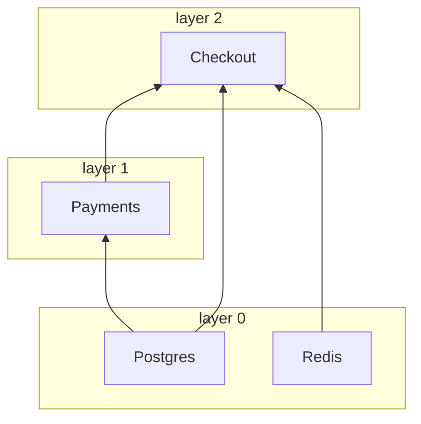

# nuke-di

[](https://pypi.org/project/nuke-di/)
[](https://pypi.org/project/nuke-di/)
[](https://github.com/troyan-dy/nuke-di/actions/workflows/ci.yml)
[](#development)
[](LICENSE)

**English** · [Русский](https://github.com/troyan-dy/nuke-di/blob/master/docs/i18n/README.ru.md) · [简体中文](https://github.com/troyan-dy/nuke-di/blob/master/docs/i18n/README.zh-CN.md) · [Español](https://github.com/troyan-dy/nuke-di/blob/master/docs/i18n/README.es.md) · [Português (Brasil)](https://github.com/troyan-dy/nuke-di/blob/master/docs/i18n/README.pt-BR.md) · [日本語](https://github.com/troyan-dy/nuke-di/blob/master/docs/i18n/README.ja.md) · [Polski](https://github.com/troyan-dy/nuke-di/blob/master/docs/i18n/README.pl.md)

The simplest dependency injection for async Python projects.

Dependencies are declared with plain type hints. `nuke-di` builds the dependency tree,
creates every client once and drives its async lifecycle: `connect()` on startup and
`disconnect()` on shutdown. Independent clients start concurrently, layer by layer,
from the deepest dependencies up.

On top of that, one decorator turns an async function into a process: a **job** that runs
once or a **worker** that runs until it is stopped, with command-line parameters, graceful
shutdown on SIGTERM and meaningful exit codes. FastAPI, Litestar and FastStream handlers take
clients by type hint the same way.

It was extracted from the DI layer of a production Python microservice framework
and has no runtime dependencies.

- [Installation](#installation)
- [Quick start](#quick-start)
- [Clients](#clients): [singletons](#client-and-notsingletonclient), [lifecycle](#connect-and-disconnect), [dataclasses](#dataclass-clients), [layers](#layers), [startup timings](#startup-timings), [the graph](#the-graph), [connect failures](#when-a-client-fails-to-connect), [resolution errors](#when-the-tree-cannot-be-built)
- [The container](#the-container)
- [Workers and jobs](#workers-and-jobs): [a job](#your-first-job), [parameters](#parameters), [a worker](#your-first-worker), [grace period](#grace-period), [background tasks](#background-tasks), [exit codes](#exit-codes), [hooks](#hooks), [Kubernetes](#running-in-kubernetes)
- Frameworks: [FastAPI](#fastapi), [Litestar](#litestar), [FastStream](#faststream)
- [Testing](#testing)
- [Configuration](#configuration) · [Errors](#errors) · [Performance](#performance) · [Development](#development)

## Installation

```bash
pip install nuke-di
```

Requires Python 3.11+.

## Quick start

```python
import asyncio

from nuke_di import DI, Client


class Database(Client):
    async def connect(self) -> None:
        print("database: connected")

    async def disconnect(self) -> None:
        print("database: disconnected")

    async def fetch_user(self, user_id: int) -> str:
        return f"user-{user_id}"


class UserService(Client):
    def __init__(self, db: Database) -> None:
        self._db = db

    async def greet(self, user_id: int) -> str:
        return f"Hello, {await self._db.fetch_user(user_id)}!"


async def handler(user_id: int, users: UserService) -> str:
    return await users.greet(user_id)


async def main() -> None:
    injected = DI.inject(handler)  # resolves UserService -> Database

    async with DI:  # connect() every client, disconnect() on exit
        print(await injected(42))


asyncio.run(main())
```

```text
database: connected
Hello, user-42!
database: disconnected
```

What happened:

1. `DI.inject(handler)` read the type hints of `handler`, found the client `UserService`, saw
   that it needs a `Database` in its `__init__` and built both. `user_id: int` is not a
   client, so it stays a regular argument.
2. `async with DI` called `connect()` on every client it built, dependencies first.
3. `injected(42)` called `handler(42, users=<UserService>)`.
4. Leaving the `async with` block called `disconnect()` in reverse order.

## Clients

### Client and NotSingletonClient

Every dependency is a subclass of one of two base classes:

| Base class           | Instances                                          |
|----------------------|----------------------------------------------------|
| `Client`             | Singleton: one instance per container              |
| `NotSingletonClient` | A new instance for every consumer that declares it |

```python
from nuke_di import Client, Dependencies, NotSingletonClient


class Settings(Client):
    pass


class HttpSession(NotSingletonClient):
    pass


class Orders(Client):
    def __init__(self, settings: Settings, http: HttpSession) -> None:
        self.settings = settings
        self.http = http


class Payments(Client):
    def __init__(self, settings: Settings, http: HttpSession) -> None:
        self.settings = settings
        self.http = http


deps = Dependencies()
orders = deps.resolve(Orders)
payments = deps.resolve(Payments)

print(orders.settings is payments.settings)  # one Settings for the whole container
print(orders.http is payments.http)  # every consumer gets its own HttpSession
print(deps.resolve(Orders) is orders)  # resolve() is idempotent for a Client
```

```text
True
False
True
```

A client declares its own dependencies as annotated `__init__` arguments. Only arguments
annotated with a client type are injected, and resolution is recursive.

### connect() and disconnect()

Override the async `connect()` / `disconnect()` methods to open and release resources such
as connection pools. `__init__` only stores the dependencies; anything that does I/O belongs
in `connect()`:

```python
class Redis(Client):
    def __init__(self) -> None:
        self._pool: Pool | None = None

    async def connect(self) -> None:
        self._pool = await create_pool()

    async def disconnect(self) -> None:
        if self._pool is not None:
            await self._pool.close()
            self._pool = None
```

Each `connect()` is bounded by `CONNECT_TIMEOUT_SECONDS` (default `30`) and each
`disconnect()` by `DISCONNECT_TIMEOUT_SECONDS` (default `10`). A failing or hanging
`disconnect()` is logged, and the other clients still shut down.

### Dataclass clients

`client_dataclass` turns a class into a `Client` and a dataclass at once, so the fields
become the injected dependencies:

```python
from nuke_di import Client, Dependencies, client_dataclass


class Postgres(Client):
    pass


class Payments(Client):
    pass


@client_dataclass(frozen=True)
class Checkout:
    pg: Postgres
    payments: Payments


checkout = Dependencies().resolve(Checkout)
print(checkout)
print(isinstance(checkout, Client))
```

```text
Checkout(pg=<__main__.Postgres object at 0x...>, payments=<__main__.Payments object at 0x...>)
True
```

It accepts the same keyword arguments as `dataclasses.dataclass`.

### Layers

Clients connect concurrently in layers. Clients without dependencies form layer 0;
every other client sits one layer above its highest dependency. A layer starts only
after the previous one has connected, so a client never connects before its own
dependencies. `disconnect()` walks the layers in reverse.

```python
import asyncio
import logging

from nuke_di import Client, Dependencies

logging.basicConfig(level=logging.DEBUG, format="%(message)s")
logging.getLogger("asyncio").setLevel(logging.WARNING)  # keep only the nuke_di records


class Postgres(Client):
    async def connect(self) -> None:
        await asyncio.sleep(0.2)
        print("  postgres ready")


class Redis(Client):
    async def connect(self) -> None:
        await asyncio.sleep(0.1)
        print("  redis ready")


class Payments(Client):
    def __init__(self, pg: Postgres) -> None:
        self.pg = pg


class Checkout(Client):
    def __init__(self, pg: Postgres, redis: Redis, payments: Payments) -> None:
        self.pg, self.redis, self.payments = pg, redis, payments


async def main() -> None:
    deps = Dependencies()
    deps.resolve(Checkout)
    async with deps:
        print("-- application is running --")


asyncio.run(main())
```

The `DEBUG` log of the `nuke_di` logger shows the layers:

```text
Resolving dependency "Checkout"
Resolving dependency "Postgres"
Resolving dependency "Redis"
Resolving dependency "Payments"
Connecting layer 0: Postgres, Redis
Connecting client Postgres
Connecting client Redis
  redis ready
Connected client Redis in 0.101s
  postgres ready
Connected client Postgres in 0.201s
Connecting layer 1: Payments
Connecting client Payments
Connected client Payments in 0.000s
Connecting layer 2: Checkout
Connecting client Checkout
Connected client Checkout in 0.000s
Connected 4 clients in 3 layers in 0.20s (slowest: Postgres 0.20s, Redis 0.10s, Payments 0.00s)
-- application is running --
Disconnecting client Checkout
Disconnected client Checkout in 0.000s
Disconnecting client Payments
Disconnected client Payments in 0.000s
Disconnecting client Postgres
Disconnected client Postgres in 0.000s
Disconnecting client Redis
Disconnected client Redis in 0.000s
```

```text
Checkout(pg, redis, payments)    layer 2
Payments(pg)                     layer 1
Postgres, Redis                  layer 0  <- connect together, in 0.2s rather than 0.3s
```

Only dependencies declared in `__init__` are ordered. If a client needs another one to be
connected first, declare it as a dependency. Set `CONNECT_CONCURRENCY` to limit how many
clients connect at once.

### Startup timings

The container measures every client's `connect()` and `disconnect()`, so a slow startup
names its culprit. After a successful `connect()` it logs a summary at `INFO`, and a
`WARNING` for every client that used more than half of `CONNECT_TIMEOUT_SECONDS`, long
before that client starts failing with a timeout:

```python
# startup.py
import asyncio
import logging

from nuke_di import Client, Dependencies, DependenciesSettings

logging.basicConfig(level=logging.INFO, format="%(levelname)s %(message)s")


class Postgres(Client):
    async def connect(self) -> None:
        await asyncio.sleep(0.2)


class Kafka(Client):
    async def connect(self) -> None:
        await asyncio.sleep(1.6)

    async def disconnect(self) -> None:
        await asyncio.sleep(0.3)


class Orders(Client):
    def __init__(self, pg: Postgres, kafka: Kafka) -> None:
        self.pg, self.kafka = pg, kafka


async def main() -> None:
    deps = Dependencies(settings=DependenciesSettings(connect_timeout=3))
    deps.resolve(Orders)
    async with deps:
        print("-- application is running --")

    for t in deps.timings:
        print(
            f"{t.name:<8} layer {t.layer}  connect {t.connect:.2f}s {t.connect_outcome:<3}  "
            f"disconnect {t.disconnect:.2f}s {t.disconnect_outcome}"
        )


asyncio.run(main())
```

```console
$ python startup.py
INFO Connected 3 clients in 2 layers in 1.60s (slowest: Kafka 1.60s, Postgres 0.20s, Orders 0.00s)
WARNING Client Kafka took 1.60s to connect, more than half of CONNECT_TIMEOUT_SECONDS (3s)
-- application is running --
Postgres layer 0  connect 0.20s ok   disconnect 0.00s ok
Kafka    layer 0  connect 1.60s ok   disconnect 0.30s ok
Orders   layer 1  connect 0.00s ok   disconnect 0.00s ok
```

`deps.timings` holds one `ClientTiming` per client of the last `connect()`, in connect
order. It outlives `disconnect()`, so it can be read once the container has stopped. In a
FastAPI app, the lifespan you pass to `FastAPI()` runs inside the connected container, so it
sees the connect timings. A worker or a job gets the same list as
[`Run.clients`](#startup-metrics-and-structured-logs).

| `ClientTiming` field | Value |
|----------------------|-------|
| `name`               | The class name of the client |
| `layer`              | The [layer](#layers) of the client |
| `connect`            | Seconds spent in `connect()`, not counting the wait for `CONNECT_CONCURRENCY`; `None` if `connect()` never ran |
| `connect_outcome`    | `"ok"`, `"failed"`, `"timed_out"`, `"cancelled"`, or `None` if `connect()` never started |
| `disconnect`, `disconnect_outcome` | The same for `disconnect()`; `None` until the client disconnects |

When a client fails to connect, the clients of its layer that are still connecting end
up `"cancelled"`, the layers above keep `None`, and the clients that had connected are
rolled back, so they get a `disconnect_outcome`. The library only measures: exporting the
timings as metrics or spans is up to your code.

### The graph

The dependency graph exists only inside a running process: the `DEBUG` log above is the only
place that shows which clients an entrypoint pulls in and in which layer each one connects.
`graph()` returns the same picture as data, before `connect()` or after it, with the clients
from the [Layers](#layers) example:

```python
deps = Dependencies()
deps.resolve(Checkout)
for node in deps.graph().nodes:
    print(f"{node.name:<8} layer {node.layer}  needs {list(node.dependencies)}")
print(deps.graph().to_mermaid())
```

```console
$ python graph.py
Postgres layer 0  needs []
Redis    layer 0  needs []
Payments layer 1  needs ['pg']
Checkout layer 2  needs ['pg', 'redis', 'payments']
graph BT
  subgraph layer0 [layer 0]
    Postgres
    Redis
  end
  subgraph layer1 [layer 1]
    Payments
  end
  subgraph layer2 [layer 2]
    Checkout
  end
  Postgres --> Payments
  Postgres --> Checkout
  Redis --> Checkout
  Payments --> Checkout
```

GitHub renders the Mermaid text in a README, a pull request or an issue, so a project can show
its architecture without a running process:



`Graph.nodes` holds one `Node` per resolved client, in resolution order, so a client comes after
its dependencies. It is a snapshot: `flush()` empties it.

| `Node` field   | Value |
|----------------|-------|
| `name`         | The class name of the client |
| `cls`          | The class the consumers asked for |
| `singleton`    | `True` for a `Client`, `False` for a `NotSingletonClient` |
| `layer`        | The [layer](#layers) of the client; `None` for a Replacement, which is never connected |
| `replacement`  | The object registered with `mock()` or `override()` in place of `cls`; `None` for a real client |
| `dependencies` | The clients of the `__init__` arguments, by argument name |

A `NotSingletonClient` gets one node per instance, all with the same name; `to_mermaid()` numbers
them from the second one (`Session`, `Session_2`). A Replacement is drawn outside the layers with a
dashed border and the name of the object in its place: `Postgres: AsyncMock`. Nodes compare by
identity, so `nodes["Checkout"].dependencies["pg"] is nodes["Payments"].dependencies["pg"]` tells
that the two consumers share the singleton.

### When a client fails to connect

If a client fails to connect, the rest of its layer is cancelled and the next layers never
start. The clients that already connected are disconnected, layers in reverse, and the
container is left disconnected and empty:

```python
import asyncio

from nuke_di import Client, ConnectError, Dependencies


class Postgres(Client):
    async def connect(self) -> None:
        print("postgres: connected")

    async def disconnect(self) -> None:
        print("postgres: disconnected")


class Kafka(Client):
    async def connect(self) -> None:
        raise OSError("broker kafka-1:9092 is unreachable")


class Orders(Client):
    def __init__(self, pg: Postgres, kafka: Kafka) -> None:
        self.pg, self.kafka = pg, kafka


async def main() -> None:
    deps = Dependencies()
    deps.resolve(Orders)
    try:
        await deps.connect()
    except ConnectError as exc:
        print(f"{exc} <- {exc.__cause__!r}")
    print("connected:", deps.connected)


asyncio.run(main())
```

```text
postgres: connected
Error occurred connecting client Kafka
Traceback (most recent call last):
  ...
OSError: broker kafka-1:9092 is unreachable
postgres: disconnected
Error occurred connecting client Kafka <- OSError('broker kafka-1:9092 is unreachable')
connected: False
```

The same cleanup happens when `connect()` itself is cancelled. `ConnectError` derives from
`SystemExit`, so an application that does not catch it stops, which is usually what you want
when a dependency is down. Mocked clients are not connected and do not affect the layers.

### When the tree cannot be built

Resolution checks every `__init__` before it calls it, so a client that cannot be built fails
before anything connects, with the argument named and the path from the client you asked for:

```python
from typing import Protocol

from nuke_di import Client, Dependencies, InvalidSignatureError


class Postgres(Client):
    pass


class UserRepository(Protocol):
    async def get(self, user_id: int) -> str: ...


class Profiles(Client):
    def __init__(self, pg: Postgres, users: UserRepository) -> None:
        self.pg, self.users = pg, users


class Checkout(Client):
    def __init__(self, profiles: Profiles) -> None:
        self.profiles = profiles


class Orders(Client):
    def __init__(self, payments: "Payments") -> None:
        self.payments = payments


class Payments(Client):
    def __init__(self, orders: Orders) -> None:
        self.orders = orders


for root in (Checkout, Orders):
    try:
        Dependencies().resolve(root)
    except InvalidSignatureError as exc:
        print(f"{type(exc).__name__}: {exc}")
```

```text
InvalidSignatureError: Argument "users" of "Profiles.__init__" is UserRepository, which is not a client (resolving Checkout -> Profiles)
CircularDependencyError: Circular dependency: Orders -> Payments -> Orders
```

An argument of `__init__` is filled with a client when its type hint is a client. Any other
argument needs a default, which is left alone. These fail with `InvalidSignatureError`:

| `__init__` argument without a default | Message                                           |
|---------------------------------------|---------------------------------------------------|
| no type hint                          | `has no type hint`                                |
| a type that is not a client           | `is UserRepository, which is not a client`        |
| `Client \| None`                      | `is Postgres \| None, a client cannot be optional` |
| a client, positional-only (`/`)       | `is positional-only, a client is passed by keyword` |

Clients that depend on each other in a cycle fail with `CircularDependencyError`, a subclass of
`InvalidSignatureError`, and a type hint that cannot be evaluated, e.g. a class defined inside a
function or imported under `TYPE_CHECKING`, with an `InvalidSignatureError` that says so. When the
error comes from `inject()`, the path starts at the function:
`(resolving handler -> Checkout -> Profiles)`. In a [worker or a job](#workers-and-jobs)
each of these fails the run with exit code `1` before anything connects.

## The container

`Dependencies` is the container. `DI` is a ready-to-use global instance; create your own
when you need isolation, e.g. in tests.

| Method               | Description                                                             |
|----------------------|-------------------------------------------------------------------------|
| `resolve(cls)`       | Build `cls` and its dependency tree. Idempotent for `Client`.           |
| `inject(func)`       | Return `functools.partial(func, ...)` with client arguments bound. Every argument of `func` except `*args` / `**kwargs` must have a type hint. |
| `connect()`          | Call `connect()` on every resolved client, layer by layer.              |
| `disconnect()`       | Call `disconnect()` layer by layer in reverse, then `flush()` the container. |
| `async with`         | `connect()` on enter, `disconnect()` on exit.                           |
| `mock(cls, new=None)`| Register a Replacement for `cls` (an autospec mock by default) until the next `flush()`. Must come before `cls` is resolved. |
| `override(cls, new=None)` | A Replacement for the duration of a `with` block, then `flush()`; see [Testing](#testing). |
| `flush()`            | Forget every resolved client.                                           |
| `timings`            | One `ClientTiming` per client of the last `connect()`; see [Startup timings](#startup-timings). |
| `graph()`            | A `Graph` of the resolved clients with their dependencies and layers, `to_mermaid()` included; see [The graph](#the-graph). |

`resolve`, `inject`, `mock`, `override` and `flush` only work while the container is disconnected:
the whole tree is built before startup.

```python
async def main() -> None:
    deps = Dependencies()
    injected = deps.inject(handler)  # build the tree
    async with deps:  # connect
        await injected(42)
        deps.resolve(Cache)  # ConnectError: already connected
```

## Workers and jobs

An async function becomes the main program of a process with one decorator:

| Decorator | Runs                                                   |
|-----------|--------------------------------------------------------|
| `@job`    | Once: the process exits when the function returns      |
| `@worker` | Until the process receives SIGTERM or SIGINT           |

The examples in this section share one module of clients:

```python
# app/clients.py
import datetime
import itertools

from nuke_di import Client


class Postgres(Client):
    async def connect(self) -> None:
        print("postgres: connected")

    async def disconnect(self) -> None:
        print("postgres: disconnected")

    async def upsert(self, table: str, rows: list[str]) -> None:
        print(f"postgres: upserted {len(rows)} rows into {table}")


class Warehouse(Client):
    async def connect(self) -> None:
        print("warehouse: connected")

    async def disconnect(self) -> None:
        print("warehouse: disconnected")

    async def changes(self, table: str, day: datetime.date) -> list[str]:
        return [f"{table}:{day}:{n}" for n in range(3)]


class Queue(Client):
    def __init__(self) -> None:
        self._ids = itertools.count(1)

    async def connect(self) -> None:
        print("queue: connected")

    async def disconnect(self) -> None:
        print("queue: disconnected")

    async def get(self) -> str:
        return f"message-{next(self._ids)}"
```

### Your first job

```python
# app/jobs/sync.py
import datetime

from nuke_di import job

from app.clients import Postgres, Warehouse


@job
async def sync(pg: Postgres, warehouse: Warehouse) -> None:
    day = datetime.date.today() - datetime.timedelta(days=1)
    for table in ["users", "orders"]:
        await pg.upsert(table, await warehouse.changes(table, day))
```

```console
$ python -m app.jobs.sync
postgres: connected
warehouse: connected
postgres: upserted 3 rows into users
postgres: upserted 3 rows into orders
postgres: disconnected
warehouse: disconnected
$ echo $?
0
```

That is the whole program: no `main()`, no `asyncio.run()`, no `if __name__ == "__main__"`.
The process resolves the clients from the global `DI` container, connects them, runs the
function, disconnects them and exits with an [exit code](#exit-codes). Scheduling is not part
of the library: a Kubernetes CronJob, a systemd timer or crontab decides when a job runs.

`nuke-di` logs every run under the `nuke_di` logger. Configure logging above the decorator to
see it:

```python
import logging

logging.basicConfig(level=logging.INFO, format="%(levelname)-5s %(name)s: %(message)s")


@job
async def sync(pg: Postgres, warehouse: Warehouse) -> None: ...
```

```console
$ python -m app.jobs.sync
INFO  nuke_di.run: Starting job app.jobs.sync.sync
postgres: connected
warehouse: connected
INFO  nuke_di.core: Connected 4 clients in 1 layer in 0.00s (slowest: Warehouse 0.00s, Postgres 0.00s, Shutdown 0.00s)
postgres: upserted 3 rows into users
postgres: upserted 3 rows into orders
postgres: disconnected
warehouse: disconnected
INFO  nuke_di.run: Run app.jobs.sync.sync finished with exit code 0 in 0.002s
```

#### One entrypoint per module, defined last

When the module is run as `__main__`, the decorator runs the function right away and the
process exits there:

```python
# app/jobs/sync.py
DI.mock(Warehouse, FakeWarehouse())  # runs: code above the decorator is fine


@job
async def sync(pg: Postgres, warehouse: Warehouse) -> None: ...


print("never printed")  # never runs under `python -m app.jobs.sync`
```

**Keep one entrypoint per module and define it last.** On a normal import, e.g. from a test,
the decorator returns the function unchanged and nothing runs. The decorated function must be
declared with `async def`, otherwise `TypeError` is raised on import.

### Parameters

Every annotated argument that is not a client becomes a command-line option. Here is the same
job, now able to copy any day, a subset of tables, in a dry run:

```python
# app/jobs/sync.py
import datetime
import enum
from typing import Annotated

from nuke_di import Option, job

from app.clients import Postgres, Warehouse


class Mode(enum.Enum):
    INCREMENTAL = "incremental"
    FULL = "full"


@job
async def sync(
    pg: Postgres,
    warehouse: Warehouse,
    day: Annotated[datetime.date, Option(help="Day to copy, YYYY-MM-DD", short="d")],
    tables: Annotated[
        list[str] | None, Option(help="Table to copy, repeat for several; all by default", short="t")
    ] = None,
    mode: Mode = Mode.INCREMENTAL,
    dry_run: Annotated[bool, Option(help="Read the changes, write nothing")] = False,
) -> None:
    """Copy one day of changes from the warehouse into Postgres."""
    print(f"sync: {mode.name} copy of {day}")
    for table in tables or ["users", "orders"]:
        rows = await warehouse.changes(table, day)
        if dry_run:
            print(f"sync: would upsert {len(rows)} rows into {table}")
        else:
            await pg.upsert(table, rows)
```

`pg` and `warehouse` are clients and are injected; `day`, `tables`, `mode` and `dry_run` come
from the command line:

```console
$ python -m app.jobs.sync --day 2026-10-01
postgres: connected
warehouse: connected
sync: INCREMENTAL copy of 2026-10-01
postgres: upserted 3 rows into users
postgres: upserted 3 rows into orders
postgres: disconnected
warehouse: disconnected

$ python -m app.jobs.sync -d 2026-10-01 -t users --mode FULL --dry-run
postgres: connected
warehouse: connected
sync: FULL copy of 2026-10-01
sync: would upsert 3 rows into users
postgres: disconnected
warehouse: disconnected
```

`--help` is generated from the signature and the docstring. It does not connect anything
(Python 3.13+ prints `-d, --day DAY` instead of `-d DAY, --day DAY`):

```console
$ python -m app.jobs.sync --help
usage: python -m app.jobs.sync [-h] -d DAY [-t TABLES]
                               [--mode {INCREMENTAL,FULL}]
                               [--dry-run | --no-dry-run]

Copy one day of changes from the warehouse into Postgres.

options:
  -h, --help            show this help message and exit
  -d DAY, --day DAY     Day to copy, YYYY-MM-DD
  -t TABLES, --tables TABLES
                        Table to copy, repeat for several; all by default
  --mode {INCREMENTAL,FULL}
                        (default: INCREMENTAL)
  --dry-run, --no-dry-run
                        Read the changes, write nothing (default: False)
```

A wrong command line is rejected **before any client is resolved or connected**, with exit
code `2`:

```console
$ python -m app.jobs.sync
usage: python -m app.jobs.sync [-h] -d DAY [-t TABLES]
                               [--mode {INCREMENTAL,FULL}]
                               [--dry-run | --no-dry-run]
python -m app.jobs.sync: error: the following arguments are required: -d/--day
Run app.jobs.sync.sync failed: the following arguments are required: -d/--day
$ echo $?
2

$ python -m app.jobs.sync --day yesterday
...
python -m app.jobs.sync: error: argument -d/--day: invalid date value: 'yesterday'

$ python -m app.jobs.sync -d 2026-10-01 --mode full
...
python -m app.jobs.sync: error: argument --mode: invalid choice: 'full' (choose from INCREMENTAL, FULL)

$ python -m app.jobs.sync -d 2026-10-01 --dry
...
python -m app.jobs.sync: error: unrecognized arguments: --dry
```

The first two lines of each error are printed by `argparse`; the `Run ... failed` line is the
`ERROR` record of the `nuke_di` logger, so it follows your logging configuration.
Abbreviations are not accepted: `--dry` is not taken for `--dry-run`.

#### Supported types

| Annotation                                    | Command line                    | Example                         |
|-----------------------------------------------|---------------------------------|---------------------------------|
| `str`, `int`, `float`, `pathlib.Path`         | `--name VALUE`                  | `--limit 10`                    |
| `bool`                                        | `--name` / `--no-name`          | `--dry-run`                     |
| `datetime.date`, `datetime.datetime`          | ISO 8601                        | `--since 2026-10-01T12:00:00`   |
| an `Enum`                                     | the member **name**, as written | `--mode FULL`                   |
| `list[T]` of any of the above except `bool`   | the option repeated             | `--table users --table orders`  |
| `T \| None`                                   | as `T`                          | `--limit 10`                    |

The rules:

- **The name.** The option is named after the argument, with `_` replaced by `-`:
  `dry_run` is `--dry-run`. There are no positional arguments, so adding a parameter never
  breaks an existing command line.
- **Required or not.** An argument without a default is a required option. An argument with a
  default is optional, and when the option is left out the function's own default is used.
- **`Option`.** `Annotated[T, Option(help=..., short=...)]` adds a help text and a one-letter
  alias such as `-d`. Both are optional.
- **No parameters.** An entrypoint without parameters still parses its command line: it
  answers `--help` and rejects any argument with exit code `2`.

These signatures are bugs in the code rather than in the command line. They fail the run with
`InvalidSignatureError` and exit code `1`:

```python
async def sync(day: dict[str, int]) -> None: ...  # unsupported type
async def sync(pg: Annotated[Postgres, Option(help="...")]) -> None: ...  # Option on a client
async def sync(help: bool = False) -> None: ...  # clashes with --help
async def sync(day: int, /) -> None: ...  # positional-only
```

#### Parameters in tests

The decorated function is still an ordinary coroutine, so a test passes parameters as keyword
arguments:

```python
async def test_sync_copies_requested_tables() -> None:
    pg, warehouse = AsyncMock(), AsyncMock()
    warehouse.changes.return_value = ["row"]

    await sync(pg, warehouse, day=datetime.date(2026, 10, 1), tables=["users"])

    warehouse.changes.assert_awaited_once_with("users", datetime.date(2026, 10, 1))
    pg.upsert.assert_awaited_once_with("users", ["row"])
```

### Your first worker

A worker runs until the process is asked to stop. It depends on the `Shutdown` client, which
is set on the first SIGTERM or SIGINT, and finishes its current piece of work:

```python
# app/workers/consumer.py
import asyncio

from nuke_di import Shutdown, worker

from app.clients import Queue


@worker
async def consumer(queue: Queue, shutdown: Shutdown) -> None:
    while not shutdown.is_set():
        message = await queue.get()
        print(f"consumer: processing {message}")
        await asyncio.sleep(1)  # the actual work
        print(f"consumer: done {message}")
    print("consumer: stopped")
```

Ctrl+C in the middle of the third message: the message is finished, the loop ends, the
clients disconnect.

```console
$ python -m app.workers.consumer
queue: connected
consumer: processing message-1
consumer: done message-1
consumer: processing message-2
consumer: done message-2
consumer: processing message-3
^C
consumer: done message-3
consumer: stopped
queue: disconnected
$ echo $?
130
```

`Shutdown` has three methods:

| Method           | Description                                                               |
|------------------|---------------------------------------------------------------------------|
| `is_set()`       | Whether a Shutdown has begun; check it between pieces of work             |
| `await wait()`   | Block until a Shutdown begins                                             |
| `set()`          | Begin a Shutdown by hand, e.g. in a test                                  |

Outside a worker or a job nothing sets it, so a loop that depends on `Shutdown` also works
unchanged inside a web application. A worker that returns or raises on its own ends the
process too: restarting it is the orchestrator's job.

On Windows only SIGINT (Ctrl+C) is handled; SIGTERM keeps its default behavior.

### Grace period

A worker that ignores `Shutdown` is cancelled after `SHUTDOWN_GRACE_SECONDS` (default `10`):

```python
# app/workers/stubborn.py
@worker
async def stubborn(queue: Queue) -> None:
    while True:  # never looks at Shutdown
        message = await queue.get()
        print(f"stubborn: processing {message}")
        await asyncio.sleep(5)
```

```console
$ SHUTDOWN_GRACE_SECONDS=2 python -m app.workers.stubborn &
queue: connected
stubborn: processing message-1
$ kill -TERM %1
Run app.workers.stubborn.stubborn did not stop within 2.0s after Shutdown, cancelling it
queue: disconnected
$ wait %1; echo $?
143
```

A second signal cancels the entrypoint at once, without waiting for the grace period, e.g.
Ctrl+C twice:

```console
$ python -m app.workers.stubborn
queue: connected
stubborn: processing message-1
^C^C
Second SIGINT, cancelling run app.workers.stubborn.stubborn
queue: disconnected
```

A signal that arrives while the clients are still connecting stops the startup, and the
clients that already connected are disconnected.

In the worst case a process stops in
`SHUTDOWN_GRACE_SECONDS + DISCONNECT_TIMEOUT_SECONDS × layers`. With the defaults, a tree of
two layers takes the whole Kubernetes default `terminationGracePeriodSeconds` of 30 seconds,
so lower the timeouts or raise the grace period for deeper trees.

### Background tasks

`BackgroundTasks` is a client that supervises coroutines running alongside the entrypoint.
Unlike a bare `asyncio.create_task()`, a failing task is never lost: it is logged with its
traceback and fails the whole process.

```python
# app/workers/indexer.py
import asyncio

from nuke_di import BackgroundTasks, Shutdown, worker

from app.clients import Queue


async def refresh_index() -> None:
    for attempt in range(1, 10):
        print(f"refresh: run {attempt}")
        await asyncio.sleep(0.5)
        if attempt == 2:
            raise ConnectionError("search cluster is unreachable")


@worker
async def indexer(queue: Queue, tasks: BackgroundTasks, shutdown: Shutdown) -> None:
    tasks.spawn(refresh_index(), name="refresh-index")
    print("indexer: waiting for Shutdown")
    await shutdown.wait()
```

```console
$ python -m app.workers.indexer
queue: connected
indexer: waiting for Shutdown
refresh: run 1
refresh: run 2
Background task refresh-index failed
Traceback (most recent call last):
  ...
ConnectionError: search cluster is unreachable
queue: disconnected
Run app.workers.indexer.indexer failed
Traceback (most recent call last):
  ...
ConnectionError: search cluster is unreachable
$ echo $?
1
```

The worker was cancelled without a grace period: a crashed background loop must not leave a
live process that does nothing. When the process stops for any reason, the tasks are cancelled
and awaited **before** any client disconnects, so they never run against closed clients.

| Method                     | Description                                                     |
|----------------------------|-----------------------------------------------------------------|
| `spawn(coro, name=None)`   | Start `coro` as a task and keep a reference to it until it ends |
| `watch(callback)`          | Call `callback(exc)` for every task that fails                  |
| `await stop()`             | Cancel every task and wait for all of them; `disconnect()` calls it |

Outside a worker or a job, e.g. under a plain `async with DI`, failures are only logged and
the tasks are cancelled on `disconnect()`.

### Exit codes

The first matching rule wins:

| Condition                                                                                           | Exit code      |
|-----------------------------------------------------------------------------------------------------|----------------|
| An invalid command line (`UsageError`)                                                              | `2`            |
| An exception: the signature, resolving or connecting the clients, the entrypoint, a background task | `1`            |
| A termination signal was received                                                                   | `128 + signum` |
| Otherwise                                                                                           | `0`            |

SIGTERM gives `143` and SIGINT gives `130`. A job that sees a Shutdown and returns cleanly
still exits with `128 + signum`: its work was interrupted, and a scheduler must not count it
as complete.

The codes are meant for whatever starts the process:

```bash
python -m app.jobs.sync --day 2026-10-01
case $? in
  0)       echo "synced" ;;
  2)       echo "fix the command line, retrying will not help" ;;
  130|143) echo "interrupted, safe to run again" ;;
  *)       echo "failed, see the log" ;;
esac
```

### Hooks

Hooks observe every run, e.g. to push metrics or open a tracing span:

```python
# app/jobs/report.py
from nuke_di import Run, job

from app.clients import Postgres


class Timer:
    async def on_start(self, run: Run) -> None:
        print(f"hook: {run.kind} {run.name} started")

    async def on_finish(self, run: Run) -> None:
        seconds = (run.finished_at - run.started_at).total_seconds()
        print(f"hook: exit code {run.exit_code} in {seconds:.1f}s, error: {run.error!r}")


@job(hooks=[Timer()])
async def report(pg: Postgres, limit: int = 10) -> None:
    print(f"report: top {limit} customers")
```

```console
$ python -m app.jobs.report --limit 3
hook: job app.jobs.report.report started
postgres: connected
report: top 3 customers
postgres: disconnected
hook: exit code 0 in 0.0s, error: None

$ python -m app.jobs.report --limit three
usage: python -m app.jobs.report [-h] [--limit LIMIT]
python -m app.jobs.report: error: argument --limit: invalid int value: 'three'
hook: job app.jobs.report.report started
Run app.jobs.report.report failed: argument --limit: invalid int value: 'three'
hook: exit code 2 in 0.0s, error: UsageError("argument --limit: invalid int value: 'three'")
```

`on_start` is called in list order before the clients are resolved; `on_finish` in reverse
order after they have disconnected, so it sees the final state of the `Run`, connect failures
included:

| `Run` field   | Value                                                                  |
|---------------|------------------------------------------------------------------------|
| `name`        | Module and function, e.g. `app.jobs.report.report`                     |
| `kind`        | `"job"` or `"worker"`                                                  |
| `started_at`  | UTC `datetime`                                                         |
| `finished_at` | UTC `datetime`, set before `on_finish`                                 |
| `exit_code`   | The process exit code, set before `on_finish`                          |
| `error`       | The exception that failed the run, e.g. a `UsageError`, or `None`      |
| `signal`      | The first termination signal received, or `None`                       |
| `clients`     | One `ClientTiming` per client: connect and disconnect durations and outcomes; empty if the run failed before connecting |

Hooks are plain objects, not clients: they manage their own resources. An exception in a hook
is logged and does not change the exit code. `--help` is not a run, so hooks do not see it.

#### Startup metrics and structured logs

`run.clients` is the place to export startup metrics: `on_finish` sees how long every
client took to connect and disconnect. Every log record of `nuke_di` also carries
structured fields, so a JSON formatter can filter and aggregate by client without
parsing messages:

```python
# app/jobs/startup.py
import json
import logging

from nuke_di import Run, job

from app.clients import Postgres, Warehouse


class JsonFormatter(logging.Formatter):
    def format(self, record: logging.LogRecord) -> str:
        fields = {key: getattr(record, key) for key in ("run", "client", "layer", "duration") if hasattr(record, key)}
        return json.dumps({"level": record.levelname, "message": record.getMessage(), **fields})


handler = logging.StreamHandler()
handler.setFormatter(JsonFormatter())
logging.basicConfig(level=logging.INFO, handlers=[handler])


class StartupMetrics:
    async def on_start(self, run: Run) -> None:
        pass

    async def on_finish(self, run: Run) -> None:
        for client in run.clients:
            print(f"metric: {client.name} connect={client.connect:.3f}s {client.connect_outcome}")


@job(hooks=[StartupMetrics()])
async def startup(pg: Postgres, warehouse: Warehouse) -> None:
    print("startup: done")
```

```console
$ python -m app.jobs.startup
{"level": "INFO", "message": "Starting job app.jobs.startup.startup", "run": "app.jobs.startup.startup"}
postgres: connected
warehouse: connected
{"level": "INFO", "message": "Connected 4 clients in 1 layer in 0.00s (slowest: Postgres 0.00s, Shutdown 0.00s, Warehouse 0.00s)", "run": "app.jobs.startup.startup", "duration": 0.00015945796621963382}
startup: done
postgres: disconnected
warehouse: disconnected
{"level": "INFO", "message": "Run app.jobs.startup.startup finished with exit code 0 in 0.001s", "run": "app.jobs.startup.startup", "duration": 0.001171}
metric: Shutdown connect=0.000s ok
metric: BackgroundTasks connect=0.000s ok
metric: Postgres connect=0.000s ok
metric: Warehouse connect=0.000s ok
```

| Field      | Set on                                                                        |
|------------|-------------------------------------------------------------------------------|
| `run`      | Every record made inside a worker or a job, the container's included: the name of the run |
| `client`   | Every record about one client: resolving, connecting, disconnecting, failures |
| `layer`    | Every record about a connecting or disconnecting client, and `Connecting layer` |
| `duration` | Seconds: a connected or disconnected client, the startup summary, a finished run |

Every run also connects its own `Shutdown` and `BackgroundTasks` clients, so they appear
in `run.clients` and in the summary.

### Running in Kubernetes

A job maps to a CronJob and a worker to a Deployment. Give a worker enough
`terminationGracePeriodSeconds` for the [shutdown budget](#grace-period):

```yaml
apiVersion: batch/v1
kind: CronJob
metadata:
  name: report
spec:
  schedule: "0 6 * * *"
  concurrencyPolicy: Forbid
  jobTemplate:
    spec:
      template:
        spec:
          restartPolicy: Never
          containers:
            - name: report
              image: registry.example.com/app:1.0
              command: ["python", "-m", "app.jobs.report"]
              args: ["--limit", "20"]
---
apiVersion: apps/v1
kind: Deployment
metadata:
  name: consumer
spec:
  replicas: 2
  selector:
    matchLabels: {app: consumer}
  template:
    metadata:
      labels: {app: consumer}
    spec:
      terminationGracePeriodSeconds: 30  # >= SHUTDOWN_GRACE_SECONDS + DISCONNECT_TIMEOUT_SECONDS × layers
      containers:
        - name: consumer
          image: registry.example.com/app:1.0
          command: ["python", "-m", "app.workers.consumer"]
          env:
            - {name: SHUTDOWN_GRACE_SECONDS, value: "15"}
```

A one-off backfill is the same image with other parameters:

```bash
kubectl run sync-backfill --rm -it --restart=Never --image=registry.example.com/app:1.0 \
  --command -- python -m app.jobs.sync --day 2026-09-30 --mode FULL
```

## FastAPI

A FastAPI path operation takes a client the way a job does, by its type hint. Nothing else is
written per handler: no `Depends`, no `inject()`.

```bash
pip install "nuke-di[fastapi]"
```

Requires FastAPI 0.105 or newer. The examples share one module of clients:

```python
# app/clients.py
from nuke_di import Client


class Database(Client):
    async def connect(self) -> None:
        print("database: connected")

    async def disconnect(self) -> None:
        print("database: disconnected")

    async def fetch_user(self, user_id: int) -> str:
        return f"user-{user_id}"


class UserService(Client):
    def __init__(self, db: Database) -> None:
        self._db = db

    async def greet(self, user_id: int) -> str:
        return f"Hello, {await self._db.fetch_user(user_id)}!"
```

The API:

```python
# app/api.py
from typing import Annotated

from fastapi import Depends, FastAPI, Header

from app.clients import Database, UserService
from nuke_di.fastapi import ClientRouter, setup

app = FastAPI()
setup(app)  # before the routes: clients connect on startup, disconnect on shutdown


@app.get("/users/{user_id}")
async def get_user(user_id: int, users: UserService) -> str:
    return await users.greet(user_id)


async def current_user(x_user_id: Annotated[int, Header()], db: Database) -> str:
    return await db.fetch_user(x_user_id)


account = ClientRouter(prefix="/me")


@account.get("")
async def me(user: Annotated[str, Depends(current_user)]) -> str:
    return user


app.include_router(account)
```

```console
$ uvicorn app.api:app
INFO:     Started server process [80948]
INFO:     Waiting for application startup.
database: connected
INFO:     Application startup complete.
INFO:     Uvicorn running on http://127.0.0.1:8000 (Press CTRL+C to quit)
INFO:     127.0.0.1:54682 - "GET /users/42 HTTP/1.1" 200 OK
INFO:     127.0.0.1:54684 - "GET /me HTTP/1.1" 200 OK
^C
INFO:     Shutting down
INFO:     Waiting for application shutdown.
database: disconnected
INFO:     Application shutdown complete.
INFO:     Finished server process [80948]
```

```console
$ curl localhost:8000/users/42
"Hello, user-42!"
$ curl localhost:8000/me -H "X-User-Id: 7"
"user-7"
```

What happened:

1. `setup(app)` made every route declared on `app` afterwards fill its client arguments from the
   global `DI`, and wrapped the app's lifespan.
2. `@app.get` saw `users: UserService` and only recorded it; nothing was built on import.
3. On startup the lifespan resolved the clients of the routes the app serves, its own and those of
   the routers it includes, and connected them, layer by layer. On shutdown it disconnected them.
4. A request to `/users/42` got the connected `UserService`. `/me` went through the dependency
   `current_user`, which takes `db: Database` the same way.

The rules:

- **Where clients are filled.** In the arguments of path operations, websocket endpoints and every
  dependency they use, at any depth: functions, and classes used as `Depends(Auth)` or `Annotated[Auth, Depends()]`,
  including `dependencies=` of the route, of its router, of `include_router()` and of the app. An
  argument is a client when its type hint is a client, also inside `Annotated[UserService, ...]`
  without a `Depends`. Every other argument is FastAPI's: path, query, header, body, `Depends`.
- **Routers.** Create them with `ClientRouter(...)`, which takes the same arguments as `APIRouter`,
  and include them into the app or into another `ClientRouter`. `APIRouter(route_class=ClientRoute)`
  works for a router that includes no other routers. For another container, use
  `setup(app, container)` and `ClientRouter(container=container)`; including a router of another
  container raises `TypeError` at once.
- **Call `setup(app)` before the routes.** A route with a client declared before it fails at once
  with the `TypeError` described [below](#not-supported).
- **Only what the app serves.** A router that the app does not include, e.g. one imported only by a
  test, connects nothing on the app's startup.
- **Instances.** As with `inject()`, a `Client` is one instance per container, and a
  `NotSingletonClient` is one instance per argument that declares it, not one per request.
- **Lifespan.** The app's own `lifespan=` runs inside: its startup code sees connected clients, and
  its shutdown code runs before they disconnect. On shutdown `Shutdown` is set and
  `BackgroundTasks` are stopped, if the app uses them, before the clients disconnect, as in a
  worker. FastAPI's own `BackgroundTasks` is a different class and is not a client.
- **The function stays a function.** Its signature now shows `Annotated[UserService, Depends(...)]`
  to FastAPI, but calling it directly with a client, e.g. in a unit test, works as before.

**Testing.** Importing the app builds nothing, so a test replaces a client before `TestClient`
starts the app, with [`override()`](#testing) or the `global_di` fixture:

```python
# tests/test_api.py
from fastapi.testclient import TestClient

from app.api import app
from app.clients import Database
from nuke_di import DI


class FakeDatabase(Database):
    async def fetch_user(self, user_id: int) -> str:
        return "alice"


def test_get_user() -> None:
    with DI.override(Database, FakeDatabase()), TestClient(app) as client:
        assert client.get("/users/1").json() == "Hello, alice!"
        assert client.get("/me", headers={"X-User-Id": "7"}).json() == "alice"
```

```console
$ pytest -q tests/test_api.py
.                                                                        [100%]
1 passed in 0.16s
```

`app.dependency_overrides` keeps working, also for a dependency function that takes clients.

**Websockets.** A websocket endpoint takes clients the same way, on the app or on a `ClientRouter`:

```python
# app/chat.py
from fastapi import FastAPI, WebSocket

from app.clients import UserService
from nuke_di.fastapi import setup

app = FastAPI()
setup(app)


@app.websocket("/greet")
async def greet(websocket: WebSocket, users: UserService) -> None:
    await websocket.accept()
    async for user_id in websocket.iter_text():
        await websocket.send_text(await users.greet(int(user_id)))
```

```python
# tests/test_chat.py
from fastapi.testclient import TestClient

from app.chat import app


def test_greet() -> None:
    with TestClient(app) as client, client.websocket_connect("/greet") as ws:
        ws.send_text("42")
        assert ws.receive_text() == "Hello, user-42!"
```

```console
$ pytest -q tests/test_chat.py
.                                                                        [100%]
1 passed in 0.16s
```

**A client that fails to connect** fails the startup. The lifespan raises a plain `RuntimeError`
from the `ConnectError`, since a `SystemExit` would escape the server's event loop, and the server
reports it and exits:

```python
# app/broken.py
from fastapi import FastAPI

from nuke_di import Client
from nuke_di.fastapi import setup


class Kafka(Client):
    async def connect(self) -> None:
        raise OSError("broker kafka-1:9092 is unreachable")


app = FastAPI()
setup(app)


@app.post("/events")
async def publish(kafka: Kafka) -> None: ...
```

```console
$ uvicorn app.broken:app
INFO:     Started server process [81379]
INFO:     Waiting for application startup.
Error occurred connecting client Kafka
Traceback (most recent call last):
  ...
OSError: broker kafka-1:9092 is unreachable
ERROR:    Traceback (most recent call last):
  ...
nuke_di.errors.ConnectError: Error occurred connecting client Kafka

The above exception was the direct cause of the following exception:

Traceback (most recent call last):
  ...
RuntimeError: nuke-di clients failed to start: Error occurred connecting client Kafka

ERROR:    Application startup failed. Exiting.
$ echo $?
3
```

### Not supported

These places take no clients. Each raises a `TypeError` that says so when the route is declared:

| Place                                                   | Instead                                       |
|---------------------------------------------------------|-----------------------------------------------|
| A router created without `ClientRouter` / `ClientRoute` | Create it with `ClientRouter(...)`            |
| A websocket endpoint on `APIRouter(route_class=ClientRoute)` | Create the router with `ClientRouter(...)` |
| An optional client, `Database \| None`                  | A plain `Database`                            |
| A bound method or a callable object as an endpoint or a dependency | A function or a class              |

Unlike these, a route of a router included into a plain `APIRouter` instead of a `ClientRouter` is
found by older FastAPI only. On FastAPI 0.14x it is declared and the app starts, but its requests fail
with `RuntimeError: UserService was not started with the app: include the router of its route into
the app or into a ClientRouter, not into a plain APIRouter`.

A request that arrives without the lifespan, e.g. through `TestClient(app)` without `with`, gets a
`RuntimeError`: `UserService is not connected: start the app with its lifespan`.

## Litestar

A Litestar route handler takes a client by its type hint too, through a plugin:

```bash
pip install "nuke-di[litestar]"
```

Requires Litestar 2.15 or newer. With the clients of the [FastAPI](#fastapi) examples:

```python
# app/litestar_api.py
from typing import Annotated

from litestar import Litestar, get
from litestar.di import NamedDependency, Provide
from litestar.params import FromPath, HeaderParameter

from app.clients import Database, UserService
from nuke_di.litestar import ClientPlugin


@get("/users/{user_id:int}")
async def get_user(user_id: FromPath[int], users: UserService) -> str:
    return await users.greet(user_id)


async def current_user(x_user_id: Annotated[int, HeaderParameter(name="X-User-Id")], db: Database) -> str:
    return await db.fetch_user(x_user_id)


@get("/me", dependencies={"user": Provide(current_user)})
async def me(user: NamedDependency[str]) -> str:
    return user


app = Litestar([get_user, me], plugins=[ClientPlugin()])
```

```console
$ uvicorn app.litestar_api:app
INFO:     Started server process [6801]
INFO:     Waiting for application startup.
database: connected
INFO:     Application startup complete.
INFO:     Uvicorn running on http://127.0.0.1:8000 (Press CTRL+C to quit)
INFO:     127.0.0.1:51940 - "GET /users/42 HTTP/1.1" 200 OK
INFO:     127.0.0.1:51942 - "GET /me HTTP/1.1" 200 OK
^C
INFO:     Shutting down
INFO:     Waiting for application shutdown.
database: disconnected
INFO:     Application shutdown complete.
INFO:     Finished server process [6801]
```

```console
$ curl localhost:8000/users/42
Hello, user-42!
$ curl localhost:8000/me -H "X-User-Id: 7"
user-7
```

`ClientPlugin()` found `users: UserService` in `get_user` and `db: Database` in the dependency
`current_user`, provided both to Litestar as dependencies, and connected them on startup.

The rules:

- **Where clients are filled.** In the arguments of the HTTP and `@websocket` handlers the app is
  created with, including those of routers and controllers at any depth, and of every dependency
  declared on the app, a router, a controller or a handler: functions and classes.
- **By name.** Litestar provides dependencies by argument name, so nuke-di provides every client
  argument under its name, on the app. One name means one client in the whole app: `users: UserService`
  in one handler and `users: Billing` in another raise `TypeError` when the app is created. A
  dependency of the same name declared by the app, a router, a controller or a handler wins over
  the client.
- **Instances.** A `Client` is one instance per container; a `NotSingletonClient` is one instance per
  argument name.
- **Lifespan.** The clients connect before the app's own `lifespan=` and `on_startup=` run, and
  disconnect after its `on_shutdown=` hooks, which Litestar calls last. `Shutdown` and
  `BackgroundTasks` behave as in [FastAPI](#fastapi).
- **The function stays a function.** Its client arguments are now annotated as explicit Litestar
  dependencies whose value is not validated, `Annotated[UserService, Dependency(), SkipValidationMarker()]`,
  which is what Litestar 2.23 asks for instead of a dependency matched by name only. Calling the function
  directly works as before.
- **Plugins.** Put `ClientPlugin()` after any plugin that adds route handlers: it sees the handlers the
  app has when its turn comes.
- **Another container.** `ClientPlugin(container)`.

**Testing.** As with FastAPI, a test replaces a client before `TestClient` starts the app:

```python
# tests/test_litestar_api.py
from litestar.testing import TestClient

from app.clients import Database
from app.litestar_api import app
from nuke_di import DI


class FakeDatabase(Database):
    async def fetch_user(self, user_id: int) -> str:
        return "alice"


def test_get_user() -> None:
    with DI.override(Database, FakeDatabase()), TestClient(app) as client:
        assert client.get("/users/1").text == "Hello, alice!"
        assert client.get("/me", headers={"X-User-Id": "7"}).text == "alice"
```

```console
$ pytest -q tests/test_litestar_api.py
.                                                                        [100%]
1 passed in 0.23s
```

**Not supported.** A websocket listener, `@websocket_listener` or a `WebsocketListener` class, takes no
clients: Litestar reads its signature when it is declared, before the plugin sees it, so the app
raises `TypeError` and names a `@websocket` handler instead. A client argument under a name Litestar
reserves, such as `state` or `request`, raises `TypeError` too. A handler registered after the app is
created, with `app.register()`, is not seen.

## FastStream

A FastStream subscriber takes a client by its type hint, next to the message:

```bash
pip install "nuke-di[faststream]"
```

Requires FastStream 0.6 or newer, with any broker. With the clients of the [FastAPI](#fastapi) examples:

```python
# app/worker.py
from faststream import FastStream
from faststream.nats import NatsBroker

from app.clients import UserService
from nuke_di.faststream import setup

broker = NatsBroker("nats://localhost:4222")
app = FastStream(broker)
setup(app)  # clients connect before the broker starts, disconnect after it stops


@broker.subscriber("greetings")
async def greet(user_id: int, users: UserService) -> None:
    print(await users.greet(user_id))
```

```console
$ faststream run app.worker:app
database: connected
2026-10-08 15:12:52,281 INFO     - FastStream app starting...
2026-10-08 15:12:52,287 INFO     - greetings |            - `Greet` waiting for messages
2026-10-08 15:12:52,287 INFO     - FastStream app started successfully! To exit, press CTRL+C
2026-10-08 15:12:55,078 INFO     - greetings | a747e4d0-2 - Received
Hello, user-42!
2026-10-08 15:12:55,079 INFO     - greetings | a747e4d0-2 - Processed
^C
2026-10-08 15:12:56,222 INFO     - FastStream app shutting down...
2026-10-08 15:12:56,223 INFO     - FastStream app shut down gracefully.
database: disconnected
```

The message was published with:

```python
# publish.py
import asyncio

from faststream.nats import NatsBroker


async def main() -> None:
    async with NatsBroker("nats://localhost:4222") as broker:
        await broker.publish(42, "greetings")


asyncio.run(main())
```

The rules:

- **Where clients are filled.** In the arguments of the subscribers of the app's brokers, those of
  included routers too, and of every `Depends(...)` they use, at any depth: functions and classes,
  including `dependencies=` of the subscriber, of its router and of the broker. Every other argument is
  FastStream's: the message, its fields, `Context()`.
- **Which clients start.** On startup, those of every subscriber the app's brokers serve, routers
  included. Subscribers may be declared before or after `setup(app)`.
- **Lifespan.** The clients connect before the app's own `lifespan=` and `on_startup=` hooks and before
  the brokers start; they disconnect after the brokers stop and after the `after_shutdown=` hooks.
  `Shutdown` and `BackgroundTasks` behave as in [FastAPI](#fastapi). `setup()` works on an
  `AsgiFastStream` too.
- **Instances.** As with `inject()`, a `Client` is one instance per container, and a
  `NotSingletonClient` is one instance per argument that declares it, not one per message.
- **The function stays a function.** Its signature shows `Annotated[UserService, Depends(...)]` to
  FastStream, as in [FastAPI](#fastapi).
- **One app at a time.** A subscriber function and its dependencies are rewritten once, whatever the
  container, so apps that share them, e.g. an app per test on a module-level broker, run one after
  another: an app that starts while another one with the same function runs fails to start. A
  dependency function that takes clients serves either FastAPI or FastStream handlers, not both.

**Testing.** FastStream's test broker runs no app hooks, so start the app with `TestApp` inside it:

```python
# tests/test_worker.py
import pytest
from faststream import TestApp
from faststream.nats import TestNatsBroker

from app.clients import Database
from app.worker import app, broker
from nuke_di import DI


class FakeDatabase(Database):
    async def fetch_user(self, user_id: int) -> str:
        return "alice"


async def test_greet(capsys: pytest.CaptureFixture[str]) -> None:
    with DI.override(Database, FakeDatabase()):
        async with TestNatsBroker(broker) as test_broker, TestApp(app):
            await test_broker.publish(1, "greetings")

    assert "Hello, alice!" in capsys.readouterr().out
```

```console
$ pytest -q tests/test_worker.py
.                                                                        [100%]
1 passed in 0.14s
```

A message handled without the app's lifespan, e.g. through `TestNatsBroker(broker)` without `TestApp`,
raises `RuntimeError: UserService is not connected: start the app with its lifespan`. A subscriber
added after the app has started raises `RuntimeError: UserService was not started with the app`.

## Testing

**A client through a container.** Register mocks before the tree is resolved; every consumer
then receives the mock:

```python
from unittest.mock import call

from nuke_di import Dependencies


async def test_greet() -> None:
    deps = Dependencies()
    db = deps.mock(Database)
    db.fetch_user.return_value = "alice"

    users = deps.resolve(UserService)
    async with deps:
        assert await users.greet(1) == "Hello, alice!"

    assert db.fetch_user.await_args_list == [call(1)]
```

**A client for one block, with `override()`.** `override(cls, new=None)` registers a Replacement
like `mock()`, but it lasts until the end of the `with` block, even across several `async with`
cycles, and the container is flushed on exit, so nothing resolved with it leaks into the next test.
It works with the global `DI` too:

```python
# test_greet.py, with Database, UserService and handler from the Quick start
from nuke_di import DI


class FakeDatabase(Database):
    async def fetch_user(self, user_id: int) -> str:
        return "alice"


async def test_greet_with_fake() -> None:
    with DI.override(Database, FakeDatabase()):
        injected = DI.inject(handler)
        async with DI:
            print(await injected(1))

    print("after the block:", DI.clients)


async def test_greet_with_autospec() -> None:
    with DI.override(Database) as db:  # an autospec mock by default
        db.fetch_user.return_value = "bob"
        injected = DI.inject(handler)
        async with DI:
            print(await injected(2))

    db.fetch_user.assert_awaited_once_with(2)
```

The async tests in this section use [pytest-asyncio](https://pypi.org/project/pytest-asyncio/) with
`asyncio_mode = auto` in `pytest.ini`; without it pytest does not run `async def` tests.

```console
$ pytest -q -s test_greet.py
Hello, alice!
after the block: OrderedDict()
.Hello, bob!
.
2 passed in 0.01s
```

`database: connected` is never printed: a Replacement is not connected.

The rules:

- **Replace before you resolve.** A Replacement registered after `cls` was resolved would reach
  only the consumers resolved later, while the earlier ones keep the real client, so `mock()`
  raises instead:

  ```python
  DI.inject(handler)  # resolves UserService -> Database
  DI.mock(Database)  # ConnectError: Database is already resolved, call mock() before resolve() or inject()
  ```

- **`override()` starts from a container without resolved clients.** Flushing on exit would
  otherwise silently drop what was resolved before the block, so it raises
  `ConnectError: override(Database) needs a container without resolved clients, found: Database, UserService`.
  Call `DI.flush()` first or use the `global_di` fixture below.
- **One Replacement per class.** `mock(cls)` called again returns the Replacement already
  registered; `mock(cls, other)` and `override(cls)` raise `ConnectError: Database already has a
  replacement`.
- **Replacements are not connected.** Their `connect()` / `disconnect()` are never called, and they
  do not take part in the [layers](#layers).
- **How long a Replacement lasts.** One from `mock()` is dropped by the next `flush()`, including the
  one at the end of `disconnect()`: a test that connects the container more than once should use
  `override()`, whose Replacement survives every `flush()` until its block ends. An exception inside
  the block propagates unchanged; leaving the block normally while the container is still connected
  raises `ConnectError`.
- **Nesting.** Blocks for different classes nest as long as each one opens before anything is
  resolved, e.g. `with DI.override(Database), DI.override(Clock):`; leaving the inner block keeps the
  outer Replacement.

**pytest fixtures.** Installing `nuke-di` registers a pytest plugin with two fixtures. Neither is
autouse, so existing tests run exactly as before:

| Fixture     | Gives                                                  |
|-------------|--------------------------------------------------------|
| `di`        | A fresh `Dependencies` for one test                    |
| `global_di` | The global `DI`, flushed before and after the test     |

A test that leaves the container connected gets an error at teardown, and the container is still
flushed, so the next test starts clean:

```python
# test_users.py, with Database, UserService and handler from the Quick start
from nuke_di import Dependencies


async def test_greet(di: Dependencies) -> None:
    di.mock(Database).fetch_user.return_value = "alice"
    users = di.resolve(UserService)
    async with di:
        assert await users.greet(1) == "Hello, alice!"


async def test_handler(global_di: Dependencies) -> None:  # e.g. code that calls DI.inject()
    global_di.mock(Database).fetch_user.return_value = "bob"
    injected = global_di.inject(handler)
    async with global_di:
        assert await injected(2) == "Hello, bob!"


async def test_forgets_to_disconnect(di: Dependencies) -> None:
    di.resolve(UserService)
    await di.connect()
```

```console
$ pytest -q test_users.py
...E                                                                     [100%]
==================================== ERRORS ====================================
_______________ ERROR at teardown of test_forgets_to_disconnect ________________
the test left the container of the "di" fixture connected; its clients were not disconnected, use `async with` or call disconnect()
----------------------------- Captured stdout call -----------------------------
database: connected
=========================== short test summary info ============================
ERROR test_users.py::test_forgets_to_disconnect - Failed: the test left the c...
3 passed, 1 error in 0.01s
```

The fixtures cannot disconnect a forgotten container themselves: by teardown the event loop of the
test may be closed. `global_di` only protects the tests that request it: a test that uses the global
`DI` without it can still leave clients behind for the next one. A project that defines its own
`di` fixture keeps it, since a `conftest.py` fixture wins over a plugin one;
`pytest -p no:nuke_di` turns the plugin off.

**A job, directly.** Importing the module does not run the job, so call the function with
mocks and parameters:

```python
async def test_sync_copies_requested_tables() -> None:
    pg, warehouse = AsyncMock(), AsyncMock()
    warehouse.changes.return_value = ["row"]

    await sync(pg, warehouse, day=datetime.date(2026, 10, 1), tables=["users"])

    pg.upsert.assert_awaited_once_with("users", ["row"])
```

**A job through a container**, with the clients wired as in production:

```python
async def test_sync_with_container() -> None:
    deps = Dependencies()
    pg = deps.mock(Postgres)  # mocks first: resolve() and inject() reuse them
    warehouse = deps.mock(Warehouse)
    warehouse.changes.return_value = ["row"]
    injected = deps.inject(sync)

    async with deps:
        await injected(day=datetime.date(2026, 10, 1), tables=["users"])

    assert pg.upsert.await_args_list == [call("users", ["row"])]
```

**Every entrypoint resolves.** Importing a module does not run its job or worker, and `inject()`
builds the tree without connecting anything, so one test checks the wiring of every entrypoint in
CI: a cycle, an argument without a type hint, a required argument that is not a client or an
`__init__` that raises fails it with the same error a real run would print, and no database is
needed:

```python
# test_wiring.py
from collections.abc import Callable

import pytest

from nuke_di import Dependencies

from app.jobs import sync
from app.workers import consumer


@pytest.mark.parametrize("entrypoint", [sync.sync, consumer.consumer])
def test_entrypoint_resolves(entrypoint: Callable[..., object]) -> None:
    Dependencies().inject(entrypoint)  # runs every __init__, connects nothing
```

```console
$ pytest -q test_wiring.py
..                                                                       [100%]
2 passed in 0.05s
```

Print `Dependencies().graph().to_mermaid()` after `inject()` to get [the graph](#the-graph) of an
entrypoint for its README.

**A worker.** `Shutdown.set()` does what SIGTERM would do:

```python
async def test_consumer_stops_on_shutdown() -> None:
    queue, shutdown = AsyncMock(), Shutdown()

    async def last_message() -> str:
        shutdown.set()  # what SIGTERM would do
        return "message-1"

    queue.get.side_effect = last_message

    await consumer(queue, shutdown)

    queue.get.assert_awaited_once()
```

## Configuration

| Environment variable         | Default | Description                                        |
|------------------------------|---------|----------------------------------------------------|
| `CONNECT_TIMEOUT_SECONDS`    | `30`    | Timeout for a single client's `connect()`, seconds |
| `CONNECT_CONCURRENCY`        | `0`     | How many clients may connect or disconnect at once across the container; `0` means no limit |
| `DISCONNECT_TIMEOUT_SECONDS` | `10`    | Timeout for a single client's `disconnect()`, seconds |
| `SHUTDOWN_GRACE_SECONDS`     | `10`    | How long a worker or a job may keep running after SIGTERM / SIGINT before it is cancelled, seconds; read when the process starts |

```bash
CONNECT_TIMEOUT_SECONDS=5 SHUTDOWN_GRACE_SECONDS=20 python -m app.workers.consumer
```

The container settings are read when a `Dependencies` instance is created. You can also pass
them explicitly:

```python
from nuke_di import Dependencies, DependenciesSettings

deps = Dependencies(settings=DependenciesSettings(connect_timeout=5, disconnect_timeout=5, connect_concurrency=4))
```

## Errors

| Exception                   | Raised when                                               |
|-----------------------------|-----------------------------------------------------------|
| `InitializeDependencyError` | A client's `__init__` raised                              |
| `ConnectError`              | A client's `connect()` raised, or the container state is wrong (e.g. resolving after connect, mocking a client that is already resolved, overriding a container that has resolved clients) |
| `ConnectTimeoutError`       | A client's `connect()` exceeded `CONNECT_TIMEOUT_SECONDS` |
| `InvalidSignatureError`     | A client's `__init__` has a required argument that is not a client, `inject()` got a function with an argument without a type hint, or an entrypoint parameter has an unsupported type or a clashing flag; see [When the tree cannot be built](#when-the-tree-cannot-be-built) |
| `CircularDependencyError`   | Clients depend on each other in a cycle; a subclass of `InvalidSignatureError` |
| `UsageError`                | The command line of a worker or a job does not match its parameters; recorded as `Run.error`, exit code `2` |

`InitializeDependencyError` and `ConnectError` derive from `SystemExit`: an application
whose dependencies cannot start is expected to stop. Catch them explicitly if you need
different behavior; the original exception is available as `__cause__`.

`nuke-di` logs through the standard `logging` module under the `nuke_di` logger, with
[structured fields](#startup-metrics-and-structured-logs) for log pipelines.

## Performance

`nuke-di` is measured rather than tuned. `benchmarks/run.py` times what the library itself adds on
no-op clients: `resolve()` of wide, deep and mixed trees of 10, 100 and 1000 clients, the scheduling
of `connect()` and `disconnect()` above the clients' own coroutines, `inject()`, `NotSingletonClient`,
the `mock()` / `override()` cycle of a test, one FastAPI request, import time and memory. It prints a
Markdown table with the median and the p95 of its repeats and a figure per client:

```console
$ uv run python benchmarks/run.py --only resolve --size 100
nuke-di 1.8.0 · CPython 3.11.7 · macOS-26.6.2-arm64-arm-64bit · commit 11f5919 · N = 100 · 20 repeats

| Scenario        | Shape |   N |  Median |     p95 | Per client |
|-----------------|-------|----:|--------:|--------:|-----------:|
| resolve(), cold | wide  | 100 |  636 µs |  672 µs |    6.36 µs |
| resolve(), warm | wide  | 100 | 99.5 ns |  126 ns |            |
| resolve(), cold | deep  | 100 |  814 µs | 1.01 ms |    8.14 µs |
| resolve(), warm | deep  | 100 | 96.4 ns | 97.1 ns |            |
| resolve(), cold | mixed | 100 |  845 µs |  986 µs |    8.45 µs |
| resolve(), warm | mixed | 100 |  101 ns |  116 ns |            |
```

`--size N` and `--repeat K` set the tree size and the number of repeats, `--only` picks a scenario
(`resolve`, `connect`, `inject`, `not_singleton`, `overrides`, `fastapi`, `import`, `memory`) and
`--json PATH` writes the figures with the Python version, platform and commit for a later comparison.
[docs/benchmarks.md](docs/benchmarks.md) explains every scenario and records the baseline on Python
3.11–3.14, taken on an Apple M2 Pro: `resolve()` costs 6–12 µs per client, so a tree of 1000 clients
is built in under 15 ms; `connect()` adds 12–18 µs per client in a layer and 0.1–0.2 ms per layer; a
FastAPI handler that takes a client through `nuke-di` costs the same as one with a plain `Depends()`;
`import nuke_di` takes 26–35 ms, most of it `asyncio`. CI runs the suite as a smoke test, without a
threshold: a GitHub runner is too noisy to gate on.

`benchmarks/compare.py` runs the same trees through dishka, wireup, dependency-injector and injector,
each registering the same classes its own way: a cold container with the root resolved, the root again,
and one FastAPI request through each library's integration. The libraries are the `compare` dependency
group:

```console
$ uv run python benchmarks/compare.py --size 100 --summary
nuke-di 1.8.0 · CPython 3.11.7 · macOS-26.6.2-arm64-arm-64bit · commit e766c7b · N = 100 · 20 repeats
nuke-di 1.8.0 · dishka 1.10.1 · wireup 2.12.1 · dependency-injector 4.49.1 · injector 0.24.0

| Lower is better                                   | nuke-di       | dishka          | wireup          | dependency-injector | injector        |
|---------------------------------------------------|--------------:|----------------:|----------------:|--------------------:|----------------:|
| Cold start: a container and a tree of 100 clients | **830 µs**    | 12.5 ms (15.1×) | 20.5 ms (24.7×) | 930 µs (1.1×)       | 1.33 ms (1.6×)  |
| A cached root                                     | 101 ns (2.6×) | 263 ns (6.8×)   | 101 ns (2.6×)   | **38.8 ns**         | 1.25 µs (32.3×) |
| A FastAPI request with a client                   | **104 µs**    | 105 µs (1.0×)   | 217 µs (2.1×)   | 216 µs (2.1×)       | —               |
```


So, is `nuke-di` the fastest? At building a tree and at a FastAPI request, yes: dishka and wireup pay
15–25 times more at startup for validating the graph when the container is created, and wireup and
dependency-injector twice as much per request. On a cached root the Cython `get()` of
dependency-injector wins by about 70 ns, a difference no application notices. The whole table, with the
method, is in [docs/benchmarks.md](docs/benchmarks.md#comparison-with-other-libraries).

## Development

```bash
make install   # uv sync --locked
make check     # ruff, mypy and tests, as in CI
make cov       # tests with a coverage report (terminal + htmlcov/)
make test-all  # tests on Python 3.11-3.14
```

Line and branch coverage is 100%, and CI fails if it drops below that
(`fail_under = 100` in `pyproject.toml`).

### Releases

Every merge into `master` is a release. The `Release` workflow publishes the version in
`pyproject.toml` to PyPI, tags it `vX.Y.Z` and creates a GitHub release from its section of
`CHANGELOG.md`. A pull request therefore carries its own version: raise it with `uv version --bump
patch|minor|major` and turn `## [Unreleased]` into `## [X.Y.Z] - YYYY-MM-DD` with a compare link at
the bottom. CI checks this on every pull request, and `make check-version` checks it locally:

```console
$ make check-version
git fetch --quiet --tags origin master
uv run --no-project python scripts/version.py check origin/master
error: version 1.5.0 is not above 1.5.0 on master: bump it, e.g. `uv version --bump minor`
error: v1.5.0 is released already
make: *** [check-version] Error 1

$ uv version --bump patch
...
nuke-di 1.5.0 => 1.5.1
$ make check-version
git fetch --quiet --tags origin master
uv run --no-project python scripts/version.py check origin/master
1.5.1
```

A change that reaches `master` without a new version, e.g. pushed directly, fails the `Release`
workflow before anything is built or published.

## License

[MIT](LICENSE)
