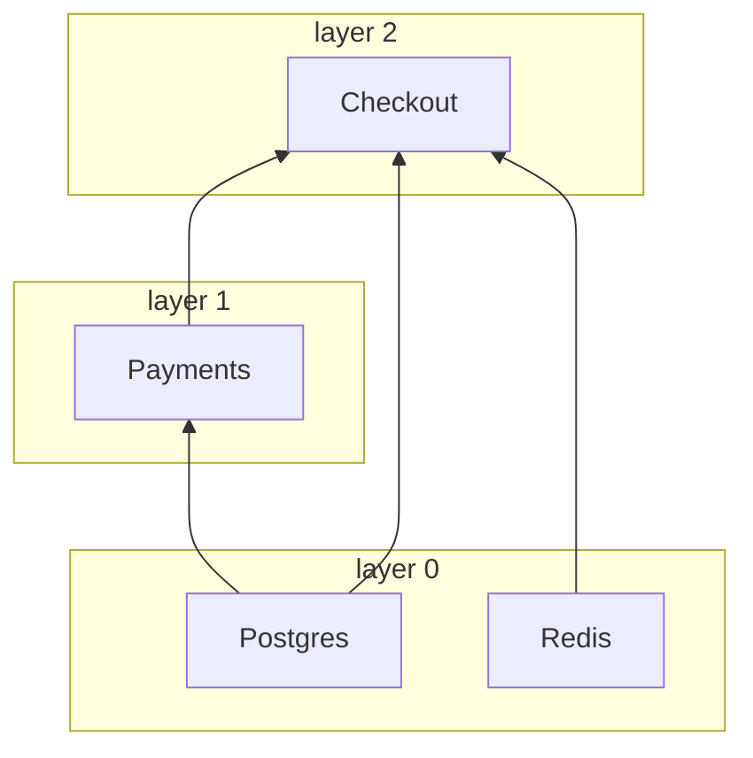

# Clients

**English** · [Русский](../i18n/ru/clients.md) · [简体中文](../i18n/zh-CN/clients.md) · [Español](../i18n/es/clients.md) · [Português (Brasil)](../i18n/pt-BR/clients.md) · [日本語](../i18n/ja/clients.md) · [Polski](../i18n/pl/clients.md)

← [Documentation](../../README.md#documentation)

## Client and NotSingletonClient

Every dependency is a subclass of one of two base classes:

| Base class           | Instances                                          |
|----------------------|----------------------------------------------------|
| `Client`             | Singleton: one instance per container              |
| `NotSingletonClient` | A new instance for every consumer that declares it |

```python
from nuke_di import Client, Dependencies, NotSingletonClient


class Settings(Client):
    pass


class HttpSession(NotSingletonClient):
    pass


class Orders(Client):
    def __init__(self, settings: Settings, http: HttpSession) -> None:
        self.settings = settings
        self.http = http


class Payments(Client):
    def __init__(self, settings: Settings, http: HttpSession) -> None:
        self.settings = settings
        self.http = http


deps = Dependencies()
orders = deps.resolve(Orders)
payments = deps.resolve(Payments)

print(orders.settings is payments.settings)  # one Settings for the whole container
print(orders.http is payments.http)  # every consumer gets its own HttpSession
print(deps.resolve(Orders) is orders)  # resolve() is idempotent for a Client
```

```text
True
False
True
```

A client declares its own dependencies as annotated `__init__` arguments. Only arguments
annotated with a client type are injected, and resolution is recursive.

## connect() and disconnect()

Override the async `connect()` / `disconnect()` methods to open and release resources such
as connection pools. `__init__` only stores the dependencies; anything that does I/O belongs
in `connect()`:

```python
class Redis(Client):
    def __init__(self) -> None:
        self._pool: Pool | None = None

    async def connect(self) -> None:
        self._pool = await create_pool()

    async def disconnect(self) -> None:
        if self._pool is not None:
            await self._pool.close()
            self._pool = None
```

Each `connect()` is bounded by `CONNECT_TIMEOUT_SECONDS` (default `30`) and each
`disconnect()` by `DISCONNECT_TIMEOUT_SECONDS` (default `10`). A failing or hanging
`disconnect()` is logged, and the other clients still shut down.

## Dataclass clients

`client_dataclass` turns a class into a `Client` and a dataclass at once, so the fields
become the injected dependencies. Subclass `Client` as well: the decorator is typed as an
identity, so the base class is what tells mypy and pyright that `Checkout` is a client; without
it the class is a client at runtime only:

```python
from nuke_di import Client, Dependencies, client_dataclass


class Postgres(Client):
    pass


class Payments(Client):
    pass


@client_dataclass(frozen=True)
class Checkout(Client):
    pg: Postgres
    payments: Payments


checkout = Dependencies().resolve(Checkout)
print(checkout)
print(isinstance(checkout, Client))
```

```text
Checkout(pg=<__main__.Postgres object at 0x...>, payments=<__main__.Payments object at 0x...>)
True
```

It accepts the same keyword arguments as `dataclasses.dataclass`.

## Layers

Clients connect concurrently in layers. Clients without dependencies form layer 0;
every other client sits one layer above its highest dependency. A layer starts only
after the previous one has connected, so a client never connects before its own
dependencies. `disconnect()` walks the layers in reverse.

```python
import asyncio
import logging

from nuke_di import Client, Dependencies

logging.basicConfig(level=logging.DEBUG, format="%(message)s")
logging.getLogger("asyncio").setLevel(logging.WARNING)  # keep only the nuke_di records


class Postgres(Client):
    async def connect(self) -> None:
        await asyncio.sleep(0.2)
        print("  postgres ready")


class Redis(Client):
    async def connect(self) -> None:
        await asyncio.sleep(0.1)
        print("  redis ready")


class Payments(Client):
    def __init__(self, pg: Postgres) -> None:
        self.pg = pg


class Checkout(Client):
    def __init__(self, pg: Postgres, redis: Redis, payments: Payments) -> None:
        self.pg, self.redis, self.payments = pg, redis, payments


async def main() -> None:
    deps = Dependencies()
    deps.resolve(Checkout)
    async with deps:
        print("-- application is running --")


asyncio.run(main())
```

The `DEBUG` log of the `nuke_di` logger shows the layers:

```text
Resolving dependency "Checkout"
Resolving dependency "Postgres"
Resolving dependency "Redis"
Resolving dependency "Payments"
Connecting layer 0: Postgres, Redis
Connecting client Postgres
Connecting client Redis
  redis ready
Connected client Redis in 0.101s
  postgres ready
Connected client Postgres in 0.201s
Connecting layer 1: Payments
Connecting client Payments
Connected client Payments in 0.000s
Connecting layer 2: Checkout
Connecting client Checkout
Connected client Checkout in 0.000s
Connected 4 clients in 3 layers in 0.20s (slowest: Postgres 0.20s, Redis 0.10s, Payments 0.00s)
-- application is running --
Disconnecting client Checkout
Disconnected client Checkout in 0.000s
Disconnecting client Payments
Disconnected client Payments in 0.000s
Disconnecting client Postgres
Disconnected client Postgres in 0.000s
Disconnecting client Redis
Disconnected client Redis in 0.000s
```

```text
Checkout(pg, redis, payments)    layer 2
Payments(pg)                     layer 1
Postgres, Redis                  layer 0  <- connect together, in 0.2s rather than 0.3s
```

Only dependencies declared in `__init__` are ordered. If a client needs another one to be
connected first, declare it as a dependency. Set `CONNECT_CONCURRENCY` to limit how many
clients connect at once.

## Startup timings

The container measures every client's `connect()` and `disconnect()`, so a slow startup
names its culprit. After a successful `connect()` it logs a summary at `INFO`, and a
`WARNING` for every client that used more than half of `CONNECT_TIMEOUT_SECONDS`, long
before that client starts failing with a timeout:

```python
# startup.py
import asyncio
import logging

from nuke_di import Client, Dependencies, DependenciesSettings

logging.basicConfig(level=logging.INFO, format="%(levelname)s %(message)s")


class Postgres(Client):
    async def connect(self) -> None:
        await asyncio.sleep(0.2)


class Kafka(Client):
    async def connect(self) -> None:
        await asyncio.sleep(1.6)

    async def disconnect(self) -> None:
        await asyncio.sleep(0.3)


class Orders(Client):
    def __init__(self, pg: Postgres, kafka: Kafka) -> None:
        self.pg, self.kafka = pg, kafka


async def main() -> None:
    deps = Dependencies(settings=DependenciesSettings(connect_timeout=3))
    deps.resolve(Orders)
    async with deps:
        print("-- application is running --")

    for t in deps.timings:
        print(
            f"{t.name:<8} layer {t.layer}  connect {t.connect:.2f}s {t.connect_outcome:<3}  "
            f"disconnect {t.disconnect:.2f}s {t.disconnect_outcome}"
        )


asyncio.run(main())
```

```console
$ python startup.py
INFO Connected 3 clients in 2 layers in 1.60s (slowest: Kafka 1.60s, Postgres 0.20s, Orders 0.00s)
WARNING Client Kafka took 1.60s to connect, more than half of CONNECT_TIMEOUT_SECONDS (3s)
-- application is running --
Postgres layer 0  connect 0.20s ok   disconnect 0.00s ok
Kafka    layer 0  connect 1.60s ok   disconnect 0.30s ok
Orders   layer 1  connect 0.00s ok   disconnect 0.00s ok
```

`deps.timings` holds one `ClientTiming` per client of the last `connect()`, in connect
order. It outlives `disconnect()`, so it can be read once the container has stopped. In a
FastAPI app, the lifespan you pass to `FastAPI()` runs inside the connected container, so it
sees the connect timings. A worker or a job gets the same list as
[`Run.clients`](workers-and-jobs.md#startup-metrics-and-structured-logs).

| `ClientTiming` field | Value |
|----------------------|-------|
| `name`               | The class name of the client |
| `layer`              | The [layer](#layers) of the client |
| `connect`            | Seconds spent in `connect()`, not counting the wait for `CONNECT_CONCURRENCY`; `None` if `connect()` never ran |
| `connect_outcome`    | `"ok"`, `"failed"`, `"timed_out"`, `"cancelled"`, or `None` if `connect()` never started |
| `disconnect`, `disconnect_outcome` | The same for `disconnect()`; `None` until the client disconnects |

When a client fails to connect, the clients of its layer that are still connecting end
up `"cancelled"`, the layers above keep `None`, and the clients that had connected are
rolled back, so they get a `disconnect_outcome`. The library only measures: exporting the
timings as metrics or spans is up to your code.

## The graph

The dependency graph exists only inside a running process: the `DEBUG` log above is the only
place that shows which clients an entrypoint pulls in and in which layer each one connects.
`graph()` returns the same picture as data, before `connect()` or after it. The clients of the
[Layers](#layers) example, without their `connect()`:

```python
# graph.py
from nuke_di import Client, Dependencies


class Postgres(Client):
    pass


class Redis(Client):
    pass


class Payments(Client):
    def __init__(self, pg: Postgres) -> None:
        self.pg = pg


class Checkout(Client):
    def __init__(self, pg: Postgres, redis: Redis, payments: Payments) -> None:
        self.pg, self.redis, self.payments = pg, redis, payments


deps = Dependencies()
deps.resolve(Checkout)
nodes = {node.name: node for node in deps.graph().nodes}
for node in nodes.values():
    print(f"{node.name:<8} layer {node.layer}  needs {list(node.dependencies)}")
print("shared:", nodes["Checkout"].dependencies["pg"] is nodes["Payments"].dependencies["pg"])
print(deps.graph().to_mermaid())
```

```console
$ python graph.py
Postgres layer 0  needs []
Redis    layer 0  needs []
Payments layer 1  needs ['pg']
Checkout layer 2  needs ['pg', 'redis', 'payments']
shared: True
graph BT
  subgraph layer0 [layer 0]
    Postgres
    Redis
  end
  subgraph layer1 [layer 1]
    Payments
  end
  subgraph layer2 [layer 2]
    Checkout
  end
  Postgres --> Payments
  Postgres --> Checkout
  Redis --> Checkout
  Payments --> Checkout
```

GitHub renders the Mermaid text in a README, a pull request or an issue, so a project can show
its architecture without a running process:



`Graph.nodes` holds one `Node` per resolved client, in resolution order, so a client comes after
its dependencies. It is a snapshot: `flush()` empties it, apart from the Replacements of the open
`override()` blocks, which survive every `flush()`.

| `Node` field   | Value |
|----------------|-------|
| `name`         | The class name of the client |
| `cls`          | The class the consumers asked for |
| `singleton`    | `True` for a `Client`, `False` for a `NotSingletonClient` |
| `layer`        | The [layer](#layers) of the client; `None` for a Replacement, which is never connected |
| `replacement`  | The object registered with `mock()` or `override()` in place of `cls`; `None` for a real client |
| `dependencies` | The clients of the `__init__` arguments, by argument name |

A `NotSingletonClient` gets one node per instance, all with the same name; `to_mermaid()` numbers
them from the second one (`Session`, `Session_2`). A Replacement is drawn outside the layers with a
dashed border and the name of the object in its place: `Postgres: AsyncMock`. Nodes compare by
identity, so the `shared: True` above says that `Checkout` and `Payments` got the same `Postgres`.

## When a client fails to connect

If a client fails to connect, the rest of its layer is cancelled and the next layers never
start. The clients that already connected are disconnected, layers in reverse, and the
container is left disconnected and empty:

```python
import asyncio

from nuke_di import Client, ConnectError, Dependencies


class Postgres(Client):
    async def connect(self) -> None:
        print("postgres: connected")

    async def disconnect(self) -> None:
        print("postgres: disconnected")


class Kafka(Client):
    async def connect(self) -> None:
        raise OSError("broker kafka-1:9092 is unreachable")


class Orders(Client):
    def __init__(self, pg: Postgres, kafka: Kafka) -> None:
        self.pg, self.kafka = pg, kafka


async def main() -> None:
    deps = Dependencies()
    deps.resolve(Orders)
    try:
        await deps.connect()
    except ConnectError as exc:
        print(f"{exc} <- {exc.__cause__!r}")
    print("connected:", deps.connected)


asyncio.run(main())
```

```text
postgres: connected
Kafka.connect() raised OSError: broker kafka-1:9092 is unreachable
Traceback (most recent call last):
  ...
OSError: broker kafka-1:9092 is unreachable
postgres: disconnected
Kafka.connect() raised OSError: broker kafka-1:9092 is unreachable <- OSError('broker kafka-1:9092 is unreachable')
connected: False
```

The same cleanup happens when `connect()` itself is cancelled. `ConnectError` derives from
`SystemExit`, so an application that does not catch it stops, which is usually what you want
when a dependency is down. Mocked clients are not connected and do not affect the layers.

## When the tree cannot be built

Resolution checks every `__init__` before it calls it, so a client that cannot be built fails
before anything connects, with the argument named and the path from the client you asked for:

```python
from typing import Protocol

from nuke_di import Client, Dependencies, InvalidSignatureError


class Postgres(Client):
    pass


class UserRepository(Protocol):
    async def get(self, user_id: int) -> str: ...


class Profiles(Client):
    def __init__(self, pg: Postgres, users: UserRepository) -> None:
        self.pg, self.users = pg, users


class Checkout(Client):
    def __init__(self, profiles: Profiles) -> None:
        self.profiles = profiles


class Orders(Client):
    def __init__(self, payments: "Payments") -> None:
        self.payments = payments


class Payments(Client):
    def __init__(self, orders: Orders) -> None:
        self.orders = orders


for root in (Checkout, Orders):
    try:
        Dependencies().resolve(root)
    except InvalidSignatureError as exc:
        print(f"{type(exc).__name__}: {exc}")

try:
    Dependencies().resolve(UserRepository)  # a type checker refuses this line, and so does the container
except InvalidSignatureError as exc:
    print(f"{type(exc).__name__}: {exc}")
```

```text
InvalidSignatureError: Argument "users" of "Profiles.__init__" is UserRepository, which is not a client (resolving Checkout -> Profiles)
CircularDependencyError: Circular dependency: Orders -> Payments -> Orders
InvalidSignatureError: UserRepository is not a client: subclass Client or NotSingletonClient
```

An argument of `__init__` is filled with a client when its type hint is a client. Any other
argument needs a default, which is left alone. These fail with `InvalidSignatureError`:

| `__init__` argument without a default | Message                                           |
|---------------------------------------|---------------------------------------------------|
| no type hint                          | `has no type hint`                                |
| a type that is not a client           | `is UserRepository, which is not a client`        |
| `Client \| None`                      | `is Postgres \| None, a client cannot be optional` |
| a client, positional-only (`/`)       | `is positional-only, a client is passed by keyword` |

A class that is not a client at all, asked for with `resolve()`, fails with `UserRepository is not a client: subclass Client or NotSingletonClient` before anything is built.

Clients that depend on each other in a cycle fail with `CircularDependencyError`, a subclass of
`InvalidSignatureError`, and a type hint that cannot be evaluated, e.g. a class defined inside a
function or imported under `TYPE_CHECKING`, with an `InvalidSignatureError` that says so. When the
error comes from `inject()`, the path starts at the function:
`(resolving handler -> Checkout -> Profiles)`. In a [worker or a job](workers-and-jobs.md)
each of these fails the run with exit code `1` before anything connects.
