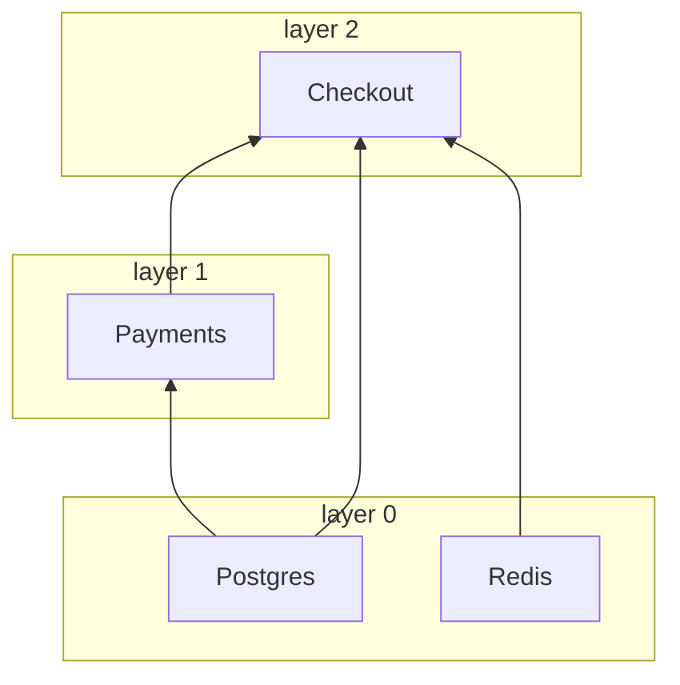

# nuke-di

[](https://pypi.org/project/nuke-di/)
[](https://pypi.org/project/nuke-di/)
[](https://github.com/troyan-dy/nuke-di/actions/workflows/ci.yml)
[](#development)
[](../../LICENSE)

[English](https://github.com/troyan-dy/nuke-di/blob/master/README.md) · [Русский](https://github.com/troyan-dy/nuke-di/blob/master/docs/i18n/README.ru.md) · [简体中文](https://github.com/troyan-dy/nuke-di/blob/master/docs/i18n/README.zh-CN.md) · [Español](https://github.com/troyan-dy/nuke-di/blob/master/docs/i18n/README.es.md) · [Português (Brasil)](https://github.com/troyan-dy/nuke-di/blob/master/docs/i18n/README.pt-BR.md) · **日本語** · [Polski](https://github.com/troyan-dy/nuke-di/blob/master/docs/i18n/README.pl.md)

非同期 Python プロジェクトのための、いちばんシンプルな依存性注入（DI）です。

依存関係は普通の型ヒントで宣言します。`nuke-di` は依存関係ツリーを構築し、各クライアントを一度だけ生成して、その非同期ライフサイクルを管理します。起動時には `connect()` を、終了時には `disconnect()` を呼び出します。互いに依存しないクライアントは、最も深い依存関係から順に、レイヤーごとに並行して起動します。

さらに、デコレーターをひとつ付けるだけで async 関数がプロセスになります。一度だけ実行される**ジョブ**か、停止されるまで動き続ける**ワーカー**として動作し、コマンドラインパラメータ、SIGTERM によるグレースフルシャットダウン、意味のある終了コードを備えます。FastAPI、Litestar、FastStream のハンドラーも、同じように型ヒントでクライアントを受け取ります。

本番運用されている Python マイクロサービスフレームワークの DI 機構を切り出したもので、実行時の依存パッケージはありません。

- [インストール](#installation)
- [クイックスタート](#quick-start)
- [クライアント](#clients)：[シングルトン](#client-and-notsingletonclient)、[ライフサイクル](#connect-and-disconnect)、[データクラス](#dataclass-clients)、[レイヤー](#layers)、[起動時間](#startup-timings)、[依存グラフ](#the-graph)、[接続の失敗](#when-a-client-fails-to-connect)、[解決エラー](#when-the-tree-cannot-be-built)
- [コンテナ](#the-container)
- [ワーカーとジョブ](#workers-and-jobs)：[ジョブ](#your-first-job)、[パラメータ](#parameters)、[ワーカー](#your-first-worker)、[猶予期間](#grace-period)、[バックグラウンドタスク](#background-tasks)、[終了コード](#exit-codes)、[フック](#hooks)、[Kubernetes](#running-in-kubernetes)
- フレームワーク：[FastAPI](#fastapi)、[Litestar](#litestar)、[FastStream](#faststream)
- [テスト](#testing)
- [設定](#configuration) · [エラー](#errors) · [パフォーマンス](#performance) · [開発](#development)

## <a id="installation"></a>インストール

```bash
pip install nuke-di
```

Python 3.11 以上が必要です。

## <a id="quick-start"></a>クイックスタート

```python
import asyncio

from nuke_di import DI, Client


class Database(Client):
    async def connect(self) -> None:
        print("database: connected")

    async def disconnect(self) -> None:
        print("database: disconnected")

    async def fetch_user(self, user_id: int) -> str:
        return f"user-{user_id}"


class UserService(Client):
    def __init__(self, db: Database) -> None:
        self._db = db

    async def greet(self, user_id: int) -> str:
        return f"Hello, {await self._db.fetch_user(user_id)}!"


async def handler(user_id: int, users: UserService) -> str:
    return await users.greet(user_id)


async def main() -> None:
    injected = DI.inject(handler)  # resolves UserService -> Database

    async with DI:  # connect() every client, disconnect() on exit
        print(await injected(42))


asyncio.run(main())
```

```text
database: connected
Hello, user-42!
database: disconnected
```

何が起きたのか：

1. `DI.inject(handler)` は `handler` の型ヒントを読み取ってクライアント `UserService` を見つけ、その `__init__` が `Database` を必要としていることを確認して、両方を構築しました。`user_id: int` はクライアントではないので、通常の引数のまま残ります。
2. `async with DI` は、構築したすべてのクライアントに対して、依存先から順に `connect()` を呼び出しました。
3. `injected(42)` は `handler(42, users=<UserService>)` を呼び出しました。
4. `async with` ブロックを抜けると、逆の順序で `disconnect()` が呼び出されました。

## <a id="clients"></a>クライアント

### <a id="client-and-notsingletonclient"></a>Client と NotSingletonClient

すべての依存関係は、次の 2 つの基底クラスのいずれかのサブクラスです。

| 基底クラス           | インスタンス                                       |
|----------------------|----------------------------------------------------|
| `Client`             | シングルトン：コンテナごとに 1 インスタンス        |
| `NotSingletonClient` | それを宣言する利用側ごとに新しいインスタンス       |

```python
from nuke_di import Client, Dependencies, NotSingletonClient


class Settings(Client):
    pass


class HttpSession(NotSingletonClient):
    pass


class Orders(Client):
    def __init__(self, settings: Settings, http: HttpSession) -> None:
        self.settings = settings
        self.http = http


class Payments(Client):
    def __init__(self, settings: Settings, http: HttpSession) -> None:
        self.settings = settings
        self.http = http


deps = Dependencies()
orders = deps.resolve(Orders)
payments = deps.resolve(Payments)

print(orders.settings is payments.settings)  # one Settings for the whole container
print(orders.http is payments.http)  # every consumer gets its own HttpSession
print(deps.resolve(Orders) is orders)  # resolve() is idempotent for a Client
```

```text
True
False
True
```

クライアントは自身の依存関係を、型注釈付きの `__init__` 引数として宣言します。注入されるのはクライアント型で注釈された引数だけで、解決は再帰的に行われます。

### <a id="connect-and-disconnect"></a>connect() と disconnect()

コネクションプールなどのリソースを確保・解放するには、非同期メソッド `connect()` / `disconnect()` をオーバーライドします。`__init__` では依存関係を保持するだけにとどめ、I/O を伴う処理はすべて `connect()` に書きます。

```python
class Redis(Client):
    def __init__(self) -> None:
        self._pool: Pool | None = None

    async def connect(self) -> None:
        self._pool = await create_pool()

    async def disconnect(self) -> None:
        if self._pool is not None:
            await self._pool.close()
            self._pool = None
```

`connect()` にはそれぞれ `CONNECT_TIMEOUT_SECONDS`（デフォルト `30`）、`disconnect()` にはそれぞれ `DISCONNECT_TIMEOUT_SECONDS`（デフォルト `10`）のタイムアウトがかかります。`disconnect()` が失敗したりハングしたりした場合はログに記録され、他のクライアントの終了処理はそのまま続行されます。

### <a id="dataclass-clients"></a>データクラスのクライアント

`client_dataclass` はクラスを `Client` かつデータクラスに一度に変換します。そのため、フィールドがそのまま注入される依存関係になります。あわせて `Client` も継承してください。デコレータは恒等関数として型付けされているので、`Checkout` がクライアントであることを mypy と pyright に伝えるのは基底クラスです。基底クラスがなければ、そのクラスは実行時にだけクライアントになります。

```python
from nuke_di import Client, Dependencies, client_dataclass


class Postgres(Client):
    pass


class Payments(Client):
    pass


@client_dataclass(frozen=True)
class Checkout(Client):
    pg: Postgres
    payments: Payments


checkout = Dependencies().resolve(Checkout)
print(checkout)
print(isinstance(checkout, Client))
```

```text
Checkout(pg=<__main__.Postgres object at 0x...>, payments=<__main__.Payments object at 0x...>)
True
```

`dataclasses.dataclass` と同じキーワード引数を受け付けます。

### <a id="layers"></a>レイヤー

クライアントはレイヤー単位で並行して接続されます。依存関係を持たないクライアントがレイヤー 0 を構成し、それ以外のクライアントは、依存先のうち最も高いレイヤーの 1 つ上に置かれます。各レイヤーは前のレイヤーの接続が完了してから開始されるため、クライアントが自身の依存先より先に接続されることはありません。`disconnect()` はレイヤーを逆順にたどります。

```python
import asyncio
import logging

from nuke_di import Client, Dependencies

logging.basicConfig(level=logging.DEBUG, format="%(message)s")
logging.getLogger("asyncio").setLevel(logging.WARNING)  # keep only the nuke_di records


class Postgres(Client):
    async def connect(self) -> None:
        await asyncio.sleep(0.2)
        print("  postgres ready")


class Redis(Client):
    async def connect(self) -> None:
        await asyncio.sleep(0.1)
        print("  redis ready")


class Payments(Client):
    def __init__(self, pg: Postgres) -> None:
        self.pg = pg


class Checkout(Client):
    def __init__(self, pg: Postgres, redis: Redis, payments: Payments) -> None:
        self.pg, self.redis, self.payments = pg, redis, payments


async def main() -> None:
    deps = Dependencies()
    deps.resolve(Checkout)
    async with deps:
        print("-- application is running --")


asyncio.run(main())
```

`nuke_di` ロガーの `DEBUG` ログにレイヤーが表示されます。

```text
Resolving dependency "Checkout"
Resolving dependency "Postgres"
Resolving dependency "Redis"
Resolving dependency "Payments"
Connecting layer 0: Postgres, Redis
Connecting client Postgres
Connecting client Redis
  redis ready
Connected client Redis in 0.101s
  postgres ready
Connected client Postgres in 0.201s
Connecting layer 1: Payments
Connecting client Payments
Connected client Payments in 0.000s
Connecting layer 2: Checkout
Connecting client Checkout
Connected client Checkout in 0.000s
Connected 4 clients in 3 layers in 0.20s (slowest: Postgres 0.20s, Redis 0.10s, Payments 0.00s)
-- application is running --
Disconnecting client Checkout
Disconnected client Checkout in 0.000s
Disconnecting client Payments
Disconnected client Payments in 0.000s
Disconnecting client Postgres
Disconnected client Postgres in 0.000s
Disconnecting client Redis
Disconnected client Redis in 0.000s
```

```text
Checkout(pg, redis, payments)    layer 2
Payments(pg)                     layer 1
Postgres, Redis                  layer 0  <- connect together, in 0.2s rather than 0.3s
```

順序が保証されるのは、`__init__` で宣言された依存関係だけです。あるクライアントより先に別のクライアントを接続しておく必要があるなら、それを依存関係として宣言してください。同時に接続するクライアントの数を制限するには、`CONNECT_CONCURRENCY` を設定します。

### <a id="startup-timings"></a>起動時間

コンテナはすべてのクライアントの `connect()` と `disconnect()` を計測するため、起動が遅いときに
原因のクライアントがすぐわかります。`connect()` が成功すると `INFO` で要約を出力し、
`CONNECT_TIMEOUT_SECONDS` の半分より長くかかったクライアントごとに `WARNING` を出力します。
そのクライアントがタイムアウトで失敗し始めるよりずっと前に気づけます：

```python
# startup.py
import asyncio
import logging

from nuke_di import Client, Dependencies, DependenciesSettings

logging.basicConfig(level=logging.INFO, format="%(levelname)s %(message)s")


class Postgres(Client):
    async def connect(self) -> None:
        await asyncio.sleep(0.2)


class Kafka(Client):
    async def connect(self) -> None:
        await asyncio.sleep(1.6)

    async def disconnect(self) -> None:
        await asyncio.sleep(0.3)


class Orders(Client):
    def __init__(self, pg: Postgres, kafka: Kafka) -> None:
        self.pg, self.kafka = pg, kafka


async def main() -> None:
    deps = Dependencies(settings=DependenciesSettings(connect_timeout=3))
    deps.resolve(Orders)
    async with deps:
        print("-- application is running --")

    for t in deps.timings:
        print(
            f"{t.name:<8} layer {t.layer}  connect {t.connect:.2f}s {t.connect_outcome:<3}  "
            f"disconnect {t.disconnect:.2f}s {t.disconnect_outcome}"
        )


asyncio.run(main())
```

```console
$ python startup.py
INFO Connected 3 clients in 2 layers in 1.60s (slowest: Kafka 1.60s, Postgres 0.20s, Orders 0.00s)
WARNING Client Kafka took 1.60s to connect, more than half of CONNECT_TIMEOUT_SECONDS (3s)
-- application is running --
Postgres layer 0  connect 0.20s ok   disconnect 0.00s ok
Kafka    layer 0  connect 1.60s ok   disconnect 0.30s ok
Orders   layer 1  connect 0.00s ok   disconnect 0.00s ok
```

`deps.timings` は直近の `connect()` のクライアントごとに `ClientTiming` を接続順に 1 つずつ保持します。
`disconnect()` の後も残るので、コンテナの停止後にも読み取れます。FastAPI アプリでは、`FastAPI()` に渡した
lifespan は接続済みのコンテナの内側で動くので、接続時間を参照できます。
ワーカーやジョブは同じリストを [`Run.clients`](#startup-metrics-and-structured-logs) で受け取ります。

| `ClientTiming` のフィールド | 値 |
|-----------------------------|----|
| `name`               | クライアントのクラス名 |
| `layer`              | クライアントの[レイヤー](#layers) |
| `connect`            | `connect()` にかかった秒数。`CONNECT_CONCURRENCY` の待ち時間は含みません。`connect()` が一度も実行されなかった場合は `None` |
| `connect_outcome`    | `"ok"`、`"failed"`、`"timed_out"`、`"cancelled"`。`connect()` が始まらなかった場合は `None` |
| `disconnect`、`disconnect_outcome` | `disconnect()` について同じもの。クライアントが切断されるまでは `None` |

あるクライアントの接続が失敗すると、同じレイヤーでまだ接続中のクライアントは `"cancelled"` になり、
上のレイヤーは `None` のままで、すでに接続していたクライアントはロールバックされて `disconnect_outcome`
を持ちます。ライブラリは計測するだけです。時間をメトリクスやスパンとしてエクスポートするのはあなたのコードの役割です。

### <a id="the-graph"></a>依存グラフ

依存グラフは実行中のプロセスの中にしか存在しません。上の `DEBUG` ログだけが、エントリーポイントがどのクライアントを
引き込み、それぞれがどのレイヤーで接続するかを示す場所です。`graph()` は同じ絵をデータとして返します。`connect()` の前でも
後でも呼べます。以下は[レイヤー](#layers)の例のクライアントから `connect()` を外したものです。

```python
# graph.py
from nuke_di import Client, Dependencies


class Postgres(Client):
    pass


class Redis(Client):
    pass


class Payments(Client):
    def __init__(self, pg: Postgres) -> None:
        self.pg = pg


class Checkout(Client):
    def __init__(self, pg: Postgres, redis: Redis, payments: Payments) -> None:
        self.pg, self.redis, self.payments = pg, redis, payments


deps = Dependencies()
deps.resolve(Checkout)
nodes = {node.name: node for node in deps.graph().nodes}
for node in nodes.values():
    print(f"{node.name:<8} layer {node.layer}  needs {list(node.dependencies)}")
print("shared:", nodes["Checkout"].dependencies["pg"] is nodes["Payments"].dependencies["pg"])
print(deps.graph().to_mermaid())
```

```console
$ python graph.py
Postgres layer 0  needs []
Redis    layer 0  needs []
Payments layer 1  needs ['pg']
Checkout layer 2  needs ['pg', 'redis', 'payments']
shared: True
graph BT
  subgraph layer0 [layer 0]
    Postgres
    Redis
  end
  subgraph layer1 [layer 1]
    Payments
  end
  subgraph layer2 [layer 2]
    Checkout
  end
  Postgres --> Payments
  Postgres --> Checkout
  Redis --> Checkout
  Payments --> Checkout
```

GitHub は README、pull request、issue の中で Mermaid のテキストを描画するので、プロジェクトはプロセスを動かさずに
アーキテクチャを見せられます。



`Graph.nodes` は解決済みのクライアントごとに 1 つの `Node` を解決順に持つので、クライアントは自分の依存の後に来ます。
これはスナップショットで、`flush()` で空になります。ただし、開いている `override()` ブロックの Replacement は残り、どの `flush()` にも
耐えます。

| `Node` のフィールド | 値 |
|---------------------|----|
| `name`              | クライアントのクラス名 |
| `cls`               | 利用側が要求したクラス |
| `singleton`         | `Client` なら `True`、`NotSingletonClient` なら `False` |
| `layer`             | クライアントの[レイヤー](#layers)。Replacement は接続されないので `None` |
| `replacement`       | `mock()` または `override()` で `cls` の代わりに登録されたオブジェクト。実際のクライアントは `None` |
| `dependencies`      | `__init__` の各引数に対応するクライアント。引数名で引く |

`NotSingletonClient` はインスタンスごとに 1 つのノードになり、名前はすべて同じです。`to_mermaid()` は 2 つ目から番号を
付けます（`Session`、`Session_2`）。Replacement はレイヤーの外に破線の枠で描かれ、代わりに置かれたオブジェクトの名前が
付きます：`Postgres: AsyncMock`。ノードは同一性で比較されるので、
上の `shared: True` は `Checkout` と `Payments` が同じ `Postgres` を受け取ったことを示します。

### <a id="when-a-client-fails-to-connect"></a>クライアントの接続に失敗した場合

クライアントの接続に失敗すると、同じレイヤーの残りの接続はキャンセルされ、次のレイヤーは開始されません。すでに接続済みのクライアントはレイヤーの逆順に切断され、コンテナは切断済みの空の状態になります。

```python
import asyncio

from nuke_di import Client, ConnectError, Dependencies


class Postgres(Client):
    async def connect(self) -> None:
        print("postgres: connected")

    async def disconnect(self) -> None:
        print("postgres: disconnected")


class Kafka(Client):
    async def connect(self) -> None:
        raise OSError("broker kafka-1:9092 is unreachable")


class Orders(Client):
    def __init__(self, pg: Postgres, kafka: Kafka) -> None:
        self.pg, self.kafka = pg, kafka


async def main() -> None:
    deps = Dependencies()
    deps.resolve(Orders)
    try:
        await deps.connect()
    except ConnectError as exc:
        print(f"{exc} <- {exc.__cause__!r}")
    print("connected:", deps.connected)


asyncio.run(main())
```

```text
postgres: connected
Kafka.connect() raised OSError: broker kafka-1:9092 is unreachable
Traceback (most recent call last):
  ...
OSError: broker kafka-1:9092 is unreachable
postgres: disconnected
Kafka.connect() raised OSError: broker kafka-1:9092 is unreachable <- OSError('broker kafka-1:9092 is unreachable')
connected: False
```

`connect()` 自体がキャンセルされた場合も、同じクリーンアップが行われます。`ConnectError` は `SystemExit` を継承しているため、これを捕捉しないアプリケーションは停止します。依存先がダウンしているときは、たいていそれが望ましい動作です。モックしたクライアントは接続されず、レイヤーにも影響しません。

### <a id="when-the-tree-cannot-be-built"></a>ツリーを構築できない場合

解決時には、すべての `__init__` を呼び出す前に検査します。そのため、構築できないクライアントは何かが接続される前に失敗し、エラーには該当する引数の名前と、要求したクライアントからの経路が示されます。

```python
from typing import Protocol

from nuke_di import Client, Dependencies, InvalidSignatureError


class Postgres(Client):
    pass


class UserRepository(Protocol):
    async def get(self, user_id: int) -> str: ...


class Profiles(Client):
    def __init__(self, pg: Postgres, users: UserRepository) -> None:
        self.pg, self.users = pg, users


class Checkout(Client):
    def __init__(self, profiles: Profiles) -> None:
        self.profiles = profiles


class Orders(Client):
    def __init__(self, payments: "Payments") -> None:
        self.payments = payments


class Payments(Client):
    def __init__(self, orders: Orders) -> None:
        self.orders = orders


for root in (Checkout, Orders):
    try:
        Dependencies().resolve(root)
    except InvalidSignatureError as exc:
        print(f"{type(exc).__name__}: {exc}")

try:
    Dependencies().resolve(UserRepository)  # a type checker refuses this line, and so does the container
except InvalidSignatureError as exc:
    print(f"{type(exc).__name__}: {exc}")
```

```text
InvalidSignatureError: Argument "users" of "Profiles.__init__" is UserRepository, which is not a client (resolving Checkout -> Profiles)
CircularDependencyError: Circular dependency: Orders -> Payments -> Orders
InvalidSignatureError: UserRepository is not a client: subclass Client or NotSingletonClient
```

`__init__` の引数は、型ヒントがクライアントであればクライアントで埋められます。それ以外の引数にはデフォルト値が必要で、その値はそのまま使われます。次の場合は `InvalidSignatureError` で失敗します。

| デフォルト値のない `__init__` 引数    | メッセージ                                        |
|---------------------------------------|---------------------------------------------------|
| 型ヒントがない                        | `has no type hint`                                |
| クライアントではない型                | `is UserRepository, which is not a client`        |
| `Client \| None`                      | `is Postgres \| None, a client cannot be optional` |
| 位置専用（`/`）のクライアント         | `is positional-only, a client is passed by keyword` |

そもそもクライアントではないクラスを `resolve()` で、または注入される関数の引数として求めると、何かが構築される前に `UserRepository is not a client: subclass Client or NotSingletonClient` で失敗します。

互いに循環して依存するクライアントは、`InvalidSignatureError` のサブクラスである `CircularDependencyError` で失敗します。評価できない型ヒント（関数の内部で定義されたクラスや、`TYPE_CHECKING` の下でインポートされたクラスなど）は、その旨を示す `InvalidSignatureError` で失敗します。エラーが `inject()` から発生した場合、経路は関数から始まります：`(resolving handler -> Checkout -> Profiles)`。[ワーカーやジョブ](#workers-and-jobs)では、いずれの場合も何かが接続される前に、終了コード `1` で実行が失敗します。

## <a id="the-container"></a>コンテナ

`Dependencies` がコンテナです。`DI` はすぐに使えるグローバルインスタンスです。テストなどで分離が必要な場合は、独自のインスタンスを作成してください。

| メソッド             | 説明                                                                    |
|----------------------|-------------------------------------------------------------------------|
| `resolve(cls)`       | `cls` とその依存関係ツリーを構築します。`Client` に対しては冪等です。   |
| `inject(func)`       | クライアント引数を束縛した `functools.partial(func, ...)` を返します。`*args` / `**kwargs` を除く `func` のすべての引数に型ヒントが必要です。 |
| `connect()`          | 解決済みのすべてのクライアントに対して、レイヤーごとに `connect()` を呼び出します。 |
| `disconnect()`       | レイヤーの逆順に `disconnect()` を呼び出し、その後コンテナを `flush()` します。 |
| `async with`         | 開始時に `connect()`、終了時に `disconnect()` を呼び出します。          |
| `mock(cls, new=None)`| 次の `flush()` まで有効な `cls` の差し替え（デフォルトは autospec モック）を登録します。`cls` が解決される前に呼び出す必要があります。 |
| `override(cls, new=None)` | `with` ブロックの間だけ有効な差し替えを登録し、ブロックの終了後に `flush()` します。[テスト](#testing)を参照してください。 |
| `flush()`            | 解決済みのクライアントをすべて破棄します。                              |
| `timings`            | 直近の `connect()` のクライアントごとの `ClientTiming`。[起動時間](#startup-timings)を参照。 |
| `graph()`            | 解決済みクライアントの `Graph`。依存とレイヤーを持ち、`to_mermaid()` 付き。[依存グラフ](#the-graph)を参照。 |

`inject()` の結果は関数の戻り値の型を保ちますが、残りの引数は型付けされません。型チェッカーはシグネチャからクライアント引数を差し引けないからです。

`resolve`、`inject`、`mock`、`override`、`flush` は、コンテナが切断されている間しか使えません。ツリー全体は起動前に構築されます。

```python
async def main() -> None:
    deps = Dependencies()
    injected = deps.inject(handler)  # build the tree
    async with deps:  # connect
        await injected(42)
        deps.resolve(Cache)  # ConnectError: resolve(Cache): the container is already connected; ...
```

## <a id="workers-and-jobs"></a>ワーカーとジョブ

デコレーターをひとつ付けるだけで、async 関数がプロセスのメインプログラムになります。

| デコレーター | 実行のしかた                                           |
|--------------|--------------------------------------------------------|
| `@job`       | 一度だけ：関数が戻るとプロセスが終了します             |
| `@worker`    | プロセスが SIGTERM または SIGINT を受け取るまで        |

このセクションの例では、次のクライアントモジュールを共通で使います。

```python
# app/clients.py
import datetime
import itertools

from nuke_di import Client


class Postgres(Client):
    async def connect(self) -> None:
        print("postgres: connected")

    async def disconnect(self) -> None:
        print("postgres: disconnected")

    async def upsert(self, table: str, rows: list[str]) -> None:
        print(f"postgres: upserted {len(rows)} rows into {table}")


class Warehouse(Client):
    async def connect(self) -> None:
        print("warehouse: connected")

    async def disconnect(self) -> None:
        print("warehouse: disconnected")

    async def changes(self, table: str, day: datetime.date) -> list[str]:
        return [f"{table}:{day}:{n}" for n in range(3)]


class Queue(Client):
    def __init__(self) -> None:
        self._ids = itertools.count(1)

    async def connect(self) -> None:
        print("queue: connected")

    async def disconnect(self) -> None:
        print("queue: disconnected")

    async def get(self) -> str:
        return f"message-{next(self._ids)}"
```

### <a id="your-first-job"></a>はじめてのジョブ

```python
# app/jobs/sync.py
import datetime

from nuke_di import job

from app.clients import Postgres, Warehouse


@job
async def sync(pg: Postgres, warehouse: Warehouse) -> None:
    day = datetime.date.today() - datetime.timedelta(days=1)
    for table in ["users", "orders"]:
        await pg.upsert(table, await warehouse.changes(table, day))
```

```console
$ python -m app.jobs.sync
postgres: connected
warehouse: connected
postgres: upserted 3 rows into users
postgres: upserted 3 rows into orders
postgres: disconnected
warehouse: disconnected
$ echo $?
0
```

プログラムはこれだけです。`main()` も `asyncio.run()` も `if __name__ == "__main__"` も要りません。プロセスはグローバルな `DI` コンテナからクライアントを解決して接続し、関数を実行し、クライアントを切断してから、[終了コード](#exit-codes)を返して終了します。スケジューリングはライブラリの役割ではありません。ジョブをいつ実行するかは、Kubernetes の CronJob、systemd タイマー、crontab などが決めます。

`nuke-di` はすべての実行を `nuke_di` ロガーに記録します。これを表示するには、デコレーターより上でロギングを設定します。

```python
import logging

logging.basicConfig(level=logging.INFO, format="%(levelname)-5s %(name)s: %(message)s")


@job
async def sync(pg: Postgres, warehouse: Warehouse) -> None: ...
```

```console
$ python -m app.jobs.sync
INFO  nuke_di.run: Starting job app.jobs.sync.sync
postgres: connected
warehouse: connected
INFO  nuke_di.core: Connected 4 clients in 1 layer in 0.00s (slowest: Warehouse 0.00s, Postgres 0.00s, Shutdown 0.00s)
postgres: upserted 3 rows into users
postgres: upserted 3 rows into orders
postgres: disconnected
warehouse: disconnected
INFO  nuke_di.run: Run app.jobs.sync.sync finished with exit code 0 in 0.002s
```

#### <a id="one-entrypoint-per-module-defined-last"></a>エントリーポイントはモジュールにひとつ、最後に定義する

モジュールが `__main__` として実行されると、デコレーターはその場で関数を実行し、プロセスはそこで終了します。

```python
# app/jobs/sync.py
DI.mock(Warehouse, FakeWarehouse())  # runs: code above the decorator is fine


@job
async def sync(pg: Postgres, warehouse: Warehouse) -> None: ...


print("never printed")  # never runs under `python -m app.jobs.sync`
```

**エントリーポイントはモジュールにひとつだけにして、最後に定義してください。** テストからインポートするなど通常のインポートでは、デコレーターは関数をそのまま返し、何も実行されません。デコレートする関数は `async def` で宣言する必要があり、そうでない場合はインポート時に `TypeError` が送出されます。

### <a id="parameters"></a>パラメータ

型注釈付きの引数のうちクライアントでないものは、すべてコマンドラインオプションになります。次は先ほどと同じジョブですが、任意の日付のデータを、一部のテーブルだけ、ドライランでコピーできるようになっています。

```python
# app/jobs/sync.py
import datetime
import enum
from typing import Annotated

from nuke_di import Option, job

from app.clients import Postgres, Warehouse


class Mode(enum.Enum):
    INCREMENTAL = "incremental"
    FULL = "full"


@job
async def sync(
    pg: Postgres,
    warehouse: Warehouse,
    day: Annotated[datetime.date, Option(help="Day to copy, YYYY-MM-DD", short="d")],
    tables: Annotated[
        list[str] | None, Option(help="Table to copy, repeat for several; all by default", short="t")
    ] = None,
    mode: Mode = Mode.INCREMENTAL,
    dry_run: Annotated[bool, Option(help="Read the changes, write nothing")] = False,
) -> None:
    """Copy one day of changes from the warehouse into Postgres."""
    print(f"sync: {mode.name} copy of {day}")
    for table in tables or ["users", "orders"]:
        rows = await warehouse.changes(table, day)
        if dry_run:
            print(f"sync: would upsert {len(rows)} rows into {table}")
        else:
            await pg.upsert(table, rows)
```

`pg` と `warehouse` はクライアントなので注入されます。`day`、`tables`、`mode`、`dry_run` はコマンドラインから渡されます。

```console
$ python -m app.jobs.sync --day 2026-10-01
postgres: connected
warehouse: connected
sync: INCREMENTAL copy of 2026-10-01
postgres: upserted 3 rows into users
postgres: upserted 3 rows into orders
postgres: disconnected
warehouse: disconnected

$ python -m app.jobs.sync -d 2026-10-01 -t users --mode FULL --dry-run
postgres: connected
warehouse: connected
sync: FULL copy of 2026-10-01
sync: would upsert 3 rows into users
postgres: disconnected
warehouse: disconnected
```

`--help` はシグネチャと docstring から生成されます。このとき何も接続されません（Python 3.13 以降では `-d DAY, --day DAY` ではなく `-d, --day DAY` と表示されます）。

```console
$ python -m app.jobs.sync --help
usage: python -m app.jobs.sync [-h] -d DAY [-t TABLES]
                               [--mode {INCREMENTAL,FULL}]
                               [--dry-run | --no-dry-run]

Copy one day of changes from the warehouse into Postgres.

options:
  -h, --help            show this help message and exit
  -d DAY, --day DAY     Day to copy, YYYY-MM-DD
  -t TABLES, --tables TABLES
                        Table to copy, repeat for several; all by default
  --mode {INCREMENTAL,FULL}
                        (default: INCREMENTAL)
  --dry-run, --no-dry-run
                        Read the changes, write nothing (default: False)
```

誤ったコマンドラインは、**クライアントが解決・接続されるより前に**、終了コード `2` で拒否されます。

```console
$ python -m app.jobs.sync
usage: python -m app.jobs.sync [-h] -d DAY [-t TABLES]
                               [--mode {INCREMENTAL,FULL}]
                               [--dry-run | --no-dry-run]
python -m app.jobs.sync: error: the following arguments are required: -d/--day
Run app.jobs.sync.sync failed: the following arguments are required: -d/--day
$ echo $?
2

$ python -m app.jobs.sync --day yesterday
...
python -m app.jobs.sync: error: argument -d/--day: invalid date value: 'yesterday'

$ python -m app.jobs.sync -d 2026-10-01 --mode full
...
python -m app.jobs.sync: error: argument --mode: invalid choice: 'full' (choose from INCREMENTAL, FULL)

$ python -m app.jobs.sync -d 2026-10-01 --dry
...
python -m app.jobs.sync: error: unrecognized arguments: --dry
```

各エラーの最初の 2 行は `argparse` が出力したものです。`Run ... failed` の行は `nuke_di` ロガーの `ERROR` レコードなので、ロギングの設定に従います。省略形は受け付けません。`--dry` が `--dry-run` とみなされることはありません。

#### <a id="supported-types"></a>サポートされる型

| アノテーション                                | コマンドライン                  | 例                              |
|-----------------------------------------------|---------------------------------|---------------------------------|
| `str`, `int`, `float`, `pathlib.Path`         | `--name VALUE`                  | `--limit 10`                    |
| `bool`                                        | `--name` / `--no-name`          | `--dry-run`                     |
| `datetime.date`, `datetime.datetime`          | ISO 8601                        | `--since 2026-10-01T12:00:00`   |
| `Enum`                                        | メンバーの**名前**（書かれたとおり） | `--mode FULL`              |
| `bool` 以外の上記いずれかの型の `list[T]`     | オプションを繰り返す            | `--table users --table orders`  |
| `T \| None`                                   | `T` と同じ                      | `--limit 10`                    |

ルール：

- **名前。** オプション名は、引数名の `_` を `-` に置き換えたものです。`dry_run` は `--dry-run` になります。位置引数はないので、パラメータを追加しても既存のコマンドラインが壊れることはありません。
- **必須かどうか。** デフォルト値のない引数は必須オプションになります。デフォルト値のある引数は省略可能で、オプションが省略された場合は関数自身のデフォルト値が使われます。
- **`Option`。** `Annotated[T, Option(help=..., short=...)]` で、ヘルプテキストと `-d` のような 1 文字のエイリアスを追加できます。どちらも省略可能です。
- **パラメータがない場合。** パラメータを持たないエントリーポイントもコマンドラインを解析します。`--help` には応答し、それ以外の引数はすべて終了コード `2` で拒否します。

次のようなシグネチャは、コマンドラインではなくコードのバグです。`InvalidSignatureError` と終了コード `1` で実行が失敗します。

```python
async def sync(day: dict[str, int]) -> None: ...  # unsupported type
async def sync(pg: Annotated[Postgres, Option(help="...")]) -> None: ...  # Option on a client
async def sync(help: bool = False) -> None: ...  # clashes with --help
async def sync(day: int, /) -> None: ...  # positional-only
```

#### <a id="parameters-in-tests"></a>テストでのパラメータ

デコレートされた関数は普通のコルーチンのままなので、テストではパラメータをキーワード引数として渡します。

```python
async def test_sync_copies_requested_tables() -> None:
    pg, warehouse = AsyncMock(), AsyncMock()
    warehouse.changes.return_value = ["row"]

    await sync(pg, warehouse, day=datetime.date(2026, 10, 1), tables=["users"])

    warehouse.changes.assert_awaited_once_with("users", datetime.date(2026, 10, 1))
    pg.upsert.assert_awaited_once_with("users", ["row"])
```

### <a id="your-first-worker"></a>はじめてのワーカー

ワーカーは、プロセスに停止が要求されるまで動き続けます。ワーカーは最初の SIGTERM または SIGINT でセットされる `Shutdown` クライアントに依存し、処理中の作業を終えてから停止します。

```python
# app/workers/consumer.py
import asyncio

from nuke_di import Shutdown, worker

from app.clients import Queue


@worker
async def consumer(queue: Queue, shutdown: Shutdown) -> None:
    while not shutdown.is_set():
        message = await queue.get()
        print(f"consumer: processing {message}")
        await asyncio.sleep(1)  # the actual work
        print(f"consumer: done {message}")
    print("consumer: stopped")
```

3 つ目のメッセージの処理中に Ctrl+C を押すと、そのメッセージの処理を終えてからループを抜け、クライアントが切断されます。

```console
$ python -m app.workers.consumer
queue: connected
consumer: processing message-1
consumer: done message-1
consumer: processing message-2
consumer: done message-2
consumer: processing message-3
^C
consumer: done message-3
consumer: stopped
queue: disconnected
$ echo $?
130
```

`Shutdown` には 3 つのメソッドがあります。

| メソッド         | 説明                                                                      |
|------------------|---------------------------------------------------------------------------|
| `is_set()`       | シャットダウンが始まったかどうか。作業の区切りごとに確認します            |
| `await wait()`   | シャットダウンが始まるまでブロックします                                  |
| `set()`          | シャットダウンを手動で開始します（テストなどで使います）                  |

ワーカーやジョブの外ではこれをセットするものがないので、`Shutdown` に依存するループは Web アプリケーションの中でもそのまま動作します。ワーカーが自ら戻ったり例外を送出したりした場合も、プロセスは終了します。再起動はオーケストレーターの役割です。

Windows で処理されるのは SIGINT（Ctrl+C）だけで、SIGTERM はデフォルトの動作のままです。

### <a id="grace-period"></a>猶予期間

`Shutdown` を無視するワーカーは、`SHUTDOWN_GRACE_SECONDS`（デフォルト `10`）秒が経過するとキャンセルされます。

```python
# app/workers/stubborn.py
@worker
async def stubborn(queue: Queue) -> None:
    while True:  # never looks at Shutdown
        message = await queue.get()
        print(f"stubborn: processing {message}")
        await asyncio.sleep(5)
```

```console
$ SHUTDOWN_GRACE_SECONDS=2 python -m app.workers.stubborn &
queue: connected
stubborn: processing message-1
$ kill -TERM %1
Run app.workers.stubborn.stubborn did not stop within 2.0s after Shutdown, cancelling it
queue: disconnected
$ wait %1; echo $?
143
```

2 回目のシグナルを受け取ると、猶予期間を待たずにただちにエントリーポイントがキャンセルされます。たとえば Ctrl+C を 2 回押した場合です。

```console
$ python -m app.workers.stubborn
queue: connected
stubborn: processing message-1
^C^C
Second SIGINT, cancelling run app.workers.stubborn.stubborn
queue: disconnected
```

クライアントの接続中にシグナルが届いた場合は起動が中止され、すでに接続済みのクライアントは切断されます。

最悪の場合、プロセスが停止するまでに `SHUTDOWN_GRACE_SECONDS + DISCONNECT_TIMEOUT_SECONDS × layers` かかります。デフォルト値のままだと、2 レイヤーのツリーだけで Kubernetes のデフォルトの `terminationGracePeriodSeconds` である 30 秒を使い切ってしまいます。ツリーがもっと深い場合は、タイムアウトを短くするか猶予期間を長くしてください。

### <a id="background-tasks"></a>バックグラウンドタスク

`BackgroundTasks` は、エントリーポイントと並行して動くコルーチンを監督するクライアントです。素の `asyncio.create_task()` とは異なり、失敗したタスクが握りつぶされることはありません。トレースバック付きでログに記録され、プロセス全体が失敗します。

```python
# app/workers/indexer.py
import asyncio

from nuke_di import BackgroundTasks, Shutdown, worker

from app.clients import Queue


async def refresh_index() -> None:
    for attempt in range(1, 10):
        print(f"refresh: run {attempt}")
        await asyncio.sleep(0.5)
        if attempt == 2:
            raise ConnectionError("search cluster is unreachable")


@worker
async def indexer(queue: Queue, tasks: BackgroundTasks, shutdown: Shutdown) -> None:
    tasks.spawn(refresh_index(), name="refresh-index")
    print("indexer: waiting for Shutdown")
    await shutdown.wait()
```

```console
$ python -m app.workers.indexer
queue: connected
indexer: waiting for Shutdown
refresh: run 1
refresh: run 2
Background task refresh-index failed
Traceback (most recent call last):
  ...
ConnectionError: search cluster is unreachable
queue: disconnected
Run app.workers.indexer.indexer failed
Traceback (most recent call last):
  ...
ConnectionError: search cluster is unreachable
$ echo $?
1
```

ワーカーは猶予期間なしでキャンセルされました。バックグラウンドのループがクラッシュしたのに、何もしないプロセスが生き残ってはならないからです。プロセスがどんな理由で停止する場合でも、タスクはクライアントが切断される**前に**キャンセルされ、その終了が待たれます。そのため、タスクが閉じたクライアントに対して動作することはありません。

| メソッド                   | 説明                                                            |
|----------------------------|-----------------------------------------------------------------|
| `spawn(coro, name=None)`   | `coro` をタスクとして開始し、終了するまでその参照を保持します    |
| `watch(callback)`          | 失敗したタスクごとに `callback(exc)` を呼び出します             |
| `await stop()`             | すべてのタスクをキャンセルし、すべての終了を待ちます。`disconnect()` から呼び出されます |

ワーカーやジョブの外（素の `async with DI` の下など）では、失敗はログに記録されるだけで、タスクは `disconnect()` の際にキャンセルされます。

### <a id="exit-codes"></a>終了コード

最初に一致したルールが適用されます。

| 条件                                                                                                | 終了コード     |
|-----------------------------------------------------------------------------------------------------|----------------|
| 無効なコマンドライン（`UsageError`）                                                                | `2`            |
| 例外：シグネチャ、クライアントの解決または接続、エントリーポイント、バックグラウンドタスクのいずれか | `1`            |
| 終了シグナルを受信した                                                                              | `128 + signum` |
| それ以外                                                                                            | `0`            |

SIGTERM では `143`、SIGINT では `130` になります。シャットダウンを検知して正常に戻ったジョブも、終了コードは `128 + signum` です。作業が中断されたので、スケジューラはそれを完了とみなしてはならないからです。

これらのコードは、プロセスを起動する側のためのものです。

```bash
python -m app.jobs.sync --day 2026-10-01
case $? in
  0)       echo "synced" ;;
  2)       echo "fix the command line, retrying will not help" ;;
  130|143) echo "interrupted, safe to run again" ;;
  *)       echo "failed, see the log" ;;
esac
```

### <a id="hooks"></a>フック

フックはすべての実行を観測します。メトリクスの送信やトレーシングのスパンの開始などに使えます。

```python
# app/jobs/report.py
from nuke_di import Run, job

from app.clients import Postgres


class Timer:
    async def on_start(self, run: Run) -> None:
        print(f"hook: {run.kind} {run.name} started")

    async def on_finish(self, run: Run) -> None:
        seconds = (run.finished_at - run.started_at).total_seconds()
        print(f"hook: exit code {run.exit_code} in {seconds:.1f}s, error: {run.error!r}")


@job(hooks=[Timer()])
async def report(pg: Postgres, limit: int = 10) -> None:
    print(f"report: top {limit} customers")
```

```console
$ python -m app.jobs.report --limit 3
hook: job app.jobs.report.report started
postgres: connected
report: top 3 customers
postgres: disconnected
hook: exit code 0 in 0.0s, error: None

$ python -m app.jobs.report --limit three
usage: python -m app.jobs.report [-h] [--limit LIMIT]
python -m app.jobs.report: error: argument --limit: invalid int value: 'three'
hook: job app.jobs.report.report started
Run app.jobs.report.report failed: argument --limit: invalid int value: 'three'
hook: exit code 2 in 0.0s, error: UsageError("argument --limit: invalid int value: 'three'")
```

`on_start` はクライアントが解決される前にリストの順に呼び出され、`on_finish` はクライアントが切断された後に逆順で呼び出されます。そのため `on_finish` からは、接続の失敗も含めた `Run` の最終状態を参照できます。

| `Run` のフィールド | 値                                                                     |
|--------------------|------------------------------------------------------------------------|
| `name`             | モジュールと関数。例：`app.jobs.report.report`                         |
| `kind`             | `"job"` または `"worker"`                                              |
| `started_at`       | UTC の `datetime`                                                      |
| `finished_at`      | UTC の `datetime`。`on_finish` の前に設定されます                      |
| `exit_code`        | プロセスの終了コード。`on_finish` の前に設定されます                   |
| `error`            | 実行を失敗させた例外（`UsageError` など）、または `None`               |
| `signal`           | 最初に受信した終了シグナル、または `None`                              |
| `clients`          | クライアントごとの `ClientTiming`：接続と切断の時間と結果。接続前に実行が失敗した場合は空 |

フックはクライアントではなく普通のオブジェクトで、自身のリソースは自分で管理します。フック内で発生した例外はログに記録され、終了コードには影響しません。`--help` は実行ではないので、フックからは見えません。

#### <a id="startup-metrics-and-structured-logs"></a>起動メトリクスと構造化ログ

起動メトリクスをエクスポートするのは `run.clients` です。`on_finish` では、各クライアントの接続と切断に
かかった時間がわかります。さらに `nuke_di` のすべてのログレコードには構造化フィールドが付くので、
JSON フォーマッターはメッセージを解析せずにクライアント単位で絞り込みや集計ができます：

```python
# app/jobs/startup.py
import json
import logging

from nuke_di import Run, job

from app.clients import Postgres, Warehouse


class JsonFormatter(logging.Formatter):
    def format(self, record: logging.LogRecord) -> str:
        fields = {key: getattr(record, key) for key in ("run", "client", "layer", "duration") if hasattr(record, key)}
        return json.dumps({"level": record.levelname, "message": record.getMessage(), **fields})


handler = logging.StreamHandler()
handler.setFormatter(JsonFormatter())
logging.basicConfig(level=logging.INFO, handlers=[handler])


class StartupMetrics:
    async def on_start(self, run: Run) -> None:
        pass

    async def on_finish(self, run: Run) -> None:
        for client in run.clients:
            print(f"metric: {client.name} connect={client.connect:.3f}s {client.connect_outcome}")


@job(hooks=[StartupMetrics()])
async def startup(pg: Postgres, warehouse: Warehouse) -> None:
    print("startup: done")
```

```console
$ python -m app.jobs.startup
{"level": "INFO", "message": "Starting job app.jobs.startup.startup", "run": "app.jobs.startup.startup"}
postgres: connected
warehouse: connected
{"level": "INFO", "message": "Connected 4 clients in 1 layer in 0.00s (slowest: Postgres 0.00s, Shutdown 0.00s, Warehouse 0.00s)", "run": "app.jobs.startup.startup", "duration": 0.00015945796621963382}
startup: done
postgres: disconnected
warehouse: disconnected
{"level": "INFO", "message": "Run app.jobs.startup.startup finished with exit code 0 in 0.001s", "run": "app.jobs.startup.startup", "duration": 0.001171}
metric: Shutdown connect=0.000s ok
metric: BackgroundTasks connect=0.000s ok
metric: Postgres connect=0.000s ok
metric: Warehouse connect=0.000s ok
```

| フィールド | 付くレコード                                                                  |
|------------|-------------------------------------------------------------------------------|
| `run`      | ワーカーやジョブの内側で出るすべてのレコード（コンテナのものを含む）：実行の名前 |
| `client`   | 1 つのクライアントに関するすべてのレコード：解決、接続、切断、失敗            |
| `layer`    | クライアントの接続や切断に関するすべてのレコードと `Connecting layer`         |
| `duration` | 秒数：接続または切断したクライアント、起動の要約、終了した実行                |

どの実行も自分の `Shutdown` と `BackgroundTasks` クライアントを接続するので、それらも
`run.clients` と要約に現れます。

### <a id="running-in-kubernetes"></a>Kubernetes での実行

ジョブは CronJob に、ワーカーは Deployment に対応します。ワーカーには、[シャットダウンにかかる時間](#grace-period)をまかなえるだけの `terminationGracePeriodSeconds` を設定してください。

```yaml
apiVersion: batch/v1
kind: CronJob
metadata:
  name: report
spec:
  schedule: "0 6 * * *"
  concurrencyPolicy: Forbid
  jobTemplate:
    spec:
      template:
        spec:
          restartPolicy: Never
          containers:
            - name: report
              image: registry.example.com/app:1.0
              command: ["python", "-m", "app.jobs.report"]
              args: ["--limit", "20"]
---
apiVersion: apps/v1
kind: Deployment
metadata:
  name: consumer
spec:
  replicas: 2
  selector:
    matchLabels: {app: consumer}
  template:
    metadata:
      labels: {app: consumer}
    spec:
      terminationGracePeriodSeconds: 30  # >= SHUTDOWN_GRACE_SECONDS + DISCONNECT_TIMEOUT_SECONDS × layers
      containers:
        - name: consumer
          image: registry.example.com/app:1.0
          command: ["python", "-m", "app.workers.consumer"]
          env:
            - {name: SHUTDOWN_GRACE_SECONDS, value: "15"}
```

単発のバックフィルは、同じイメージを別のパラメータで実行するだけです。

```bash
kubectl run sync-backfill --rm -it --restart=Never --image=registry.example.com/app:1.0 \
  --command -- python -m app.jobs.sync --day 2026-09-30 --mode FULL
```

## <a id="fastapi"></a>FastAPI

FastAPI のパスオペレーションは、ジョブと同じように型ヒントでクライアントを受け取ります。ハンドラーごとに書き足すものは何もありません。`Depends` も `inject()` も不要です。

```bash
pip install "nuke-di[fastapi]"
```

FastAPI 0.105 以降が必要です。例では次のクライアントモジュールを共通で使います。

```python
# app/clients.py
from nuke_di import Client


class Database(Client):
    async def connect(self) -> None:
        print("database: connected")

    async def disconnect(self) -> None:
        print("database: disconnected")

    async def fetch_user(self, user_id: int) -> str:
        return f"user-{user_id}"


class UserService(Client):
    def __init__(self, db: Database) -> None:
        self._db = db

    async def greet(self, user_id: int) -> str:
        return f"Hello, {await self._db.fetch_user(user_id)}!"
```

API 本体：

```python
# app/api.py
from typing import Annotated

from fastapi import Depends, FastAPI, Header

from app.clients import Database, UserService
from nuke_di.fastapi import ClientRouter, setup

app = FastAPI()
setup(app)  # before the routes: clients connect on startup, disconnect on shutdown


@app.get("/users/{user_id}")
async def get_user(user_id: int, users: UserService) -> str:
    return await users.greet(user_id)


async def current_user(x_user_id: Annotated[int, Header()], db: Database) -> str:
    return await db.fetch_user(x_user_id)


account = ClientRouter(prefix="/me")


@account.get("")
async def me(user: Annotated[str, Depends(current_user)]) -> str:
    return user


app.include_router(account)
```

```console
$ uvicorn app.api:app
INFO:     Started server process [80948]
INFO:     Waiting for application startup.
database: connected
INFO:     Application startup complete.
INFO:     Uvicorn running on http://127.0.0.1:8000 (Press CTRL+C to quit)
INFO:     127.0.0.1:54682 - "GET /users/42 HTTP/1.1" 200 OK
INFO:     127.0.0.1:54684 - "GET /me HTTP/1.1" 200 OK
^C
INFO:     Shutting down
INFO:     Waiting for application shutdown.
database: disconnected
INFO:     Application shutdown complete.
INFO:     Finished server process [80948]
```

```console
$ curl localhost:8000/users/42
"Hello, user-42!"
$ curl localhost:8000/me -H "X-User-Id: 7"
"user-7"
```

何が起きたのか：

1. `setup(app)` によって、それ以降に `app` で宣言されるすべてのルートが、クライアント引数をグローバルな `DI` から埋めるようになり、アプリの lifespan がラップされました。
2. `@app.get` は `users: UserService` を見つけて記録しただけで、インポート時には何も構築されませんでした。
3. 起動時に lifespan が、アプリが提供するルート（アプリ自身のルートと、インクルードしたルーターのルート）のクライアントを解決し、レイヤーごとに接続しました。終了時にはそれらを切断しました。
4. `/users/42` へのリクエストは接続済みの `UserService` を受け取りました。`/me` は依存関係 `current_user` を経由し、`current_user` も同じ方法で `db: Database` を受け取ります。

ルール：

- **クライアントが埋められる場所。** パスオペレーション、WebSocket エンドポイントと、それらが使うすべての依存関係の引数です。深さは問いません。関数のほか、`Depends(Auth)` や `Annotated[Auth, Depends()]` として使われるクラスも対象で、ルート、そのルーター、`include_router()`、アプリの `dependencies=` も含まれます。型ヒントがクライアントである引数はクライアントとして扱われ、`Depends` を伴わない `Annotated[UserService, ...]` の中にある場合も同様です。それ以外の引数（パス、クエリ、ヘッダー、ボディ、`Depends`）はすべて FastAPI が扱います。
- **ルーター。** ルーターは、`APIRouter` と同じ引数を受け取る `ClientRouter(...)` で作成し、アプリか別の `ClientRouter` にインクルードします。他のルーターをインクルードしないルーターであれば、`APIRouter(route_class=ClientRoute)` でも動作します。別のコンテナを使う場合は、`setup(app, container)` と `ClientRouter(container=container)` を使います。別のコンテナのルーターをインクルードすると、ただちに `TypeError` が送出されます。
- **`setup(app)` はルートより前に呼び出す。** それより前に宣言された、クライアントを受け取るルートは、[後述](#not-supported)の `TypeError` でただちに失敗します。
- **アプリが提供するものだけ。** アプリがインクルードしていないルーター（テストからだけインポートされるものなど）は、アプリの起動時に何も接続しません。
- **インスタンス。** `inject()` と同様に、`Client` はコンテナごとに 1 インスタンス、`NotSingletonClient` はそれを宣言する引数ごとに 1 インスタンスです。リクエストごとではありません。
- **lifespan。** アプリ自身の `lifespan=` はその内側で実行されます。起動処理からは接続済みのクライアントが見え、終了処理はクライアントが切断される前に実行されます。終了時には、ワーカーと同じように、クライアントが切断される前に `Shutdown` がセットされ、アプリが `BackgroundTasks` を使っていればそれも停止されます。FastAPI 自身の `BackgroundTasks` は別のクラスで、クライアントではありません。
- **関数は関数のまま。** FastAPI から見たシグネチャは `Annotated[UserService, Depends(...)]` になりますが、単体テストなどでクライアントを渡して直接呼び出すことは、これまでどおりできます。

**テスト。** アプリをインポートしても何も構築されないので、テストでは `TestClient` がアプリを起動する前に、[`override()`](#testing) か `global_di` フィクスチャでクライアントを差し替えます。

```python
# tests/test_api.py
from fastapi.testclient import TestClient

from app.api import app
from app.clients import Database
from nuke_di import DI


class FakeDatabase(Database):
    async def fetch_user(self, user_id: int) -> str:
        return "alice"


def test_get_user() -> None:
    with DI.override(Database, FakeDatabase()), TestClient(app) as client:
        assert client.get("/users/1").json() == "Hello, alice!"
        assert client.get("/me", headers={"X-User-Id": "7"}).json() == "alice"
```

```console
$ pytest -q tests/test_api.py
.                                                                        [100%]
1 passed in 0.16s
```

`app.dependency_overrides` も引き続き使えます。クライアントを受け取る依存関係の関数に対しても同様です。

**WebSocket。** WebSocket エンドポイントも、アプリ上でも `ClientRouter` 上でも、同じようにクライアントを受け取ります。

```python
# app/chat.py
from fastapi import FastAPI, WebSocket

from app.clients import UserService
from nuke_di.fastapi import setup

app = FastAPI()
setup(app)


@app.websocket("/greet")
async def greet(websocket: WebSocket, users: UserService) -> None:
    await websocket.accept()
    async for user_id in websocket.iter_text():
        await websocket.send_text(await users.greet(int(user_id)))
```

```python
# tests/test_chat.py
from fastapi.testclient import TestClient

from app.chat import app


def test_greet() -> None:
    with TestClient(app) as client, client.websocket_connect("/greet") as ws:
        ws.send_text("42")
        assert ws.receive_text() == "Hello, user-42!"
```

```console
$ pytest -q tests/test_chat.py
.                                                                        [100%]
1 passed in 0.16s
```

**接続に失敗したクライアント**があると、起動が失敗します。`SystemExit` ではサーバーのイベントループを突き抜けてしまうため、lifespan は `ConnectError` を原因とする通常の `RuntimeError` を送出し、サーバーはそれを報告して終了します。

```python
# app/broken.py
from fastapi import FastAPI

from nuke_di import Client
from nuke_di.fastapi import setup


class Kafka(Client):
    async def connect(self) -> None:
        raise OSError("broker kafka-1:9092 is unreachable")


app = FastAPI()
setup(app)


@app.post("/events")
async def publish(kafka: Kafka) -> None: ...
```

```console
$ uvicorn app.broken:app
INFO:     Started server process [81379]
INFO:     Waiting for application startup.
Kafka.connect() raised OSError: broker kafka-1:9092 is unreachable
Traceback (most recent call last):
  ...
OSError: broker kafka-1:9092 is unreachable
ERROR:    Traceback (most recent call last):
  ...
nuke_di.errors.ConnectError: Kafka.connect() raised OSError: broker kafka-1:9092 is unreachable

The above exception was the direct cause of the following exception:

Traceback (most recent call last):
  ...
RuntimeError: nuke-di clients failed to start: Kafka.connect() raised OSError: broker kafka-1:9092 is unreachable

ERROR:    Application startup failed. Exiting.
$ echo $?
3
```

### <a id="not-supported"></a>サポートされていないもの

次の場所ではクライアントを受け取れません。いずれも、ルートを宣言した時点で、その旨を示す `TypeError` が送出されます。

| 場所                                                    | 代わりの方法                                  |
|---------------------------------------------------------|-----------------------------------------------|
| `ClientRouter` / `ClientRoute` を使わずに作成したルーター | `ClientRouter(...)` で作成する              |
| `APIRouter(route_class=ClientRoute)` 上の WebSocket エンドポイント | `ClientRouter(...)` でルーターを作成する |
| オプショナルなクライアント `Database \| None`           | 普通の `Database`                             |
| エンドポイントや依存関係としての束縛メソッドや呼び出し可能オブジェクト | 関数またはクラス               |

これらとは異なり、`ClientRouter` ではなく素の `APIRouter` にインクルードされたルーターのルートは、古い FastAPI でしか検出されません。FastAPI 0.14x ではルートを宣言でき、アプリも起動しますが、そのルートへのリクエストは `RuntimeError: UserService was not started with the app: include the router of its route into
the app or into a ClientRouter, not into a plain APIRouter` で失敗します。

lifespan を経由せずに届いたリクエスト（`with` を使わない `TestClient(app)` など）は、`RuntimeError` になります：`UserService is not connected: start the app with its lifespan`。

## <a id="litestar"></a>Litestar

Litestar のルートハンドラーも、プラグインを通じて型ヒントでクライアントを受け取ります。

```bash
pip install "nuke-di[litestar]"
```

Litestar 2.15 以降が必要です。[FastAPI](#fastapi) の例と同じクライアントを使います。

```python
# app/litestar_api.py
from typing import Annotated

from litestar import Litestar, get
from litestar.di import NamedDependency, Provide
from litestar.params import FromPath, HeaderParameter

from app.clients import Database, UserService
from nuke_di.litestar import ClientPlugin


@get("/users/{user_id:int}")
async def get_user(user_id: FromPath[int], users: UserService) -> str:
    return await users.greet(user_id)


async def current_user(x_user_id: Annotated[int, HeaderParameter(name="X-User-Id")], db: Database) -> str:
    return await db.fetch_user(x_user_id)


@get("/me", dependencies={"user": Provide(current_user)})
async def me(user: NamedDependency[str]) -> str:
    return user


app = Litestar([get_user, me], plugins=[ClientPlugin()])
```

```console
$ uvicorn app.litestar_api:app
INFO:     Started server process [6801]
INFO:     Waiting for application startup.
database: connected
INFO:     Application startup complete.
INFO:     Uvicorn running on http://127.0.0.1:8000 (Press CTRL+C to quit)
INFO:     127.0.0.1:51940 - "GET /users/42 HTTP/1.1" 200 OK
INFO:     127.0.0.1:51942 - "GET /me HTTP/1.1" 200 OK
^C
INFO:     Shutting down
INFO:     Waiting for application shutdown.
database: disconnected
INFO:     Application shutdown complete.
INFO:     Finished server process [6801]
```

```console
$ curl localhost:8000/users/42
Hello, user-42!
$ curl localhost:8000/me -H "X-User-Id: 7"
user-7
```

`ClientPlugin()` は `get_user` の `users: UserService` と、依存関係 `current_user` の `db: Database` を見つけ、その両方を依存関係として Litestar に提供し、起動時に接続しました。

ルール：

- **クライアントが埋められる場所。** アプリの作成時に渡された HTTP ハンドラーと `@websocket` ハンドラー（任意の深さのルーターやコントローラーのものも含む）の引数と、アプリ、ルーター、コントローラー、ハンドラーで宣言されたすべての依存関係（関数とクラス）の引数です。
- **名前で。** Litestar は依存関係を引数名で提供するので、nuke-di はすべてのクライアント引数をその名前でアプリに提供します。ひとつの名前はアプリ全体でひとつのクライアントを意味します。あるハンドラーで `users: UserService`、別のハンドラーで `users: Billing` とすると、アプリの作成時に `TypeError` が送出されます。アプリ、ルーター、コントローラー、ハンドラーで同じ名前の依存関係が宣言されている場合は、クライアントよりもそちらが優先されます。
- **インスタンス。** `Client` はコンテナごとに 1 インスタンス、`NotSingletonClient` は引数名ごとに 1 インスタンスです。
- **lifespan。** クライアントは、アプリ自身の `lifespan=` と `on_startup=` が実行される前に接続し、Litestar が最後に呼び出す `on_shutdown=` フックの後に切断します。`Shutdown` と `BackgroundTasks` は [FastAPI](#fastapi) と同じように動作します。
- **関数は関数のまま。** クライアント引数は、値が検証されない Litestar の明示的な依存関係として `Annotated[UserService, Dependency(), SkipValidationMarker()]` と注釈されます。これは、名前だけで照合される依存関係の代わりに Litestar 2.23 が求める形です。関数を直接呼び出すことは、これまでどおりできます。
- **プラグイン。** ルートハンドラーを追加するプラグインがある場合は、`ClientPlugin()` をそれらの後に置いてください。`ClientPlugin()` は、自分の番が来た時点でアプリが持っているハンドラーを参照します。
- **別のコンテナ。** `ClientPlugin(container)` を使います。

**テスト。** FastAPI と同様に、テストでは `TestClient` がアプリを起動する前にクライアントを差し替えます。

```python
# tests/test_litestar_api.py
from litestar.testing import TestClient

from app.clients import Database
from app.litestar_api import app
from nuke_di import DI


class FakeDatabase(Database):
    async def fetch_user(self, user_id: int) -> str:
        return "alice"


def test_get_user() -> None:
    with DI.override(Database, FakeDatabase()), TestClient(app) as client:
        assert client.get("/users/1").text == "Hello, alice!"
        assert client.get("/me", headers={"X-User-Id": "7"}).text == "alice"
```

```console
$ pytest -q tests/test_litestar_api.py
.                                                                        [100%]
1 passed in 0.23s
```

**サポートされていないもの。** WebSocket リスナー（`@websocket_listener` や `WebsocketListener` クラス）はクライアントを受け取れません。Litestar はリスナーが宣言された時点、つまりプラグインがそれを見る前にシグネチャを読み取るためです。そのためアプリは `TypeError` を送出し、代わりに `@websocket` ハンドラーを使うよう示します。Litestar が予約している名前（`state` や `request` など）のクライアント引数でも `TypeError` が送出されます。アプリの作成後に `app.register()` で登録されたハンドラーは検出されません。

## <a id="faststream"></a>FastStream

FastStream のサブスクライバーは、メッセージと並んで型ヒントでクライアントを受け取ります。

```bash
pip install "nuke-di[faststream]"
```

FastStream 0.6 以降が必要で、ブローカーの種類は問いません。[FastAPI](#fastapi) の例と同じクライアントを使います。

```python
# app/worker.py
from faststream import FastStream
from faststream.nats import NatsBroker

from app.clients import UserService
from nuke_di.faststream import setup

broker = NatsBroker("nats://localhost:4222")
app = FastStream(broker)
setup(app)  # clients connect before the broker starts, disconnect after it stops


@broker.subscriber("greetings")
async def greet(user_id: int, users: UserService) -> None:
    print(await users.greet(user_id))
```

```console
$ faststream run app.worker:app
database: connected
2026-10-08 15:12:52,281 INFO     - FastStream app starting...
2026-10-08 15:12:52,287 INFO     - greetings |            - `Greet` waiting for messages
2026-10-08 15:12:52,287 INFO     - FastStream app started successfully! To exit, press CTRL+C
2026-10-08 15:12:55,078 INFO     - greetings | a747e4d0-2 - Received
Hello, user-42!
2026-10-08 15:12:55,079 INFO     - greetings | a747e4d0-2 - Processed
^C
2026-10-08 15:12:56,222 INFO     - FastStream app shutting down...
2026-10-08 15:12:56,223 INFO     - FastStream app shut down gracefully.
database: disconnected
```

メッセージは次のコードで送信しました。

```python
# publish.py
import asyncio

from faststream.nats import NatsBroker


async def main() -> None:
    async with NatsBroker("nats://localhost:4222") as broker:
        await broker.publish(42, "greetings")


asyncio.run(main())
```

ルール：

- **クライアントが埋められる場所。** アプリのブローカーのサブスクライバー（インクルードされたルーターのものも含む）と、それらが使うすべての `Depends(...)` の引数です。深さは問いません。関数とクラスが対象で、サブスクライバー、そのルーター、ブローカーの `dependencies=` も含まれます。それ以外の引数（メッセージ、そのフィールド、`Context()`）はすべて FastStream が扱います。
- **起動するクライアント。** 起動時に、アプリのブローカーが扱うすべてのサブスクライバー（ルーターのものも含む）のクライアントが起動します。サブスクライバーは `setup(app)` の前に宣言しても後に宣言してもかまいません。
- **lifespan。** クライアントは、アプリ自身の `lifespan=` と `on_startup=` フックより前、かつブローカーの起動より前に接続し、ブローカーの停止と `after_shutdown=` フックの後に切断します。`Shutdown` と `BackgroundTasks` は [FastAPI](#fastapi) と同じように動作します。`setup()` は `AsgiFastStream` でも使えます。
- **インスタンス。** `inject()` と同様に、`Client` はコンテナごとに 1 インスタンス、`NotSingletonClient` はそれを宣言する引数ごとに 1 インスタンスです。メッセージごとではありません。
- **関数は関数のまま。** [FastAPI](#fastapi) と同じように、FastStream から見たシグネチャは `Annotated[UserService, Depends(...)]` になります。
- **一度に 1 つのアプリ。** サブスクライバー関数とその依存関係は、コンテナに関係なく一度だけ書き換えられます。そのため、それらを共有するアプリ（たとえばモジュールレベルのブローカーでテストごとに作るアプリ）は 1 つずつ順番に実行します。同じ関数を持つ別のアプリが動いている間に起動したアプリは、起動に失敗します。クライアントを受け取る依存関係の関数が扱えるのは、FastAPI か FastStream のどちらか一方のハンドラーで、両方ではありません。

**テスト。** FastStream のテストブローカーはアプリのフックを実行しないので、その内側で `TestApp` を使ってアプリを起動します。

```python
# tests/test_worker.py
import pytest
from faststream import TestApp
from faststream.nats import TestNatsBroker

from app.clients import Database
from app.worker import app, broker
from nuke_di import DI


class FakeDatabase(Database):
    async def fetch_user(self, user_id: int) -> str:
        return "alice"


async def test_greet(capsys: pytest.CaptureFixture[str]) -> None:
    with DI.override(Database, FakeDatabase()):
        async with TestNatsBroker(broker) as test_broker, TestApp(app):
            await test_broker.publish(1, "greetings")

    assert "Hello, alice!" in capsys.readouterr().out
```

```console
$ pytest -q tests/test_worker.py
.                                                                        [100%]
1 passed in 0.14s
```

アプリの lifespan を経由せずに処理されたメッセージ（`TestApp` を使わない `TestNatsBroker(broker)` など）は、`RuntimeError: UserService is not connected: start the app with its lifespan` を送出します。アプリの起動後に追加されたサブスクライバーは `RuntimeError: UserService was not started with the app` を送出します。

## <a id="testing"></a>テスト

**コンテナ経由でクライアントをテストする。** ツリーを解決する前にモックを登録しておけば、すべての利用側がそのモックを受け取ります。

```python
from unittest.mock import call

from nuke_di import Dependencies


async def test_greet() -> None:
    deps = Dependencies()
    db = deps.mock(Database)
    db.fetch_user.return_value = "alice"

    users = deps.resolve(UserService)
    async with deps:
        assert await users.greet(1) == "Hello, alice!"

    assert db.fetch_user.await_args_list == [call(1)]
```

**`override()` でブロックの間だけクライアントを差し替える。** `override(cls, new=None)` は `mock()` と同じように差し替えを登録しますが、その有効期間は `with` ブロックの終わりまでで、ブロック内で `async with` のサイクルを何度繰り返しても維持されます。ブロックを抜けるとコンテナがフラッシュされるので、ブロック内で解決したものが次のテストに漏れ出すことはありません。グローバルな `DI` でも使えます。

```python
# test_greet.py, with Database, UserService and handler from the Quick start
from nuke_di import DI


class FakeDatabase(Database):
    async def fetch_user(self, user_id: int) -> str:
        return "alice"


async def test_greet_with_fake() -> None:
    with DI.override(Database, FakeDatabase()):
        injected = DI.inject(handler)
        async with DI:
            print(await injected(1))

    print("after the block:", DI.clients)


async def test_greet_with_autospec() -> None:
    with DI.override(Database) as db:  # an autospec mock by default
        db.fetch_user.return_value = "bob"
        injected = DI.inject(handler)
        async with DI:
            print(await injected(2))

    db.fetch_user.assert_awaited_once_with(2)
```

このセクションの非同期テストは、`pytest.ini` に `asyncio_mode = auto` を設定した [pytest-asyncio](https://pypi.org/project/pytest-asyncio/) を使っています。これがないと、pytest は `async def` のテストを実行しません。

```console
$ pytest -q -s test_greet.py
Hello, alice!
after the block: OrderedDict()
.Hello, bob!
.
2 passed in 0.01s
```

`database: connected` は一度も出力されません。差し替えは接続されないからです。

ルール：

- **解決する前に差し替える。** `cls` が解決された後に差し替えを登録しても、それ以降に解決された利用側にしか届かず、先に解決された利用側は本物のクライアントを持ったままになります。そのため、この場合 `mock()` は例外を送出します。

  ```python
  DI.inject(handler)  # resolves UserService -> Database
  DI.mock(Database)  # ConnectError: Database is already resolved, call mock() before resolve() or inject()
  ```

- **`override()` は解決済みクライアントのないコンテナから始める。** そうでないと、終了時のフラッシュによって、ブロックより前に解決されたものが黙って破棄されてしまうため、`ConnectError: override(Database) needs a container without resolved clients, found: Database, UserService` が送出されます。先に `DI.flush()` を呼び出すか、後述の `global_di` フィクスチャを使ってください。
- **差し替えはクラスごとにひとつ。** `mock(cls)` をもう一度呼び出すと、すでに登録されている差し替えが返されます。`mock(cls, other)` と `override(cls)` は `ConnectError: Database already has a replacement` を送出します。
- **差し替えは接続されない。** 差し替えの `connect()` / `disconnect()` が呼び出されることはなく、[レイヤー](#layers)にも加わりません。
- **差し替えの有効期間。** `mock()` で登録した差し替えは、`disconnect()` の最後に行われるものも含め、次の `flush()` で破棄されます。コンテナを複数回接続するテストでは `override()` を使ってください。その差し替えは、ブロックが終わるまでどの `flush()` を経ても残ります。ブロック内で発生した例外はそのまま伝播します。コンテナが接続されたままブロックを正常に抜けると、`ConnectError` が送出されます。
- **ネスト。** 異なるクラスのブロックは、それぞれが何かを解決する前に開かれている限りネストできます（例：`with DI.override(Database), DI.override(Clock):`）。内側のブロックを抜けても、外側の差し替えは残ります。

**pytest フィクスチャ。** `nuke-di` をインストールすると、2 つのフィクスチャを提供する pytest プラグインが登録されます。どちらも autouse ではないので、既存のテストはこれまでとまったく同じように動作します。

| フィクスチャ | 提供するもの                                           |
|--------------|--------------------------------------------------------|
| `di`         | テストごとに新しい `Dependencies`                      |
| `global_di`  | テストの前後でフラッシュされるグローバルな `DI`        |

コンテナを接続したまま終了したテストは teardown でエラーになりますが、それでもコンテナはフラッシュされるので、次のテストはクリーンな状態で始まります。

```python
# test_users.py, with Database, UserService and handler from the Quick start
from nuke_di import Dependencies


async def test_greet(di: Dependencies) -> None:
    di.mock(Database).fetch_user.return_value = "alice"
    users = di.resolve(UserService)
    async with di:
        assert await users.greet(1) == "Hello, alice!"


async def test_handler(global_di: Dependencies) -> None:  # e.g. code that calls DI.inject()
    global_di.mock(Database).fetch_user.return_value = "bob"
    injected = global_di.inject(handler)
    async with global_di:
        assert await injected(2) == "Hello, bob!"


async def test_forgets_to_disconnect(di: Dependencies) -> None:
    di.resolve(UserService)
    await di.connect()
```

```console
$ pytest -q test_users.py
...E                                                                     [100%]
==================================== ERRORS ====================================
_______________ ERROR at teardown of test_forgets_to_disconnect ________________
the test left the container of the "di" fixture connected; its clients were not disconnected, use `async with` or call disconnect()
----------------------------- Captured stdout call -----------------------------
database: connected
=========================== short test summary info ============================
ERROR test_users.py::test_forgets_to_disconnect - Failed: the test left the c...
3 passed, 1 error in 0.01s
```

フィクスチャが、切断し忘れたコンテナを代わりに切断することはできません。teardown の時点では、テストのイベントループがすでに閉じている可能性があるからです。`global_di` が保護するのは、それを要求したテストだけです。`global_di` を使わずにグローバルな `DI` を使うテストは、次のテストにクライアントを残してしまう可能性があります。独自の `di` フィクスチャを定義しているプロジェクトでは、それがそのまま使われます。`conftest.py` のフィクスチャはプラグインのフィクスチャより優先されるからです。プラグインは `pytest -p no:nuke_di` で無効にできます。

**ジョブを直接テストする。** モジュールをインポートしてもジョブは実行されないので、モックとパラメータを渡して関数を呼び出します。

```python
async def test_sync_copies_requested_tables() -> None:
    pg, warehouse = AsyncMock(), AsyncMock()
    warehouse.changes.return_value = ["row"]

    await sync(pg, warehouse, day=datetime.date(2026, 10, 1), tables=["users"])

    pg.upsert.assert_awaited_once_with("users", ["row"])
```

**コンテナ経由でジョブをテストする**と、クライアントが本番と同じように組み立てられます。

```python
async def test_sync_with_container() -> None:
    deps = Dependencies()
    pg = deps.mock(Postgres)  # mocks first: resolve() and inject() reuse them
    warehouse = deps.mock(Warehouse)
    warehouse.changes.return_value = ["row"]
    injected = deps.inject(sync)

    async with deps:
        await injected(day=datetime.date(2026, 10, 1), tables=["users"])

    assert pg.upsert.await_args_list == [call("users", ["row"])]
```

**すべてのエントリーポイントが解決できる。** モジュールをインポートしてもジョブやワーカーは実行されず、`inject()` は何も接続
せずにツリーを組み立てます。そのため、1 つのテストで CI 上ですべてのエントリーポイントの配線を確認できます。循環、型ヒントの
ない引数、クライアントではない必須引数、例外を投げる `__init__` は、実際の実行が出すのと同じエラーでテストを失敗させ、
データベースは不要です。

```python
# test_wiring.py
from collections.abc import Callable

import pytest

from nuke_di import Dependencies

from app.jobs import sync
from app.workers import consumer


@pytest.mark.parametrize("entrypoint", [sync.sync, consumer.consumer])
def test_entrypoint_resolves(entrypoint: Callable[..., object]) -> None:
    Dependencies().inject(entrypoint)  # runs every __init__, connects nothing
```

```console
$ pytest -q test_wiring.py
..                                                                       [100%]
2 passed in 0.05s
```

コンテナを保持すれば、そのエントリーポイントの[依存グラフ](#the-graph)が README 用に得られます：
`deps = Dependencies(); deps.inject(sync.sync); print(deps.graph().to_mermaid())`。

**ワーカーをテストする。** `Shutdown.set()` は SIGTERM と同じ働きをします。

```python
async def test_consumer_stops_on_shutdown() -> None:
    queue, shutdown = AsyncMock(), Shutdown()

    async def last_message() -> str:
        shutdown.set()  # what SIGTERM would do
        return "message-1"

    queue.get.side_effect = last_message

    await consumer(queue, shutdown)

    queue.get.assert_awaited_once()
```

## <a id="configuration"></a>設定

| 環境変数                     | デフォルト | 説明                                               |
|------------------------------|------------|----------------------------------------------------|
| `CONNECT_TIMEOUT_SECONDS`    | `30`       | クライアント 1 つあたりの `connect()` のタイムアウト（秒） |
| `CONNECT_CONCURRENCY`        | `0`        | コンテナ全体で同時に接続・切断できるクライアントの数。`0` は無制限 |
| `DISCONNECT_TIMEOUT_SECONDS` | `10`       | クライアント 1 つあたりの `disconnect()` のタイムアウト（秒） |
| `SHUTDOWN_GRACE_SECONDS`     | `10`       | SIGTERM / SIGINT を受け取ってから、ワーカーやジョブがキャンセルされるまで実行を続けられる時間（秒）。プロセスの起動時に読み込まれます |

```bash
CONNECT_TIMEOUT_SECONDS=5 SHUTDOWN_GRACE_SECONDS=20 python -m app.workers.consumer
```

コンテナの設定は、`Dependencies` インスタンスの作成時に読み込まれます。明示的に渡すこともできます。

```python
from nuke_di import Dependencies, DependenciesSettings

deps = Dependencies(settings=DependenciesSettings(connect_timeout=5, disconnect_timeout=5, connect_concurrency=4))
```

## <a id="errors"></a>エラー

| 例外                        | 送出される条件                                            |
|-----------------------------|-----------------------------------------------------------|
| `InitializeDependencyError` | クライアントの `__init__` が例外を送出した                |
| `ConnectError`              | クライアントの `connect()` が例外を送出した、またはコンテナの状態が不正（接続後の解決、解決済みクライアントのモック、解決済みクライアントを持つコンテナでの override など） |
| `ConnectTimeoutError`       | クライアントの `connect()` が `CONNECT_TIMEOUT_SECONDS` を超えた |
| `InvalidSignatureError`     | クライアントの `__init__` にクライアントではない必須引数がある、`inject()` に型ヒントのない引数を持つ関数が渡された、`resolve()` にクライアントではないクラスが渡された、またはエントリーポイントのパラメータがサポートされない型であるかフラグが衝突している。[ツリーを構築できない場合](#when-the-tree-cannot-be-built)を参照 |
| `CircularDependencyError`   | クライアント同士が循環して依存している。`InvalidSignatureError` のサブクラス |
| `UsageError`                | ワーカーやジョブのコマンドラインがパラメータと一致しない。`Run.error` に記録され、終了コードは `2` |

`InitializeDependencyError` と `ConnectError` は `SystemExit` を継承しています。依存関係を起動できないアプリケーションは停止すべきだ、という前提によるものです。別の動作が必要な場合は明示的に捕捉してください。元の例外は `__cause__` で参照できます。

`nuke-di` は標準の `logging` モジュールを使い、`nuke_di` ロガーにログを出力します。ログパイプライン向けの
[構造化フィールド](#startup-metrics-and-structured-logs)付きです。

## <a id="performance"></a>パフォーマンス

`nuke-di` は推測ではなく計測で判断します。`benchmarks/run.py` は何もしないクライアントの上でライブラリ自身が
加えるコストを計ります。10、100、1000 クライアントの幅広・深い・混合ツリーの `resolve()`、クライアント自身のコルーチンに
対する `connect()` と `disconnect()` のスケジューリングのオーバーヘッド、`inject()`、`NotSingletonClient`、テストでの
`mock()` / `override()` サイクル、FastAPI のリクエスト 1 回、インポート時間、メモリです。結果は反復の中央値と p95、
クライアント 1 件あたりの数値を含む Markdown の表として出力されます。

```console
$ uv run python benchmarks/run.py --only resolve --size 100
nuke-di 1.8.0 · CPython 3.11.7 · macOS-26.6.2-arm64-arm-64bit · commit 11f5919 · N = 100 · 20 repeats

| Scenario        | Shape |   N |  Median |     p95 | Per client |
|-----------------|-------|----:|--------:|--------:|-----------:|
| resolve(), cold | wide  | 100 |  636 µs |  672 µs |    6.36 µs |
| resolve(), warm | wide  | 100 | 99.5 ns |  126 ns |            |
| resolve(), cold | deep  | 100 |  814 µs | 1.01 ms |    8.14 µs |
| resolve(), warm | deep  | 100 | 96.4 ns | 97.1 ns |            |
| resolve(), cold | mixed | 100 |  845 µs |  986 µs |    8.45 µs |
| resolve(), warm | mixed | 100 |  101 ns |  116 ns |            |
```

`--size N` と `--repeat K` はツリーのサイズと反復回数を、`--only` はシナリオ（`resolve`、`connect`、`inject`、
`not_singleton`、`overrides`、`fastapi`、`import`、`memory`）を指定し、`--json PATH` は後で比較できるように Python の
バージョン、プラットフォーム、コミットと共に数値を書き出します。[docs/benchmarks.md](../benchmarks.md) は各シナリオの説明と、
Apple M2 Pro 上の Python 3.11–3.14 のベースラインを記録しています。`resolve()` はクライアント 1 件あたり 6–12 µs なので、
1000 クライアントのツリーは 15 ms 未満で構築されます。`connect()` は同じ層のクライアント 1 件あたり 12–18 µs、層ごとに
0.1–0.2 ms を加えます。`nuke-di` 経由でクライアントを受け取る FastAPI ハンドラのコストは、通常の `Depends()` を使った
ハンドラと同じです。`import nuke_di` は 26–35 ms で、大半は `asyncio` です。CI はこのスイートをしきい値なしのスモークテスト
として実行します。GitHub のランナーはノイズが大きすぎてゲートには使えないためです。

`benchmarks/compare.py` は同じツリーを dishka、wireup、dependency-injector、injector に通します。各ライブラリは同じクラス群を
自分の流儀で登録し、ルートを解決したコールドなコンテナ、ルートの再取得、各ライブラリの統合経由の FastAPI リクエスト 1 回を計ります。
これらのライブラリは依存グループ `compare` にあります。

```console
$ uv run python benchmarks/compare.py --size 100 --summary
nuke-di 1.8.0 · CPython 3.11.7 · macOS-26.6.2-arm64-arm-64bit · commit e766c7b · N = 100 · 20 repeats
nuke-di 1.8.0 · dishka 1.10.1 · wireup 2.12.1 · dependency-injector 4.49.1 · injector 0.24.0

| Lower is better                                   | nuke-di       | dishka          | wireup          | dependency-injector | injector        |
|---------------------------------------------------|--------------:|----------------:|----------------:|--------------------:|----------------:|
| Cold start: a container and a tree of 100 clients | **830 µs**    | 12.5 ms (15.1×) | 20.5 ms (24.7×) | 930 µs (1.1×)       | 1.33 ms (1.6×)  |
| A cached root                                     | 101 ns (2.6×) | 263 ns (6.8×)   | 101 ns (2.6×)   | **38.8 ns**         | 1.25 µs (32.3×) |
| A FastAPI request with a client                   | **104 µs**    | 105 µs (1.0×)   | 217 µs (2.1×)   | 216 µs (2.1×)       | —               |
```


では `nuke-di` は最速なのでしょうか。ツリーの構築と FastAPI リクエストでは、はい。dishka と wireup はコンテナ作成時のグラフ検証
のために起動時に 15–25 倍を払い、wireup と dependency-injector はリクエストごとに 2 倍を払います。キャッシュ済みのルートでは
dependency-injector の Cython 製 `get()` が約 70 ns 速く、これはどのアプリケーションも気づかない差です。方法を含む全体の表は
[docs/benchmarks.md](../benchmarks.md#comparison-with-other-libraries) にあります。

## <a id="development"></a>開発

```bash
make install   # uv sync --locked
make check     # ruff, mypy, pyright and tests, as in CI
make cov       # tests with a coverage report (terminal + htmlcov/)
make test-all  # tests on Python 3.11-3.14
```

行カバレッジとブランチカバレッジはいずれも 100% で、これを下回ると CI が失敗します（`pyproject.toml` の `fail_under = 100`）。

### <a id="releases"></a>リリース

`master` へのマージは、すべてリリースになります。`Release` ワークフローは `pyproject.toml` に書かれたバージョンを PyPI に公開し、`vX.Y.Z` のタグを付け、`CHANGELOG.md` の該当セクションから GitHub リリースを作成します。したがって、プルリクエストはそれぞれ自身のバージョンを持ちます。`uv version --bump patch|minor|major` でバージョンを上げ、`## [Unreleased]` を `## [X.Y.Z] - YYYY-MM-DD` に書き換えて、末尾に比較リンクを追加してください。CI はすべてのプルリクエストでこれを確認します。ローカルでは `make check-version` で確認できます。

```console
$ make check-version
git fetch --quiet --tags origin master
uv run --no-project python scripts/version.py check origin/master
error: version 1.5.0 is not above 1.5.0 on master: bump it, e.g. `uv version --bump minor`
error: v1.5.0 is released already
make: *** [check-version] Error 1

$ uv version --bump patch
...
nuke-di 1.5.0 => 1.5.1
$ make check-version
git fetch --quiet --tags origin master
uv run --no-project python scripts/version.py check origin/master
1.5.1
```

新しいバージョンなしで `master` に到達した変更（直接プッシュされた場合など）は、何かがビルド・公開される前に `Release` ワークフローで失敗します。

## <a id="license"></a>ライセンス

[MIT](../../LICENSE)
