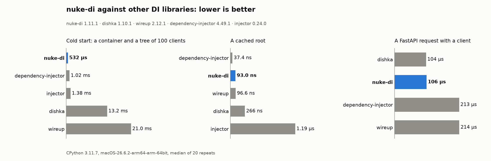

# nuke-di

[](https://pypi.org/project/nuke-di/)
[](https://pypi.org/project/nuke-di/)
[](https://github.com/troyan-dy/nuke-di/actions/workflows/ci.yml)
[](pt-BR/development.md)
[](../../LICENSE)

[English](https://github.com/troyan-dy/nuke-di/blob/master/README.md) · [Русский](https://github.com/troyan-dy/nuke-di/blob/master/docs/i18n/README.ru.md) · [简体中文](https://github.com/troyan-dy/nuke-di/blob/master/docs/i18n/README.zh-CN.md) · [Español](https://github.com/troyan-dy/nuke-di/blob/master/docs/i18n/README.es.md) · **Português (Brasil)** · [日本語](https://github.com/troyan-dy/nuke-di/blob/master/docs/i18n/README.ja.md) · [Polski](https://github.com/troyan-dy/nuke-di/blob/master/docs/i18n/README.pl.md)

A injeção de dependências mais simples para projetos Python assíncronos.

As dependências são declaradas com type hints comuns. O `nuke-di` monta a árvore de dependências,
cria cada cliente uma única vez e cuida do seu ciclo de vida assíncrono: `connect()` na inicialização e
`disconnect()` no encerramento. Clientes independentes sobem em paralelo, camada por camada,
das dependências mais profundas para cima.

Além disso, um único decorador transforma uma função assíncrona em um processo com argumentos de linha
de comando, e os handlers do FastAPI, do Litestar e do FastStream recebem clientes pelo type hint da mesma forma.

A biblioteca foi extraída da camada de DI de um framework de microsserviços Python usado em produção
e não tem dependências em tempo de execução.

- [Instalação](#installation) · [Início rápido](#quick-start) · [Princípios](#principles) · [Desempenho](#performance)
- Exemplos: [um job com argumentos de linha de comando](#a-job-with-command-line-arguments) · [FastAPI](#fastapi)
- [Documentação](#documentation)

## <a id="installation"></a>Instalação

```bash
pip install nuke-di
```

Requer Python 3.11+.

## <a id="quick-start"></a>Início rápido

```python
import asyncio

from nuke_di import DI, Client


class Database(Client):
    async def connect(self) -> None:
        print("database: connected")

    async def disconnect(self) -> None:
        print("database: disconnected")

    async def fetch_user(self, user_id: int) -> str:
        return f"user-{user_id}"


class UserService(Client):
    def __init__(self, db: Database) -> None:
        self._db = db

    async def greet(self, user_id: int) -> str:
        return f"Hello, {await self._db.fetch_user(user_id)}!"


async def handler(user_id: int, users: UserService) -> str:
    return await users.greet(user_id)


async def main() -> None:
    injected = DI.inject(handler)  # resolves UserService -> Database

    async with DI:  # connect() every client, disconnect() on exit
        print(await injected(42))


asyncio.run(main())
```

```text
database: connected
Hello, user-42!
database: disconnected
```

O que aconteceu:

1. `DI.inject(handler)` leu os type hints de `handler`, encontrou o cliente `UserService`, viu
   que ele precisa de um `Database` no seu `__init__` e construiu os dois. `user_id: int` não é
   um cliente, então continua sendo um argumento comum.
2. `async with DI` chamou `connect()` em cada cliente que construiu, começando pelas dependências.
3. `injected(42)` chamou `handler(42, users=<UserService>)`.
4. Ao sair do bloco `async with`, `disconnect()` foi chamado na ordem inversa.

## <a id="principles"></a>Princípios

- **Uma dependência é uma classe.** Uma subclasse de `Client` com um `__init__` com type hints e os métodos
  assíncronos `connect()` / `disconnect()` é o modelo inteiro: sem providers, sem módulos, sem registro, sem
  escopos para configurar. Um objeto de terceiros vira uma dependência quando é envolvido em uma classe assim.
- **Os type hints são a ligação.** Um cliente pede as suas dependências no `__init__`, uma função na
  sua assinatura. Nada mais as nomeia, então renomear ou adicionar uma dependência é uma refatoração comum.
- **Inicialização em paralelo, encerramento em ordem.** Os clientes se conectam camada por camada, das
  dependências mais profundas para cima, e os clientes de uma mesma camada se conectam em paralelo. Eles se desconectam
  na ordem inversa, e um `disconnect()` que falha não impede os demais.
- **Falhar cedo.** Uma árvore que não pode ser construída falha antes de qualquer conexão, com o nome do argumento e
  o caminho até ele, e o `mypy` com o
  [plugin](pt-BR/clients.md#checking-the-tree-with-mypy)
  aponta o mesmo erro antes de o processo iniciar. Um cliente que não consegue se conectar para a
  aplicação depois que os já conectados são desconectados. Não há novas tentativas: reiniciar é tarefa
  do orquestrador.
- **Os testes substituem, não religam.** `mock()` e `override()` colocam um falso no lugar de um cliente
  durante um teste; o código testado não muda.
- **Sem dependências em tempo de execução.** O núcleo usa só a biblioteca padrão; as integrações com
  frameworks são extras.

## <a id="performance"></a>Desempenho

`benchmarks/compare.py` passa as mesmas árvores de clientes por dishka, wireup, dependency-injector e
injector, registrando as mesmas classes do jeito de cada biblioteca: um container frio com a raiz resolvida, sobre
classes novas para o processo, a raiz de novo e uma requisição FastAPI pela integração de cada biblioteca:

```console
$ uv run python benchmarks/compare.py --size 100 --summary
nuke-di 1.11.1 · CPython 3.11.7 · macOS-26.6.2-arm64-arm-64bit · commit 6c2ae10 · N = 100 · 20 repeats
nuke-di 1.11.1 · dishka 1.10.1 · wireup 2.12.1 · dependency-injector 4.49.1 · injector 0.24.0

| Lower is better                                          | nuke-di        | dishka          | wireup          | dependency-injector | injector        |
|----------------------------------------------------------|---------------:|----------------:|----------------:|--------------------:|----------------:|
| Cold start: a container and a tree of 100 clients        | **541 µs**     | 12.9 ms (23.8×) | 20.0 ms (37.0×) | 1.05 ms (1.9×)      | 1.34 ms (2.5×)  |
| Cold start: the same 100 clients with string annotations | 1.27 ms (1.2×) | 13.7 ms (12.6×) | 21.4 ms (19.6×) | **1.09 ms**         | 1.47 ms (1.3×)  |
| A cached root                                            | 94.1 ns (2.5×) | 261 ns (7.1×)   | 92.6 ns (2.5×)  | **37.0 ns**         | 1.18 µs (31.9×) |
| A FastAPI request with a client                          | **103 µs**     | 107 µs (1.0×)   | 206 µs (2.0×)   | 221 µs (2.2×)       | —               |
```



Então o `nuke-di` é o mais rápido? Ao construir uma árvore com anotações de tipo reais e em uma
requisição FastAPI, sim: dependency-injector e injector levam 2–2,5 vezes mais tempo na árvore, dishka e
wireup 24–37 vezes mais para validar o grafo ao criar o container, e wireup e dependency-injector o dobro
por requisição. Com anotações em string, o dependency-injector, que não lê nenhuma anotação, fica
um quinto à frente. Em uma raiz em cache o `nuke-di` empata com o wireup, e o `get()` em Cython do
dependency-injector vence por cerca de 50 ns, uma diferença que nenhuma aplicação percebe.

Sozinho, `resolve()` custa 4–7 µs por cliente, então uma árvore de 1000 clientes é construída em menos de 6 ms, e
`connect()` acrescenta 9–15 µs por cliente em uma camada. [docs/benchmarks.md](../benchmarks.md) explica cada
cenário, registra a linha de base no Python 3.11–3.14 e traz a comparação completa, com o método.

## <a id="a-job-with-command-line-arguments"></a>Um job com argumentos de linha de comando

Um único decorador transforma uma função assíncrona no programa principal de um processo. Os clientes são injetados, e todo
outro argumento anotado vira uma opção de linha de comando, tipada e validada:

```python
# sync.py
import datetime
import enum
from typing import Annotated

from nuke_di import Client, Option, job


class Postgres(Client):
    async def connect(self) -> None:
        print("postgres: connected")

    async def disconnect(self) -> None:
        print("postgres: disconnected")

    async def upsert(self, table: str, rows: list[str]) -> None:
        print(f"postgres: upserted {len(rows)} rows into {table}")


class Warehouse(Client):
    async def changes(self, table: str, day: datetime.date) -> list[str]:
        return [f"{table}:{day}:{n}" for n in range(3)]


class Mode(enum.Enum):
    INCREMENTAL = "incremental"
    FULL = "full"


@job
async def sync(
    pg: Postgres,
    warehouse: Warehouse,
    day: Annotated[datetime.date, Option(help="Day to copy, YYYY-MM-DD", short="d")],
    tables: Annotated[
        list[str] | None, Option(help="Table to copy, repeat for several; all by default", short="t")
    ] = None,
    mode: Mode = Mode.INCREMENTAL,
    dry_run: Annotated[bool, Option(help="Read the changes, write nothing")] = False,
) -> None:
    """Copy one day of changes from the warehouse into Postgres."""
    print(f"sync: {mode.name} copy of {day}")
    for table in tables or ["users", "orders"]:
        rows = await warehouse.changes(table, day)
        if dry_run:
            print(f"sync: would upsert {len(rows)} rows into {table}")
        else:
            await pg.upsert(table, rows)
```

Sem `main()`, sem `asyncio.run()`, sem `argparse`: o decorador resolve e conecta os clientes, faz o parsing
da linha de comando, executa a função e termina com um código de saída que significa alguma coisa:

```console
$ python sync.py --day 2026-10-01
postgres: connected
sync: INCREMENTAL copy of 2026-10-01
postgres: upserted 3 rows into users
postgres: upserted 3 rows into orders
postgres: disconnected

$ python sync.py -d 2026-10-01 -t users --mode FULL --dry-run
postgres: connected
sync: FULL copy of 2026-10-01
sync: would upsert 3 rows into users
postgres: disconnected
```

O `--help` é gerado a partir da assinatura e da docstring (no Python 3.13+ aparece `-d, --day DAY` em vez
de `-d DAY, --day DAY`):

```console
$ python sync.py --help
usage: sync.py [-h] -d DAY [-t TABLES] [--mode {INCREMENTAL,FULL}]
               [--dry-run | --no-dry-run]

Copy one day of changes from the warehouse into Postgres.

options:
  -h, --help            show this help message and exit
  -d DAY, --day DAY     Day to copy, YYYY-MM-DD
  -t TABLES, --tables TABLES
                        Table to copy, repeat for several; all by default
  --mode {INCREMENTAL,FULL}
                        (default: INCREMENTAL)
  --dry-run, --no-dry-run
                        Read the changes, write nothing (default: False)
```

Uma linha de comando inválida é rejeitada antes que qualquer cliente seja conectado, com código de saída `2`:

```console
$ python sync.py -d 2026-10-01 --mode full
usage: sync.py [-h] -d DAY [-t TABLES] [--mode {INCREMENTAL,FULL}]
               [--dry-run | --no-dry-run]
sync.py: error: argument --mode: invalid choice: 'full' (choose from INCREMENTAL, FULL)
Run sync.sync failed: argument --mode: invalid choice: 'full' (choose from INCREMENTAL, FULL)
$ echo $?
2
```

`@worker` faz o mesmo para um processo que roda até o SIGTERM, com encerramento gracioso. Os dois são
descritos em [Workers e jobs](pt-BR/workers-and-jobs.md).

## <a id="fastapi"></a>FastAPI

Uma operação de rota recebe um cliente pelo seu type hint, sem `Depends` e sem `inject()` em cada handler.
`app/clients.py` contém as classes `Database` e `UserService` do [Início rápido](#quick-start), sem o seu
`main()`:

```bash
pip install "nuke-di[fastapi]"
```

```python
# app/api.py
from typing import Annotated

from fastapi import Depends, FastAPI, Header

from app.clients import Database, UserService
from nuke_di.fastapi import setup

app = FastAPI()
setup(app)  # before the routes: clients connect on startup, disconnect on shutdown


@app.get("/users/{user_id}")
async def get_user(user_id: int, users: UserService) -> str:
    return await users.greet(user_id)


async def current_user(x_user_id: Annotated[int, Header()], db: Database) -> str:
    return await db.fetch_user(x_user_id)


@app.get("/me")
async def me(user: Annotated[str, Depends(current_user)]) -> str:
    return user
```

```console
$ uvicorn app.api:app
INFO:     Started server process [55625]
INFO:     Waiting for application startup.
database: connected
INFO:     Application startup complete.
INFO:     Uvicorn running on http://127.0.0.1:8000 (Press CTRL+C to quit)
INFO:     127.0.0.1:51602 - "GET /users/42 HTTP/1.1" 200 OK
INFO:     127.0.0.1:51604 - "GET /me HTTP/1.1" 200 OK
^C
INFO:     Shutting down
INFO:     Waiting for application shutdown.
database: disconnected
INFO:     Application shutdown complete.
INFO:     Finished server process [55625]
```

```console
$ curl localhost:8000/users/42
"Hello, user-42!"
$ curl localhost:8000/me -H "X-User-Id: 7"
"user-7"
```

Os clientes se conectam na inicialização e se desconectam no encerramento, e uma dependência como `current_user` recebe
clientes da mesma forma. Importar a aplicação não constrói nada, então um teste substitui um cliente antes que o `TestClient`
inicie a aplicação:

```python
# tests/test_api.py
from fastapi.testclient import TestClient

from app.api import app
from app.clients import Database
from nuke_di import DI


class FakeDatabase(Database):
    async def fetch_user(self, user_id: int) -> str:
        return "alice"


def test_get_user() -> None:
    with DI.override(Database, FakeDatabase()), TestClient(app) as client:
        assert client.get("/users/1").json() == "Hello, alice!"
        assert client.get("/me", headers={"X-User-Id": "7"}).json() == "alice"
```

```console
$ pytest -q tests/test_api.py
.                                                                        [100%]
1 passed in 0.23s
```

Routers, websockets e o lifespan da própria aplicação são tratados em [FastAPI](pt-BR/fastapi.md);
[Litestar](pt-BR/litestar.md) e [FastStream](pt-BR/faststream.md) funcionam da mesma forma.

## <a id="documentation"></a>Documentação

- [Clientes](pt-BR/clients.md): `Client` e `NotSingletonClient`, o ciclo de vida, clientes dataclass,
  camadas, tempos de inicialização, o grafo de dependências, erros de conexão e de resolução
- [O container](pt-BR/container.md): `Dependencies` e o `DI` global, `resolve()`, `inject()`,
  `mock()`, `override()`
- [Workers e jobs](pt-BR/workers-and-jobs.md): `@job` e `@worker`, parâmetros de linha de comando,
  `Shutdown`, o período de tolerância, tarefas em segundo plano, códigos de saída, hooks, Kubernetes
- Frameworks: [FastAPI](pt-BR/fastapi.md), [Litestar](pt-BR/litestar.md),
  [FastStream](pt-BR/faststream.md) e
  [como escrever uma integração](pt-BR/integrations.md) para outro framework com `nuke_di.integration`
- [Testes](pt-BR/testing.md): `mock()`, `override()`, as fixtures do pytest, a verificação da ligação
- [Configuração](pt-BR/configuration.md): timeouts, concorrência e o período de tolerância
- [Erros](pt-BR/errors.md): cada exceção e quando ela é lançada
- [Exemplos](../../examples/README.md): 21 cenários prontos para executar, de um script avulso e um worker de fila
  a FastAPI, Litestar, FastStream, Starlette e um serviço completo, cada um com sua saída e seus testes
- [Benchmarks](../benchmarks.md): cada cenário, a linha de base no Python 3.11–3.14 e a comparação
  com outras bibliotecas
- [Desenvolvimento](pt-BR/development.md): as verificações, a cobertura e as releases

## <a id="license"></a>Licença

[MIT](../../LICENSE)
