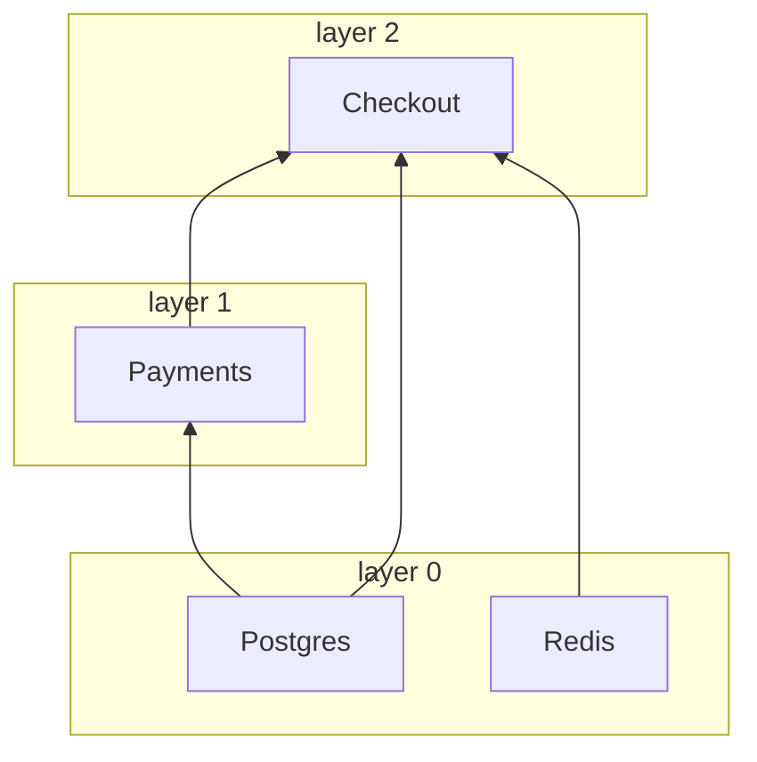

# nuke-di

[](https://pypi.org/project/nuke-di/)
[](https://pypi.org/project/nuke-di/)
[](https://github.com/troyan-dy/nuke-di/actions/workflows/ci.yml)
[](#development)
[](../../LICENSE)

[English](https://github.com/troyan-dy/nuke-di/blob/master/README.md) · [Русский](https://github.com/troyan-dy/nuke-di/blob/master/docs/i18n/README.ru.md) · **简体中文** · [Español](https://github.com/troyan-dy/nuke-di/blob/master/docs/i18n/README.es.md) · [Português (Brasil)](https://github.com/troyan-dy/nuke-di/blob/master/docs/i18n/README.pt-BR.md) · [日本語](https://github.com/troyan-dy/nuke-di/blob/master/docs/i18n/README.ja.md) · [Polski](https://github.com/troyan-dy/nuke-di/blob/master/docs/i18n/README.pl.md)

为异步 Python 项目打造的最简单的依赖注入。

依赖用普通的类型提示声明即可。`nuke-di` 会构建依赖树，每个客户端只创建一次，并驱动它的异步生命周期：
启动时调用 `connect()`，关闭时调用 `disconnect()`。相互独立的客户端按层并发启动，
从最深层的依赖开始逐层向上。

在此之上，只需一个装饰器就能把异步函数变成一个进程：只运行一次的 **job**，或一直运行到被停止的
**worker**，并且自带命令行参数、收到 SIGTERM 时优雅关闭，以及含义明确的退出码。
FastAPI、Litestar 和 FastStream 的处理函数也以同样的方式通过类型提示接收客户端。

它提取自一个生产环境 Python 微服务框架的 DI 层，没有任何运行时依赖。

- [安装](#installation)
- [快速开始](#quick-start)
- [客户端](#clients)：[单例](#client-and-notsingletonclient)、[生命周期](#connect-and-disconnect)、[dataclass](#dataclass-clients)、[层](#layers)、[启动耗时](#startup-timings)、[依赖图](#the-graph)、[连接失败](#when-a-client-fails-to-connect)、[解析错误](#when-the-tree-cannot-be-built)
- [容器](#the-container)
- [worker 与 job](#workers-and-jobs)：[第一个 job](#your-first-job)、[参数](#parameters)、[第一个 worker](#your-first-worker)、[宽限期](#grace-period)、[后台任务](#background-tasks)、[退出码](#exit-codes)、[钩子](#hooks)、[Kubernetes](#running-in-kubernetes)
- 框架：[FastAPI](#fastapi)、[Litestar](#litestar)、[FastStream](#faststream)
- [测试](#testing)
- [配置](#configuration) · [错误](#errors) · [性能](#performance) · [开发](#development)

## <a id="installation"></a>安装

```bash
pip install nuke-di
```

需要 Python 3.11+。

## <a id="quick-start"></a>快速开始

```python
import asyncio

from nuke_di import DI, Client


class Database(Client):
    async def connect(self) -> None:
        print("database: connected")

    async def disconnect(self) -> None:
        print("database: disconnected")

    async def fetch_user(self, user_id: int) -> str:
        return f"user-{user_id}"


class UserService(Client):
    def __init__(self, db: Database) -> None:
        self._db = db

    async def greet(self, user_id: int) -> str:
        return f"Hello, {await self._db.fetch_user(user_id)}!"


async def handler(user_id: int, users: UserService) -> str:
    return await users.greet(user_id)


async def main() -> None:
    injected = DI.inject(handler)  # resolves UserService -> Database

    async with DI:  # connect() every client, disconnect() on exit
        print(await injected(42))


asyncio.run(main())
```

```text
database: connected
Hello, user-42!
database: disconnected
```

执行过程：

1. `DI.inject(handler)` 读取 `handler` 的类型提示，找到客户端 `UserService`，发现它的 `__init__`
   需要一个 `Database`，于是把两者都构建出来。`user_id: int` 不是客户端，因此仍是普通参数。
2. `async with DI` 对它构建的每个客户端调用 `connect()`，依赖先连接。
3. `injected(42)` 调用了 `handler(42, users=<UserService>)`。
4. 离开 `async with` 块时，按相反顺序调用 `disconnect()`。

## <a id="clients"></a>客户端

### <a id="client-and-notsingletonclient"></a>Client 与 NotSingletonClient

每个依赖都是以下两个基类之一的子类：

| 基类                 | 实例                                               |
|----------------------|----------------------------------------------------|
| `Client`             | 单例：每个容器一个实例                             |
| `NotSingletonClient` | 每个声明它的使用方都会得到一个新实例               |

```python
from nuke_di import Client, Dependencies, NotSingletonClient


class Settings(Client):
    pass


class HttpSession(NotSingletonClient):
    pass


class Orders(Client):
    def __init__(self, settings: Settings, http: HttpSession) -> None:
        self.settings = settings
        self.http = http


class Payments(Client):
    def __init__(self, settings: Settings, http: HttpSession) -> None:
        self.settings = settings
        self.http = http


deps = Dependencies()
orders = deps.resolve(Orders)
payments = deps.resolve(Payments)

print(orders.settings is payments.settings)  # one Settings for the whole container
print(orders.http is payments.http)  # every consumer gets its own HttpSession
print(deps.resolve(Orders) is orders)  # resolve() is idempotent for a Client
```

```text
True
False
True
```

客户端通过带注解的 `__init__` 参数声明自己的依赖。只有注解为客户端类型的参数才会被注入，
并且解析是递归进行的。

### <a id="connect-and-disconnect"></a>connect() 与 disconnect()

重写异步方法 `connect()` / `disconnect()`，用来打开和释放连接池之类的资源。`__init__`
只负责保存依赖，任何涉及 I/O 的操作都应放在 `connect()` 中：

```python
class Redis(Client):
    def __init__(self) -> None:
        self._pool: Pool | None = None

    async def connect(self) -> None:
        self._pool = await create_pool()

    async def disconnect(self) -> None:
        if self._pool is not None:
            await self._pool.close()
            self._pool = None
```

每次 `connect()` 受 `CONNECT_TIMEOUT_SECONDS`（默认 `30`）限制，每次 `disconnect()` 受
`DISCONNECT_TIMEOUT_SECONDS`（默认 `10`）限制。失败或卡住的 `disconnect()` 会被记录到日志，
其他客户端仍会照常关闭。

### <a id="dataclass-clients"></a>dataclass 客户端

`client_dataclass` 把一个类同时变成 `Client` 和 dataclass，于是它的字段就成了被注入的依赖。同时也要继承 `Client`：装饰器的类型是恒等的，所以让 mypy 和 pyright 知道 `Checkout` 是客户端的正是这个基类；没有它，这个类只在运行时才是客户端：

```python
from nuke_di import Client, Dependencies, client_dataclass


class Postgres(Client):
    pass


class Payments(Client):
    pass


@client_dataclass(frozen=True)
class Checkout(Client):
    pg: Postgres
    payments: Payments


checkout = Dependencies().resolve(Checkout)
print(checkout)
print(isinstance(checkout, Client))
```

```text
Checkout(pg=<__main__.Postgres object at 0x...>, payments=<__main__.Payments object at 0x...>)
True
```

它接受与 `dataclasses.dataclass` 相同的关键字参数。

### <a id="layers"></a>层

客户端按层并发连接。没有依赖的客户端构成第 0 层；其他客户端位于它最高的那个依赖所在层的上一层。
前一层全部连接完成后，下一层才会开始，因此客户端绝不会先于自己的依赖连接。
`disconnect()` 则按相反顺序遍历各层。

```python
import asyncio
import logging

from nuke_di import Client, Dependencies

logging.basicConfig(level=logging.DEBUG, format="%(message)s")
logging.getLogger("asyncio").setLevel(logging.WARNING)  # keep only the nuke_di records


class Postgres(Client):
    async def connect(self) -> None:
        await asyncio.sleep(0.2)
        print("  postgres ready")


class Redis(Client):
    async def connect(self) -> None:
        await asyncio.sleep(0.1)
        print("  redis ready")


class Payments(Client):
    def __init__(self, pg: Postgres) -> None:
        self.pg = pg


class Checkout(Client):
    def __init__(self, pg: Postgres, redis: Redis, payments: Payments) -> None:
        self.pg, self.redis, self.payments = pg, redis, payments


async def main() -> None:
    deps = Dependencies()
    deps.resolve(Checkout)
    async with deps:
        print("-- application is running --")


asyncio.run(main())
```

`nuke_di` logger 的 `DEBUG` 日志展示了各层：

```text
Resolving dependency "Checkout"
Resolving dependency "Postgres"
Resolving dependency "Redis"
Resolving dependency "Payments"
Connecting layer 0: Postgres, Redis
Connecting client Postgres
Connecting client Redis
  redis ready
Connected client Redis in 0.101s
  postgres ready
Connected client Postgres in 0.201s
Connecting layer 1: Payments
Connecting client Payments
Connected client Payments in 0.000s
Connecting layer 2: Checkout
Connecting client Checkout
Connected client Checkout in 0.000s
Connected 4 clients in 3 layers in 0.20s (slowest: Postgres 0.20s, Redis 0.10s, Payments 0.00s)
-- application is running --
Disconnecting client Checkout
Disconnected client Checkout in 0.000s
Disconnecting client Payments
Disconnected client Payments in 0.000s
Disconnecting client Postgres
Disconnected client Postgres in 0.000s
Disconnecting client Redis
Disconnected client Redis in 0.000s
```

```text
Checkout(pg, redis, payments)    layer 2
Payments(pg)                     layer 1
Postgres, Redis                  layer 0  <- connect together, in 0.2s rather than 0.3s
```

只有在 `__init__` 中声明的依赖才参与排序。如果某个客户端需要另一个客户端先连接好，就把它声明为依赖。
设置 `CONNECT_CONCURRENCY` 可以限制同时连接的客户端数量。

### <a id="startup-timings"></a>启动耗时

容器会测量每个客户端的 `connect()` 和 `disconnect()`，因此启动变慢时能直接找到原因。
`connect()` 成功后，它会以 `INFO` 级别输出一条汇总；对于耗时超过 `CONNECT_TIMEOUT_SECONDS`
一半的客户端，还会输出一条 `WARNING`，远在该客户端开始因超时而失败之前：

```python
# startup.py
import asyncio
import logging

from nuke_di import Client, Dependencies, DependenciesSettings

logging.basicConfig(level=logging.INFO, format="%(levelname)s %(message)s")


class Postgres(Client):
    async def connect(self) -> None:
        await asyncio.sleep(0.2)


class Kafka(Client):
    async def connect(self) -> None:
        await asyncio.sleep(1.6)

    async def disconnect(self) -> None:
        await asyncio.sleep(0.3)


class Orders(Client):
    def __init__(self, pg: Postgres, kafka: Kafka) -> None:
        self.pg, self.kafka = pg, kafka


async def main() -> None:
    deps = Dependencies(settings=DependenciesSettings(connect_timeout=3))
    deps.resolve(Orders)
    async with deps:
        print("-- application is running --")

    for t in deps.timings:
        print(
            f"{t.name:<8} layer {t.layer}  connect {t.connect:.2f}s {t.connect_outcome:<3}  "
            f"disconnect {t.disconnect:.2f}s {t.disconnect_outcome}"
        )


asyncio.run(main())
```

```console
$ python startup.py
INFO Connected 3 clients in 2 layers in 1.60s (slowest: Kafka 1.60s, Postgres 0.20s, Orders 0.00s)
WARNING Client Kafka took 1.60s to connect, more than half of CONNECT_TIMEOUT_SECONDS (3s)
-- application is running --
Postgres layer 0  connect 0.20s ok   disconnect 0.00s ok
Kafka    layer 0  connect 1.60s ok   disconnect 0.30s ok
Orders   layer 1  connect 0.00s ok   disconnect 0.00s ok
```

`deps.timings` 按连接顺序为最近一次 `connect()` 的每个客户端保存一个 `ClientTiming`。
它在 `disconnect()` 之后依然保留，因此可以在容器停止后读取。在 FastAPI 应用中，传给 `FastAPI()`
的 lifespan 运行在已连接的容器内部，因此能看到连接耗时。
worker 或 job 会在 [`Run.clients`](#startup-metrics-and-structured-logs) 中得到同一个列表。

| `ClientTiming` 字段  | 值 |
|----------------------|----|
| `name`               | 客户端的类名 |
| `layer`              | 客户端所在的[层](#layers) |
| `connect`            | 在 `connect()` 中花费的秒数，不含等待 `CONNECT_CONCURRENCY` 的时间；`connect()` 从未运行时为 `None` |
| `connect_outcome`    | `"ok"`、`"failed"`、`"timed_out"`、`"cancelled"`；`connect()` 从未开始时为 `None` |
| `disconnect`、`disconnect_outcome` | `disconnect()` 的对应值；客户端断开之前为 `None` |

当某个客户端连接失败时，同一层中仍在连接的客户端为 `"cancelled"`，更高的层保持 `None`，
已经连接的客户端会被回滚，因此会得到 `disconnect_outcome`。库只负责测量：把耗时导出为
指标或 span 由你的代码完成。

### <a id="the-graph"></a>依赖图

依赖图只存在于运行中的进程里：上面的 `DEBUG` 日志是唯一能看到一个入口点拉入哪些客户端、
每个客户端在哪一层连接的地方。`graph()` 把同一幅图作为数据返回，在 `connect()` 之前或之后都可以。
下面是[层](#layers)一节示例中的客户端，去掉了它们的 `connect()`：

```python
# graph.py
from nuke_di import Client, Dependencies


class Postgres(Client):
    pass


class Redis(Client):
    pass


class Payments(Client):
    def __init__(self, pg: Postgres) -> None:
        self.pg = pg


class Checkout(Client):
    def __init__(self, pg: Postgres, redis: Redis, payments: Payments) -> None:
        self.pg, self.redis, self.payments = pg, redis, payments


deps = Dependencies()
deps.resolve(Checkout)
nodes = {node.name: node for node in deps.graph().nodes}
for node in nodes.values():
    print(f"{node.name:<8} layer {node.layer}  needs {list(node.dependencies)}")
print("shared:", nodes["Checkout"].dependencies["pg"] is nodes["Payments"].dependencies["pg"])
print(deps.graph().to_mermaid())
```

```console
$ python graph.py
Postgres layer 0  needs []
Redis    layer 0  needs []
Payments layer 1  needs ['pg']
Checkout layer 2  needs ['pg', 'redis', 'payments']
shared: True
graph BT
  subgraph layer0 [layer 0]
    Postgres
    Redis
  end
  subgraph layer1 [layer 1]
    Payments
  end
  subgraph layer2 [layer 2]
    Checkout
  end
  Postgres --> Payments
  Postgres --> Checkout
  Redis --> Checkout
  Payments --> Checkout
```

GitHub 会在 README、pull request 或 issue 中渲染 Mermaid 文本，所以项目无需运行进程就能展示自己的架构：



`Graph.nodes` 为每个已解析的客户端保存一个 `Node`，按解析顺序排列，因此客户端排在它的依赖之后。
它是一个快照：`flush()` 会清空它，但仍然打开的 `override()` 块的 Replacement 会留下，它们经得起任何一次 `flush()`。

| `Node` 字段    | 值 |
|----------------|----|
| `name`         | 客户端的类名 |
| `cls`          | 使用方请求的类 |
| `singleton`    | `Client` 为 `True`，`NotSingletonClient` 为 `False` |
| `layer`        | 客户端的[层](#layers)；Replacement 为 `None`，它永远不会连接 |
| `replacement`  | 通过 `mock()` 或 `override()` 注册、代替 `cls` 的对象；真实客户端为 `None` |
| `dependencies` | `__init__` 各参数对应的客户端，按参数名索引 |

`NotSingletonClient` 的每个实例各占一个节点，名字相同；`to_mermaid()` 从第二个开始编号
（`Session`、`Session_2`）。Replacement 画在层之外，带虚线边框，并标出代替它的对象名：`Postgres: AsyncMock`。
节点按标识比较，因此上面的 `shared: True` 说明 `Checkout` 和 `Payments` 拿到的是同一个 `Postgres`。

### <a id="when-a-client-fails-to-connect"></a>客户端连接失败时

如果某个客户端连接失败，同一层的其余客户端会被取消，后续各层也不会启动。已经连接的客户端会按层逆序断开连接，
容器最终处于未连接且为空的状态：

```python
import asyncio

from nuke_di import Client, ConnectError, Dependencies


class Postgres(Client):
    async def connect(self) -> None:
        print("postgres: connected")

    async def disconnect(self) -> None:
        print("postgres: disconnected")


class Kafka(Client):
    async def connect(self) -> None:
        raise OSError("broker kafka-1:9092 is unreachable")


class Orders(Client):
    def __init__(self, pg: Postgres, kafka: Kafka) -> None:
        self.pg, self.kafka = pg, kafka


async def main() -> None:
    deps = Dependencies()
    deps.resolve(Orders)
    try:
        await deps.connect()
    except ConnectError as exc:
        print(f"{exc} <- {exc.__cause__!r}")
    print("connected:", deps.connected)


asyncio.run(main())
```

```text
postgres: connected
Error occurred connecting client Kafka
Traceback (most recent call last):
  ...
OSError: broker kafka-1:9092 is unreachable
postgres: disconnected
Error occurred connecting client Kafka <- OSError('broker kafka-1:9092 is unreachable')
connected: False
```

`connect()` 本身被取消时也会执行同样的清理。`ConnectError` 继承自 `SystemExit`，因此不捕获它的应用会直接停止——
当某个依赖不可用时，这通常正是你想要的。被 mock 的客户端不会被连接，也不影响分层。

### <a id="when-the-tree-cannot-be-built"></a>依赖树无法构建时

解析会在调用每个 `__init__` 之前先对它做检查，因此无法构建的客户端会在任何连接发生之前就失败，
错误信息会指出有问题的参数，以及从你所请求的客户端出发的路径：

```python
from typing import Protocol

from nuke_di import Client, Dependencies, InvalidSignatureError


class Postgres(Client):
    pass


class UserRepository(Protocol):
    async def get(self, user_id: int) -> str: ...


class Profiles(Client):
    def __init__(self, pg: Postgres, users: UserRepository) -> None:
        self.pg, self.users = pg, users


class Checkout(Client):
    def __init__(self, profiles: Profiles) -> None:
        self.profiles = profiles


class Orders(Client):
    def __init__(self, payments: "Payments") -> None:
        self.payments = payments


class Payments(Client):
    def __init__(self, orders: Orders) -> None:
        self.orders = orders


for root in (Checkout, Orders):
    try:
        Dependencies().resolve(root)
    except InvalidSignatureError as exc:
        print(f"{type(exc).__name__}: {exc}")
```

```text
InvalidSignatureError: Argument "users" of "Profiles.__init__" is UserRepository, which is not a client (resolving Checkout -> Profiles)
CircularDependencyError: Circular dependency: Orders -> Payments -> Orders
```

当 `__init__` 参数的类型提示是客户端时，它会被填入客户端。其他参数都必须有默认值，并且保持原样不动。
以下情况会以 `InvalidSignatureError` 失败：

| 没有默认值的 `__init__` 参数          | 消息                                              |
|---------------------------------------|---------------------------------------------------|
| 没有类型提示                          | `has no type hint`                                |
| 类型不是客户端                        | `is UserRepository, which is not a client`        |
| `Client \| None`                      | `is Postgres \| None, a client cannot be optional` |
| 仅限位置（`/`）的客户端参数           | `is positional-only, a client is passed by keyword` |

相互循环依赖的客户端会以 `CircularDependencyError`（`InvalidSignatureError` 的子类）失败；无法求值的类型提示，
例如在函数内部定义的类或在 `TYPE_CHECKING` 下导入的类，则会引发一个说明此情况的 `InvalidSignatureError`。
如果错误来自 `inject()`，路径从函数开始：
`(resolving handler -> Checkout -> Profiles)`。在 [worker 或 job](#workers-and-jobs) 中，
上述任一错误都会让这次运行在任何连接发生之前以退出码 `1` 失败。

## <a id="the-container"></a>容器

`Dependencies` 就是容器。`DI` 是一个开箱即用的全局实例；需要隔离时（例如在测试中），
可以创建自己的实例。

| 方法                 | 说明                                                                    |
|----------------------|-------------------------------------------------------------------------|
| `resolve(cls)`       | 构建 `cls` 及其依赖树。对 `Client` 是幂等的。                           |
| `inject(func)`       | 返回已绑定客户端参数的 `functools.partial(func, ...)`。除 `*args` / `**kwargs` 外，`func` 的每个参数都必须有类型提示。 |
| `connect()`          | 逐层对每个已解析的客户端调用 `connect()`。                              |
| `disconnect()`       | 逐层逆序调用 `disconnect()`，然后对容器执行 `flush()`。                 |
| `async with`         | 进入时调用 `connect()`，退出时调用 `disconnect()`。                     |
| `mock(cls, new=None)`| 为 `cls` 注册一个替换对象（默认为 autospec mock），有效期到下一次 `flush()` 为止。必须在 `cls` 被解析之前调用。 |
| `override(cls, new=None)` | 仅在 `with` 块内有效的替换对象，块结束后执行 `flush()`；参见[测试](#testing)。 |
| `flush()`            | 丢弃所有已解析的客户端。                                                |
| `timings`            | 最近一次 `connect()` 的每个客户端一个 `ClientTiming`；见[启动耗时](#startup-timings)。 |
| `graph()`            | 已解析客户端的 `Graph`，含依赖和层，带 `to_mermaid()`；见[依赖图](#the-graph)。 |

`inject()` 的结果保留函数的返回类型，但其余参数不带类型：类型检查器无法从签名中减去客户端参数。

`resolve`、`inject`、`mock`、`override` 和 `flush` 只能在容器未连接时使用：
整棵树在启动之前就已构建完成。

容器可以安全地从多个线程解析：每个容器一把锁串行化 `resolve`、`inject`、`mock`、`override` 和 `flush`，因此两个线程同时请求的单例只构建一次。`connect()` 和 `disconnect()` 属于同一个事件循环。

```python
async def main() -> None:
    deps = Dependencies()
    injected = deps.inject(handler)  # build the tree
    async with deps:  # connect
        await injected(42)
        deps.resolve(Cache)  # ConnectError: already connected
```

## <a id="workers-and-jobs"></a>worker 与 job

只需一个装饰器，异步函数就能成为一个进程的主程序：

| 装饰器    | 运行方式                                               |
|-----------|--------------------------------------------------------|
| `@job`    | 运行一次：函数返回时进程退出                           |
| `@worker` | 一直运行，直到进程收到 SIGTERM 或 SIGINT               |

本节的示例共用同一个客户端模块：

```python
# app/clients.py
import datetime
import itertools

from nuke_di import Client


class Postgres(Client):
    async def connect(self) -> None:
        print("postgres: connected")

    async def disconnect(self) -> None:
        print("postgres: disconnected")

    async def upsert(self, table: str, rows: list[str]) -> None:
        print(f"postgres: upserted {len(rows)} rows into {table}")


class Warehouse(Client):
    async def connect(self) -> None:
        print("warehouse: connected")

    async def disconnect(self) -> None:
        print("warehouse: disconnected")

    async def changes(self, table: str, day: datetime.date) -> list[str]:
        return [f"{table}:{day}:{n}" for n in range(3)]


class Queue(Client):
    def __init__(self) -> None:
        self._ids = itertools.count(1)

    async def connect(self) -> None:
        print("queue: connected")

    async def disconnect(self) -> None:
        print("queue: disconnected")

    async def get(self) -> str:
        return f"message-{next(self._ids)}"
```

### <a id="your-first-job"></a>第一个 job

```python
# app/jobs/sync.py
import datetime

from nuke_di import job

from app.clients import Postgres, Warehouse


@job
async def sync(pg: Postgres, warehouse: Warehouse) -> None:
    day = datetime.date.today() - datetime.timedelta(days=1)
    for table in ["users", "orders"]:
        await pg.upsert(table, await warehouse.changes(table, day))
```

```console
$ python -m app.jobs.sync
postgres: connected
warehouse: connected
postgres: upserted 3 rows into users
postgres: upserted 3 rows into orders
postgres: disconnected
warehouse: disconnected
$ echo $?
0
```

这就是整个程序：没有 `main()`，没有 `asyncio.run()`，也没有 `if __name__ == "__main__"`。
进程从全局容器 `DI` 中解析客户端、连接它们、运行函数、断开连接，然后以相应的[退出码](#exit-codes)退出。
调度不在本库的职责范围内：job 何时运行，由 Kubernetes CronJob、systemd timer 或 crontab 决定。

`nuke-di` 通过 `nuke_di` logger 记录每一次运行。在装饰器上方配置好 logging，
就能看到这些日志：

```python
import logging

logging.basicConfig(level=logging.INFO, format="%(levelname)-5s %(name)s: %(message)s")


@job
async def sync(pg: Postgres, warehouse: Warehouse) -> None: ...
```

```console
$ python -m app.jobs.sync
INFO  nuke_di.run: Starting job app.jobs.sync.sync
postgres: connected
warehouse: connected
INFO  nuke_di.core: Connected 4 clients in 1 layer in 0.00s (slowest: Warehouse 0.00s, Postgres 0.00s, Shutdown 0.00s)
postgres: upserted 3 rows into users
postgres: upserted 3 rows into orders
postgres: disconnected
warehouse: disconnected
INFO  nuke_di.run: Run app.jobs.sync.sync finished with exit code 0 in 0.002s
```

#### <a id="one-entrypoint-per-module-defined-last"></a>每个模块一个入口点，并放在最后定义

当模块以 `__main__` 身份运行时，装饰器会立即运行该函数，进程也就在那里退出：

```python
# app/jobs/sync.py
DI.mock(Warehouse, FakeWarehouse())  # runs: code above the decorator is fine


@job
async def sync(pg: Postgres, warehouse: Warehouse) -> None: ...


print("never printed")  # never runs under `python -m app.jobs.sync`
```

**每个模块只保留一个入口点，并把它定义在最后。** 正常导入时（例如在测试中导入），
装饰器会原样返回函数，什么也不会运行。被装饰的函数必须用 `async def` 声明，
否则导入时会抛出 `TypeError`。

### <a id="parameters"></a>参数

每个不是客户端的带注解参数都会成为一个命令行选项。下面还是同一个 job，现在它可以复制任意一天的数据、
只复制部分表，还支持试运行（dry run）：

```python
# app/jobs/sync.py
import datetime
import enum
from typing import Annotated

from nuke_di import Option, job

from app.clients import Postgres, Warehouse


class Mode(enum.Enum):
    INCREMENTAL = "incremental"
    FULL = "full"


@job
async def sync(
    pg: Postgres,
    warehouse: Warehouse,
    day: Annotated[datetime.date, Option(help="Day to copy, YYYY-MM-DD", short="d")],
    tables: Annotated[
        list[str] | None, Option(help="Table to copy, repeat for several; all by default", short="t")
    ] = None,
    mode: Mode = Mode.INCREMENTAL,
    dry_run: Annotated[bool, Option(help="Read the changes, write nothing")] = False,
) -> None:
    """Copy one day of changes from the warehouse into Postgres."""
    print(f"sync: {mode.name} copy of {day}")
    for table in tables or ["users", "orders"]:
        rows = await warehouse.changes(table, day)
        if dry_run:
            print(f"sync: would upsert {len(rows)} rows into {table}")
        else:
            await pg.upsert(table, rows)
```

`pg` 和 `warehouse` 是客户端，会被注入；`day`、`tables`、`mode` 和 `dry_run`
则来自命令行：

```console
$ python -m app.jobs.sync --day 2026-10-01
postgres: connected
warehouse: connected
sync: INCREMENTAL copy of 2026-10-01
postgres: upserted 3 rows into users
postgres: upserted 3 rows into orders
postgres: disconnected
warehouse: disconnected

$ python -m app.jobs.sync -d 2026-10-01 -t users --mode FULL --dry-run
postgres: connected
warehouse: connected
sync: FULL copy of 2026-10-01
sync: would upsert 3 rows into users
postgres: disconnected
warehouse: disconnected
```

`--help` 根据函数签名和 docstring 自动生成，并且不会连接任何东西
（Python 3.13+ 输出的是 `-d, --day DAY`，而不是 `-d DAY, --day DAY`）：

```console
$ python -m app.jobs.sync --help
usage: python -m app.jobs.sync [-h] -d DAY [-t TABLES]
                               [--mode {INCREMENTAL,FULL}]
                               [--dry-run | --no-dry-run]

Copy one day of changes from the warehouse into Postgres.

options:
  -h, --help            show this help message and exit
  -d DAY, --day DAY     Day to copy, YYYY-MM-DD
  -t TABLES, --tables TABLES
                        Table to copy, repeat for several; all by default
  --mode {INCREMENTAL,FULL}
                        (default: INCREMENTAL)
  --dry-run, --no-dry-run
                        Read the changes, write nothing (default: False)
```

错误的命令行会**在解析或连接任何客户端之前**被拒绝，
退出码为 `2`：

```console
$ python -m app.jobs.sync
usage: python -m app.jobs.sync [-h] -d DAY [-t TABLES]
                               [--mode {INCREMENTAL,FULL}]
                               [--dry-run | --no-dry-run]
python -m app.jobs.sync: error: the following arguments are required: -d/--day
Run app.jobs.sync.sync failed: the following arguments are required: -d/--day
$ echo $?
2

$ python -m app.jobs.sync --day yesterday
...
python -m app.jobs.sync: error: argument -d/--day: invalid date value: 'yesterday'

$ python -m app.jobs.sync -d 2026-10-01 --mode full
...
python -m app.jobs.sync: error: argument --mode: invalid choice: 'full' (choose from INCREMENTAL, FULL)

$ python -m app.jobs.sync -d 2026-10-01 --dry
...
python -m app.jobs.sync: error: unrecognized arguments: --dry
```

每条错误的前两行由 `argparse` 输出；`Run ... failed` 这一行是 `nuke_di` logger 的
`ERROR` 记录，因此遵循你的 logging 配置。
不接受缩写：`--dry` 不会被当作 `--dry-run`。

#### <a id="supported-types"></a>支持的类型

| 注解                                          | 命令行                          | 示例                            |
|-----------------------------------------------|---------------------------------|---------------------------------|
| `str`, `int`, `float`, `pathlib.Path`         | `--name VALUE`                  | `--limit 10`                    |
| `bool`                                        | `--name` / `--no-name`          | `--dry-run`                     |
| `datetime.date`, `datetime.datetime`          | ISO 8601                        | `--since 2026-10-01T12:00:00`   |
| 任意 `Enum`                                   | 成员的**名称**，与定义完全一致  | `--mode FULL`                   |
| 由上述任一类型（`bool` 除外）构成的 `list[T]` | 重复使用该选项                  | `--table users --table orders`  |
| `T \| None`                                   | 与 `T` 相同                     | `--limit 10`                    |

规则如下：

- **名称。** 选项以参数名命名，并把 `_` 替换为 `-`：
  `dry_run` 对应 `--dry-run`。不存在位置参数，因此新增参数永远不会
  破坏现有的命令行。
- **是否必需。** 没有默认值的参数是必需选项。有默认值的参数是可选的，
  省略该选项时使用函数自身的默认值。
- **`Option`。** `Annotated[T, Option(help=..., short=...)]` 用于添加帮助文本和单字母别名，
  例如 `-d`。两者都是可选的。
- **没有参数。** 没有参数的入口点仍会解析命令行：它会响应
  `--help`，并以退出码 `2` 拒绝任何参数。

以下签名属于代码中的错误，而不是命令行的错误。它们会让这次运行以
`InvalidSignatureError` 和退出码 `1` 失败：

```python
async def sync(day: dict[str, int]) -> None: ...  # unsupported type
async def sync(pg: Annotated[Postgres, Option(help="...")]) -> None: ...  # Option on a client
async def sync(help: bool = False) -> None: ...  # clashes with --help
async def sync(day: int, /) -> None: ...  # positional-only
```

#### <a id="parameters-in-tests"></a>在测试中传入参数

被装饰的函数仍是一个普通的协程，因此测试可以通过关键字参数
传入参数：

```python
async def test_sync_copies_requested_tables() -> None:
    pg, warehouse = AsyncMock(), AsyncMock()
    warehouse.changes.return_value = ["row"]

    await sync(pg, warehouse, day=datetime.date(2026, 10, 1), tables=["users"])

    warehouse.changes.assert_awaited_once_with("users", datetime.date(2026, 10, 1))
    pg.upsert.assert_awaited_once_with("users", ["row"])
```

### <a id="your-first-worker"></a>第一个 worker

worker 会一直运行，直到进程被要求停止。它依赖客户端 `Shutdown`，该客户端在收到第一个
SIGTERM 或 SIGINT 时被置位，worker 随后处理完手头的工作再结束：

```python
# app/workers/consumer.py
import asyncio

from nuke_di import Shutdown, worker

from app.clients import Queue


@worker
async def consumer(queue: Queue, shutdown: Shutdown) -> None:
    while not shutdown.is_set():
        message = await queue.get()
        print(f"consumer: processing {message}")
        await asyncio.sleep(1)  # the actual work
        print(f"consumer: done {message}")
    print("consumer: stopped")
```

在处理第三条消息的中途按下 Ctrl+C：这条消息会被处理完，循环结束，
客户端断开连接。

```console
$ python -m app.workers.consumer
queue: connected
consumer: processing message-1
consumer: done message-1
consumer: processing message-2
consumer: done message-2
consumer: processing message-3
^C
consumer: done message-3
consumer: stopped
queue: disconnected
$ echo $?
130
```

`Shutdown` 有三个方法：

| 方法             | 说明                                                                      |
|------------------|---------------------------------------------------------------------------|
| `is_set()`       | 是否已开始关闭；在两段工作之间检查它                                      |
| `await wait()`   | 阻塞，直到开始关闭                                                        |
| `set()`          | 手动发起关闭，例如在测试中                                                |

在 worker 或 job 之外，没有任何东西会将它置位，因此依赖 `Shutdown` 的循环放进 Web 应用里也能
原样工作。自行返回或抛出异常的 worker 同样会结束进程：
重启它是编排系统的职责。

在 Windows 上只处理 SIGINT（Ctrl+C）；SIGTERM 保持默认行为。

### <a id="grace-period"></a>宽限期

忽略 `Shutdown` 的 worker 会在 `SHUTDOWN_GRACE_SECONDS`（默认 `10`）之后被取消：

```python
# app/workers/stubborn.py
@worker
async def stubborn(queue: Queue) -> None:
    while True:  # never looks at Shutdown
        message = await queue.get()
        print(f"stubborn: processing {message}")
        await asyncio.sleep(5)
```

```console
$ SHUTDOWN_GRACE_SECONDS=2 python -m app.workers.stubborn &
queue: connected
stubborn: processing message-1
$ kill -TERM %1
Run app.workers.stubborn.stubborn did not stop within 2.0s after Shutdown, cancelling it
queue: disconnected
$ wait %1; echo $?
143
```

第二个信号会立即取消入口点，不再等待宽限期结束，例如
连按两次 Ctrl+C：

```console
$ python -m app.workers.stubborn
queue: connected
stubborn: processing message-1
^C^C
Second SIGINT, cancelling run app.workers.stubborn.stubborn
queue: disconnected
```

如果信号在客户端仍在连接时到达，启动过程会停止，
已经连接的客户端会被断开。

最坏情况下，进程停止需要
`SHUTDOWN_GRACE_SECONDS + DISCONNECT_TIMEOUT_SECONDS × layers`。在默认设置下，两层的依赖树就会
用完 Kubernetes 默认的 30 秒 `terminationGracePeriodSeconds`，
因此对于更深的依赖树，请调低超时或调高宽限期。

### <a id="background-tasks"></a>后台任务

`BackgroundTasks` 是一个客户端，负责监管与入口点并行运行的协程。
与直接调用 `asyncio.create_task()` 不同，失败的任务永远不会被悄悄丢掉：它会连同 traceback 一起记录到日志，
并让整个进程失败。

```python
# app/workers/indexer.py
import asyncio

from nuke_di import BackgroundTasks, Shutdown, worker

from app.clients import Queue


async def refresh_index() -> None:
    for attempt in range(1, 10):
        print(f"refresh: run {attempt}")
        await asyncio.sleep(0.5)
        if attempt == 2:
            raise ConnectionError("search cluster is unreachable")


@worker
async def indexer(queue: Queue, tasks: BackgroundTasks, shutdown: Shutdown) -> None:
    tasks.spawn(refresh_index(), name="refresh-index")
    print("indexer: waiting for Shutdown")
    await shutdown.wait()
```

```console
$ python -m app.workers.indexer
queue: connected
indexer: waiting for Shutdown
refresh: run 1
refresh: run 2
Background task refresh-index failed
Traceback (most recent call last):
  ...
ConnectionError: search cluster is unreachable
queue: disconnected
Run app.workers.indexer.indexer failed
Traceback (most recent call last):
  ...
ConnectionError: search cluster is unreachable
$ echo $?
1
```

worker 被取消时没有宽限期：崩溃的后台循环不应留下一个存活却什么也不做的
进程。无论进程因何停止，任务都会在任何客户端断开连接**之前**被取消并等待结束，
因此它们绝不会在已关闭的客户端上运行。

| 方法                       | 说明                                                            |
|----------------------------|-----------------------------------------------------------------|
| `spawn(coro, name=None)`   | 将 `coro` 作为任务启动，并持有它的引用直到它结束                |
| `watch(callback)`          | 对每个失败的任务调用 `callback(exc)`                            |
| `await stop()`             | 取消所有任务并等待它们全部结束；`disconnect()` 会调用它         |

在 worker 或 job 之外，例如在普通的 `async with DI` 下，失败只会被记录到日志，
任务在 `disconnect()` 时被取消。

### <a id="exit-codes"></a>退出码

按顺序匹配，第一条命中的规则生效：

| 条件                                                                                                | 退出码         |
|-----------------------------------------------------------------------------------------------------|----------------|
| 无效的命令行（`UsageError`）                                                                        | `2`            |
| 出现异常：签名、客户端的解析或连接、入口点本身、后台任务                                            | `1`            |
| 收到了终止信号                                                                                      | `128 + signum` |
| 其他情况                                                                                            | `0`            |

SIGTERM 对应 `143`，SIGINT 对应 `130`。job 察觉到关闭后即使正常返回，
退出码仍是 `128 + signum`：它的工作被中断了，调度器不应把它
视为已完成。

这些退出码是给负责启动进程的一方使用的：

```bash
python -m app.jobs.sync --day 2026-10-01
case $? in
  0)       echo "synced" ;;
  2)       echo "fix the command line, retrying will not help" ;;
  130|143) echo "interrupted, safe to run again" ;;
  *)       echo "failed, see the log" ;;
esac
```

### <a id="hooks"></a>钩子

钩子可以观察每一次运行，例如用来上报指标或开启一个 tracing span：

```python
# app/jobs/report.py
from nuke_di import Run, job

from app.clients import Postgres


class Timer:
    async def on_start(self, run: Run) -> None:
        print(f"hook: {run.kind} {run.name} started")

    async def on_finish(self, run: Run) -> None:
        seconds = (run.finished_at - run.started_at).total_seconds()
        print(f"hook: exit code {run.exit_code} in {seconds:.1f}s, error: {run.error!r}")


@job(hooks=[Timer()])
async def report(pg: Postgres, limit: int = 10) -> None:
    print(f"report: top {limit} customers")
```

```console
$ python -m app.jobs.report --limit 3
hook: job app.jobs.report.report started
postgres: connected
report: top 3 customers
postgres: disconnected
hook: exit code 0 in 0.0s, error: None

$ python -m app.jobs.report --limit three
usage: python -m app.jobs.report [-h] [--limit LIMIT]
python -m app.jobs.report: error: argument --limit: invalid int value: 'three'
hook: job app.jobs.report.report started
Run app.jobs.report.report failed: argument --limit: invalid int value: 'three'
hook: exit code 2 in 0.0s, error: UsageError("argument --limit: invalid int value: 'three'")
```

`on_start` 在解析客户端之前按列表顺序调用；`on_finish` 在客户端断开连接之后按逆序调用，
因此它能看到 `Run` 的最终状态，连接失败也包括在内：

| `Run` 字段    | 值                                                                     |
|---------------|------------------------------------------------------------------------|
| `name`        | 模块和函数，例如 `app.jobs.report.report`                              |
| `kind`        | `"job"` 或 `"worker"`                                                  |
| `started_at`  | UTC `datetime`                                                         |
| `finished_at` | UTC `datetime`，在 `on_finish` 之前设置                                |
| `exit_code`   | 进程的退出码，在 `on_finish` 之前设置                                  |
| `error`       | 导致运行失败的异常，例如 `UsageError`；否则为 `None`                   |
| `signal`      | 收到的第一个终止信号；否则为 `None`                                    |
| `clients`     | 每个客户端一个 `ClientTiming`：连接和断开的耗时与结果；运行在连接前失败时为空 |

钩子是普通对象，不是客户端：它们自行管理自己的资源。钩子中的异常
会被记录到日志，但不会改变退出码。`--help` 不算一次运行，因此钩子看不到它。

#### <a id="startup-metrics-and-structured-logs"></a>启动指标与结构化日志

`run.clients` 是导出启动指标的地方：`on_finish` 能看到每个客户端连接和断开各用了多久。
此外，`nuke_di` 的每条日志记录都带有结构化字段，JSON formatter 无需解析消息文本即可按客户端
过滤和聚合：

```python
# app/jobs/startup.py
import json
import logging

from nuke_di import Run, job

from app.clients import Postgres, Warehouse


class JsonFormatter(logging.Formatter):
    def format(self, record: logging.LogRecord) -> str:
        fields = {key: getattr(record, key) for key in ("run", "client", "layer", "duration") if hasattr(record, key)}
        return json.dumps({"level": record.levelname, "message": record.getMessage(), **fields})


handler = logging.StreamHandler()
handler.setFormatter(JsonFormatter())
logging.basicConfig(level=logging.INFO, handlers=[handler])


class StartupMetrics:
    async def on_start(self, run: Run) -> None:
        pass

    async def on_finish(self, run: Run) -> None:
        for client in run.clients:
            print(f"metric: {client.name} connect={client.connect:.3f}s {client.connect_outcome}")


@job(hooks=[StartupMetrics()])
async def startup(pg: Postgres, warehouse: Warehouse) -> None:
    print("startup: done")
```

```console
$ python -m app.jobs.startup
{"level": "INFO", "message": "Starting job app.jobs.startup.startup", "run": "app.jobs.startup.startup"}
postgres: connected
warehouse: connected
{"level": "INFO", "message": "Connected 4 clients in 1 layer in 0.00s (slowest: Postgres 0.00s, Shutdown 0.00s, Warehouse 0.00s)", "run": "app.jobs.startup.startup", "duration": 0.00015945796621963382}
startup: done
postgres: disconnected
warehouse: disconnected
{"level": "INFO", "message": "Run app.jobs.startup.startup finished with exit code 0 in 0.001s", "run": "app.jobs.startup.startup", "duration": 0.001171}
metric: Shutdown connect=0.000s ok
metric: BackgroundTasks connect=0.000s ok
metric: Postgres connect=0.000s ok
metric: Warehouse connect=0.000s ok
```

| 字段       | 出现在                                                                        |
|------------|-------------------------------------------------------------------------------|
| `run`      | 在 worker 或 job 内产生的每条记录，包括容器的记录：运行的名称                 |
| `client`   | 关于单个客户端的每条记录：解析、连接、断开、失败                              |
| `layer`    | 关于客户端连接或断开的每条记录，以及 `Connecting layer`                       |
| `duration` | 秒数：已连接或已断开的客户端、启动汇总、已结束的运行                          |

每次运行还会连接它自己的 `Shutdown` 和 `BackgroundTasks` 客户端，所以它们也会出现在
`run.clients` 和汇总中。

### <a id="running-in-kubernetes"></a>在 Kubernetes 中运行

job 对应 CronJob，worker 对应 Deployment。请给 worker 留出足够的
`terminationGracePeriodSeconds`，以满足[关闭所需的时间](#grace-period)：

```yaml
apiVersion: batch/v1
kind: CronJob
metadata:
  name: report
spec:
  schedule: "0 6 * * *"
  concurrencyPolicy: Forbid
  jobTemplate:
    spec:
      template:
        spec:
          restartPolicy: Never
          containers:
            - name: report
              image: registry.example.com/app:1.0
              command: ["python", "-m", "app.jobs.report"]
              args: ["--limit", "20"]
---
apiVersion: apps/v1
kind: Deployment
metadata:
  name: consumer
spec:
  replicas: 2
  selector:
    matchLabels: {app: consumer}
  template:
    metadata:
      labels: {app: consumer}
    spec:
      terminationGracePeriodSeconds: 30  # >= SHUTDOWN_GRACE_SECONDS + DISCONNECT_TIMEOUT_SECONDS × layers
      containers:
        - name: consumer
          image: registry.example.com/app:1.0
          command: ["python", "-m", "app.workers.consumer"]
          env:
            - {name: SHUTDOWN_GRACE_SECONDS, value: "15"}
```

一次性的回填只需使用同一个镜像，换一组参数：

```bash
kubectl run sync-backfill --rm -it --restart=Never --image=registry.example.com/app:1.0 \
  --command -- python -m app.jobs.sync --day 2026-09-30 --mode FULL
```

## <a id="fastapi"></a>FastAPI

FastAPI 的路径操作像 job 一样，通过类型提示接收客户端。每个处理函数都无需额外编写任何东西：
不需要 `Depends`，也不需要 `inject()`。

```bash
pip install "nuke-di[fastapi]"
```

需要 FastAPI 0.105 或更高版本。示例共用同一个客户端模块：

```python
# app/clients.py
from nuke_di import Client


class Database(Client):
    async def connect(self) -> None:
        print("database: connected")

    async def disconnect(self) -> None:
        print("database: disconnected")

    async def fetch_user(self, user_id: int) -> str:
        return f"user-{user_id}"


class UserService(Client):
    def __init__(self, db: Database) -> None:
        self._db = db

    async def greet(self, user_id: int) -> str:
        return f"Hello, {await self._db.fetch_user(user_id)}!"
```

API 如下：

```python
# app/api.py
from typing import Annotated

from fastapi import Depends, FastAPI, Header

from app.clients import Database, UserService
from nuke_di.fastapi import ClientRouter, setup

app = FastAPI()
setup(app)  # before the routes: clients connect on startup, disconnect on shutdown


@app.get("/users/{user_id}")
async def get_user(user_id: int, users: UserService) -> str:
    return await users.greet(user_id)


async def current_user(x_user_id: Annotated[int, Header()], db: Database) -> str:
    return await db.fetch_user(x_user_id)


account = ClientRouter(prefix="/me")


@account.get("")
async def me(user: Annotated[str, Depends(current_user)]) -> str:
    return user


app.include_router(account)
```

```console
$ uvicorn app.api:app
INFO:     Started server process [80948]
INFO:     Waiting for application startup.
database: connected
INFO:     Application startup complete.
INFO:     Uvicorn running on http://127.0.0.1:8000 (Press CTRL+C to quit)
INFO:     127.0.0.1:54682 - "GET /users/42 HTTP/1.1" 200 OK
INFO:     127.0.0.1:54684 - "GET /me HTTP/1.1" 200 OK
^C
INFO:     Shutting down
INFO:     Waiting for application shutdown.
database: disconnected
INFO:     Application shutdown complete.
INFO:     Finished server process [80948]
```

```console
$ curl localhost:8000/users/42
"Hello, user-42!"
$ curl localhost:8000/me -H "X-User-Id: 7"
"user-7"
```

执行过程：

1. `setup(app)` 让此后在 `app` 上声明的每个路由都从全局 `DI` 中填充自己的客户端参数，
   并包装了应用的 lifespan。
2. `@app.get` 看到 `users: UserService` 后只做了记录；导入时什么也没有构建。
3. 启动时，lifespan 为应用所提供的路由（包括它自身的路由和它所包含的路由器中的路由）
   解析客户端，并逐层连接它们。关闭时则断开它们的连接。
4. 对 `/users/42` 的请求拿到的是已连接的 `UserService`。`/me` 则经过依赖项
   `current_user`，后者以同样的方式接收 `db: Database`。

规则如下：

- **在哪里填充客户端。** 在路径操作和 WebSocket 端点的参数中，以及它们用到的每个依赖项的参数中，不论嵌套多深：
  既包括函数，也包括以 `Depends(Auth)` 或 `Annotated[Auth, Depends()]` 方式使用的类，
  还包括路由、其路由器、`include_router()` 和应用上的 `dependencies=`。
  只要参数的类型提示是客户端，它就是客户端参数，即便写在不带 `Depends` 的 `Annotated[UserService, ...]`
  中也是如此。其余参数都交给 FastAPI 处理：路径参数、查询参数、请求头、请求体、`Depends`。
- **路由器。** 用 `ClientRouter(...)` 创建路由器，它接受与 `APIRouter` 相同的参数，
  然后把它包含进应用或另一个 `ClientRouter`。对于不包含其他路由器的路由器，
  `APIRouter(route_class=ClientRoute)` 也可以使用。如需使用其他容器，请调用
  `setup(app, container)` 和 `ClientRouter(container=container)`；包含属于另一个
  容器的路由器会立即抛出 `TypeError`。
- **在声明路由之前调用 `setup(app)`。** 在它之前声明、且带有客户端的路由会立即失败，
  抛出[下文](#not-supported)所述的 `TypeError`。
- **只连接应用实际提供的路由。** 应用没有包含的路由器（例如只在
  测试中导入的路由器）在应用启动时不会连接任何东西。
- **实例。** 与 `inject()` 一样，`Client` 在每个容器中只有一个实例，而
  `NotSingletonClient` 是每个声明它的参数一个实例，而不是每个请求一个。
- **lifespan。** 应用自己的 `lifespan=` 在内部运行：它的启动代码能看到已连接的客户端，
  它的关闭代码在客户端断开之前运行。关闭时，如果应用用到了 `Shutdown` 和
  `BackgroundTasks`，会先将 `Shutdown` 置位并停止 `BackgroundTasks`，然后才断开客户端，
  与 worker 中的行为一致。FastAPI 自带的 `BackgroundTasks` 是另一个类，不是客户端。
- **函数仍然是函数。** FastAPI 现在看到的签名是 `Annotated[UserService, Depends(...)]`，
  但直接传入客户端来调用它（例如在单元测试中）仍和以前一样可行。

**测试。** 导入应用不会构建任何东西，因此测试可以在 `TestClient`
启动应用之前，通过 [`override()`](#testing) 或 `global_di` fixture 替换客户端：

```python
# tests/test_api.py
from fastapi.testclient import TestClient

from app.api import app
from app.clients import Database
from nuke_di import DI


class FakeDatabase(Database):
    async def fetch_user(self, user_id: int) -> str:
        return "alice"


def test_get_user() -> None:
    with DI.override(Database, FakeDatabase()), TestClient(app) as client:
        assert client.get("/users/1").json() == "Hello, alice!"
        assert client.get("/me", headers={"X-User-Id": "7"}).json() == "alice"
```

```console
$ pytest -q tests/test_api.py
.                                                                        [100%]
1 passed in 0.16s
```

`app.dependency_overrides` 依然有效，对接收客户端的依赖函数也同样适用。

**WebSocket。** WebSocket 端点以同样的方式接收客户端，无论它声明在应用上还是 `ClientRouter` 上：

```python
# app/chat.py
from fastapi import FastAPI, WebSocket

from app.clients import UserService
from nuke_di.fastapi import setup

app = FastAPI()
setup(app)


@app.websocket("/greet")
async def greet(websocket: WebSocket, users: UserService) -> None:
    await websocket.accept()
    async for user_id in websocket.iter_text():
        await websocket.send_text(await users.greet(int(user_id)))
```

```python
# tests/test_chat.py
from fastapi.testclient import TestClient

from app.chat import app


def test_greet() -> None:
    with TestClient(app) as client, client.websocket_connect("/greet") as ws:
        ws.send_text("42")
        assert ws.receive_text() == "Hello, user-42!"
```

```console
$ pytest -q tests/test_chat.py
.                                                                        [100%]
1 passed in 0.16s
```

**客户端连接失败**会导致启动失败。由于 `SystemExit` 会逃逸出服务器的事件循环，
lifespan 会从 `ConnectError` 抛出一个普通的 `RuntimeError`，服务器报告该错误
后退出：

```python
# app/broken.py
from fastapi import FastAPI

from nuke_di import Client
from nuke_di.fastapi import setup


class Kafka(Client):
    async def connect(self) -> None:
        raise OSError("broker kafka-1:9092 is unreachable")


app = FastAPI()
setup(app)


@app.post("/events")
async def publish(kafka: Kafka) -> None: ...
```

```console
$ uvicorn app.broken:app
INFO:     Started server process [81379]
INFO:     Waiting for application startup.
Error occurred connecting client Kafka
Traceback (most recent call last):
  ...
OSError: broker kafka-1:9092 is unreachable
ERROR:    Traceback (most recent call last):
  ...
nuke_di.errors.ConnectError: Error occurred connecting client Kafka

The above exception was the direct cause of the following exception:

Traceback (most recent call last):
  ...
RuntimeError: nuke-di clients failed to start: Error occurred connecting client Kafka

ERROR:    Application startup failed. Exiting.
$ echo $?
3
```

### <a id="not-supported"></a>不支持的情况

以下位置不接受客户端。在声明路由时，每种情况都会抛出一个说明原因的 `TypeError`：

| 位置                                                    | 替代做法                                      |
|---------------------------------------------------------|-----------------------------------------------|
| 未使用 `ClientRouter` / `ClientRoute` 创建的路由器      | 用 `ClientRouter(...)` 创建                   |
| `APIRouter(route_class=ClientRoute)` 上的 WebSocket 端点 | 用 `ClientRouter(...)` 创建路由器             |
| 可选的客户端 `Database \| None`                         | 普通的 `Database`                             |
| 作为端点或依赖项的绑定方法或可调用对象                  | 函数或类                                      |

与上述情况不同，如果路由器被包含进普通的 `APIRouter` 而不是 `ClientRouter`，其中的路由
只有较旧的 FastAPI 能发现。在 FastAPI 0.14x 上，路由能正常声明，应用也能启动，但它的请求会失败，
报错 `RuntimeError: UserService was not started with the app: include the router of its route into the app or into a ClientRouter, not into a plain APIRouter`。

没有经过 lifespan 就到达的请求，例如通过不带 `with` 的 `TestClient(app)` 发出的请求，会得到一个
`RuntimeError`：`UserService is not connected: start the app with its lifespan`。

## <a id="litestar"></a>Litestar

Litestar 的路由处理函数同样通过类型提示接收客户端，借助一个插件实现：

```bash
pip install "nuke-di[litestar]"
```

需要 Litestar 2.15 或更高版本。使用 [FastAPI](#fastapi) 示例中的客户端：

```python
# app/litestar_api.py
from typing import Annotated

from litestar import Litestar, get
from litestar.di import NamedDependency, Provide
from litestar.params import FromPath, HeaderParameter

from app.clients import Database, UserService
from nuke_di.litestar import ClientPlugin


@get("/users/{user_id:int}")
async def get_user(user_id: FromPath[int], users: UserService) -> str:
    return await users.greet(user_id)


async def current_user(x_user_id: Annotated[int, HeaderParameter(name="X-User-Id")], db: Database) -> str:
    return await db.fetch_user(x_user_id)


@get("/me", dependencies={"user": Provide(current_user)})
async def me(user: NamedDependency[str]) -> str:
    return user


app = Litestar([get_user, me], plugins=[ClientPlugin()])
```

```console
$ uvicorn app.litestar_api:app
INFO:     Started server process [6801]
INFO:     Waiting for application startup.
database: connected
INFO:     Application startup complete.
INFO:     Uvicorn running on http://127.0.0.1:8000 (Press CTRL+C to quit)
INFO:     127.0.0.1:51940 - "GET /users/42 HTTP/1.1" 200 OK
INFO:     127.0.0.1:51942 - "GET /me HTTP/1.1" 200 OK
^C
INFO:     Shutting down
INFO:     Waiting for application shutdown.
database: disconnected
INFO:     Application shutdown complete.
INFO:     Finished server process [6801]
```

```console
$ curl localhost:8000/users/42
Hello, user-42!
$ curl localhost:8000/me -H "X-User-Id: 7"
user-7
```

`ClientPlugin()` 在 `get_user` 中找到了 `users: UserService`，在依赖项 `current_user` 中找到了
`db: Database`，把两者作为依赖项提供给 Litestar，并在启动时连接它们。

规则如下：

- **在哪里填充客户端。** 在创建应用时传入的 HTTP 处理函数和 `@websocket` 处理函数的参数中，
  包括任意深度的路由器和控制器中的处理函数，以及在应用、路由器、控制器或处理函数上声明的
  每个依赖项的参数中：既包括函数，也包括类。
- **按名称提供。** Litestar 按参数名提供依赖项，因此 nuke-di 在应用上以参数名提供每个客户端参数。
  在整个应用中，一个名称只对应一个客户端：如果一个处理函数中写 `users: UserService`，另一个中写
  `users: Billing`，创建应用时就会抛出 `TypeError`。应用、路由器、控制器或处理函数声明的同名
  依赖项优先于客户端。
- **实例。** `Client` 在每个容器中只有一个实例；`NotSingletonClient` 是每个参数名一个实例。
- **lifespan。** 客户端在应用自己的 `lifespan=` 和 `on_startup=` 运行之前连接，在它的
  `on_shutdown=` 钩子之后断开，Litestar 最后才调用这些钩子。`Shutdown` 和
  `BackgroundTasks` 的行为与 [FastAPI](#fastapi) 中相同。
- **函数仍然是函数。** 它的客户端参数现在标注为 Litestar 的显式依赖项，且不校验其值：
  `Annotated[UserService, Dependency(), SkipValidationMarker()]`，这正是 Litestar 2.23 所要求的
  写法，用来取代仅按名称匹配的依赖项。直接调用该函数仍和以前一样可行。
- **插件。** 把 `ClientPlugin()` 放在所有会添加路由处理函数的插件之后：轮到它时，它看到的是应用
  此刻已有的处理函数。
- **使用其他容器。** `ClientPlugin(container)`。

**测试。** 与 FastAPI 一样，测试在 `TestClient` 启动应用之前替换客户端：

```python
# tests/test_litestar_api.py
from litestar.testing import TestClient

from app.clients import Database
from app.litestar_api import app
from nuke_di import DI


class FakeDatabase(Database):
    async def fetch_user(self, user_id: int) -> str:
        return "alice"


def test_get_user() -> None:
    with DI.override(Database, FakeDatabase()), TestClient(app) as client:
        assert client.get("/users/1").text == "Hello, alice!"
        assert client.get("/me", headers={"X-User-Id": "7"}).text == "alice"
```

```console
$ pytest -q tests/test_litestar_api.py
.                                                                        [100%]
1 passed in 0.23s
```

**不支持的情况。** WebSocket 监听器，即 `@websocket_listener` 或 `WebsocketListener` 类，不接受
客户端：Litestar 在声明它时就读取了其签名，早于插件看到它，因此应用会抛出 `TypeError`，并建议
改用 `@websocket` 处理函数。如果客户端参数使用了 Litestar 保留的名称，例如 `state` 或 `request`，
同样会抛出 `TypeError`。在应用创建之后通过 `app.register()` 注册的处理函数，插件看不到。

## <a id="faststream"></a>FastStream

FastStream 的订阅者在消息旁边通过类型提示接收客户端：

```bash
pip install "nuke-di[faststream]"
```

需要 FastStream 0.6 或更高版本，支持任意 broker。使用 [FastAPI](#fastapi) 示例中的客户端：

```python
# app/worker.py
from faststream import FastStream
from faststream.nats import NatsBroker

from app.clients import UserService
from nuke_di.faststream import setup

broker = NatsBroker("nats://localhost:4222")
app = FastStream(broker)
setup(app)  # clients connect before the broker starts, disconnect after it stops


@broker.subscriber("greetings")
async def greet(user_id: int, users: UserService) -> None:
    print(await users.greet(user_id))
```

```console
$ faststream run app.worker:app
database: connected
2026-10-08 15:12:52,281 INFO     - FastStream app starting...
2026-10-08 15:12:52,287 INFO     - greetings |            - `Greet` waiting for messages
2026-10-08 15:12:52,287 INFO     - FastStream app started successfully! To exit, press CTRL+C
2026-10-08 15:12:55,078 INFO     - greetings | a747e4d0-2 - Received
Hello, user-42!
2026-10-08 15:12:55,079 INFO     - greetings | a747e4d0-2 - Processed
^C
2026-10-08 15:12:56,222 INFO     - FastStream app shutting down...
2026-10-08 15:12:56,223 INFO     - FastStream app shut down gracefully.
database: disconnected
```

消息是这样发布的：

```python
# publish.py
import asyncio

from faststream.nats import NatsBroker


async def main() -> None:
    async with NatsBroker("nats://localhost:4222") as broker:
        await broker.publish(42, "greetings")


asyncio.run(main())
```

规则如下：

- **在哪里填充客户端。** 在应用的 broker 的订阅者（也包括所包含路由器中的订阅者）的参数中，
  以及它们用到的每个 `Depends(...)` 的参数中，不论嵌套多深：既包括函数，也包括类，还包括
  订阅者、其路由器和 broker 上的 `dependencies=`。其余参数都交给 FastStream 处理：消息、
  消息的字段、`Context()`。
- **哪些客户端会启动。** 启动时，应用的 broker 所服务的每个订阅者（包括路由器中的订阅者）
  的客户端都会启动。订阅者可以在 `setup(app)` 之前或之后声明。
- **lifespan。** 客户端在应用自己的 `lifespan=` 和 `on_startup=` 钩子之前、在 broker 启动之前连接；
  在 broker 停止之后、在 `after_shutdown=` 钩子之后断开。`Shutdown` 和 `BackgroundTasks`
  的行为与 [FastAPI](#fastapi) 中相同。`setup()` 也适用于 `AsgiFastStream`。
- **实例。** 与 `inject()` 一样，`Client` 在每个容器中只有一个实例，而
  `NotSingletonClient` 是每个声明它的参数一个实例，而不是每条消息一个。
- **函数仍然是函数。** FastStream 看到的签名是 `Annotated[UserService, Depends(...)]`，
  与 [FastAPI](#fastapi) 中相同。
- **一次一个应用。** 订阅者函数及其依赖只会被重写一次，与容器无关，因此共享它们的应用
  （例如在模块级 broker 上每个测试一个应用）要依次运行：当另一个使用同一函数的应用正在运行时，
  新启动的应用会启动失败。接收客户端的依赖函数只能服务于 FastAPI 或 FastStream 的处理函数，不能同时服务两者。

**测试。** FastStream 的测试 broker 不运行任何应用钩子，因此要在其中用 `TestApp` 启动应用：

```python
# tests/test_worker.py
import pytest
from faststream import TestApp
from faststream.nats import TestNatsBroker

from app.clients import Database
from app.worker import app, broker
from nuke_di import DI


class FakeDatabase(Database):
    async def fetch_user(self, user_id: int) -> str:
        return "alice"


async def test_greet(capsys: pytest.CaptureFixture[str]) -> None:
    with DI.override(Database, FakeDatabase()):
        async with TestNatsBroker(broker) as test_broker, TestApp(app):
            await test_broker.publish(1, "greetings")

    assert "Hello, alice!" in capsys.readouterr().out
```

```console
$ pytest -q tests/test_worker.py
.                                                                        [100%]
1 passed in 0.14s
```

没有经过应用的 lifespan 就处理的消息，例如通过不带 `TestApp` 的 `TestNatsBroker(broker)`
处理的消息，会抛出 `RuntimeError: UserService is not connected: start the app with its lifespan`。
在应用启动之后才添加的订阅者会抛出 `RuntimeError: UserService was not started with the app`。

## <a id="testing"></a>测试

**通过容器测试客户端。** 在解析依赖树之前注册 mock；之后每个使用方
都会收到这个 mock：

```python
from unittest.mock import call

from nuke_di import Dependencies


async def test_greet() -> None:
    deps = Dependencies()
    db = deps.mock(Database)
    db.fetch_user.return_value = "alice"

    users = deps.resolve(UserService)
    async with deps:
        assert await users.greet(1) == "Hello, alice!"

    assert db.fetch_user.await_args_list == [call(1)]
```

**用 `override()` 在一个代码块内替换客户端。** `override(cls, new=None)` 与 `mock()` 一样注册一个替换对象，
但它一直有效到 `with` 块结束，即使跨越多次 `async with`
周期也是如此；退出时容器会被清空，因此借助它解析出的任何东西都不会泄漏到下一个测试中。
它同样适用于全局 `DI`：

```python
# test_greet.py, with Database, UserService and handler from the Quick start
from nuke_di import DI


class FakeDatabase(Database):
    async def fetch_user(self, user_id: int) -> str:
        return "alice"


async def test_greet_with_fake() -> None:
    with DI.override(Database, FakeDatabase()):
        injected = DI.inject(handler)
        async with DI:
            print(await injected(1))

    print("after the block:", DI.clients)


async def test_greet_with_autospec() -> None:
    with DI.override(Database) as db:  # an autospec mock by default
        db.fetch_user.return_value = "bob"
        injected = DI.inject(handler)
        async with DI:
            print(await injected(2))

    db.fetch_user.assert_awaited_once_with(2)
```

本节中的异步测试使用 [pytest-asyncio](https://pypi.org/project/pytest-asyncio/)，并在
`pytest.ini` 中设置 `asyncio_mode = auto`；否则 pytest 不会运行 `async def` 测试。

```console
$ pytest -q -s test_greet.py
Hello, alice!
after the block: OrderedDict()
.Hello, bob!
.
2 passed in 0.01s
```

`database: connected` 从未打印：替换对象不会被连接。

规则如下：

- **先替换，再解析。** 如果在 `cls` 已被解析之后才注册替换对象，它只会影响
  之后解析的使用方，而之前的使用方仍持有真实的客户端，因此 `mock()`
  会直接抛出异常：

  ```python
  DI.inject(handler)  # resolves UserService -> Database
  DI.mock(Database)  # ConnectError: Database is already resolved, call mock() before resolve() or inject()
  ```

- **`override()` 要求容器中没有已解析的客户端。** 否则退出时的清空
  会悄悄丢弃代码块之前解析的内容，因此它会抛出
  `ConnectError: override(Database) needs a container without resolved clients, found: Database, UserService`。
  请先调用 `DI.flush()`，或使用下文的 `global_di` fixture。
- **每个类只能有一个替换对象。** 再次调用 `mock(cls)` 会返回已注册的替换对象；
  `mock(cls, other)` 和 `override(cls)` 会抛出 `ConnectError: Database already has a replacement`。
- **替换对象不会被连接。** 它们的 `connect()` / `disconnect()` 永远不会被调用，
  也不参与[按层连接](#layers)。
- **替换对象的有效期。** 由 `mock()` 注册的替换对象会在下一次 `flush()` 时被丢弃，包括
  `disconnect()` 末尾的那一次：需要多次连接容器的测试应使用
  `override()`，它的替换对象会在每次 `flush()` 后保留下来，直到代码块结束。代码块内的异常
  会原样传播；如果在容器仍处于连接状态时正常离开代码块，
  则会抛出 `ConnectError`。
- **嵌套。** 针对不同类的代码块可以嵌套，只要每个代码块都在解析任何东西之前打开即可，
  例如 `with DI.override(Database), DI.override(Clock):`；离开内层代码块时，
  外层的替换对象仍然保留。

**pytest fixture。** 安装 `nuke-di` 会注册一个提供两个 fixture 的 pytest 插件。它们都不是
autouse 的，因此现有测试的运行方式完全不变：

| Fixture     | 提供的内容                                             |
|-------------|--------------------------------------------------------|
| `di`        | 为单个测试准备的全新 `Dependencies`                    |
| `global_di` | 全局 `DI`，在测试前后都会被清空                        |

让容器保持连接状态的测试会在 teardown 时报错，而容器仍会
被清空，因此下一个测试能从干净的状态开始：

```python
# test_users.py, with Database, UserService and handler from the Quick start
from nuke_di import Dependencies


async def test_greet(di: Dependencies) -> None:
    di.mock(Database).fetch_user.return_value = "alice"
    users = di.resolve(UserService)
    async with di:
        assert await users.greet(1) == "Hello, alice!"


async def test_handler(global_di: Dependencies) -> None:  # e.g. code that calls DI.inject()
    global_di.mock(Database).fetch_user.return_value = "bob"
    injected = global_di.inject(handler)
    async with global_di:
        assert await injected(2) == "Hello, bob!"


async def test_forgets_to_disconnect(di: Dependencies) -> None:
    di.resolve(UserService)
    await di.connect()
```

```console
$ pytest -q test_users.py
...E                                                                     [100%]
==================================== ERRORS ====================================
_______________ ERROR at teardown of test_forgets_to_disconnect ________________
the test left the container of the "di" fixture connected; its clients were not disconnected, use `async with` or call disconnect()
----------------------------- Captured stdout call -----------------------------
database: connected
=========================== short test summary info ============================
ERROR test_users.py::test_forgets_to_disconnect - Failed: the test left the c...
3 passed, 1 error in 0.01s
```

fixture 无法自行断开被遗忘的容器：到 teardown 时，测试的事件循环
可能已经关闭。`global_di` 只保护请求了它的测试：不经过它而直接使用全局
`DI` 的测试，仍可能给下一个测试留下客户端。自行定义了
`di` fixture 的项目会继续使用自己的版本，因为 `conftest.py` 中的 fixture 优先于插件中的 fixture；
`pytest -p no:nuke_di` 可以关闭该插件。

**直接测试 job。** 导入模块不会运行 job，因此可以直接用
mock 和参数调用该函数：

```python
async def test_sync_copies_requested_tables() -> None:
    pg, warehouse = AsyncMock(), AsyncMock()
    warehouse.changes.return_value = ["row"]

    await sync(pg, warehouse, day=datetime.date(2026, 10, 1), tables=["users"])

    pg.upsert.assert_awaited_once_with("users", ["row"])
```

**通过容器测试 job**，客户端的装配方式与生产环境相同：

```python
async def test_sync_with_container() -> None:
    deps = Dependencies()
    pg = deps.mock(Postgres)  # mocks first: resolve() and inject() reuse them
    warehouse = deps.mock(Warehouse)
    warehouse.changes.return_value = ["row"]
    injected = deps.inject(sync)

    async with deps:
        await injected(day=datetime.date(2026, 10, 1), tables=["users"])

    assert pg.upsert.await_args_list == [call("users", ["row"])]
```

**每个入口点都能解析。** 导入模块不会运行其中的 job 或 worker，而 `inject()` 构建依赖树时不连接任何东西，
所以一个测试就能在 CI 中检查所有入口点的接线：循环依赖、没有类型注解的参数、不是客户端的必填参数或抛出异常的
`__init__` 都会让它失败，错误与真实运行打印的一样，并且不需要数据库：

```python
# test_wiring.py
from collections.abc import Callable

import pytest

from nuke_di import Dependencies

from app.jobs import sync
from app.workers import consumer


@pytest.mark.parametrize("entrypoint", [sync.sync, consumer.consumer])
def test_entrypoint_resolves(entrypoint: Callable[..., object]) -> None:
    Dependencies().inject(entrypoint)  # runs every __init__, connects nothing
```

```console
$ pytest -q test_wiring.py
..                                                                       [100%]
2 passed in 0.05s
```

保留容器，就能得到该入口点的[依赖图](#the-graph)，放进它的 README：
`deps = Dependencies(); deps.inject(sync.sync); print(deps.graph().to_mermaid())`。

**测试 worker。** `Shutdown.set()` 的作用与 SIGTERM 相同：

```python
async def test_consumer_stops_on_shutdown() -> None:
    queue, shutdown = AsyncMock(), Shutdown()

    async def last_message() -> str:
        shutdown.set()  # what SIGTERM would do
        return "message-1"

    queue.get.side_effect = last_message

    await consumer(queue, shutdown)

    queue.get.assert_awaited_once()
```

## <a id="configuration"></a>配置

| 环境变量                     | 默认值  | 说明                                               |
|------------------------------|---------|----------------------------------------------------|
| `CONNECT_TIMEOUT_SECONDS`    | `30`    | 单个客户端 `connect()` 的超时时间，单位为秒        |
| `CONNECT_CONCURRENCY`        | `0`     | 整个容器内可同时连接或断开连接的客户端数量；`0` 表示不限制 |
| `DISCONNECT_TIMEOUT_SECONDS` | `10`    | 单个客户端 `disconnect()` 的超时时间，单位为秒     |
| `SHUTDOWN_GRACE_SECONDS`     | `10`    | worker 或 job 在收到 SIGTERM / SIGINT 后、被取消之前还能继续运行的时间，单位为秒；在进程启动时读取 |

```bash
CONNECT_TIMEOUT_SECONDS=5 SHUTDOWN_GRACE_SECONDS=20 python -m app.workers.consumer
```

容器设置在创建 `Dependencies` 实例时读取。也可以
显式传入：

```python
from nuke_di import Dependencies, DependenciesSettings

deps = Dependencies(settings=DependenciesSettings(connect_timeout=5, disconnect_timeout=5, connect_concurrency=4))
```

## <a id="errors"></a>错误

| 异常                        | 抛出时机                                                  |
|-----------------------------|-----------------------------------------------------------|
| `InitializeDependencyError` | 客户端的 `__init__` 抛出了异常                            |
| `ConnectError`              | 客户端的 `connect()` 抛出了异常，或容器状态不正确（例如在连接后解析、mock 一个已解析的客户端、对已有已解析客户端的容器调用 override） |
| `ConnectTimeoutError`       | 客户端的 `connect()` 超过了 `CONNECT_TIMEOUT_SECONDS`     |
| `InvalidSignatureError`     | 客户端的 `__init__` 有一个不是客户端的必需参数，`inject()` 收到的函数有参数缺少类型提示，或入口点参数的类型不受支持、选项名与已有选项冲突；参见[依赖树无法构建时](#when-the-tree-cannot-be-built) |
| `CircularDependencyError`   | 客户端之间存在循环依赖；是 `InvalidSignatureError` 的子类 |
| `UsageError`                | worker 或 job 的命令行与其参数不匹配；记录为 `Run.error`，退出码为 `2` |

`InitializeDependencyError` 和 `ConnectError` 继承自 `SystemExit`：依赖无法启动的应用
理应停止。如果需要不同的行为，请显式捕获它们；
原始异常可以通过 `__cause__` 获取。

`nuke-di` 通过标准的 `logging` 模块，以 `nuke_di` logger 输出日志，并带有供日志管道使用的
[结构化字段](#startup-metrics-and-structured-logs)。

## <a id="performance"></a>性能

`nuke-di` 以测量为准，而非调优。`benchmarks/run.py` 在空操作客户端上测量库本身的开销：10、100 和 1000
个客户端的宽、深、混合依赖树的 `resolve()`，`connect()` 与 `disconnect()` 在客户端自身协程之上的调度开销，
`inject()`，`NotSingletonClient`，测试中的 `mock()` / `override()` 循环，一次 FastAPI 请求，导入时间和内存。它输出一张
Markdown 表格，包含各次重复的中位数、p95 以及每个客户端的开销：

```console
$ uv run python benchmarks/run.py --only resolve --size 100
nuke-di 1.8.0 · CPython 3.11.7 · macOS-26.6.2-arm64-arm-64bit · commit 11f5919 · N = 100 · 20 repeats

| Scenario        | Shape |   N |  Median |     p95 | Per client |
|-----------------|-------|----:|--------:|--------:|-----------:|
| resolve(), cold | wide  | 100 |  636 µs |  672 µs |    6.36 µs |
| resolve(), warm | wide  | 100 | 99.5 ns |  126 ns |            |
| resolve(), cold | deep  | 100 |  814 µs | 1.01 ms |    8.14 µs |
| resolve(), warm | deep  | 100 | 96.4 ns | 97.1 ns |            |
| resolve(), cold | mixed | 100 |  845 µs |  986 µs |    8.45 µs |
| resolve(), warm | mixed | 100 |  101 ns |  116 ns |            |
```

`--size N` 和 `--repeat K` 设置依赖树的大小和重复次数，`--only` 选择一个场景（`resolve`、`connect`、`inject`、
`not_singleton`、`overrides`、`fastapi`、`import`、`memory`），`--json PATH` 把数据连同 Python 版本、平台和提交写成
JSON，便于日后比较。[docs/benchmarks.md](../benchmarks.md) 解释每个场景，并记录在 Apple M2 Pro 上 Python 3.11–3.14
的基线：`resolve()` 每个客户端耗时 6–12 µs，因此 1000 个客户端的依赖树在 15 ms 内建成；`connect()` 对同一层的每个客户端增加
12–18 µs，每层增加 0.1–0.2 ms；通过 `nuke-di` 获取客户端的 FastAPI 处理函数与使用普通 `Depends()` 的开销相同；
`import nuke_di` 耗时 26–35 ms，大部分来自 `asyncio`。CI 把这套基准作为冒烟测试运行，不设阈值：GitHub runner 的噪声太大，
不适合作为门禁。

`benchmarks/compare.py` 把同样的依赖树交给 dishka、wireup、dependency-injector 和 injector，各自按自己的方式注册同一组类：
冷启动的容器并解析根节点、再次获取根节点，以及通过各库的集成发起一次 FastAPI 请求。这些库位于 `compare` 依赖组：

```console
$ uv run python benchmarks/compare.py --size 100 --summary
nuke-di 1.8.0 · CPython 3.11.7 · macOS-26.6.2-arm64-arm-64bit · commit e766c7b · N = 100 · 20 repeats
nuke-di 1.8.0 · dishka 1.10.1 · wireup 2.12.1 · dependency-injector 4.49.1 · injector 0.24.0

| Lower is better                                   | nuke-di       | dishka          | wireup          | dependency-injector | injector        |
|---------------------------------------------------|--------------:|----------------:|----------------:|--------------------:|----------------:|
| Cold start: a container and a tree of 100 clients | **830 µs**    | 12.5 ms (15.1×) | 20.5 ms (24.7×) | 930 µs (1.1×)       | 1.33 ms (1.6×)  |
| A cached root                                     | 101 ns (2.6×) | 263 ns (6.8×)   | 101 ns (2.6×)   | **38.8 ns**         | 1.25 µs (32.3×) |
| A FastAPI request with a client                   | **104 µs**    | 105 µs (1.0×)   | 217 µs (2.1×)   | 216 µs (2.1×)       | —               |
```


那么 `nuke-di` 是最快的吗？在构建依赖树和 FastAPI 请求上，是的：dishka 和 wireup 为创建容器时的图校验在启动时多付出
15–25 倍，wireup 和 dependency-injector 每个请求多付出一倍。在缓存根节点上，dependency-injector 的 Cython `get()` 领先约
70 ns，这个差距任何应用都察觉不到。完整表格和方法见 [docs/benchmarks.md](../benchmarks.md#comparison-with-other-libraries)。

## <a id="development"></a>开发

```bash
make install   # uv sync --locked
make check     # ruff, mypy, pyright and tests, as in CI
make cov       # tests with a coverage report (terminal + htmlcov/)
make test-all  # tests on Python 3.11-3.14
```

行覆盖率和分支覆盖率均为 100%，一旦低于这个值 CI 就会失败
（`pyproject.toml` 中的 `fail_under = 100`）。

### <a id="releases"></a>发布

每次合并到 `master` 就是一次发布。`Release` workflow 会把 `pyproject.toml` 中的版本
发布到 PyPI，打上 `vX.Y.Z` 标签，并根据 `CHANGELOG.md` 中对应的章节创建 GitHub Release。
因此，每个 pull request 都要自带版本号：用 `uv version --bump patch|minor|major` 提升版本，
并把 `## [Unreleased]` 改为 `## [X.Y.Z] - YYYY-MM-DD`，同时在文件底部添加 compare 链接。
CI 会在每个 pull request 上检查这一点，本地则可以用 `make check-version` 检查：

```console
$ make check-version
git fetch --quiet --tags origin master
uv run --no-project python scripts/version.py check origin/master
error: version 1.5.0 is not above 1.5.0 on master: bump it, e.g. `uv version --bump minor`
error: v1.5.0 is released already
make: *** [check-version] Error 1

$ uv version --bump patch
...
nuke-di 1.5.0 => 1.5.1
$ make check-version
git fetch --quiet --tags origin master
uv run --no-project python scripts/version.py check origin/master
1.5.1
```

没有提升版本号就进入 `master` 的变更（例如直接 push 的提交），会让 `Release`
workflow 在构建或发布任何东西之前就失败。

## <a id="license"></a>许可证

[MIT](../../LICENSE)
