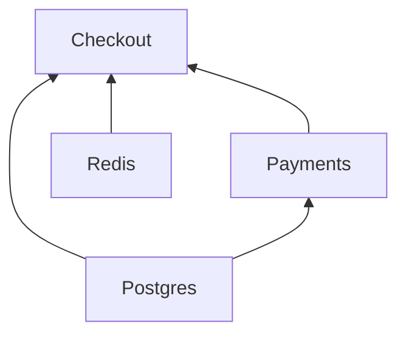

# <a id="clients"></a>Clientes

[English](../../guide/clients.md) · [Русский](../ru/clients.md) · [简体中文](../zh-CN/clients.md) · **Español** · [Português (Brasil)](../pt-BR/clients.md) · [日本語](../ja/clients.md) · [Polski](../pl/clients.md)

← [Documentación](../README.es.md#documentation)

## <a id="client-and-notsingletonclient"></a>Client y NotSingletonClient

Toda dependencia es una subclase de una de estas dos clases base:

| Clase base           | Instancias                                             |
|----------------------|--------------------------------------------------------|
| `Client`             | Singleton: una instancia por contenedor                |
| `NotSingletonClient` | Una instancia nueva para cada consumidor que la declara |

```python
from nuke_di import Client, Dependencies, NotSingletonClient


class Settings(Client):
    pass


class HttpSession(NotSingletonClient):
    pass


class Orders(Client):
    def __init__(self, settings: Settings, http: HttpSession) -> None:
        self.settings = settings
        self.http = http


class Payments(Client):
    def __init__(self, settings: Settings, http: HttpSession) -> None:
        self.settings = settings
        self.http = http


deps = Dependencies()
orders = deps.resolve(Orders)
payments = deps.resolve(Payments)

print(orders.settings is payments.settings)  # one Settings for the whole container
print(orders.http is payments.http)  # every consumer gets its own HttpSession
print(deps.resolve(Orders) is orders)  # resolve() is idempotent for a Client
```

```text
True
False
True
```

Un cliente declara sus propias dependencias como argumentos anotados de `__init__`. Solo se
inyectan los argumentos anotados con un tipo de cliente, y la resolución es recursiva.

Un cliente vive lo mismo que su contenedor. No hay clientes por petición ni por mensaje, ni los
habrá ([ADR-0006](../../adr/0006-clients-live-as-long-as-the-container.md)): una transacción o cualquier cosa que viva una sola petición se abre en el
handler mediante un método de un cliente. `NotSingletonClient` sigue soportado, pero se eliminará en
una futura versión mayor, así que no construyas código nuevo sobre él.

## <a id="connect-and-disconnect"></a>connect() y disconnect()

Sobrescribe los métodos asíncronos `connect()` / `disconnect()` para abrir y liberar recursos
como los pools de conexiones. `__init__` solo guarda las dependencias; todo lo que haga E/S va
en `connect()`:

```python
class Redis(Client):
    def __init__(self) -> None:
        self._pool: Pool | None = None

    async def connect(self) -> None:
        self._pool = await create_pool()

    async def disconnect(self) -> None:
        if self._pool is not None:
            await self._pool.close()
            self._pool = None
```

Cada `connect()` está limitado por `CONNECT_TIMEOUT_SECONDS` (por defecto `30`) y cada
`disconnect()` por `DISCONNECT_TIMEOUT_SECONDS` (por defecto `10`). Un `disconnect()` que falla
o se cuelga queda registrado en el log, y el resto de los clientes se apaga igualmente.

## <a id="dataclass-clients"></a>Clientes como dataclass

`client_dataclass` convierte una clase en `Client` y en dataclass a la vez, de modo que sus campos
pasan a ser las dependencias inyectadas. Hereda también de `Client`: el decorador está tipado como
identidad, así que es la clase base la que le dice a mypy y a pyright que `Checkout` es un cliente;
sin ella, la clase es un cliente solo en tiempo de ejecución:

```python
from nuke_di import Client, Dependencies, client_dataclass


class Postgres(Client):
    pass


class Payments(Client):
    pass


@client_dataclass(frozen=True)
class Checkout(Client):
    pg: Postgres
    payments: Payments


checkout = Dependencies().resolve(Checkout)
print(checkout)
print(isinstance(checkout, Client))
```

```text
Checkout(pg=<__main__.Postgres object at 0x...>, payments=<__main__.Payments object at 0x...>)
True
```

Acepta los mismos argumentos con nombre que `dataclasses.dataclass`.

## <a id="connect-order"></a>Orden de conexión

Un cliente se conecta en cuanto sus propias dependencias lo han hecho, de forma concurrente con todos
los demás clientes que estén listos, así que un cliente lento solo retrasa a los clientes que lo
necesitan. `disconnect()` va en sentido contrario: un cliente se desconecta en cuanto lo han hecho los
clientes que dependen de él.

```python
# connect_order.py
import asyncio
import logging
import time

from nuke_di import Client, Dependencies

logging.basicConfig(level=logging.INFO, format="%(levelname)s %(message)s")
started = time.perf_counter()


async def connecting(name: str, seconds: float) -> None:
    await asyncio.sleep(seconds)  # a real client opens its connection here
    print(f"{time.perf_counter() - started:.2f}s  {name} connected")


class Postgres(Client):
    async def connect(self) -> None:
        await connecting("Postgres", 0.3)


class Kafka(Client):
    async def connect(self) -> None:
        await connecting("Kafka", 0.05)


class Redis(Client):
    async def connect(self) -> None:
        await connecting("Redis", 0.05)


class Repository(Client):
    def __init__(self, pg: Postgres) -> None:
        self.pg = pg


class Consumer(Client):
    def __init__(self, kafka: Kafka) -> None:
        self.kafka = kafka

    async def connect(self) -> None:
        await connecting("Consumer", 0.3)


class Http(Client):
    def __init__(self, redis: Redis) -> None:
        self.redis = redis

    async def connect(self) -> None:
        await connecting("Http", 0.2)


class App(Client):
    def __init__(self, repository: Repository, consumer: Consumer, http: Http) -> None:
        self.repository, self.consumer, self.http = repository, consumer, http


async def main() -> None:
    deps = Dependencies()
    deps.resolve(App)
    async with deps:
        print("-- application is running --")


asyncio.run(main())
```

```console
$ python connect_order.py
0.05s  Kafka connected
0.05s  Redis connected
0.25s  Http connected
0.30s  Postgres connected
0.35s  Consumer connected
INFO Connected 7 clients in 0.35s (slowest: Postgres 0.30s, Consumer 0.30s, Http 0.20s)
-- application is running --
```

`Consumer` solo necesita `Kafka`, así que arranca a los 0.05s mientras `Postgres` todavía se está
conectando, y el arranque dura lo que su cadena de dependencias más larga, `Kafka` → `Consumer`. Hasta
la 1.11 los clientes se conectaban por capas, y cada uno esperaba al cliente más lento de la capa
inferior, lo que aquí tomaba 0.60s:


Con `DEBUG` activado, el logger `nuke_di` nombra cada cliente cuando empieza y cuando termina, junto
con cuántos se han conectado hasta el momento: `Connecting client Consumer (2/7 connected)`, y lo
mismo para `disconnect()`.

Solo se ordenan las dependencias declaradas en `__init__`. Si un cliente necesita que otro esté
conectado antes, decláralo como dependencia. Configura `CONNECT_CONCURRENCY` para limitar cuántos
clientes se conectan a la vez; un cliente que espera a sus dependencias no ocupa un hueco.

## <a id="startup-timings"></a>Tiempos de arranque

El contenedor mide el `connect()` y el `disconnect()` de cada cliente, así que un arranque
lento señala al culpable. Tras un `connect()` exitoso registra un resumen en `INFO` y un
`WARNING` por cada cliente que usó más de la mitad de `CONNECT_TIMEOUT_SECONDS`, mucho
antes de que ese cliente empiece a fallar por timeout:

```python
# startup.py
import asyncio
import logging

from nuke_di import Client, Dependencies, DependenciesSettings

logging.basicConfig(level=logging.INFO, format="%(levelname)s %(message)s")


class Postgres(Client):
    async def connect(self) -> None:
        await asyncio.sleep(0.2)


class Kafka(Client):
    async def connect(self) -> None:
        await asyncio.sleep(1.6)

    async def disconnect(self) -> None:
        await asyncio.sleep(0.3)


class Orders(Client):
    def __init__(self, pg: Postgres, kafka: Kafka) -> None:
        self.pg, self.kafka = pg, kafka


async def main() -> None:
    deps = Dependencies(settings=DependenciesSettings(connect_timeout=3))
    deps.resolve(Orders)
    async with deps:
        print("-- application is running --")

    for t in deps.timings:
        print(
            f"{t.name:<8} connect {t.connect:.2f}s {t.connect_outcome:<3}  "
            f"disconnect {t.disconnect:.2f}s {t.disconnect_outcome}"
        )


asyncio.run(main())
```

```console
$ python startup.py
INFO Connected 3 clients in 1.60s (slowest: Kafka 1.60s, Postgres 0.20s, Orders 0.00s)
WARNING Client Kafka took 1.60s to connect, more than half of CONNECT_TIMEOUT_SECONDS (3s)
-- application is running --
Postgres connect 0.20s ok   disconnect 0.00s ok
Kafka    connect 1.60s ok   disconnect 0.30s ok
Orders   connect 0.00s ok   disconnect 0.00s ok
```

`deps.timings` guarda un `ClientTiming` por cada cliente del último `connect()`, en orden de
resolución, así que un cliente va después de sus dependencias. Sobrevive a `disconnect()`, así que se puede leer cuando el contenedor ya se ha
detenido. En una app de FastAPI, el lifespan que pasas a `FastAPI()` se ejecuta dentro del
contenedor conectado, así que ve los tiempos de conexión. Un worker o un job recibe la misma
lista en [`Run.clients`](workers-and-jobs.md#startup-metrics-and-structured-logs).

| Campo de `ClientTiming` | Valor |
|-------------------------|-------|
| `name`               | El nombre de la clase del cliente |
| `connect`            | Segundos dentro de `connect()`, sin contar la espera por `CONNECT_CONCURRENCY`; `None` si `connect()` nunca se ejecutó |
| `connect_outcome`    | `"ok"`, `"failed"`, `"timed_out"`, `"cancelled"`, o `None` si `connect()` nunca empezó |
| `disconnect`, `disconnect_outcome` | Lo mismo para `disconnect()`; `None` hasta que el cliente se desconecta |

Cuando un cliente no logra conectarse, los clientes que aún se están conectando quedan en
`"cancelled"`, los clientes que aún esperan a sus dependencias mantienen `None` y los clientes que ya se
habían conectado se revierten, por lo que reciben un `disconnect_outcome`. La biblioteca
solo mide: exportar los tiempos como métricas o spans queda en manos de tu código.

## <a id="the-graph"></a>El grafo

El grafo de dependencias solo existe dentro de un proceso en marcha: el log `DEBUG` es el único
lugar que muestra qué clientes arrastra un entrypoint y a qué espera cada uno. `graph()` devuelve la
misma imagen como datos, antes de `connect()` o después:

```python
# graph.py
from nuke_di import Client, Dependencies


class Postgres(Client):
    pass


class Redis(Client):
    pass


class Payments(Client):
    def __init__(self, pg: Postgres) -> None:
        self.pg = pg


class Checkout(Client):
    def __init__(self, pg: Postgres, redis: Redis, payments: Payments) -> None:
        self.pg, self.redis, self.payments = pg, redis, payments


deps = Dependencies()
deps.resolve(Checkout)
nodes = {node.name: node for node in deps.graph().nodes}
for node in nodes.values():
    print(f"{node.name:<8} needs {list(node.dependencies)}")
print("shared:", nodes["Checkout"].dependencies["pg"] is nodes["Payments"].dependencies["pg"])
print(deps.graph().to_mermaid())
```

```console
$ python graph.py
Postgres needs []
Redis    needs []
Payments needs ['pg']
Checkout needs ['pg', 'redis', 'payments']
shared: True
graph BT
  Postgres
  Redis
  Payments
  Checkout
  Postgres --> Payments
  Postgres --> Checkout
  Redis --> Checkout
  Payments --> Checkout
```

GitHub renderiza el texto Mermaid en un README, un pull request o un issue, así que un proyecto
puede mostrar su arquitectura sin un proceso en marcha:



`Graph.nodes` contiene un `Node` por cliente resuelto, en orden de resolución, así que un cliente va
después de sus dependencias. Es una instantánea: `flush()` lo vacía, salvo los Replacement de los bloques
`override()` abiertos, que sobreviven a cada `flush()`.

| Campo de `Node` | Valor |
|-----------------|-------|
| `name`          | El nombre de la clase del cliente |
| `cls`           | La clase que pidieron los consumidores |
| `singleton`     | `True` para un `Client`, `False` para un `NotSingletonClient` |
| `replacement`   | El objeto registrado con `mock()` u `override()` en lugar de `cls`; `None` para un cliente real |
| `dependencies`  | Los clientes de los argumentos de `__init__`, por nombre de argumento |

Un `NotSingletonClient` recibe un nodo por instancia, todos con el mismo nombre; `to_mermaid()` los
numera desde el segundo (`Session`, `Session_2`). Un Replacement se dibuja con un
borde discontinuo y el nombre del objeto que lo sustituye: `Postgres: AsyncMock`. Los nodos se comparan
por identidad, así que el `shared: True` de arriba dice que `Checkout` y `Payments` recibieron el mismo `Postgres`.

## <a id="when-a-client-fails-to-connect"></a>Cuando un cliente no logra conectarse

Si un cliente no logra conectarse, se cancela todo cliente que aún se esté conectando y los clientes
que lo esperan nunca arrancan. Los clientes que ya se habían conectado se desconectan, cada uno después
de los clientes que dependen de él, y el contenedor queda desconectado y vacío:

```python
import asyncio

from nuke_di import Client, ConnectError, Dependencies


class Postgres(Client):
    async def connect(self) -> None:
        print("postgres: connected")

    async def disconnect(self) -> None:
        print("postgres: disconnected")


class Kafka(Client):
    async def connect(self) -> None:
        raise OSError("broker kafka-1:9092 is unreachable")


class Orders(Client):
    def __init__(self, pg: Postgres, kafka: Kafka) -> None:
        self.pg, self.kafka = pg, kafka


async def main() -> None:
    deps = Dependencies()
    deps.resolve(Orders)
    try:
        await deps.connect()
    except ConnectError as exc:
        print(f"{exc} <- {exc.__cause__!r}")
    print("connected:", deps.connected)


asyncio.run(main())
```

```text
postgres: connected
Kafka.connect() raised OSError: broker kafka-1:9092 is unreachable
Traceback (most recent call last):
  ...
OSError: broker kafka-1:9092 is unreachable
postgres: disconnected
Kafka.connect() raised OSError: broker kafka-1:9092 is unreachable <- OSError('broker kafka-1:9092 is unreachable')
connected: False
```

La misma limpieza ocurre cuando se cancela el propio `connect()`. `ConnectError` deriva de
`SystemExit`, así que una aplicación que no la captura se detiene, que es justo lo que se suele
querer cuando una dependencia está caída. Los clientes mockeados no se conectan, y nada los espera.

## <a id="when-the-tree-cannot-be-built"></a>Cuando el árbol no se puede construir

La resolución revisa cada `__init__` antes de llamarlo, así que un cliente que no se puede
construir falla antes de que se conecte nada, indicando el argumento y la ruta desde el cliente
que pediste:

```python
from typing import Protocol

from nuke_di import Client, Dependencies, InvalidSignatureError


class Postgres(Client):
    pass


class UserRepository(Protocol):
    async def get(self, user_id: int) -> str: ...


class Profiles(Client):
    def __init__(self, pg: Postgres, users: UserRepository) -> None:
        self.pg, self.users = pg, users


class Checkout(Client):
    def __init__(self, profiles: Profiles) -> None:
        self.profiles = profiles


class Orders(Client):
    def __init__(self, payments: "Payments") -> None:
        self.payments = payments


class Payments(Client):
    def __init__(self, orders: Orders) -> None:
        self.orders = orders


for root in (Checkout, Orders):
    try:
        Dependencies().resolve(root)
    except InvalidSignatureError as exc:
        print(f"{type(exc).__name__}: {exc}")

try:
    Dependencies().resolve(UserRepository)  # a type checker refuses this line, and so does the container
except InvalidSignatureError as exc:
    print(f"{type(exc).__name__}: {exc}")
```

```text
InvalidSignatureError: Argument "users" of "Profiles.__init__" is UserRepository, which is not a client (resolving Checkout -> Profiles)
CircularDependencyError: Circular dependency: Orders -> Payments -> Orders
InvalidSignatureError: UserRepository is not a client: subclass Client or NotSingletonClient
```

Un argumento de `__init__` recibe un cliente cuando su type hint es un cliente. Cualquier otro
argumento necesita un valor por defecto, que se deja tal cual. Estos casos fallan con `InvalidSignatureError`:

| Argumento de `__init__` sin valor por defecto | Mensaje                                    |
|-----------------------------------------------|--------------------------------------------|
| sin type hint                                 | `has no type hint`                         |
| un tipo que no es un cliente                  | `is UserRepository, which is not a client` |
| `Client \| None`                              | `is Postgres \| None, a client cannot be optional` |
| un cliente, solo posicional (`/`)             | `is positional-only, a client is passed by keyword` |

Una clase que no es un cliente en absoluto, pedida con `resolve()`, falla con `UserRepository is not a client: subclass Client or NotSingletonClient` antes de que se construya nada.

Los clientes que dependen unos de otros en un ciclo fallan con `CircularDependencyError`, una
subclase de `InvalidSignatureError`, y un type hint que no se puede evaluar, por ejemplo una clase
definida dentro de una función o importada bajo `TYPE_CHECKING`, falla con un `InvalidSignatureError`
que lo explica. Cuando el error viene de `inject()`, la ruta empieza en la función:
`(resolving handler -> Checkout -> Profiles)`. En un [worker o un job](workers-and-jobs.md)
cada uno de estos errores hace fallar la ejecución con el código de salida `1` antes de que se conecte nada.
