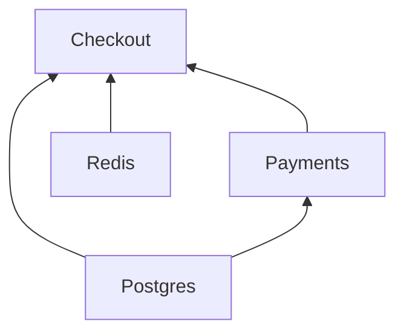

# <a id="clients"></a>クライアント

[English](../../guide/clients.md) · [Русский](../ru/clients.md) · [简体中文](../zh-CN/clients.md) · [Español](../es/clients.md) · [Português (Brasil)](../pt-BR/clients.md) · **日本語** · [Polski](../pl/clients.md)

← [ドキュメント](../README.ja.md#documentation)

## <a id="client-and-notsingletonclient"></a>Client と NotSingletonClient

すべての依存関係は、次の 2 つの基底クラスのいずれかのサブクラスです。

| 基底クラス           | インスタンス                                       |
|----------------------|----------------------------------------------------|
| `Client`             | シングルトン：コンテナごとに 1 インスタンス        |
| `NotSingletonClient` | それを宣言する利用側ごとに新しいインスタンス       |

```python
from nuke_di import Client, Dependencies, NotSingletonClient


class Settings(Client):
    pass


class HttpSession(NotSingletonClient):
    pass


class Orders(Client):
    def __init__(self, settings: Settings, http: HttpSession) -> None:
        self.settings = settings
        self.http = http


class Payments(Client):
    def __init__(self, settings: Settings, http: HttpSession) -> None:
        self.settings = settings
        self.http = http


deps = Dependencies()
orders = deps.resolve(Orders)
payments = deps.resolve(Payments)

print(orders.settings is payments.settings)  # one Settings for the whole container
print(orders.http is payments.http)  # every consumer gets its own HttpSession
print(deps.resolve(Orders) is orders)  # resolve() is idempotent for a Client
```

```text
True
False
True
```

クライアントは自身の依存関係を、型注釈付きの `__init__` 引数として宣言します。注入されるのはクライアント型で注釈された引数だけで、解決は再帰的に行われます。

クライアントの寿命はコンテナと同じです。リクエストごと・メッセージごとのクライアントはなく、今後も追加されません（[ADR-0006](../../adr/0006-clients-live-as-long-as-the-container.md)）。トランザクションなど 1 リクエストの間だけ存在するものは、ハンドラーがクライアントのメソッドを通じて開きます。`NotSingletonClient` は当面サポートされますが、将来のメジャーバージョンで削除される予定のため、新しいコードをその上に構築しないでください。

## <a id="connect-and-disconnect"></a>connect() と disconnect()

コネクションプールなどのリソースを確保・解放するには、非同期メソッド `connect()` / `disconnect()` をオーバーライドします。`__init__` では依存関係を保持するだけにとどめ、I/O を伴う処理はすべて `connect()` に書きます。

```python
class Redis(Client):
    def __init__(self) -> None:
        self._pool: Pool | None = None

    async def connect(self) -> None:
        self._pool = await create_pool()

    async def disconnect(self) -> None:
        if self._pool is not None:
            await self._pool.close()
            self._pool = None
```

`connect()` にはそれぞれ `CONNECT_TIMEOUT_SECONDS`（デフォルト `30`）、`disconnect()` にはそれぞれ `DISCONNECT_TIMEOUT_SECONDS`（デフォルト `10`）のタイムアウトがかかります。`disconnect()` が失敗したりハングしたりした場合はログに記録され、他のクライアントの終了処理はそのまま続行されます。

## <a id="dataclass-clients"></a>データクラスのクライアント

`client_dataclass` はクラスを `Client` かつデータクラスに一度に変換します。そのため、フィールドがそのまま注入される依存関係になります。あわせて `Client` も継承してください。デコレータは恒等関数として型付けされているので、`Checkout` がクライアントであることを mypy と pyright に伝えるのは基底クラスです。基底クラスがなければ、そのクラスは実行時にだけクライアントになります。

```python
from nuke_di import Client, Dependencies, client_dataclass


class Postgres(Client):
    pass


class Payments(Client):
    pass


@client_dataclass(frozen=True)
class Checkout(Client):
    pg: Postgres
    payments: Payments


checkout = Dependencies().resolve(Checkout)
print(checkout)
print(isinstance(checkout, Client))
```

```text
Checkout(pg=<__main__.Postgres object at 0x...>, payments=<__main__.Payments object at 0x...>)
True
```

`dataclasses.dataclass` と同じキーワード引数を受け付けます。

## <a id="connect-order"></a>接続順序

クライアントは自身の依存先の接続が終わるとすぐに接続を始め、準備ができた他のすべてのクライアントと並行して接続されます。そのため、遅いクライアントが待たせるのは、それを必要とするクライアントだけです。`disconnect()` は逆向きに進みます。クライアントは、それに依存するクライアントの切断が終わるとすぐに切断されます。

```python
# connect_order.py
import asyncio
import logging
import time

from nuke_di import Client, Dependencies

logging.basicConfig(level=logging.INFO, format="%(levelname)s %(message)s")
started = time.perf_counter()


async def connecting(name: str, seconds: float) -> None:
    await asyncio.sleep(seconds)  # a real client opens its connection here
    print(f"{time.perf_counter() - started:.2f}s  {name} connected")


class Postgres(Client):
    async def connect(self) -> None:
        await connecting("Postgres", 0.3)


class Kafka(Client):
    async def connect(self) -> None:
        await connecting("Kafka", 0.05)


class Redis(Client):
    async def connect(self) -> None:
        await connecting("Redis", 0.05)


class Repository(Client):
    def __init__(self, pg: Postgres) -> None:
        self.pg = pg


class Consumer(Client):
    def __init__(self, kafka: Kafka) -> None:
        self.kafka = kafka

    async def connect(self) -> None:
        await connecting("Consumer", 0.3)


class Http(Client):
    def __init__(self, redis: Redis) -> None:
        self.redis = redis

    async def connect(self) -> None:
        await connecting("Http", 0.2)


class App(Client):
    def __init__(self, repository: Repository, consumer: Consumer, http: Http) -> None:
        self.repository, self.consumer, self.http = repository, consumer, http


async def main() -> None:
    deps = Dependencies()
    deps.resolve(App)
    async with deps:
        print("-- application is running --")


asyncio.run(main())
```

```console
$ python connect_order.py
0.05s  Kafka connected
0.05s  Redis connected
0.25s  Http connected
0.30s  Postgres connected
0.35s  Consumer connected
INFO Connected 7 clients in 0.35s (slowest: Postgres 0.30s, Consumer 0.30s, Http 0.20s)
-- application is running --
```

`Consumer` が必要とするのは `Kafka` だけなので、`Postgres` がまだ接続中の 0.05s の時点で開始します。起動にかかる時間は、最も長い依存関係の連鎖である `Kafka` → `Consumer` の時間になります。1.12 までは、クライアントはレイヤー単位で接続され、各レイヤーが下のレイヤーで最も遅いクライアントを待っていたため、この例では 0.60s かかっていました。1.0 では解決順に 1 つずつ接続していたため、0.90s かかっていました。


`DEBUG` を有効にすると、`nuke_di` ロガーは各クライアントの開始と完了を、その時点までに接続済みの数とともに記録します：`Connecting client Consumer (2/7 connected)`。`disconnect()` についても同様です。

順序が保証されるのは、`__init__` で宣言された依存関係だけです。あるクライアントより先に別のクライアントを接続しておく必要があるなら、それを依存関係として宣言してください。同時に接続するクライアントの数を制限するには、`CONNECT_CONCURRENCY` を設定します。依存先を待っているクライアントは枠を消費しません。

## <a id="startup-timings"></a>起動時間

コンテナはすべてのクライアントの `connect()` と `disconnect()` を計測するため、起動が遅いときに
原因のクライアントがすぐわかります。`connect()` が成功すると `INFO` で要約を出力し、
`CONNECT_TIMEOUT_SECONDS` の半分より長くかかったクライアントごとに `WARNING` を出力します。
そのクライアントがタイムアウトで失敗し始めるよりずっと前に気づけます：

```python
# startup.py
import asyncio
import logging

from nuke_di import Client, Dependencies, DependenciesSettings

logging.basicConfig(level=logging.INFO, format="%(levelname)s %(message)s")


class Postgres(Client):
    async def connect(self) -> None:
        await asyncio.sleep(0.2)


class Kafka(Client):
    async def connect(self) -> None:
        await asyncio.sleep(1.6)

    async def disconnect(self) -> None:
        await asyncio.sleep(0.3)


class Orders(Client):
    def __init__(self, pg: Postgres, kafka: Kafka) -> None:
        self.pg, self.kafka = pg, kafka


async def main() -> None:
    deps = Dependencies(settings=DependenciesSettings(connect_timeout=3))
    deps.resolve(Orders)
    async with deps:
        print("-- application is running --")

    for t in deps.timings:
        print(
            f"{t.name:<8} connect {t.connect:.2f}s {t.connect_outcome:<3}  "
            f"disconnect {t.disconnect:.2f}s {t.disconnect_outcome}"
        )


asyncio.run(main())
```

```console
$ python startup.py
INFO Connected 3 clients in 1.60s (slowest: Kafka 1.60s, Postgres 0.20s, Orders 0.00s)
WARNING Client Kafka took 1.60s to connect, more than half of CONNECT_TIMEOUT_SECONDS (3s)
-- application is running --
Postgres connect 0.20s ok   disconnect 0.00s ok
Kafka    connect 1.60s ok   disconnect 0.30s ok
Orders   connect 0.00s ok   disconnect 0.00s ok
```

`deps.timings` は直近の `connect()` のクライアントごとに `ClientTiming` を解決順に 1 つずつ保持するので、クライアントは必ず自身の依存先の後に並びます。
`disconnect()` の後も残るので、コンテナの停止後にも読み取れます。FastAPI アプリでは、`FastAPI()` に渡した
lifespan は接続済みのコンテナの内側で動くので、接続時間を参照できます。
ワーカーやジョブは同じリストを [`Run.clients`](workers-and-jobs.md#startup-metrics-and-structured-logs) で受け取ります。

| `ClientTiming` のフィールド | 値 |
|-----------------------------|----|
| `name`               | クライアントのクラス名 |
| `connect`            | `connect()` にかかった秒数。`CONNECT_CONCURRENCY` の待ち時間は含みません。`connect()` が一度も実行されなかった場合は `None` |
| `connect_outcome`    | `"ok"`、`"failed"`、`"timed_out"`、`"cancelled"`。`connect()` が始まらなかった場合は `None` |
| `disconnect`、`disconnect_outcome` | `disconnect()` について同じもの。クライアントが切断されるまでは `None` |

あるクライアントの接続が失敗すると、まだ接続中のクライアントは `"cancelled"` になり、
依存先を待っているクライアントは `None` のままで、すでに接続していたクライアントはロールバックされて `disconnect_outcome`
を持ちます。ライブラリは計測するだけです。時間をメトリクスやスパンとしてエクスポートするのはあなたのコードの役割です。

## <a id="the-graph"></a>依存グラフ

依存グラフは実行中のプロセスの中にしか存在しません。`DEBUG` ログだけが、エントリーポイントがどのクライアントを
引き込み、それぞれが何を待つかを示す場所です。`graph()` は同じ絵をデータとして返します。`connect()` の前でも
後でも呼べます：

```python
# graph.py
from nuke_di import Client, Dependencies


class Postgres(Client):
    pass


class Redis(Client):
    pass


class Payments(Client):
    def __init__(self, pg: Postgres) -> None:
        self.pg = pg


class Checkout(Client):
    def __init__(self, pg: Postgres, redis: Redis, payments: Payments) -> None:
        self.pg, self.redis, self.payments = pg, redis, payments


deps = Dependencies()
deps.resolve(Checkout)
nodes = {node.name: node for node in deps.graph().nodes}
for node in nodes.values():
    print(f"{node.name:<8} needs {list(node.dependencies)}")
print("shared:", nodes["Checkout"].dependencies["pg"] is nodes["Payments"].dependencies["pg"])
print(deps.graph().to_mermaid())
```

```console
$ python graph.py
Postgres needs []
Redis    needs []
Payments needs ['pg']
Checkout needs ['pg', 'redis', 'payments']
shared: True
graph BT
  Postgres
  Redis
  Payments
  Checkout
  Postgres --> Payments
  Postgres --> Checkout
  Redis --> Checkout
  Payments --> Checkout
```

GitHub は README、pull request、issue の中で Mermaid のテキストを描画するので、プロジェクトはプロセスを動かさずに
アーキテクチャを見せられます。



`Graph.nodes` は解決済みのクライアントごとに 1 つの `Node` を解決順に持つので、クライアントは自分の依存の後に来ます。
これはスナップショットで、`flush()` で空になります。ただし、開いている `override()` ブロックの Replacement は残り、どの `flush()` にも
耐えます。

| `Node` のフィールド | 値 |
|---------------------|----|
| `name`              | クライアントのクラス名 |
| `cls`               | 利用側が要求したクラス |
| `singleton`         | `Client` なら `True`、`NotSingletonClient` なら `False` |
| `replacement`       | `mock()` または `override()` で `cls` の代わりに登録されたオブジェクト。実際のクライアントは `None` |
| `dependencies`      | `__init__` の各引数に対応するクライアント。引数名で引く |

`NotSingletonClient` はインスタンスごとに 1 つのノードになり、名前はすべて同じです。`to_mermaid()` は 2 つ目から番号を
付けます（`Session`、`Session_2`）。Replacement は破線の枠で描かれ、代わりに置かれたオブジェクトの名前が
付きます：`Postgres: AsyncMock`。ノードは同一性で比較されるので、
上の `shared: True` は `Checkout` と `Payments` が同じ `Postgres` を受け取ったことを示します。

## <a id="when-a-client-fails-to-connect"></a>クライアントの接続に失敗した場合

クライアントの接続に失敗すると、まだ接続中のクライアントはすべてキャンセルされ、そのクライアントを待っているクライアントは開始されません。すでに接続済みのクライアントは、それぞれ自身に依存するクライアントの後に切断され、コンテナは切断済みの空の状態になります。

```python
import asyncio

from nuke_di import Client, ConnectError, Dependencies


class Postgres(Client):
    async def connect(self) -> None:
        print("postgres: connected")

    async def disconnect(self) -> None:
        print("postgres: disconnected")


class Kafka(Client):
    async def connect(self) -> None:
        raise OSError("broker kafka-1:9092 is unreachable")


class Orders(Client):
    def __init__(self, pg: Postgres, kafka: Kafka) -> None:
        self.pg, self.kafka = pg, kafka


async def main() -> None:
    deps = Dependencies()
    deps.resolve(Orders)
    try:
        await deps.connect()
    except ConnectError as exc:
        print(f"{exc} <- {exc.__cause__!r}")
    print("connected:", deps.connected)


asyncio.run(main())
```

```text
postgres: connected
Kafka.connect() raised OSError: broker kafka-1:9092 is unreachable
Traceback (most recent call last):
  ...
OSError: broker kafka-1:9092 is unreachable
postgres: disconnected
Kafka.connect() raised OSError: broker kafka-1:9092 is unreachable <- OSError('broker kafka-1:9092 is unreachable')
connected: False
```

`connect()` 自体がキャンセルされた場合も、同じクリーンアップが行われます。`ConnectError` は `SystemExit` を継承しているため、これを捕捉しないアプリケーションは停止します。依存先がダウンしているときは、たいていそれが望ましい動作です。モックしたクライアントは接続されず、それを待つものもありません。

## <a id="when-the-tree-cannot-be-built"></a>ツリーを構築できない場合

解決時には、すべての `__init__` を呼び出す前に検査します。そのため、構築できないクライアントは何かが接続される前に失敗し、エラーには該当する引数の名前と、要求したクライアントからの経路が示されます。

```python
from typing import Protocol

from nuke_di import Client, Dependencies, InvalidSignatureError


class Postgres(Client):
    pass


class UserRepository(Protocol):
    async def get(self, user_id: int) -> str: ...


class Profiles(Client):
    def __init__(self, pg: Postgres, users: UserRepository) -> None:
        self.pg, self.users = pg, users


class Checkout(Client):
    def __init__(self, profiles: Profiles) -> None:
        self.profiles = profiles


class Orders(Client):
    def __init__(self, payments: "Payments") -> None:
        self.payments = payments


class Payments(Client):
    def __init__(self, orders: Orders) -> None:
        self.orders = orders


for root in (Checkout, Orders):
    try:
        Dependencies().resolve(root)
    except InvalidSignatureError as exc:
        print(f"{type(exc).__name__}: {exc}")

try:
    Dependencies().resolve(UserRepository)  # a type checker refuses this line, and so does the container
except InvalidSignatureError as exc:
    print(f"{type(exc).__name__}: {exc}")
```

```text
InvalidSignatureError: Argument "users" of "Profiles.__init__" is UserRepository, which is not a client (resolving Checkout -> Profiles)
CircularDependencyError: Circular dependency: Orders -> Payments -> Orders
InvalidSignatureError: UserRepository is not a client: subclass Client or NotSingletonClient
```

`__init__` の引数は、型ヒントがクライアントであればクライアントで埋められます。それ以外の引数にはデフォルト値が必要で、その値はそのまま使われます。次の場合は `InvalidSignatureError` で失敗します。

| デフォルト値のない `__init__` 引数    | メッセージ                                        |
|---------------------------------------|---------------------------------------------------|
| 型ヒントがない                        | `has no type hint`                                |
| クライアントではない型                | `is UserRepository, which is not a client`        |
| `Client \| None`                      | `is Postgres \| None, a client cannot be optional` |
| 位置専用（`/`）のクライアント         | `is positional-only, a client is passed by keyword` |

そもそもクライアントではないクラスを `resolve()` で求めると、何かが構築される前に `UserRepository is not a client: subclass Client or NotSingletonClient` で失敗します。

互いに循環して依存するクライアントは、`InvalidSignatureError` のサブクラスである `CircularDependencyError` で失敗します。評価できない型ヒント（関数の内部で定義されたクラスや、`TYPE_CHECKING` の下でインポートされたクラスなど）は、その旨を示す `InvalidSignatureError` で失敗します。エラーが `inject()` から発生した場合、経路は関数から始まります：`(resolving handler -> Checkout -> Profiles)`。[ワーカーやジョブ](workers-and-jobs.md)では、いずれの場合も何かが接続される前に、終了コード `1` で実行が失敗します。

## <a id="checking-the-tree-with-mypy"></a>mypy によるツリーのチェック

`nuke_di.mypy` は mypy のプラグインで、mypy が型をチェックする段階で、プロセスやテストが実行される前にこれらのエラーを見つけます。`pyproject.toml` で有効にします：

```toml
[tool.mypy]
plugins = ["nuke_di.mypy"]
```

`resolve()`、`inject()`、`@job`、`@worker` のそれぞれで、プラグインはコンテナと同じように、その呼び出しが構築するすべてのクライアントの `__init__` をたどり、コンテナが送出するはずのエラーを同じメッセージで報告します：

```python
# tree.py
from typing import Protocol, reveal_type

from nuke_di import DI, Client, job


class Postgres(Client):
    pass


class UserRepository(Protocol):
    async def get(self, user_id: int) -> str: ...


class Profiles(Client):
    def __init__(self, pg: Postgres, users: UserRepository) -> None:
        self.pg, self.users = pg, users


class Checkout(Client):
    def __init__(self, profiles: Profiles) -> None:
        self.profiles = profiles


class Orders(Client):
    def __init__(self, payments: "Payments") -> None:
        self.payments = payments


class Payments(Client):
    def __init__(self, orders: Orders) -> None:
        self.orders = orders


async def greet(user_id: int, pg: Postgres) -> str:
    return f"Hello, user-{user_id}!"


DI.resolve(Checkout)
reveal_type(DI.inject(greet))


@job
async def settle(orders: Orders) -> None:
    pass
```

```console
$ mypy tree.py
tree.py:39: error: Argument "users" of "Profiles.__init__" is UserRepository, which is not a client (resolving Checkout -> Profiles)  [nuke-di]
tree.py:40: note: Revealed type is "def (user_id: int) -> typing.Coroutine[Any, Any, str]"
tree.py:43: error: Circular dependency: settle -> Orders -> Payments -> Orders  [nuke-di]
Found 2 errors in 1 file (checked 1 source file)
```

- 上の表のすべての行がチェックされ、循環もチェックされます。`inject()`、`@job`、`@worker` に渡された関数の、型ヒントのない引数も同様です。エラーはそれを送出するはずの呼び出しの位置に、その呼び出しからの経路とともに報告されます。複数のエラーを持つツリーでは、コンテナが最初のエラーで止まるのに対し、プラグインはそのすべてを報告します。
- `inject()` は、それが構築する `partial` の型として、クライアント引数を除いた関数を返します。上の例では `Callable[..., Coroutine[Any, Any, str]]` ではなく `def (user_id: int) -> Coroutine[Any, Any, str]` になります。クライアント引数より後ろにある引数はキーワード専用になります。位置引数として渡した値はクライアントの位置に入ってしまうからです。
- コンテナに任されるもの：実行時に評価できない型ヒント（mypy はそれでも評価します）、`type[...]` 型の変数に入ったクラス（別の `__init__` を持つサブクラスが入っているかもしれません）、デコレートされた、またはオーバーロードされた `__init__`、クラスに対する `inject()`、FastAPI・Litestar・FastStream・aiogram との統合のルートとハンドラー、mypy が知らない型（型ヒントのないライブラリのクラスなど）。
- 意図したエラーは、そのエラーのテストの中で `# type: ignore[nuke-di]` によって抑制します。
- mypy 1.13 以降で動作し、キャッシュの有無にかかわらず同じように機能します。ツリーの深いところにあるクライアントを変更すると、そのツリーの呼び出しが再びチェックされます。mypy のデーモン `dmypy` は、再起動するまでこのような変更を見逃すことがあります。
- Pyright にはプラグイン API がありません。Pyright では、[すべてのエントリーポイントを注入するテスト](testing.md)が同じエラーを見つけます。
