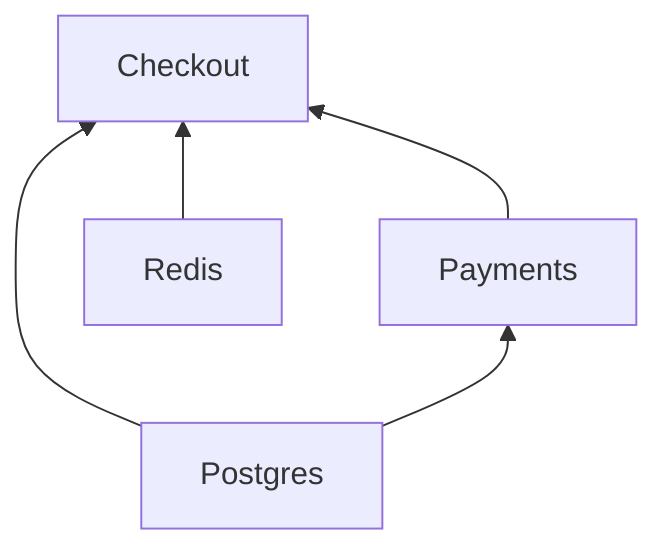

# <a id="clients"></a>Klienci

[English](../../guide/clients.md) · [Русский](../ru/clients.md) · [简体中文](../zh-CN/clients.md) · [Español](../es/clients.md) · [Português (Brasil)](../pt-BR/clients.md) · [日本語](../ja/clients.md) · **Polski**

← [Dokumentacja](../README.pl.md#documentation)

## <a id="client-and-notsingletonclient"></a>Client i NotSingletonClient

Każda zależność jest podklasą jednej z dwóch klas bazowych:

| Klasa bazowa         | Instancje                                                  |
|----------------------|------------------------------------------------------------|
| `Client`             | Singleton: jedna instancja na kontener                     |
| `NotSingletonClient` | Nowa instancja dla każdego konsumenta, który ją deklaruje  |

```python
from nuke_di import Client, Dependencies, NotSingletonClient


class Settings(Client):
    pass


class HttpSession(NotSingletonClient):
    pass


class Orders(Client):
    def __init__(self, settings: Settings, http: HttpSession) -> None:
        self.settings = settings
        self.http = http


class Payments(Client):
    def __init__(self, settings: Settings, http: HttpSession) -> None:
        self.settings = settings
        self.http = http


deps = Dependencies()
orders = deps.resolve(Orders)
payments = deps.resolve(Payments)

print(orders.settings is payments.settings)  # one Settings for the whole container
print(orders.http is payments.http)  # every consumer gets its own HttpSession
print(deps.resolve(Orders) is orders)  # resolve() is idempotent for a Client
```

```text
True
False
True
```

Klient deklaruje własne zależności jako argumenty `__init__` z adnotacjami typów. Wstrzykiwane są
tylko argumenty, których adnotacja jest typem klienta, a rozwiązywanie działa rekurencyjnie.

Klient żyje tak długo jak jego kontener. Nie ma klientów na żądanie ani na wiadomość i nie będzie
([ADR-0006](../../adr/0006-clients-live-as-long-as-the-container.md)): transakcję i wszystko, co żyje przez jedno żądanie, handler otwiera przez metodę
klienta. `NotSingletonClient` jest nadal wspierany, ale zostanie usunięty w jednej z przyszłych wersji
major, więc nie opieraj na nim nowego kodu.

## <a id="connect-and-disconnect"></a>connect() i disconnect()

Nadpisz asynchroniczne metody `connect()` / `disconnect()`, aby otwierać i zwalniać zasoby, takie
jak pule połączeń. `__init__` tylko zapamiętuje zależności; wszystko, co wykonuje I/O, należy
do `connect()`:

```python
class Redis(Client):
    def __init__(self) -> None:
        self._pool: Pool | None = None

    async def connect(self) -> None:
        self._pool = await create_pool()

    async def disconnect(self) -> None:
        if self._pool is not None:
            await self._pool.close()
            self._pool = None
```

Każde `connect()` jest ograniczone przez `CONNECT_TIMEOUT_SECONDS` (domyślnie `30`), a każde
`disconnect()` przez `DISCONNECT_TIMEOUT_SECONDS` (domyślnie `10`). Błąd lub zawieszenie się
`disconnect()` trafia do logu, a pozostali klienci i tak się zamykają.

## <a id="dataclass-clients"></a>Klienci jako dataclass

`client_dataclass` zamienia klasę jednocześnie w `Client` i w dataclass, więc jej pola
stają się wstrzykiwanymi zależnościami. Dziedzicz też po `Client`: dekorator jest typowany jako
tożsamość, więc to klasa bazowa mówi mypy i pyrightowi, że `Checkout` jest klientem; bez niej klasa
jest klientem tylko w czasie wykonania:

```python
from nuke_di import Client, Dependencies, client_dataclass


class Postgres(Client):
    pass


class Payments(Client):
    pass


@client_dataclass(frozen=True)
class Checkout(Client):
    pg: Postgres
    payments: Payments


checkout = Dependencies().resolve(Checkout)
print(checkout)
print(isinstance(checkout, Client))
```

```text
Checkout(pg=<__main__.Postgres object at 0x...>, payments=<__main__.Payments object at 0x...>)
True
```

Przyjmuje te same argumenty nazwane co `dataclasses.dataclass`.

## <a id="connect-order"></a>Kolejność łączenia

Klient łączy się, gdy tylko połączą się jego własne zależności, współbieżnie ze wszystkimi innymi
klientami, którzy są gotowi, więc powolny klient wstrzymuje tylko tych klientów, którzy go potrzebują.
`disconnect()` idzie w drugą stronę: klient rozłącza się, gdy tylko rozłączą się klienci, którzy od
niego zależą.

```python
# connect_order.py
import asyncio
import logging
import time

from nuke_di import Client, Dependencies

logging.basicConfig(level=logging.INFO, format="%(levelname)s %(message)s")
started = time.perf_counter()


async def connecting(name: str, seconds: float) -> None:
    await asyncio.sleep(seconds)  # a real client opens its connection here
    print(f"{time.perf_counter() - started:.2f}s  {name} connected")


class Postgres(Client):
    async def connect(self) -> None:
        await connecting("Postgres", 0.3)


class Kafka(Client):
    async def connect(self) -> None:
        await connecting("Kafka", 0.05)


class Redis(Client):
    async def connect(self) -> None:
        await connecting("Redis", 0.05)


class Repository(Client):
    def __init__(self, pg: Postgres) -> None:
        self.pg = pg


class Consumer(Client):
    def __init__(self, kafka: Kafka) -> None:
        self.kafka = kafka

    async def connect(self) -> None:
        await connecting("Consumer", 0.3)


class Http(Client):
    def __init__(self, redis: Redis) -> None:
        self.redis = redis

    async def connect(self) -> None:
        await connecting("Http", 0.2)


class App(Client):
    def __init__(self, repository: Repository, consumer: Consumer, http: Http) -> None:
        self.repository, self.consumer, self.http = repository, consumer, http


async def main() -> None:
    deps = Dependencies()
    deps.resolve(App)
    async with deps:
        print("-- application is running --")


asyncio.run(main())
```

```console
$ python connect_order.py
0.05s  Kafka connected
0.05s  Redis connected
0.25s  Http connected
0.30s  Postgres connected
0.35s  Consumer connected
INFO Connected 7 clients in 0.35s (slowest: Postgres 0.30s, Consumer 0.30s, Http 0.20s)
-- application is running --
```

`Consumer` potrzebuje tylko `Kafka`, więc startuje w 0.05s, gdy `Postgres` wciąż się łączy, a start
trwa tyle, ile najdłuższy łańcuch zależności, `Kafka` → `Consumer`. Do wersji 1.12 włącznie klienci łączyli się
warstwami, a każda warstwa czekała na najwolniejszego klienta warstwy poniżej, co tutaj zajmowało 0.60s,
a w wersji 1.0 jeden po drugim w kolejności rozwiązywania, co zajmowało 0.90s:


Przy włączonym `DEBUG` logger `nuke_di` podaje nazwę każdego klienta, gdy zaczyna i kończy łączenie,
wraz z liczbą klientów połączonych do tej pory: `Connecting client Consumer (2/7 connected)`, i tak
samo dla `disconnect()`.

Kolejność ustalana jest wyłącznie na podstawie zależności zadeklarowanych w `__init__`. Jeśli klient
potrzebuje, żeby inny był połączony wcześniej, zadeklaruj go jako zależność. Ustaw `CONNECT_CONCURRENCY`,
aby ograniczyć liczbę klientów łączących się jednocześnie; klient czekający na swoje zależności nie
zajmuje miejsca.

## <a id="startup-timings"></a>Czasy startu

Kontener mierzy `connect()` i `disconnect()` każdego klienta, więc powolny start sam wskazuje
winnego. Po udanym `connect()` loguje podsumowanie na poziomie `INFO` oraz `WARNING` dla
każdego klienta, który zużył ponad połowę `CONNECT_TIMEOUT_SECONDS`, na długo zanim ten
klient zacznie padać z powodu timeoutu:

```python
# startup.py
import asyncio
import logging

from nuke_di import Client, Dependencies, DependenciesSettings

logging.basicConfig(level=logging.INFO, format="%(levelname)s %(message)s")


class Postgres(Client):
    async def connect(self) -> None:
        await asyncio.sleep(0.2)


class Kafka(Client):
    async def connect(self) -> None:
        await asyncio.sleep(1.6)

    async def disconnect(self) -> None:
        await asyncio.sleep(0.3)


class Orders(Client):
    def __init__(self, pg: Postgres, kafka: Kafka) -> None:
        self.pg, self.kafka = pg, kafka


async def main() -> None:
    deps = Dependencies(settings=DependenciesSettings(connect_timeout=3))
    deps.resolve(Orders)
    async with deps:
        print("-- application is running --")

    for t in deps.timings:
        print(
            f"{t.name:<8} connect {t.connect:.2f}s {t.connect_outcome:<3}  "
            f"disconnect {t.disconnect:.2f}s {t.disconnect_outcome}"
        )


asyncio.run(main())
```

```console
$ python startup.py
INFO Connected 3 clients in 1.60s (slowest: Kafka 1.60s, Postgres 0.20s, Orders 0.00s)
WARNING Client Kafka took 1.60s to connect, more than half of CONNECT_TIMEOUT_SECONDS (3s)
-- application is running --
Postgres connect 0.20s ok   disconnect 0.00s ok
Kafka    connect 1.60s ok   disconnect 0.30s ok
Orders   connect 0.00s ok   disconnect 0.00s ok
```

`deps.timings` przechowuje po jednym `ClientTiming` na każdego klienta ostatniego `connect()`,
w kolejności rozwiązywania, więc klient występuje po swoich zależnościach. Lista przetrwa `disconnect()`, więc można ją odczytać po zatrzymaniu
kontenera. W aplikacji FastAPI lifespan przekazany do `FastAPI()` działa wewnątrz połączonego
kontenera, więc widzi czasy łączenia. Worker lub job dostaje tę samą listę w
[`Run.clients`](workers-and-jobs.md#startup-metrics-and-structured-logs).

| Pole `ClientTiming`  | Wartość |
|----------------------|---------|
| `name`               | Nazwa klasy klienta |
| `connect`            | Sekundy spędzone w `connect()`, bez czekania na `CONNECT_CONCURRENCY`; `None`, jeśli `connect()` nigdy się nie uruchomił |
| `connect_outcome`    | `"ok"`, `"failed"`, `"timed_out"`, `"cancelled"` albo `None`, jeśli `connect()` się nie zaczął |
| `disconnect`, `disconnect_outcome` | To samo dla `disconnect()`; `None`, dopóki klient się nie rozłączy |

Gdy klient nie może się połączyć, klienci, którzy wciąż się łączą, dostają `"cancelled"`,
klienci wciąż czekający na swoje zależności zostają z `None`, a klienci już połączeni są wycofywani, więc
dostają `disconnect_outcome`. Biblioteka tylko mierzy: eksport czasów jako metryk lub spanów
należy do twojego kodu.

## <a id="the-graph"></a>Graf

Graf zależności istnieje tylko wewnątrz działającego procesu: log `DEBUG` to jedyne miejsce,
które pokazuje, jakich klientów ściąga punkt wejścia i na co każdy z nich czeka. `graph()` zwraca
ten sam obraz jako dane, przed `connect()` albo po nim:

```python
# graph.py
from nuke_di import Client, Dependencies


class Postgres(Client):
    pass


class Redis(Client):
    pass


class Payments(Client):
    def __init__(self, pg: Postgres) -> None:
        self.pg = pg


class Checkout(Client):
    def __init__(self, pg: Postgres, redis: Redis, payments: Payments) -> None:
        self.pg, self.redis, self.payments = pg, redis, payments


deps = Dependencies()
deps.resolve(Checkout)
nodes = {node.name: node for node in deps.graph().nodes}
for node in nodes.values():
    print(f"{node.name:<8} needs {list(node.dependencies)}")
print("shared:", nodes["Checkout"].dependencies["pg"] is nodes["Payments"].dependencies["pg"])
print(deps.graph().to_mermaid())
```

```console
$ python graph.py
Postgres needs []
Redis    needs []
Payments needs ['pg']
Checkout needs ['pg', 'redis', 'payments']
shared: True
graph BT
  Postgres
  Redis
  Payments
  Checkout
  Postgres --> Payments
  Postgres --> Checkout
  Redis --> Checkout
  Payments --> Checkout
```

GitHub renderuje tekst Mermaid w README, pull requeście lub issue, więc projekt może pokazać swoją
architekturę bez działającego procesu:



`Graph.nodes` trzyma po jednym `Node` na rozwiązanego klienta, w kolejności rozwiązywania, więc klient
jest po swoich zależnościach. To zrzut: `flush()` go opróżnia, poza Replacement otwartych bloków
`override()`, które przetrwają każdy `flush()`.

| Pole `Node`    | Wartość |
|----------------|---------|
| `name`         | Nazwa klasy klienta |
| `cls`          | Klasa, o którą prosili konsumenci |
| `singleton`    | `True` dla `Client`, `False` dla `NotSingletonClient` |
| `replacement`  | Obiekt zarejestrowany przez `mock()` lub `override()` w miejsce `cls`; `None` dla prawdziwego klienta |
| `dependencies` | Klienci argumentów `__init__`, według nazwy argumentu |

`NotSingletonClient` dostaje po węźle na instancję, wszystkie o tej samej nazwie; `to_mermaid()` numeruje je
od drugiego (`Session`, `Session_2`). Replacement jest rysowany z przerywaną ramką i nazwą
obiektu na jego miejscu: `Postgres: AsyncMock`. Węzły porównują się przez tożsamość, więc
`shared: True` powyżej mówi, że `Checkout` i `Payments` dostali ten sam `Postgres`.

## <a id="when-a-client-fails-to-connect"></a>Gdy klient nie może się połączyć

Jeśli klientowi nie uda się połączyć, każdy klient, który wciąż się łączy, zostaje anulowany, a klienci
czekający na niego w ogóle nie startują. Klienci, którzy zdążyli się połączyć, zostają rozłączeni — każdy
po klientach, którzy od niego zależą — a kontener zostaje rozłączony i pusty:

```python
import asyncio

from nuke_di import Client, ConnectError, Dependencies


class Postgres(Client):
    async def connect(self) -> None:
        print("postgres: connected")

    async def disconnect(self) -> None:
        print("postgres: disconnected")


class Kafka(Client):
    async def connect(self) -> None:
        raise OSError("broker kafka-1:9092 is unreachable")


class Orders(Client):
    def __init__(self, pg: Postgres, kafka: Kafka) -> None:
        self.pg, self.kafka = pg, kafka


async def main() -> None:
    deps = Dependencies()
    deps.resolve(Orders)
    try:
        await deps.connect()
    except ConnectError as exc:
        print(f"{exc} <- {exc.__cause__!r}")
    print("connected:", deps.connected)


asyncio.run(main())
```

```text
postgres: connected
Kafka.connect() raised OSError: broker kafka-1:9092 is unreachable
Traceback (most recent call last):
  ...
OSError: broker kafka-1:9092 is unreachable
postgres: disconnected
Kafka.connect() raised OSError: broker kafka-1:9092 is unreachable <- OSError('broker kafka-1:9092 is unreachable')
connected: False
```

To samo sprzątanie następuje, gdy anulowane zostanie samo `connect()`. `ConnectError` dziedziczy po
`SystemExit`, więc aplikacja, która go nie przechwyci, kończy działanie — i zwykle właśnie tego chcesz,
gdy któraś zależność leży. Zamockowani klienci nie są łączeni i nic na nich nie czeka.

## <a id="when-the-tree-cannot-be-built"></a>Gdy nie da się zbudować drzewa

Rozwiązywanie sprawdza każde `__init__` przed jego wywołaniem, więc klient, którego nie da się zbudować,
zgłasza błąd, zanim cokolwiek się połączy — z nazwą argumentu i ścieżką od klienta, o którego prosisz:

```python
from typing import Protocol

from nuke_di import Client, Dependencies, InvalidSignatureError


class Postgres(Client):
    pass


class UserRepository(Protocol):
    async def get(self, user_id: int) -> str: ...


class Profiles(Client):
    def __init__(self, pg: Postgres, users: UserRepository) -> None:
        self.pg, self.users = pg, users


class Checkout(Client):
    def __init__(self, profiles: Profiles) -> None:
        self.profiles = profiles


class Orders(Client):
    def __init__(self, payments: "Payments") -> None:
        self.payments = payments


class Payments(Client):
    def __init__(self, orders: Orders) -> None:
        self.orders = orders


for root in (Checkout, Orders):
    try:
        Dependencies().resolve(root)
    except InvalidSignatureError as exc:
        print(f"{type(exc).__name__}: {exc}")

try:
    Dependencies().resolve(UserRepository)  # a type checker refuses this line, and so does the container
except InvalidSignatureError as exc:
    print(f"{type(exc).__name__}: {exc}")
```

```text
InvalidSignatureError: Argument "users" of "Profiles.__init__" is UserRepository, which is not a client (resolving Checkout -> Profiles)
CircularDependencyError: Circular dependency: Orders -> Payments -> Orders
InvalidSignatureError: UserRepository is not a client: subclass Client or NotSingletonClient
```

Argument `__init__` otrzymuje klienta, gdy jego adnotacja typu jest klientem. Każdy inny
argument musi mieć wartość domyślną, której biblioteka nie rusza. Te przypadki kończą się błędem `InvalidSignatureError`:

| Argument `__init__` bez wartości domyślnej | Komunikat                                          |
|--------------------------------------------|----------------------------------------------------|
| brak adnotacji typu                        | `has no type hint`                                 |
| typ, który nie jest klientem               | `is UserRepository, which is not a client`         |
| `Client \| None`                           | `is Postgres \| None, a client cannot be optional` |
| klient, tylko pozycyjny (`/`)              | `is positional-only, a client is passed by keyword` |

Klasa, która w ogóle nie jest klientem, zażądana przez `resolve()`, kończy się błędem `UserRepository is not a client: subclass Client or NotSingletonClient`, zanim cokolwiek zostanie zbudowane.

Klienci zależni od siebie nawzajem w cyklu kończą się błędem `CircularDependencyError`, podklasą
`InvalidSignatureError`, a adnotacja typu, której nie da się wyewaluować, np. klasa zdefiniowana wewnątrz
funkcji albo zaimportowana pod `TYPE_CHECKING` — błędem `InvalidSignatureError`, który mówi o tym wprost.
Gdy błąd pochodzi z `inject()`, ścieżka zaczyna się od funkcji:
`(resolving handler -> Checkout -> Profiles)`. W [workerze lub jobie](workers-and-jobs.md)
każdy z tych błędów kończy uruchomienie kodem wyjścia `1`, zanim cokolwiek się połączy.

## <a id="checking-the-tree-with-mypy"></a>Sprawdzanie drzewa przez mypy

`nuke_di.mypy` to wtyczka mypy, która znajduje te błędy podczas sprawdzania typów przez mypy, zanim
uruchomi się proces czy test. Włącza się ją w `pyproject.toml`:

```toml
[tool.mypy]
plugins = ["nuke_di.mypy"]
```

Przy każdym `resolve()`, `inject()`, `@job` i `@worker` wtyczka przechodzi przez `__init__` każdego
klienta, którego zbudowałoby to wywołanie, tak jak robi to kontener, i zgłasza to, co zgłosiłby kontener,
z tym samym komunikatem:

```python
# tree.py
from typing import Protocol, reveal_type

from nuke_di import DI, Client, job


class Postgres(Client):
    pass


class UserRepository(Protocol):
    async def get(self, user_id: int) -> str: ...


class Profiles(Client):
    def __init__(self, pg: Postgres, users: UserRepository) -> None:
        self.pg, self.users = pg, users


class Checkout(Client):
    def __init__(self, profiles: Profiles) -> None:
        self.profiles = profiles


class Orders(Client):
    def __init__(self, payments: "Payments") -> None:
        self.payments = payments


class Payments(Client):
    def __init__(self, orders: Orders) -> None:
        self.orders = orders


async def greet(user_id: int, pg: Postgres) -> str:
    return f"Hello, user-{user_id}!"


DI.resolve(Checkout)
reveal_type(DI.inject(greet))


@job
async def settle(orders: Orders) -> None:
    pass
```

```console
$ mypy tree.py
tree.py:39: error: Argument "users" of "Profiles.__init__" is UserRepository, which is not a client (resolving Checkout -> Profiles)  [nuke-di]
tree.py:40: note: Revealed type is "def (user_id: int) -> typing.Coroutine[Any, Any, str]"
tree.py:43: error: Circular dependency: settle -> Orders -> Payments -> Orders  [nuke-di]
Found 2 errors in 1 file (checked 1 source file)
```

- Sprawdzany jest każdy wiersz powyższej tabeli, również cykle, a także argument bez adnotacji typu
  w funkcji przekazanej do `inject()`, `@job` lub `@worker`. Błąd jest zgłaszany przy wywołaniu, które
  by go zgłosiło, ze ścieżką od tego wywołania; drzewo z kilkoma błędami zgłasza je wszystkie, podczas
  gdy kontener zatrzymuje się na pierwszym.
- `inject()` zwraca funkcję bez jej argumentów-klientów, czyli typ budowanego przez siebie `partial`:
  powyżej `def (user_id: int) -> Coroutine[Any, Any, str]` zamiast
  `Callable[..., Coroutine[Any, Any, str]]`. Argument występujący po argumencie-kliencie staje się
  wyłącznie nazwany (keyword-only), bo wartość pozycyjna trafiłaby na miejsce klienta.
- Pozostaje kontenerowi: adnotacja typu, której nie da się wyewaluować w czasie działania, a którą mypy
  i tak ewaluuje; klasa w zmiennej typu `type[...]`, która może zawierać podklasę z innym `__init__`;
  udekorowane lub przeciążone `__init__`; `inject()` klasy; trasy i handlery integracji z FastAPI,
  Litestar, FastStream i aiogram; typ, którego mypy nie zna, np. klasa z biblioteki bez adnotacji typów.
- Zamierzony błąd, w teście tego błędu, wycisza się przez `# type: ignore[nuke-di]`.
- Działa z mypy 1.13 i nowszym, z pamięcią podręczną (cache) i bez niej: zmiana klienta głęboko
  w drzewie powoduje ponowne sprawdzenie wywołań tego drzewa. Demon mypy, `dmypy`, może przeoczyć
  taką zmianę aż do ponownego uruchomienia.
- Pyright nie ma API wtyczek. Z Pyright te same błędy znajduje
  [test, który wstrzykuje każdy punkt wejścia](testing.md).
