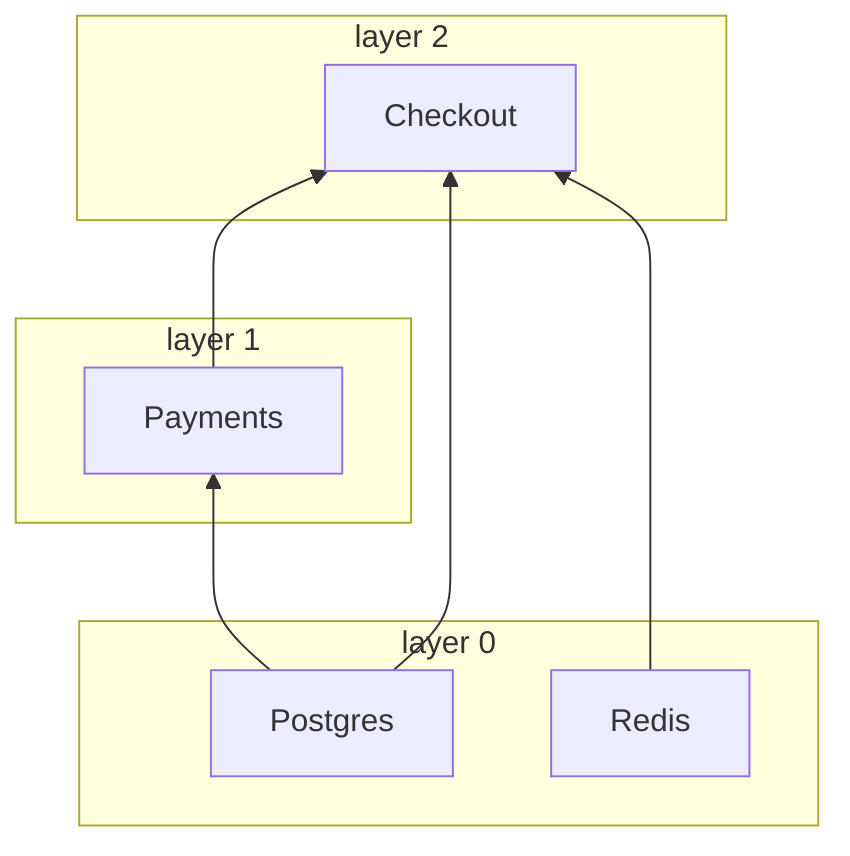

# <a id="clients"></a>Clientes

[English](../../guide/clients.md) · [Русский](../ru/clients.md) · [简体中文](../zh-CN/clients.md) · [Español](../es/clients.md) · **Português (Brasil)** · [日本語](../ja/clients.md) · [Polski](../pl/clients.md)

← [Documentação](../README.pt-BR.md#documentation)

## <a id="client-and-notsingletonclient"></a>Client e NotSingletonClient

Toda dependência é uma subclasse de uma destas duas classes base:

| Classe base          | Instâncias                                                  |
|----------------------|-------------------------------------------------------------|
| `Client`             | Singleton: uma instância por container                      |
| `NotSingletonClient` | Uma instância nova para cada consumidor que a declara       |

```python
from nuke_di import Client, Dependencies, NotSingletonClient


class Settings(Client):
    pass


class HttpSession(NotSingletonClient):
    pass


class Orders(Client):
    def __init__(self, settings: Settings, http: HttpSession) -> None:
        self.settings = settings
        self.http = http


class Payments(Client):
    def __init__(self, settings: Settings, http: HttpSession) -> None:
        self.settings = settings
        self.http = http


deps = Dependencies()
orders = deps.resolve(Orders)
payments = deps.resolve(Payments)

print(orders.settings is payments.settings)  # one Settings for the whole container
print(orders.http is payments.http)  # every consumer gets its own HttpSession
print(deps.resolve(Orders) is orders)  # resolve() is idempotent for a Client
```

```text
True
False
True
```

Um cliente declara as próprias dependências como argumentos anotados do `__init__`. Só são injetados
os argumentos anotados com um tipo de cliente, e a resolução é recursiva.

Um cliente vive tanto quanto o seu contêiner. Não existem clientes por requisição ou por mensagem,
nem existirão ([ADR-0006](../../adr/0006-clients-live-as-long-as-the-container.md)): uma transação ou qualquer coisa que dure uma requisição é aberta no
handler por meio de um método de um cliente. `NotSingletonClient` continua suportado, mas será
removido em uma futura versão major, então não construa código novo sobre ele.

## <a id="connect-and-disconnect"></a>connect() e disconnect()

Sobrescreva os métodos assíncronos `connect()` / `disconnect()` para abrir e liberar recursos, como
pools de conexões. O `__init__` apenas guarda as dependências; tudo o que faz I/O deve ficar
em `connect()`:

```python
class Redis(Client):
    def __init__(self) -> None:
        self._pool: Pool | None = None

    async def connect(self) -> None:
        self._pool = await create_pool()

    async def disconnect(self) -> None:
        if self._pool is not None:
            await self._pool.close()
            self._pool = None
```

Cada `connect()` é limitado por `CONNECT_TIMEOUT_SECONDS` (padrão `30`) e cada
`disconnect()` por `DISCONNECT_TIMEOUT_SECONDS` (padrão `10`). Um `disconnect()` que falha ou
trava é registrado no log, e os demais clientes são encerrados mesmo assim.

## <a id="dataclass-clients"></a>Clientes dataclass

`client_dataclass` transforma uma classe em `Client` e em dataclass ao mesmo tempo, de modo que os campos
passam a ser as dependências injetadas. Herde também de `Client`: o decorador é tipado como identidade,
então é a classe base que diz ao mypy e ao pyright que `Checkout` é um cliente; sem ela, a classe é um
cliente apenas em tempo de execução:

```python
from nuke_di import Client, Dependencies, client_dataclass


class Postgres(Client):
    pass


class Payments(Client):
    pass


@client_dataclass(frozen=True)
class Checkout(Client):
    pg: Postgres
    payments: Payments


checkout = Dependencies().resolve(Checkout)
print(checkout)
print(isinstance(checkout, Client))
```

```text
Checkout(pg=<__main__.Postgres object at 0x...>, payments=<__main__.Payments object at 0x...>)
True
```

Aceita os mesmos argumentos nomeados que `dataclasses.dataclass`.

## <a id="layers"></a>Camadas

Os clientes se conectam em paralelo, por camadas. Clientes sem dependências formam a camada 0;
todos os outros ficam uma camada acima da sua dependência mais alta. Uma camada só começa
depois que a anterior terminou de se conectar, então um cliente nunca se conecta antes das suas
próprias dependências. `disconnect()` percorre as camadas na ordem inversa.

```python
import asyncio
import logging

from nuke_di import Client, Dependencies

logging.basicConfig(level=logging.DEBUG, format="%(message)s")
logging.getLogger("asyncio").setLevel(logging.WARNING)  # keep only the nuke_di records


class Postgres(Client):
    async def connect(self) -> None:
        await asyncio.sleep(0.2)
        print("  postgres ready")


class Redis(Client):
    async def connect(self) -> None:
        await asyncio.sleep(0.1)
        print("  redis ready")


class Payments(Client):
    def __init__(self, pg: Postgres) -> None:
        self.pg = pg


class Checkout(Client):
    def __init__(self, pg: Postgres, redis: Redis, payments: Payments) -> None:
        self.pg, self.redis, self.payments = pg, redis, payments


async def main() -> None:
    deps = Dependencies()
    deps.resolve(Checkout)
    async with deps:
        print("-- application is running --")


asyncio.run(main())
```

O log `DEBUG` do logger `nuke_di` mostra as camadas:

```text
Resolving dependency "Checkout"
Resolving dependency "Postgres"
Resolving dependency "Redis"
Resolving dependency "Payments"
Connecting layer 0: Postgres, Redis
Connecting client Postgres
Connecting client Redis
  redis ready
Connected client Redis in 0.101s
  postgres ready
Connected client Postgres in 0.201s
Connecting layer 1: Payments
Connecting client Payments
Connected client Payments in 0.000s
Connecting layer 2: Checkout
Connecting client Checkout
Connected client Checkout in 0.000s
Connected 4 clients in 3 layers in 0.20s (slowest: Postgres 0.20s, Redis 0.10s, Payments 0.00s)
-- application is running --
Disconnecting client Checkout
Disconnected client Checkout in 0.000s
Disconnecting client Payments
Disconnected client Payments in 0.000s
Disconnecting client Postgres
Disconnected client Postgres in 0.000s
Disconnecting client Redis
Disconnected client Redis in 0.000s
```

```text
Checkout(pg, redis, payments)    layer 2
Payments(pg)                     layer 1
Postgres, Redis                  layer 0  <- connect together, in 0.2s rather than 0.3s
```

Só as dependências declaradas no `__init__` entram na ordenação. Se um cliente precisa que outro
já esteja conectado, declare-o como dependência. Defina `CONNECT_CONCURRENCY` para limitar quantos
clientes se conectam ao mesmo tempo.

## <a id="startup-timings"></a>Tempos de inicialização

O contêiner mede o `connect()` e o `disconnect()` de cada cliente, então uma inicialização
lenta aponta o culpado. Depois de um `connect()` bem-sucedido ele registra um resumo em
`INFO` e um `WARNING` para cada cliente que usou mais da metade de `CONNECT_TIMEOUT_SECONDS`,
bem antes de esse cliente começar a falhar por timeout:

```python
# startup.py
import asyncio
import logging

from nuke_di import Client, Dependencies, DependenciesSettings

logging.basicConfig(level=logging.INFO, format="%(levelname)s %(message)s")


class Postgres(Client):
    async def connect(self) -> None:
        await asyncio.sleep(0.2)


class Kafka(Client):
    async def connect(self) -> None:
        await asyncio.sleep(1.6)

    async def disconnect(self) -> None:
        await asyncio.sleep(0.3)


class Orders(Client):
    def __init__(self, pg: Postgres, kafka: Kafka) -> None:
        self.pg, self.kafka = pg, kafka


async def main() -> None:
    deps = Dependencies(settings=DependenciesSettings(connect_timeout=3))
    deps.resolve(Orders)
    async with deps:
        print("-- application is running --")

    for t in deps.timings:
        print(
            f"{t.name:<8} layer {t.layer}  connect {t.connect:.2f}s {t.connect_outcome:<3}  "
            f"disconnect {t.disconnect:.2f}s {t.disconnect_outcome}"
        )


asyncio.run(main())
```

```console
$ python startup.py
INFO Connected 3 clients in 2 layers in 1.60s (slowest: Kafka 1.60s, Postgres 0.20s, Orders 0.00s)
WARNING Client Kafka took 1.60s to connect, more than half of CONNECT_TIMEOUT_SECONDS (3s)
-- application is running --
Postgres layer 0  connect 0.20s ok   disconnect 0.00s ok
Kafka    layer 0  connect 1.60s ok   disconnect 0.30s ok
Orders   layer 1  connect 0.00s ok   disconnect 0.00s ok
```

`deps.timings` guarda um `ClientTiming` por cliente do último `connect()`, na ordem de
conexão. Ele sobrevive ao `disconnect()`, então pode ser lido depois que o contêiner parou.
Em um app FastAPI, o lifespan que você passa para `FastAPI()` roda dentro do contêiner
conectado, então ele vê os tempos de conexão. Um worker ou um job recebe a mesma lista em
[`Run.clients`](workers-and-jobs.md#startup-metrics-and-structured-logs).

| Campo de `ClientTiming` | Valor |
|-------------------------|-------|
| `name`               | O nome da classe do cliente |
| `layer`              | A [camada](#layers) do cliente |
| `connect`            | Segundos dentro de `connect()`, sem contar a espera por `CONNECT_CONCURRENCY`; `None` se `connect()` nunca rodou |
| `connect_outcome`    | `"ok"`, `"failed"`, `"timed_out"`, `"cancelled"`, ou `None` se `connect()` nunca começou |
| `disconnect`, `disconnect_outcome` | O mesmo para `disconnect()`; `None` até o cliente se desconectar |

Quando um cliente não consegue se conectar, os clientes da camada dele que ainda estão se
conectando ficam como `"cancelled"`, as camadas acima mantêm `None` e os clientes que já
tinham se conectado são revertidos, então recebem um `disconnect_outcome`. A biblioteca só
mede: exportar os tempos como métricas ou spans fica a cargo do seu código.

## <a id="the-graph"></a>O grafo

O grafo de dependências só existe dentro de um processo em execução: o log `DEBUG` acima é o único
lugar que mostra quais clientes um entrypoint puxa e em qual camada cada um se conecta. `graph()`
devolve a mesma imagem como dados, antes de `connect()` ou depois. Os clientes do exemplo de
[Camadas](#layers), sem o seu `connect()`:

```python
# graph.py
from nuke_di import Client, Dependencies


class Postgres(Client):
    pass


class Redis(Client):
    pass


class Payments(Client):
    def __init__(self, pg: Postgres) -> None:
        self.pg = pg


class Checkout(Client):
    def __init__(self, pg: Postgres, redis: Redis, payments: Payments) -> None:
        self.pg, self.redis, self.payments = pg, redis, payments


deps = Dependencies()
deps.resolve(Checkout)
nodes = {node.name: node for node in deps.graph().nodes}
for node in nodes.values():
    print(f"{node.name:<8} layer {node.layer}  needs {list(node.dependencies)}")
print("shared:", nodes["Checkout"].dependencies["pg"] is nodes["Payments"].dependencies["pg"])
print(deps.graph().to_mermaid())
```

```console
$ python graph.py
Postgres layer 0  needs []
Redis    layer 0  needs []
Payments layer 1  needs ['pg']
Checkout layer 2  needs ['pg', 'redis', 'payments']
shared: True
graph BT
  subgraph layer0 [layer 0]
    Postgres
    Redis
  end
  subgraph layer1 [layer 1]
    Payments
  end
  subgraph layer2 [layer 2]
    Checkout
  end
  Postgres --> Payments
  Postgres --> Checkout
  Redis --> Checkout
  Payments --> Checkout
```

O GitHub renderiza o texto Mermaid em um README, um pull request ou uma issue, então um projeto pode
mostrar sua arquitetura sem um processo em execução:



`Graph.nodes` guarda um `Node` por cliente resolvido, em ordem de resolução, então um cliente vem
depois das suas dependências. É um instantâneo: `flush()` o esvazia, exceto os Replacement dos blocos
`override()` abertos, que sobrevivem a todo `flush()`.

| Campo de `Node` | Valor |
|-----------------|-------|
| `name`          | O nome da classe do cliente |
| `cls`           | A classe que os consumidores pediram |
| `singleton`     | `True` para um `Client`, `False` para um `NotSingletonClient` |
| `layer`         | A [camada](#layers) do cliente; `None` para um Replacement, que nunca se conecta |
| `replacement`   | O objeto registrado com `mock()` ou `override()` no lugar de `cls`; `None` para um cliente real |
| `dependencies`  | Os clientes dos argumentos de `__init__`, por nome de argumento |

Um `NotSingletonClient` recebe um nó por instância, todos com o mesmo nome; `to_mermaid()` os numera
a partir do segundo (`Session`, `Session_2`). Um Replacement é desenhado fora das camadas com borda
tracejada e o nome do objeto no seu lugar: `Postgres: AsyncMock`. Os nós são comparados por identidade,
então o `shared: True` acima diz que `Checkout` e `Payments` receberam o mesmo `Postgres`.

## <a id="when-a-client-fails-to-connect"></a>Quando um cliente não consegue se conectar

Se um cliente não consegue se conectar, o restante da sua camada é cancelado e as camadas seguintes
nem começam. Os clientes que já estavam conectados são desconectados, camada por camada na ordem inversa, e o
container fica desconectado e vazio:

```python
import asyncio

from nuke_di import Client, ConnectError, Dependencies


class Postgres(Client):
    async def connect(self) -> None:
        print("postgres: connected")

    async def disconnect(self) -> None:
        print("postgres: disconnected")


class Kafka(Client):
    async def connect(self) -> None:
        raise OSError("broker kafka-1:9092 is unreachable")


class Orders(Client):
    def __init__(self, pg: Postgres, kafka: Kafka) -> None:
        self.pg, self.kafka = pg, kafka


async def main() -> None:
    deps = Dependencies()
    deps.resolve(Orders)
    try:
        await deps.connect()
    except ConnectError as exc:
        print(f"{exc} <- {exc.__cause__!r}")
    print("connected:", deps.connected)


asyncio.run(main())
```

```text
postgres: connected
Kafka.connect() raised OSError: broker kafka-1:9092 is unreachable
Traceback (most recent call last):
  ...
OSError: broker kafka-1:9092 is unreachable
postgres: disconnected
Kafka.connect() raised OSError: broker kafka-1:9092 is unreachable <- OSError('broker kafka-1:9092 is unreachable')
connected: False
```

A mesma limpeza acontece quando o próprio `connect()` é cancelado. `ConnectError` herda de
`SystemExit`, então uma aplicação que não a captura é encerrada, o que geralmente é o desejado
quando uma dependência está fora do ar. Clientes mockados não são conectados e não afetam as camadas.

## <a id="when-the-tree-cannot-be-built"></a>Quando a árvore não pode ser construída

A resolução verifica cada `__init__` antes de chamá-lo, então um cliente que não pode ser construído falha
antes de qualquer conexão, com o nome do argumento e o caminho a partir do cliente que você pediu:

```python
from typing import Protocol

from nuke_di import Client, Dependencies, InvalidSignatureError


class Postgres(Client):
    pass


class UserRepository(Protocol):
    async def get(self, user_id: int) -> str: ...


class Profiles(Client):
    def __init__(self, pg: Postgres, users: UserRepository) -> None:
        self.pg, self.users = pg, users


class Checkout(Client):
    def __init__(self, profiles: Profiles) -> None:
        self.profiles = profiles


class Orders(Client):
    def __init__(self, payments: "Payments") -> None:
        self.payments = payments


class Payments(Client):
    def __init__(self, orders: Orders) -> None:
        self.orders = orders


for root in (Checkout, Orders):
    try:
        Dependencies().resolve(root)
    except InvalidSignatureError as exc:
        print(f"{type(exc).__name__}: {exc}")

try:
    Dependencies().resolve(UserRepository)  # a type checker refuses this line, and so does the container
except InvalidSignatureError as exc:
    print(f"{type(exc).__name__}: {exc}")
```

```text
InvalidSignatureError: Argument "users" of "Profiles.__init__" is UserRepository, which is not a client (resolving Checkout -> Profiles)
CircularDependencyError: Circular dependency: Orders -> Payments -> Orders
InvalidSignatureError: UserRepository is not a client: subclass Client or NotSingletonClient
```

Um argumento do `__init__` recebe um cliente quando o seu type hint é um cliente. Qualquer outro
argumento precisa de um valor padrão, que é mantido como está. Estes casos falham com `InvalidSignatureError`:

| Argumento do `__init__` sem valor padrão | Mensagem                                          |
|------------------------------------------|---------------------------------------------------|
| sem type hint                            | `has no type hint`                                |
| um tipo que não é cliente                | `is UserRepository, which is not a client`        |
| `Client \| None`                         | `is Postgres \| None, a client cannot be optional` |
| um cliente, positional-only (`/`)        | `is positional-only, a client is passed by keyword` |

Uma classe que não é cliente de forma alguma, pedida com `resolve()`, falha com `UserRepository is not a client: subclass Client or NotSingletonClient` antes que qualquer coisa seja construída.

Clientes que dependem uns dos outros em ciclo falham com `CircularDependencyError`, uma subclasse de
`InvalidSignatureError`, e um type hint que não pode ser avaliado, por exemplo uma classe definida dentro de uma
função ou importada sob `TYPE_CHECKING`, falha com um `InvalidSignatureError` que explica isso. Quando o
erro vem de `inject()`, o caminho começa na função:
`(resolving handler -> Checkout -> Profiles)`. Em um [worker ou job](workers-and-jobs.md),
qualquer um desses erros faz a execução falhar com código de saída `1` antes de qualquer conexão.
