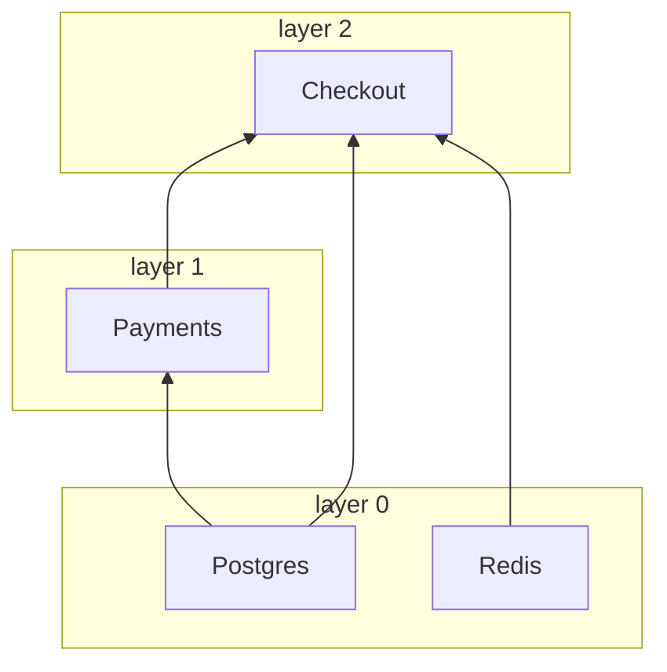

# <a id="clients"></a>Клиенты

[English](../../guide/clients.md) · **Русский** · [简体中文](../zh-CN/clients.md) · [Español](../es/clients.md) · [Português (Brasil)](../pt-BR/clients.md) · [日本語](../ja/clients.md) · [Polski](../pl/clients.md)

← [Документация](../README.ru.md#documentation)

## <a id="client-and-notsingletonclient"></a>Client и NotSingletonClient

Каждая зависимость — подкласс одного из двух базовых классов:

| Базовый класс        | Экземпляры                                                     |
|----------------------|----------------------------------------------------------------|
| `Client`             | Синглтон: один экземпляр на контейнер                          |
| `NotSingletonClient` | Новый экземпляр для каждого потребителя, который его объявляет |

```python
from nuke_di import Client, Dependencies, NotSingletonClient


class Settings(Client):
    pass


class HttpSession(NotSingletonClient):
    pass


class Orders(Client):
    def __init__(self, settings: Settings, http: HttpSession) -> None:
        self.settings = settings
        self.http = http


class Payments(Client):
    def __init__(self, settings: Settings, http: HttpSession) -> None:
        self.settings = settings
        self.http = http


deps = Dependencies()
orders = deps.resolve(Orders)
payments = deps.resolve(Payments)

print(orders.settings is payments.settings)  # one Settings for the whole container
print(orders.http is payments.http)  # every consumer gets its own HttpSession
print(deps.resolve(Orders) is orders)  # resolve() is idempotent for a Client
```

```text
True
False
True
```

Клиент объявляет свои зависимости как аннотированные аргументы `__init__`. Внедряются только
аргументы, аннотированные типом клиента, и разрешение идёт рекурсивно.

## <a id="connect-and-disconnect"></a>connect() и disconnect()

Переопределите асинхронные методы `connect()` / `disconnect()`, чтобы открывать и освобождать
ресурсы, например пулы соединений. `__init__` только сохраняет зависимости; всё, что выполняет
I/O, место в `connect()`:

```python
class Redis(Client):
    def __init__(self) -> None:
        self._pool: Pool | None = None

    async def connect(self) -> None:
        self._pool = await create_pool()

    async def disconnect(self) -> None:
        if self._pool is not None:
            await self._pool.close()
            self._pool = None
```

Время каждого `connect()` ограничено `CONNECT_TIMEOUT_SECONDS` (по умолчанию `30`), а каждого
`disconnect()` — `DISCONNECT_TIMEOUT_SECONDS` (по умолчанию `10`). Упавший или зависший
`disconnect()` попадает в лог, а остальные клиенты всё равно отключаются.

## <a id="dataclass-clients"></a>Клиенты-датаклассы

`client_dataclass` делает класс одновременно `Client` и датаклассом, так что его поля
становятся внедряемыми зависимостями. Наследуйте и от `Client`: декоратор типизирован как
тождественный, и именно базовый класс сообщает mypy и pyright, что `Checkout` — клиент; без него
класс является клиентом только во время выполнения:

```python
from nuke_di import Client, Dependencies, client_dataclass


class Postgres(Client):
    pass


class Payments(Client):
    pass


@client_dataclass(frozen=True)
class Checkout(Client):
    pg: Postgres
    payments: Payments


checkout = Dependencies().resolve(Checkout)
print(checkout)
print(isinstance(checkout, Client))
```

```text
Checkout(pg=<__main__.Postgres object at 0x...>, payments=<__main__.Payments object at 0x...>)
True
```

Он принимает те же именованные аргументы, что и `dataclasses.dataclass`.

## <a id="layers"></a>Слои

Клиенты подключаются конкурентно, по слоям. Клиенты без зависимостей образуют слой 0;
любой другой клиент находится на один слой выше своей самой высокой зависимости. Слой начинает
подключаться только после того, как подключился предыдущий, поэтому клиент никогда не подключается
раньше собственных зависимостей. `disconnect()` проходит слои в обратном порядке.

```python
import asyncio
import logging

from nuke_di import Client, Dependencies

logging.basicConfig(level=logging.DEBUG, format="%(message)s")
logging.getLogger("asyncio").setLevel(logging.WARNING)  # keep only the nuke_di records


class Postgres(Client):
    async def connect(self) -> None:
        await asyncio.sleep(0.2)
        print("  postgres ready")


class Redis(Client):
    async def connect(self) -> None:
        await asyncio.sleep(0.1)
        print("  redis ready")


class Payments(Client):
    def __init__(self, pg: Postgres) -> None:
        self.pg = pg


class Checkout(Client):
    def __init__(self, pg: Postgres, redis: Redis, payments: Payments) -> None:
        self.pg, self.redis, self.payments = pg, redis, payments


async def main() -> None:
    deps = Dependencies()
    deps.resolve(Checkout)
    async with deps:
        print("-- application is running --")


asyncio.run(main())
```

Слои видны в `DEBUG`-логе логгера `nuke_di`:

```text
Resolving dependency "Checkout"
Resolving dependency "Postgres"
Resolving dependency "Redis"
Resolving dependency "Payments"
Connecting layer 0: Postgres, Redis
Connecting client Postgres
Connecting client Redis
  redis ready
Connected client Redis in 0.101s
  postgres ready
Connected client Postgres in 0.201s
Connecting layer 1: Payments
Connecting client Payments
Connected client Payments in 0.000s
Connecting layer 2: Checkout
Connecting client Checkout
Connected client Checkout in 0.000s
Connected 4 clients in 3 layers in 0.20s (slowest: Postgres 0.20s, Redis 0.10s, Payments 0.00s)
-- application is running --
Disconnecting client Checkout
Disconnected client Checkout in 0.000s
Disconnecting client Payments
Disconnected client Payments in 0.000s
Disconnecting client Postgres
Disconnected client Postgres in 0.000s
Disconnecting client Redis
Disconnected client Redis in 0.000s
```

```text
Checkout(pg, redis, payments)    layer 2
Payments(pg)                     layer 1
Postgres, Redis                  layer 0  <- connect together, in 0.2s rather than 0.3s
```

Упорядочиваются только зависимости, объявленные в `__init__`. Если клиенту нужно, чтобы другой
клиент подключился раньше, объявите его зависимостью. Чтобы ограничить число клиентов,
подключающихся одновременно, задайте `CONNECT_CONCURRENCY`.

## <a id="startup-timings"></a>Время старта

Контейнер замеряет `connect()` и `disconnect()` каждого клиента, так что медленный старт
сам называет виновника. После успешного `connect()` он пишет сводку на уровне `INFO` и
`WARNING` для каждого клиента, который потратил больше половины `CONNECT_TIMEOUT_SECONDS`,
задолго до того, как этот клиент начнёт падать по таймауту:

```python
# startup.py
import asyncio
import logging

from nuke_di import Client, Dependencies, DependenciesSettings

logging.basicConfig(level=logging.INFO, format="%(levelname)s %(message)s")


class Postgres(Client):
    async def connect(self) -> None:
        await asyncio.sleep(0.2)


class Kafka(Client):
    async def connect(self) -> None:
        await asyncio.sleep(1.6)

    async def disconnect(self) -> None:
        await asyncio.sleep(0.3)


class Orders(Client):
    def __init__(self, pg: Postgres, kafka: Kafka) -> None:
        self.pg, self.kafka = pg, kafka


async def main() -> None:
    deps = Dependencies(settings=DependenciesSettings(connect_timeout=3))
    deps.resolve(Orders)
    async with deps:
        print("-- application is running --")

    for t in deps.timings:
        print(
            f"{t.name:<8} layer {t.layer}  connect {t.connect:.2f}s {t.connect_outcome:<3}  "
            f"disconnect {t.disconnect:.2f}s {t.disconnect_outcome}"
        )


asyncio.run(main())
```

```console
$ python startup.py
INFO Connected 3 clients in 2 layers in 1.60s (slowest: Kafka 1.60s, Postgres 0.20s, Orders 0.00s)
WARNING Client Kafka took 1.60s to connect, more than half of CONNECT_TIMEOUT_SECONDS (3s)
-- application is running --
Postgres layer 0  connect 0.20s ok   disconnect 0.00s ok
Kafka    layer 0  connect 1.60s ok   disconnect 0.30s ok
Orders   layer 1  connect 0.00s ok   disconnect 0.00s ok
```

`deps.timings` хранит по одному `ClientTiming` на каждый клиент последнего `connect()`, в
порядке подключения. Список переживает `disconnect()`, поэтому его можно прочитать после
остановки контейнера. В приложении FastAPI lifespan, переданный в `FastAPI()`, работает внутри
подключённого контейнера и видит тайминги подключения. Воркер или джоба получают тот же
список в [`Run.clients`](workers-and-jobs.md#startup-metrics-and-structured-logs).

| Поле `ClientTiming`  | Значение |
|----------------------|----------|
| `name`               | Имя класса клиента |
| `layer`              | [Слой](#layers) клиента |
| `connect`            | Секунды внутри `connect()` без ожидания `CONNECT_CONCURRENCY`; `None`, если `connect()` не запускался |
| `connect_outcome`    | `"ok"`, `"failed"`, `"timed_out"`, `"cancelled"` или `None`, если `connect()` не начинался |
| `disconnect`, `disconnect_outcome` | То же для `disconnect()`; `None`, пока клиент не отключился |

Когда клиент не может подключиться, клиенты его слоя, которые ещё подключаются, получают
`"cancelled"`, слои выше остаются с `None`, а уже подключённые клиенты откатываются и
получают `disconnect_outcome`. Библиотека только замеряет: экспорт таймингов в метрики
или спаны остаётся за вашим кодом.

## <a id="the-graph"></a>Граф

Граф зависимостей существует только внутри работающего процесса: лог `DEBUG` выше — единственное
место, где видно, каких клиентов тянет entrypoint и в каком слое каждый из них подключается.
`graph()` возвращает ту же картину данными, до `connect()` или после него. Клиенты из примера про
[слои](#layers), без их `connect()`:

```python
# graph.py
from nuke_di import Client, Dependencies


class Postgres(Client):
    pass


class Redis(Client):
    pass


class Payments(Client):
    def __init__(self, pg: Postgres) -> None:
        self.pg = pg


class Checkout(Client):
    def __init__(self, pg: Postgres, redis: Redis, payments: Payments) -> None:
        self.pg, self.redis, self.payments = pg, redis, payments


deps = Dependencies()
deps.resolve(Checkout)
nodes = {node.name: node for node in deps.graph().nodes}
for node in nodes.values():
    print(f"{node.name:<8} layer {node.layer}  needs {list(node.dependencies)}")
print("shared:", nodes["Checkout"].dependencies["pg"] is nodes["Payments"].dependencies["pg"])
print(deps.graph().to_mermaid())
```

```console
$ python graph.py
Postgres layer 0  needs []
Redis    layer 0  needs []
Payments layer 1  needs ['pg']
Checkout layer 2  needs ['pg', 'redis', 'payments']
shared: True
graph BT
  subgraph layer0 [layer 0]
    Postgres
    Redis
  end
  subgraph layer1 [layer 1]
    Payments
  end
  subgraph layer2 [layer 2]
    Checkout
  end
  Postgres --> Payments
  Postgres --> Checkout
  Redis --> Checkout
  Payments --> Checkout
```

GitHub рисует текст Mermaid в README, pull request или issue, так что проект может показать
свою архитектуру без запущенного процесса:



`Graph.nodes` хранит по одному `Node` на разрешённый клиент в порядке разрешения, поэтому клиент
идёт после своих зависимостей. Это снимок: `flush()` опустошает его, кроме Replacement-ов открытых
блоков `override()`, которые переживают любой `flush()`.

| Поле `Node`    | Значение |
|----------------|----------|
| `name`         | Имя класса клиента |
| `cls`          | Класс, который запросили потребители |
| `singleton`    | `True` для `Client`, `False` для `NotSingletonClient` |
| `layer`        | [Слой](#layers) клиента; `None` для Replacement, который никогда не подключается |
| `replacement`  | Объект, зарегистрированный через `mock()` или `override()` вместо `cls`; `None` для настоящего клиента |
| `dependencies` | Клиенты аргументов `__init__` по имени аргумента |

`NotSingletonClient` получает по узлу на экземпляр, все с одним именем; `to_mermaid()` нумерует их
со второго (`Session`, `Session_2`). Replacement рисуется вне слоёв, с пунктирной рамкой и именем
объекта на его месте: `Postgres: AsyncMock`. Узлы сравниваются по идентичности, поэтому
`shared: True` выше говорит, что `Checkout` и `Payments` получили один и тот же `Postgres`.

## <a id="when-a-client-fails-to-connect"></a>Если клиент не смог подключиться

Если клиент не смог подключиться, остальная часть его слоя отменяется, а следующие слои так и не
стартуют. Уже подключённые клиенты отключаются, слои — в обратном порядке, и контейнер остаётся
отключённым и пустым:

```python
import asyncio

from nuke_di import Client, ConnectError, Dependencies


class Postgres(Client):
    async def connect(self) -> None:
        print("postgres: connected")

    async def disconnect(self) -> None:
        print("postgres: disconnected")


class Kafka(Client):
    async def connect(self) -> None:
        raise OSError("broker kafka-1:9092 is unreachable")


class Orders(Client):
    def __init__(self, pg: Postgres, kafka: Kafka) -> None:
        self.pg, self.kafka = pg, kafka


async def main() -> None:
    deps = Dependencies()
    deps.resolve(Orders)
    try:
        await deps.connect()
    except ConnectError as exc:
        print(f"{exc} <- {exc.__cause__!r}")
    print("connected:", deps.connected)


asyncio.run(main())
```

```text
postgres: connected
Kafka.connect() raised OSError: broker kafka-1:9092 is unreachable
Traceback (most recent call last):
  ...
OSError: broker kafka-1:9092 is unreachable
postgres: disconnected
Kafka.connect() raised OSError: broker kafka-1:9092 is unreachable <- OSError('broker kafka-1:9092 is unreachable')
connected: False
```

Та же очистка происходит, если отменён сам `connect()`. `ConnectError` наследуется от
`SystemExit`, поэтому приложение, которое его не перехватывает, останавливается — обычно именно это
и нужно, когда зависимость недоступна. Замоканные клиенты не подключаются и не влияют на слои.

## <a id="when-the-tree-cannot-be-built"></a>Если дерево не удаётся построить

Разрешение проверяет каждый `__init__` до его вызова, поэтому клиент, который невозможно построить,
падает ещё до того, как что-либо подключится, — с именем аргумента и путём от запрошенного клиента:

```python
from typing import Protocol

from nuke_di import Client, Dependencies, InvalidSignatureError


class Postgres(Client):
    pass


class UserRepository(Protocol):
    async def get(self, user_id: int) -> str: ...


class Profiles(Client):
    def __init__(self, pg: Postgres, users: UserRepository) -> None:
        self.pg, self.users = pg, users


class Checkout(Client):
    def __init__(self, profiles: Profiles) -> None:
        self.profiles = profiles


class Orders(Client):
    def __init__(self, payments: "Payments") -> None:
        self.payments = payments


class Payments(Client):
    def __init__(self, orders: Orders) -> None:
        self.orders = orders


for root in (Checkout, Orders):
    try:
        Dependencies().resolve(root)
    except InvalidSignatureError as exc:
        print(f"{type(exc).__name__}: {exc}")

try:
    Dependencies().resolve(UserRepository)  # a type checker refuses this line, and so does the container
except InvalidSignatureError as exc:
    print(f"{type(exc).__name__}: {exc}")
```

```text
InvalidSignatureError: Argument "users" of "Profiles.__init__" is UserRepository, which is not a client (resolving Checkout -> Profiles)
CircularDependencyError: Circular dependency: Orders -> Payments -> Orders
InvalidSignatureError: UserRepository is not a client: subclass Client or NotSingletonClient
```

Аргумент `__init__` заполняется клиентом, если его аннотация типа — клиент. Любому другому
аргументу нужно значение по умолчанию, и его не трогают. С `InvalidSignatureError` падают:

| Аргумент `__init__` без значения по умолчанию | Сообщение                                         |
|-----------------------------------------------|---------------------------------------------------|
| без аннотации типа                            | `has no type hint`                                |
| тип, который не является клиентом             | `is UserRepository, which is not a client`        |
| `Client \| None`                              | `is Postgres \| None, a client cannot be optional` |
| клиент, только позиционный (`/`)              | `is positional-only, a client is passed by keyword` |

Класс, который вообще не является клиентом, запрошенный через `resolve()`, падает с `UserRepository is not a client: subclass Client or NotSingletonClient` до того, как что-либо будет построено.

Клиенты, циклически зависящие друг от друга, падают с `CircularDependencyError` — подклассом
`InvalidSignatureError`, а аннотация типа, которую не удаётся вычислить (например, класс, определённый
внутри функции или импортированный под `TYPE_CHECKING`), — с `InvalidSignatureError`, где об этом
прямо сказано. Если ошибка пришла из `inject()`, путь начинается с функции:
`(resolving handler -> Checkout -> Profiles)`. В [воркере или джобе](workers-and-jobs.md)
любая из этих ошибок завершает запуск с кодом `1` ещё до подключения.
