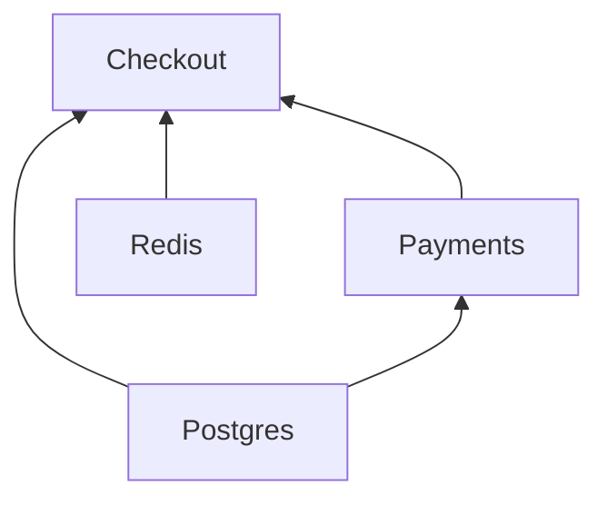

# <a id="clients"></a>客户端

[English](../../guide/clients.md) · [Русский](../ru/clients.md) · **简体中文** · [Español](../es/clients.md) · [Português (Brasil)](../pt-BR/clients.md) · [日本語](../ja/clients.md) · [Polski](../pl/clients.md)

← [文档](../README.zh-CN.md#documentation)

## <a id="client-and-notsingletonclient"></a>Client 与 NotSingletonClient

每个依赖都是以下两个基类之一的子类：

| 基类                 | 实例                                               |
|----------------------|----------------------------------------------------|
| `Client`             | 单例：每个容器一个实例                             |
| `NotSingletonClient` | 每个声明它的使用方都会得到一个新实例               |

```python
from nuke_di import Client, Dependencies, NotSingletonClient


class Settings(Client):
    pass


class HttpSession(NotSingletonClient):
    pass


class Orders(Client):
    def __init__(self, settings: Settings, http: HttpSession) -> None:
        self.settings = settings
        self.http = http


class Payments(Client):
    def __init__(self, settings: Settings, http: HttpSession) -> None:
        self.settings = settings
        self.http = http


deps = Dependencies()
orders = deps.resolve(Orders)
payments = deps.resolve(Payments)

print(orders.settings is payments.settings)  # one Settings for the whole container
print(orders.http is payments.http)  # every consumer gets its own HttpSession
print(deps.resolve(Orders) is orders)  # resolve() is idempotent for a Client
```

```text
True
False
True
```

客户端通过带注解的 `__init__` 参数声明自己的依赖。只有注解为客户端类型的参数才会被注入，
并且解析是递归进行的。

客户端的生命周期与其容器相同。没有按请求或按消息创建的客户端，今后也不会有
（[ADR-0006](../../adr/0006-clients-live-as-long-as-the-container.md)）：事务以及其他只存在于一次请求内的东西，由处理函数通过客户端的方法打开。
`NotSingletonClient` 目前仍受支持，但会在未来的某个主版本中移除，新代码不要建立在它之上。

## <a id="connect-and-disconnect"></a>connect() 与 disconnect()

重写异步方法 `connect()` / `disconnect()`，用来打开和释放连接池之类的资源。`__init__`
只负责保存依赖，任何涉及 I/O 的操作都应放在 `connect()` 中：

```python
class Redis(Client):
    def __init__(self) -> None:
        self._pool: Pool | None = None

    async def connect(self) -> None:
        self._pool = await create_pool()

    async def disconnect(self) -> None:
        if self._pool is not None:
            await self._pool.close()
            self._pool = None
```

每次 `connect()` 受 `CONNECT_TIMEOUT_SECONDS`（默认 `30`）限制，每次 `disconnect()` 受
`DISCONNECT_TIMEOUT_SECONDS`（默认 `10`）限制。失败或卡住的 `disconnect()` 会被记录到日志，
其他客户端仍会照常关闭。

## <a id="dataclass-clients"></a>dataclass 客户端

`client_dataclass` 把一个类同时变成 `Client` 和 dataclass，于是它的字段就成了被注入的依赖。同时也要继承 `Client`：装饰器的类型是恒等的，所以让 mypy 和 pyright 知道 `Checkout` 是客户端的正是这个基类；没有它，这个类只在运行时才是客户端：

```python
from nuke_di import Client, Dependencies, client_dataclass


class Postgres(Client):
    pass


class Payments(Client):
    pass


@client_dataclass(frozen=True)
class Checkout(Client):
    pg: Postgres
    payments: Payments


checkout = Dependencies().resolve(Checkout)
print(checkout)
print(isinstance(checkout, Client))
```

```text
Checkout(pg=<__main__.Postgres object at 0x...>, payments=<__main__.Payments object at 0x...>)
True
```

它接受与 `dataclasses.dataclass` 相同的关键字参数。

## <a id="connect-order"></a>连接顺序

客户端在自己的依赖连接完成后立即连接，与其他所有已就绪的客户端并发进行，因此一个慢的客户端只会拖住
需要它的那些客户端。`disconnect()` 方向相反：依赖某个客户端的那些客户端断开后，它立即断开。

```python
# connect_order.py
import asyncio
import logging
import time

from nuke_di import Client, Dependencies

logging.basicConfig(level=logging.INFO, format="%(levelname)s %(message)s")
started = time.perf_counter()


async def connecting(name: str, seconds: float) -> None:
    await asyncio.sleep(seconds)  # a real client opens its connection here
    print(f"{time.perf_counter() - started:.2f}s  {name} connected")


class Postgres(Client):
    async def connect(self) -> None:
        await connecting("Postgres", 0.3)


class Kafka(Client):
    async def connect(self) -> None:
        await connecting("Kafka", 0.05)


class Redis(Client):
    async def connect(self) -> None:
        await connecting("Redis", 0.05)


class Repository(Client):
    def __init__(self, pg: Postgres) -> None:
        self.pg = pg


class Consumer(Client):
    def __init__(self, kafka: Kafka) -> None:
        self.kafka = kafka

    async def connect(self) -> None:
        await connecting("Consumer", 0.3)


class Http(Client):
    def __init__(self, redis: Redis) -> None:
        self.redis = redis

    async def connect(self) -> None:
        await connecting("Http", 0.2)


class App(Client):
    def __init__(self, repository: Repository, consumer: Consumer, http: Http) -> None:
        self.repository, self.consumer, self.http = repository, consumer, http


async def main() -> None:
    deps = Dependencies()
    deps.resolve(App)
    async with deps:
        print("-- application is running --")


asyncio.run(main())
```

```console
$ python connect_order.py
0.05s  Kafka connected
0.05s  Redis connected
0.25s  Http connected
0.30s  Postgres connected
0.35s  Consumer connected
INFO Connected 7 clients in 0.35s (slowest: Postgres 0.30s, Consumer 0.30s, Http 0.20s)
-- application is running --
```

`Consumer` 只需要 `Kafka`，所以它在 0.05s 就开始连接，此时 `Postgres` 还在连接中；
整个启动耗时等于最长的那条依赖链 `Kafka` → `Consumer`。在 1.12 及之前的版本中，客户端按层连接，
每个客户端都要等待下面那一层中最慢的客户端，在这里需要 0.60s；而在 1.0 中按解析顺序逐个连接，需要 0.90s：


开启 `DEBUG` 后，`nuke_di` logger 会在每个客户端开始和完成时记下它的名字，以及目前已连接的数量：
`Connecting client Consumer (2/7 connected)`，`disconnect()` 也是如此。

只有在 `__init__` 中声明的依赖才参与排序。如果某个客户端需要另一个客户端先连接好，就把它声明为依赖。
设置 `CONNECT_CONCURRENCY` 可以限制同时连接的客户端数量；正在等待依赖的客户端不占用名额。

## <a id="startup-timings"></a>启动耗时

容器会测量每个客户端的 `connect()` 和 `disconnect()`，因此启动变慢时能直接找到原因。
`connect()` 成功后，它会以 `INFO` 级别输出一条汇总；对于耗时超过 `CONNECT_TIMEOUT_SECONDS`
一半的客户端，还会输出一条 `WARNING`，远在该客户端开始因超时而失败之前：

```python
# startup.py
import asyncio
import logging

from nuke_di import Client, Dependencies, DependenciesSettings

logging.basicConfig(level=logging.INFO, format="%(levelname)s %(message)s")


class Postgres(Client):
    async def connect(self) -> None:
        await asyncio.sleep(0.2)


class Kafka(Client):
    async def connect(self) -> None:
        await asyncio.sleep(1.6)

    async def disconnect(self) -> None:
        await asyncio.sleep(0.3)


class Orders(Client):
    def __init__(self, pg: Postgres, kafka: Kafka) -> None:
        self.pg, self.kafka = pg, kafka


async def main() -> None:
    deps = Dependencies(settings=DependenciesSettings(connect_timeout=3))
    deps.resolve(Orders)
    async with deps:
        print("-- application is running --")

    for t in deps.timings:
        print(
            f"{t.name:<8} connect {t.connect:.2f}s {t.connect_outcome:<3}  "
            f"disconnect {t.disconnect:.2f}s {t.disconnect_outcome}"
        )


asyncio.run(main())
```

```console
$ python startup.py
INFO Connected 3 clients in 1.60s (slowest: Kafka 1.60s, Postgres 0.20s, Orders 0.00s)
WARNING Client Kafka took 1.60s to connect, more than half of CONNECT_TIMEOUT_SECONDS (3s)
-- application is running --
Postgres connect 0.20s ok   disconnect 0.00s ok
Kafka    connect 1.60s ok   disconnect 0.30s ok
Orders   connect 0.00s ok   disconnect 0.00s ok
```

`deps.timings` 按解析顺序为最近一次 `connect()` 的每个客户端保存一个 `ClientTiming`，
因此客户端总是排在它的依赖之后。
它在 `disconnect()` 之后依然保留，因此可以在容器停止后读取。在 FastAPI 应用中，传给 `FastAPI()`
的 lifespan 运行在已连接的容器内部，因此能看到连接耗时。
worker 或 job 会在 [`Run.clients`](workers-and-jobs.md#startup-metrics-and-structured-logs) 中得到同一个列表。

| `ClientTiming` 字段  | 值 |
|----------------------|----|
| `name`               | 客户端的类名 |
| `connect`            | 在 `connect()` 中花费的秒数，不含等待 `CONNECT_CONCURRENCY` 的时间；`connect()` 从未运行时为 `None` |
| `connect_outcome`    | `"ok"`、`"failed"`、`"timed_out"`、`"cancelled"`；`connect()` 从未开始时为 `None` |
| `disconnect`、`disconnect_outcome` | `disconnect()` 的对应值；客户端断开之前为 `None` |

当某个客户端连接失败时，仍在连接的客户端为 `"cancelled"`，仍在等待依赖的客户端保持 `None`，
已经连接的客户端会被回滚，因此会得到 `disconnect_outcome`。库只负责测量：把耗时导出为
指标或 span 由你的代码完成。

## <a id="the-graph"></a>依赖图

依赖图只存在于运行中的进程里：`DEBUG` 日志是唯一能看到一个入口点拉入哪些客户端、
每个客户端在等待什么的地方。`graph()` 把同一幅图作为数据返回，在 `connect()` 之前或之后都可以：

```python
# graph.py
from nuke_di import Client, Dependencies


class Postgres(Client):
    pass


class Redis(Client):
    pass


class Payments(Client):
    def __init__(self, pg: Postgres) -> None:
        self.pg = pg


class Checkout(Client):
    def __init__(self, pg: Postgres, redis: Redis, payments: Payments) -> None:
        self.pg, self.redis, self.payments = pg, redis, payments


deps = Dependencies()
deps.resolve(Checkout)
nodes = {node.name: node for node in deps.graph().nodes}
for node in nodes.values():
    print(f"{node.name:<8} needs {list(node.dependencies)}")
print("shared:", nodes["Checkout"].dependencies["pg"] is nodes["Payments"].dependencies["pg"])
print(deps.graph().to_mermaid())
```

```console
$ python graph.py
Postgres needs []
Redis    needs []
Payments needs ['pg']
Checkout needs ['pg', 'redis', 'payments']
shared: True
graph BT
  Postgres
  Redis
  Payments
  Checkout
  Postgres --> Payments
  Postgres --> Checkout
  Redis --> Checkout
  Payments --> Checkout
```

GitHub 会在 README、pull request 或 issue 中渲染 Mermaid 文本，所以项目无需运行进程就能展示自己的架构：



`Graph.nodes` 为每个已解析的客户端保存一个 `Node`，按解析顺序排列，因此客户端排在它的依赖之后。
它是一个快照：`flush()` 会清空它，但仍然打开的 `override()` 块的 Replacement 会留下，它们经得起任何一次 `flush()`。

| `Node` 字段    | 值 |
|----------------|----|
| `name`         | 客户端的类名 |
| `cls`          | 使用方请求的类 |
| `singleton`    | `Client` 为 `True`，`NotSingletonClient` 为 `False` |
| `replacement`  | 通过 `mock()` 或 `override()` 注册、代替 `cls` 的对象；真实客户端为 `None` |
| `dependencies` | `__init__` 各参数对应的客户端，按参数名索引 |

`NotSingletonClient` 的每个实例各占一个节点，名字相同；`to_mermaid()` 从第二个开始编号
（`Session`、`Session_2`）。Replacement 带虚线边框，并标出代替它的对象名：`Postgres: AsyncMock`。
节点按标识比较，因此上面的 `shared: True` 说明 `Checkout` 和 `Payments` 拿到的是同一个 `Postgres`。

## <a id="when-a-client-fails-to-connect"></a>客户端连接失败时

如果某个客户端连接失败，所有仍在连接的客户端都会被取消，等待它的客户端也不会启动。已经连接的客户端会断开连接，
每个都在依赖它的客户端之后断开，
容器最终处于未连接且为空的状态：

```python
import asyncio

from nuke_di import Client, ConnectError, Dependencies


class Postgres(Client):
    async def connect(self) -> None:
        print("postgres: connected")

    async def disconnect(self) -> None:
        print("postgres: disconnected")


class Kafka(Client):
    async def connect(self) -> None:
        raise OSError("broker kafka-1:9092 is unreachable")


class Orders(Client):
    def __init__(self, pg: Postgres, kafka: Kafka) -> None:
        self.pg, self.kafka = pg, kafka


async def main() -> None:
    deps = Dependencies()
    deps.resolve(Orders)
    try:
        await deps.connect()
    except ConnectError as exc:
        print(f"{exc} <- {exc.__cause__!r}")
    print("connected:", deps.connected)


asyncio.run(main())
```

```text
postgres: connected
Kafka.connect() raised OSError: broker kafka-1:9092 is unreachable
Traceback (most recent call last):
  ...
OSError: broker kafka-1:9092 is unreachable
postgres: disconnected
Kafka.connect() raised OSError: broker kafka-1:9092 is unreachable <- OSError('broker kafka-1:9092 is unreachable')
connected: False
```

`connect()` 本身被取消时也会执行同样的清理。`ConnectError` 继承自 `SystemExit`，因此不捕获它的应用会直接停止——
当某个依赖不可用时，这通常正是你想要的。被 mock 的客户端不会被连接，也没有客户端等待它们。

## <a id="when-the-tree-cannot-be-built"></a>依赖树无法构建时

解析会在调用每个 `__init__` 之前先对它做检查，因此无法构建的客户端会在任何连接发生之前就失败，
错误信息会指出有问题的参数，以及从你所请求的客户端出发的路径：

```python
from typing import Protocol

from nuke_di import Client, Dependencies, InvalidSignatureError


class Postgres(Client):
    pass


class UserRepository(Protocol):
    async def get(self, user_id: int) -> str: ...


class Profiles(Client):
    def __init__(self, pg: Postgres, users: UserRepository) -> None:
        self.pg, self.users = pg, users


class Checkout(Client):
    def __init__(self, profiles: Profiles) -> None:
        self.profiles = profiles


class Orders(Client):
    def __init__(self, payments: "Payments") -> None:
        self.payments = payments


class Payments(Client):
    def __init__(self, orders: Orders) -> None:
        self.orders = orders


for root in (Checkout, Orders):
    try:
        Dependencies().resolve(root)
    except InvalidSignatureError as exc:
        print(f"{type(exc).__name__}: {exc}")

try:
    Dependencies().resolve(UserRepository)  # a type checker refuses this line, and so does the container
except InvalidSignatureError as exc:
    print(f"{type(exc).__name__}: {exc}")
```

```text
InvalidSignatureError: Argument "users" of "Profiles.__init__" is UserRepository, which is not a client (resolving Checkout -> Profiles)
CircularDependencyError: Circular dependency: Orders -> Payments -> Orders
InvalidSignatureError: UserRepository is not a client: subclass Client or NotSingletonClient
```

当 `__init__` 参数的类型提示是客户端时，它会被填入客户端。其他参数都必须有默认值，并且保持原样不动。
以下情况会以 `InvalidSignatureError` 失败：

| 没有默认值的 `__init__` 参数          | 消息                                              |
|---------------------------------------|---------------------------------------------------|
| 没有类型提示                          | `has no type hint`                                |
| 类型不是客户端                        | `is UserRepository, which is not a client`        |
| `Client \| None`                      | `is Postgres \| None, a client cannot be optional` |
| 仅限位置（`/`）的客户端参数           | `is positional-only, a client is passed by keyword` |

根本不是客户端的类，通过 `resolve()` 请求时，会在构建任何东西之前以 `UserRepository is not a client: subclass Client or NotSingletonClient` 失败。

相互循环依赖的客户端会以 `CircularDependencyError`（`InvalidSignatureError` 的子类）失败；无法求值的类型提示，
例如在函数内部定义的类或在 `TYPE_CHECKING` 下导入的类，则会引发一个说明此情况的 `InvalidSignatureError`。
如果错误来自 `inject()`，路径从函数开始：
`(resolving handler -> Checkout -> Profiles)`。在 [worker 或 job](workers-and-jobs.md) 中，
上述任一错误都会让这次运行在任何连接发生之前以退出码 `1` 失败。

## <a id="checking-the-tree-with-mypy"></a>用 mypy 检查依赖树

`nuke_di.mypy` 是一个 mypy 插件，它在 mypy 检查类型时就能发现上述错误，早于任何进程或测试的运行。
在 `pyproject.toml` 中启用它：

```toml
[tool.mypy]
plugins = ["nuke_di.mypy"]
```

在每一处 `resolve()`、`inject()`、`@job` 和 `@worker`，插件都会像容器那样，遍历该调用将要构建的每个客户端的 `__init__`，
并报告容器会引发的错误，消息也完全相同：

```python
# tree.py
from typing import Protocol, reveal_type

from nuke_di import DI, Client, job


class Postgres(Client):
    pass


class UserRepository(Protocol):
    async def get(self, user_id: int) -> str: ...


class Profiles(Client):
    def __init__(self, pg: Postgres, users: UserRepository) -> None:
        self.pg, self.users = pg, users


class Checkout(Client):
    def __init__(self, profiles: Profiles) -> None:
        self.profiles = profiles


class Orders(Client):
    def __init__(self, payments: "Payments") -> None:
        self.payments = payments


class Payments(Client):
    def __init__(self, orders: Orders) -> None:
        self.orders = orders


async def greet(user_id: int, pg: Postgres) -> str:
    return f"Hello, user-{user_id}!"


DI.resolve(Checkout)
reveal_type(DI.inject(greet))


@job
async def settle(orders: Orders) -> None:
    pass
```

```console
$ mypy tree.py
tree.py:39: error: Argument "users" of "Profiles.__init__" is UserRepository, which is not a client (resolving Checkout -> Profiles)  [nuke-di]
tree.py:40: note: Revealed type is "def (user_id: int) -> typing.Coroutine[Any, Any, str]"
tree.py:43: error: Circular dependency: settle -> Orders -> Payments -> Orders  [nuke-di]
Found 2 errors in 1 file (checked 1 source file)
```

- 上表中的每一行都会被检查，循环依赖也一样；传给 `inject()`、`@job` 或 `@worker` 的函数中
  没有类型提示的参数同样会被检查。错误会报告在会引发它的那个调用处，并附上从该调用出发的路径；
  依赖树中有多个错误时，插件会全部报告，而容器在遇到第一个错误时就会停止。
- `inject()` 返回的是去掉了客户端参数的函数，即它所构建的 `partial` 的类型：上例中是
  `def (user_id: int) -> Coroutine[Any, Any, str]`，而不是 `Callable[..., Coroutine[Any, Any, str]]`。
  位于客户端参数之后的参数会变为仅限关键字参数，因为按位置传入的值会落到客户端的位置上。
- 留给容器处理的情况：运行时无法求值的类型提示（mypy 仍会对它求值）；存放在 `type[...]` 类型变量中的类，
  它可能持有带有另一个 `__init__` 的子类；被装饰或被重载的 `__init__`；对类调用 `inject()`；
  FastAPI、Litestar、FastStream 和 aiogram 集成中的路由与处理函数；mypy 不认识的类型，例如没有类型提示的库中的类。
- 有意为之的错误（例如在测试该错误的测试中）用 `# type: ignore[nuke-di]` 屏蔽。
- 它支持 mypy 1.13 及更高版本，无论是否使用缓存都能工作：修改依赖树深处的某个客户端后，
  该依赖树的所有调用都会被重新检查。mypy 的守护进程 `dmypy` 在重启之前可能察觉不到这类修改。
- Pyright 没有插件 API。使用 Pyright 时，[注入每个入口点的测试](testing.md)能发现同样的错误。
