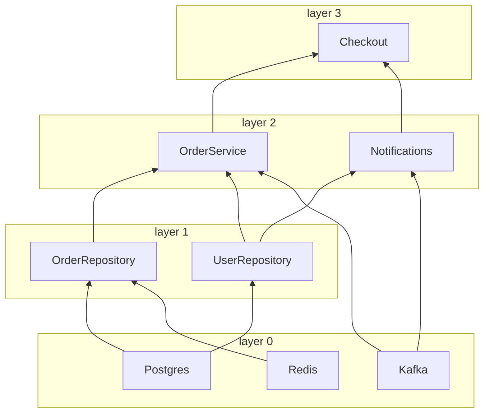

# The graph

An application of three infrastructure clients, two repositories and three services, and the
dependency graph of one entrypoint: as a table of layers, as a Mermaid diagram for a README, and
as the `DEBUG` log of a real startup. Useful to document an architecture and to see why a startup
takes as long as it does.

| File              | What it holds                                                             |
|-------------------|---------------------------------------------------------------------------|
| `clients.py`      | `Postgres`, `Redis`, `Kafka`, with connect times of 0.2 s, 0.05 s, 0.1 s  |
| `repositories.py` | `UserRepository` and `OrderRepository`                                    |
| `services.py`     | `OrderService`, `Notifications` and `Checkout` on top of them             |
| `api.py`          | `place_order`, the entrypoint whose tree is drawn                         |
| `show.py`         | Prints the layers and `to_mermaid()`; connects nothing                    |
| `start.py`        | Connects the tree with the `DEBUG` log of `nuke_di` on                    |
| `test_graph.py`   | The layers, the shared `Postgres`, and that the diagram below is current  |

## Run

```console
$ cd examples
$ uv run python -m graph.show
layer 0  Postgres         needs -
layer 0  Redis            needs -
layer 0  Kafka            needs -
layer 1  OrderRepository  needs Postgres, Redis
layer 1  UserRepository   needs Postgres
layer 2  OrderService     needs OrderRepository, UserRepository, Kafka
layer 2  Notifications    needs UserRepository, Kafka
layer 3  Checkout         needs OrderService, Notifications

graph BT
  subgraph layer0 [layer 0]
    Postgres
    Redis
    Kafka
  end
  subgraph layer1 [layer 1]
    OrderRepository
    UserRepository
  end
  subgraph layer2 [layer 2]
    OrderService
    Notifications
  end
  subgraph layer3 [layer 3]
    Checkout
  end
  Postgres --> OrderRepository
  Redis --> OrderRepository
  Postgres --> UserRepository
  OrderRepository --> OrderService
  UserRepository --> OrderService
  Kafka --> OrderService
  UserRepository --> Notifications
  Kafka --> Notifications
  OrderService --> Checkout
  Notifications --> Checkout
```

The same text in a ` ```mermaid ` block, which GitHub draws:



The `DEBUG` log of a real startup shows the same layers connecting one after another, and the
clients of a layer connecting together. The durations vary a little from run to run:

```console
$ uv run python -m graph.start
DEBUG Parsing signature of func "place_order"
DEBUG Resolving dependency "Checkout"
DEBUG Resolving dependency "OrderService"
DEBUG Resolving dependency "OrderRepository"
DEBUG Resolving dependency "Postgres"
DEBUG Resolving dependency "Redis"
DEBUG Resolving dependency "UserRepository"
DEBUG Resolving dependency "Kafka"
DEBUG Resolving dependency "Notifications"
DEBUG Connecting layer 0: Postgres, Redis, Kafka
DEBUG Connecting client Postgres
DEBUG Connecting client Redis
DEBUG Connecting client Kafka
redis: connected
DEBUG Connected client Redis in 0.051s
kafka: connected
DEBUG Connected client Kafka in 0.101s
postgres: connected
DEBUG Connected client Postgres in 0.201s
DEBUG Connecting layer 1: OrderRepository, UserRepository
DEBUG Connecting client OrderRepository
DEBUG Connected client OrderRepository in 0.000s
DEBUG Connecting client UserRepository
DEBUG Connected client UserRepository in 0.000s
DEBUG Connecting layer 2: OrderService, Notifications
DEBUG Connecting client OrderService
DEBUG Connected client OrderService in 0.000s
DEBUG Connecting client Notifications
DEBUG Connected client Notifications in 0.000s
DEBUG Connecting layer 3: Checkout
DEBUG Connecting client Checkout
DEBUG Connected client Checkout in 0.000s
INFO  Connected 8 clients in 4 layers in 0.20s (slowest: Postgres 0.20s, Kafka 0.10s, Redis 0.05s)
postgres: order 1 of user-42
kafka: orders.created <- 1
kafka: notifications <- order 1 for user-42
placed order 1
DEBUG Disconnecting client Checkout
DEBUG Disconnected client Checkout in 0.000s
DEBUG Disconnecting client OrderService
DEBUG Disconnected client OrderService in 0.000s
DEBUG Disconnecting client Notifications
DEBUG Disconnected client Notifications in 0.000s
DEBUG Disconnecting client OrderRepository
DEBUG Disconnected client OrderRepository in 0.000s
DEBUG Disconnecting client UserRepository
DEBUG Disconnected client UserRepository in 0.000s
DEBUG Disconnecting client Postgres
postgres: disconnected
DEBUG Disconnected client Postgres in 0.000s
DEBUG Disconnecting client Redis
redis: disconnected
DEBUG Disconnected client Redis in 0.000s
DEBUG Disconnecting client Kafka
kafka: disconnected
DEBUG Disconnected client Kafka in 0.000s
```

## Test

```console
$ uv run pytest -q graph
...                                                                      [100%]
3 passed in 0.04s
```

## What to look at

- `deps.inject(place_order)` builds the whole tree without connecting anything, so `show.py` and
  the test need no database. `graph()` works the same before and after `connect()`.
- Layer 0 takes as long as its slowest client: the startup took 0.20 s, not 0.35 s, because
  `Postgres`, `Redis` and `Kafka` connect together.
- `node.dependencies` maps argument names to nodes, and nodes compare by identity: the test checks
  that both repositories got the same `Postgres`.
- `test_readme_diagram_is_current` fails when the code changes and the diagram above does not.
