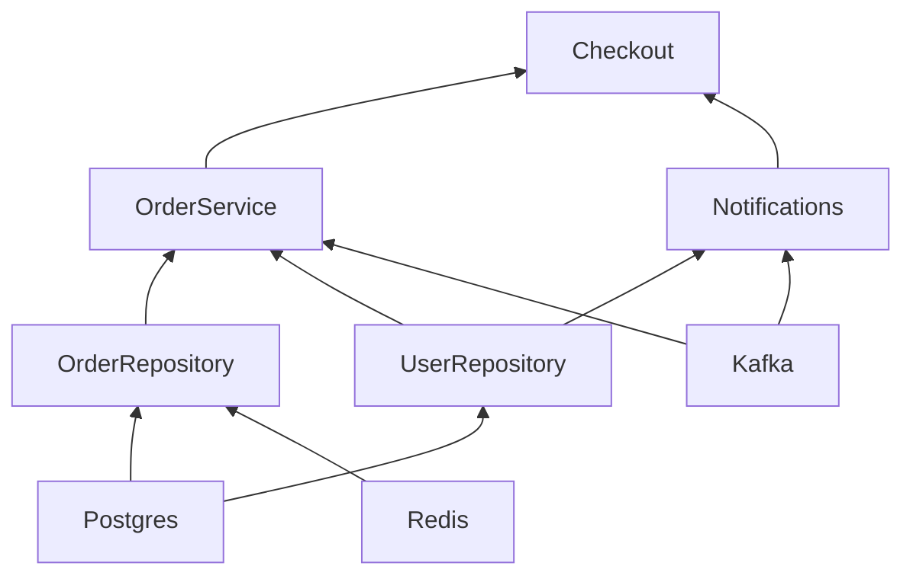

# The graph

An application of three infrastructure clients, two repositories and three services, and the
dependency graph of one entrypoint: as a list of who needs whom, as a Mermaid diagram for a README,
and as the `DEBUG` log of a real startup. Useful to document an architecture and to see why a startup
takes as long as it does.

| File              | What it holds                                                             |
|-------------------|---------------------------------------------------------------------------|
| `clients.py`      | `Postgres`, `Redis`, `Kafka`, with connect times of 0.2 s, 0.05 s, 0.1 s  |
| `repositories.py` | `UserRepository` and `OrderRepository`                                    |
| `services.py`     | `OrderService`, `Notifications` and `Checkout` on top of them             |
| `api.py`          | `place_order`, the entrypoint whose tree is drawn                         |
| `show.py`         | Prints who needs whom and `to_mermaid()`; connects nothing                |
| `start.py`        | Connects the tree with the `DEBUG` log of `nuke_di` on                    |
| `test_graph.py`   | The dependencies, the shared `Postgres`, and that the diagram below is current |

## Run

```console
$ cd examples
$ uv run python -m graph.show
Postgres         needs -
Redis            needs -
OrderRepository  needs Postgres, Redis
UserRepository   needs Postgres
Kafka            needs -
OrderService     needs OrderRepository, UserRepository, Kafka
Notifications    needs UserRepository, Kafka
Checkout         needs OrderService, Notifications

graph BT
  Postgres
  Redis
  OrderRepository
  UserRepository
  Kafka
  OrderService
  Notifications
  Checkout
  Postgres --> OrderRepository
  Redis --> OrderRepository
  Postgres --> UserRepository
  OrderRepository --> OrderService
  UserRepository --> OrderService
  Kafka --> OrderService
  UserRepository --> Notifications
  Kafka --> Notifications
  OrderService --> Checkout
  Notifications --> Checkout
```

The same text in a ` ```mermaid ` block, which GitHub draws:



The `DEBUG` log of a real startup shows every client starting as soon as its own dependencies have
connected, with how many have connected so far. The durations vary a little from run to run:

```console
$ uv run python -m graph.start
DEBUG Parsing signature of func "place_order"
DEBUG Resolving dependency "Checkout"
DEBUG Resolving dependency "OrderService"
DEBUG Resolving dependency "OrderRepository"
DEBUG Resolving dependency "Postgres"
DEBUG Resolving dependency "Redis"
DEBUG Resolving dependency "UserRepository"
DEBUG Resolving dependency "Kafka"
DEBUG Resolving dependency "Notifications"
DEBUG Connecting client Postgres (0/8 connected)
DEBUG Connecting client Redis (0/8 connected)
DEBUG Connecting client Kafka (0/8 connected)
redis: connected
DEBUG Connected client Redis in 0.050s (1/8 connected)
kafka: connected
DEBUG Connected client Kafka in 0.101s (2/8 connected)
postgres: connected
DEBUG Connected client Postgres in 0.201s (3/8 connected)
DEBUG Connecting client OrderRepository (3/8 connected)
DEBUG Connected client OrderRepository in 0.000s (4/8 connected)
DEBUG Connecting client UserRepository (4/8 connected)
DEBUG Connected client UserRepository in 0.000s (5/8 connected)
DEBUG Connecting client OrderService (5/8 connected)
DEBUG Connected client OrderService in 0.000s (6/8 connected)
DEBUG Connecting client Notifications (6/8 connected)
DEBUG Connected client Notifications in 0.000s (7/8 connected)
DEBUG Connecting client Checkout (7/8 connected)
DEBUG Connected client Checkout in 0.000s (8/8 connected)
INFO  Connected 8 clients in 0.20s (slowest: Postgres 0.20s, Kafka 0.10s, Redis 0.05s)
postgres: order 1 of user-42
kafka: orders.created <- 1
kafka: notifications <- order 1 for user-42
placed order 1
DEBUG Disconnecting client Checkout (0/8 disconnected)
DEBUG Disconnected client Checkout in 0.000s (1/8 disconnected)
DEBUG Disconnecting client OrderService (1/8 disconnected)
DEBUG Disconnected client OrderService in 0.000s (2/8 disconnected)
DEBUG Disconnecting client Notifications (2/8 disconnected)
DEBUG Disconnected client Notifications in 0.000s (3/8 disconnected)
DEBUG Disconnecting client OrderRepository (3/8 disconnected)
DEBUG Disconnected client OrderRepository in 0.000s (4/8 disconnected)
DEBUG Disconnecting client UserRepository (4/8 disconnected)
DEBUG Disconnected client UserRepository in 0.000s (5/8 disconnected)
DEBUG Disconnecting client Kafka (5/8 disconnected)
kafka: disconnected
DEBUG Disconnected client Kafka in 0.000s (6/8 disconnected)
DEBUG Disconnecting client Postgres (6/8 disconnected)
postgres: disconnected
DEBUG Disconnected client Postgres in 0.000s (7/8 disconnected)
DEBUG Disconnecting client Redis (7/8 disconnected)
redis: disconnected
DEBUG Disconnected client Redis in 0.000s (8/8 disconnected)
```

## Test

```console
$ uv run pytest -q graph
...                                                                      [100%]
3 passed in 0.04s
```

## What to look at

- `deps.inject(place_order)` builds the whole tree without connecting anything, so `show.py` and
  the test need no database. `graph()` works the same before and after `connect()`.
- The startup takes as long as its longest chain of dependencies, `Postgres` → `OrderRepository` →
  `OrderService` → `Checkout`: 0.20 s, not 0.35 s, because `Postgres`, `Redis` and `Kafka` connect
  together, and nothing that does not need `Postgres` waits for it.
- `node.dependencies` maps argument names to nodes, and nodes compare by identity: the test checks
  that both repositories got the same `Postgres`.
- `test_readme_diagram_is_current` fails when the code changes and the diagram above does not.
